### 浅析JVM第四篇: JVM类加载机制

这篇文章我们一起来看JVM如何加载字节码文件。JVM类加载的流程分为5个阶段，***加载***、***验证***、**准备**、***解析***、***初始化***

#### 加载

加载时属于类加载的第一步，用于将Class文件加载到虚拟机中，在加载的时候，虚拟机会完成三件事情。

* 通过类的全限定名获取该类的二进制流
* 将字节流的静态存储结构转化为方法区的运行时数据结构
* 在java堆中生成代表该类的Class对象

#### 验证

用来验证Class文件包含的信息是否符合虚拟机规范以及一些代码逻辑的校验。

#### 准备

准备阶段是比较核心的阶段，此时会为类变量在方法区中分配内存并设置默认初始值，比如`static int a =10`，此时a会被赋值为0，至于`a=10`会在`<clinit>`中完成，对于带有final类型的静态变量会被赋值为指定的值，final类型只能被赋值一次，不能被修改，比如:`static final int a=10 `，此时a 会被赋值为10

#### 解析

解析阶段中，JVM会将常量池中的符号引用替换为直接引用。

#### 初始化

初始化阶段实际上是执行`<clinit>`方法的过程,首先我们来看下什么是`<clinit>`方法。

>The name `<clinit>` is supplied by a compiler. Because the name `<clinit>` is not a valid identifier, it cannot be used directly in a program written in the Java programming language. Class and interface initialization methods are invoked implicitly by the Java Virtual Machine; they are never invoked directly from any Java Virtual Machine instruction, but are invoked only indirectly as part of the class initialization process.

以上是来自Oracle官网中关于`<clinit>`方法的解释。`<clinit>`是由编译器提供的，名字不是有效的标识符，不能在Java编程语言编写的程序中直接使用。而是通过JVM隐式的调用，他们也从来不会按照JVM指令直接调用，而是作为类初始化过程的一部分间接调用。

知道了`<clinit>`是类初始化方法之后，在看该方法内部的指令操作之前，我们先来看一个有趣的例子。

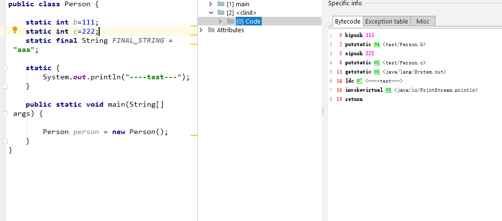

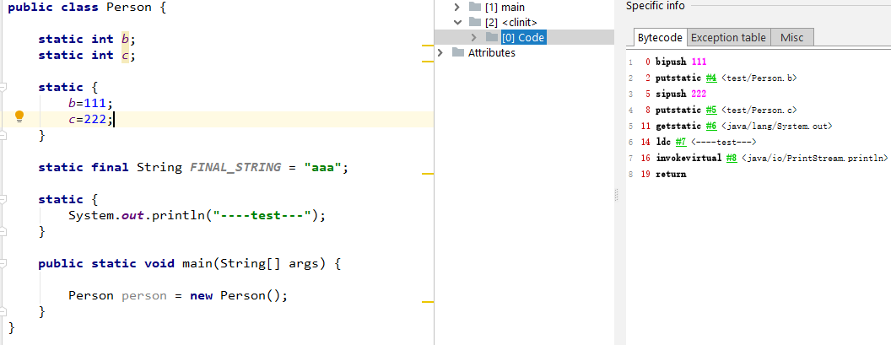

图中关于静态变量b、c的定义方式不同，但是在`<clinit>`方法生成的字节码相同，并且`<clinit>`方法内部包含了对于静态变量的赋值和静态代码块中的操作，这是我们能从图中观察到的特点。实际上，`<clinit>`这个类构造器方法是对于代码收敛的过程，类构造器会收集类静态代码块、类变量的赋值语句，按照源代码行中的顺序生成`<clinit>`的字节码。同时，之所以`<clinit>`方法中没有关于final修饰符变量赋值语句的字节码，是因为final类型的变量在类加载过程中的准备阶段，就会被赋值，同时静态变量也会在此时进行默认赋值。`<clinit>`是在初始化阶段执行的操作。

与`<clinit>`方法对应的是`<init>`，`<init>`是JVM调用的实例构造方法，我们继续看一个有趣的例子然后来进行总结。

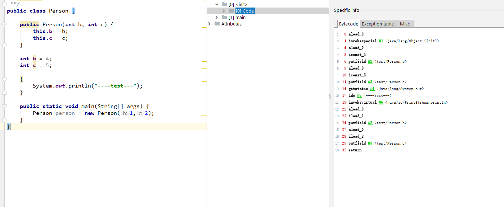

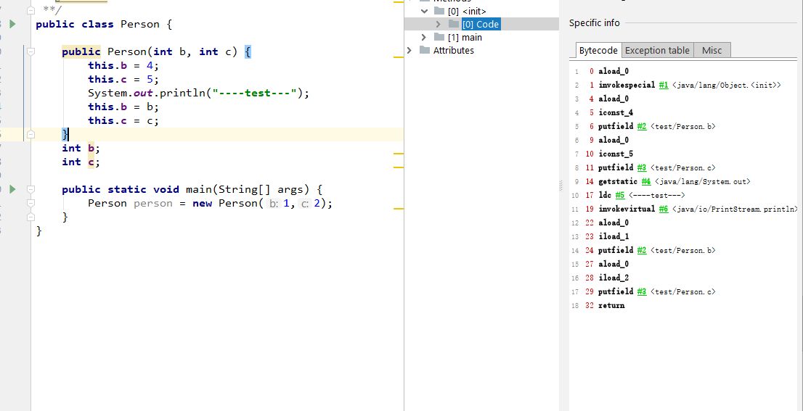

我们发现，两边的`<init>`中字节码是一样的。首先按照源代码中声明实例变量和代码块的顺序执行，最后执行实例构造器方法。并且，先对实例变量赋值，在定义实例变量似乎也没有报错，这是我们从图中所看到的。实际上，只要定义了一个构造器方法就会生成一个`<init>`方法，定义两个实例构造器方法（无参、带参），就会生成两个`<init>`方法，`<init>`方法也会对实例字段初始化语句、代码块按照顺序进行收敛，最后执行对应的实例构造方法的语句。

我们来回想一下，静态变量**默认初始化**是在类加载过程的**准备阶段**，至于**声明初始化和静态代码块初始化**是在类加载过程中的**初始化阶段**。对应的，实例变量的声明初始化、代码块、实例构造方法是在`<init>`中执行的，而`<init>` 方法被调用与`<clinit>`不同，`<clinit>`是在类加载过程中完成的，加载该类时,JVM会保证父类的`<clinit>`方法先执行。`<init>`方法是在创建对象的时候，被隐式调用，同时会先调用父类的`<init>`方法。

那么再来回想下为什么，在源代码中先对实例变量赋值，再在源代码中后面定义实例变量，这种情况不会导致报错呢？

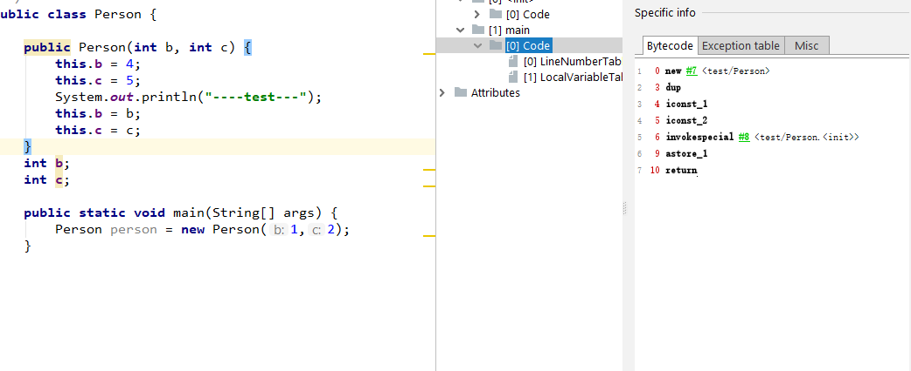

我们继续来观察字节码，发现 这个指令就是对于该被创建的对象在堆中分配空间，同时对于实例变量进行默认初始化，然后把指向该对象的引用放到操作数栈中。

到这边我们就清楚了，实例变量的**默认初始化**是在**new指令**中完成的，之后隐式调用`<init>`，完成**字段的声明初始化和实例构造方法的初始化** 。

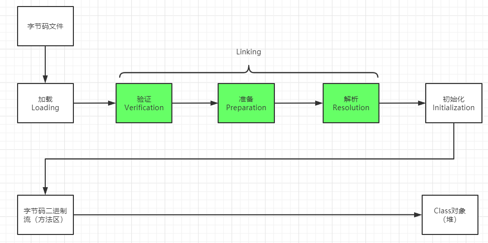

<p align='center'>类加载流程</p>

那么当我们写完一个.java文件，想要执行源代码，底层的类加载器的初始化过程以及类的加载的流程如下：

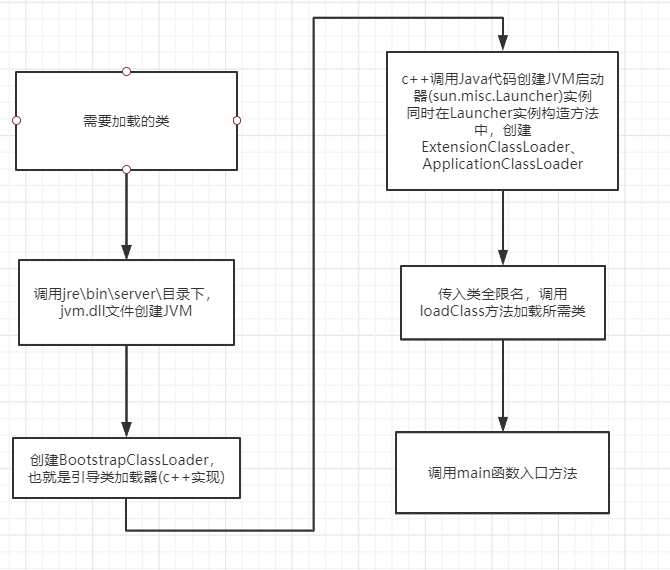

在整个类加载器初始化过程中，`sun.misc.Launcher`负责`ExtensionClassLoader`、`ApplicationClassCloader`创建，其本身是由`BootstrapClassLoader`加载，所以我们先看Launcher这个类，

```java
private static Launcher launcher = new Launcher();
//通过静态方法返回Launcher实例
public static Launcher getLauncher() {
    return launcher;
}
public Launcher() {
    Launcher.ExtClassLoader var1;
    try {
        var1 = Launcher.ExtClassLoader.getExtClassLoader();
    } catch (IOException var10) {
        throw new InternalError("Could not create extension class loader", var10);
    }

    try {
        this.loader = Launcher.AppClassLoader.getAppClassLoader(var1);
    } catch (IOException var9) {
        throw new InternalError("Could not create application class loader", var9);
    }

    Thread.currentThread().setContextClassLoader(this.loader);
    String var2 = System.getProperty("java.security.manager");
    if (var2 != null) {
        SecurityManager var3 = null;
        if (!"".equals(var2) && !"default".equals(var2)) {
            try {
                var3 = (SecurityManager)this.loader.loadClass(var2).newInstance();
            } catch (IllegalAccessException var5) {
            } catch (InstantiationException var6) {
            } catch (ClassNotFoundException var7) {
            } catch (ClassCastException var8) {
            }
        } else {
            var3 = new SecurityManager();
        }

        if (var3 == null) {
            throw new InternalError("Could not create SecurityManager: " + var2);
        }

        System.setSecurityManager(var3);
    }

}

//ExtClassLoader属于Launcher的静态内部类，单例模式创建ExtClassLoader，URLClassLoader是通过搜索路径加载资源、引入JAR文件和目录的路径
static class ExtClassLoader extends URLClassLoader {
    public static Launcher.ExtClassLoader getExtClassLoader() throws IOException {
        if (instance == null) {
            Class var0 = Launcher.ExtClassLoader.class;
            synchronized(Launcher.ExtClassLoader.class) {
                if (instance == null) {
                    instance = createExtClassLoader();
                }
            }
        }

        return instance;
    }
   .......
}
//同样的，AppplicationClassLoader也是作为Launcher的内部类，并且ApplicationClassLoader的加载路径是classpath
static class AppClassLoader extends URLClassLoader {
    public static ClassLoader getAppClassLoader(final ClassLoader var0) throws IOException {
        final String var1 = System.getProperty("java.class.path");
        final File[] var2 = var1 == null ? new File[0] : Launcher.getClassPath(var1);
        return (ClassLoader)AccessController.doPrivileged(new PrivilegedAction<Launcher.AppClassLoader>() {
            public Launcher.AppClassLoader run() {
                URL[] var1x = var1 == null ? new URL[0] : Launcher.pathToURLs(var2);
                return new Launcher.AppClassLoader(var1x, var0);
            }
        });
    }
    ......
}
```

这样问题就回到`BootstrapClassLoader`、`ExtClassLoader`、`AppClassLoader` ，三者都属于类加载器，主要完成类加载流程的第一步**加载**。

* `BootstrapClassLoader` 用来加载jre/lib下的jar文件比如rt.jar （rt.jar包含java的util、lang、io等重要的文件）

  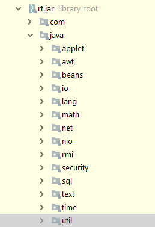

* `ExtClassLoader`用来加载jre/lib/ext文件夹下的jar

* `AppClassLoader`用来加载CLASS_PATH下的文件，我们来看下CLASS_PATH到底是什么，然后输出之后发现，`AppClassLoader`可以加载`BootstrapClassLoader`和`ExtClassLoader`的jar之外，还可以加载自己编写的class文件。

  **那么问题来了，`AppClassLoader`文件也可以加载前两个类加载器的路径，干嘛不直接用一个类加载器来搞定所有的事情？**

  假设好几个独立的应用部署在同一个应用服务器上，它们用着相同名字不同版本的jar，这个时候，如何同时加载这些类的时候，避免同名类的差异检测。所以每个应用拥有自己的类加载器。

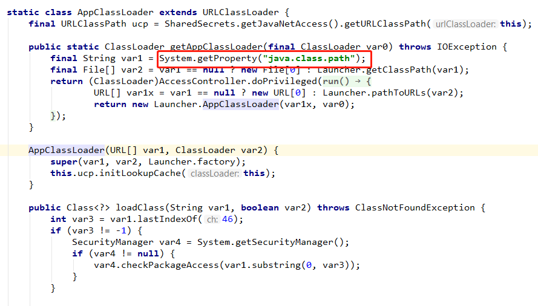

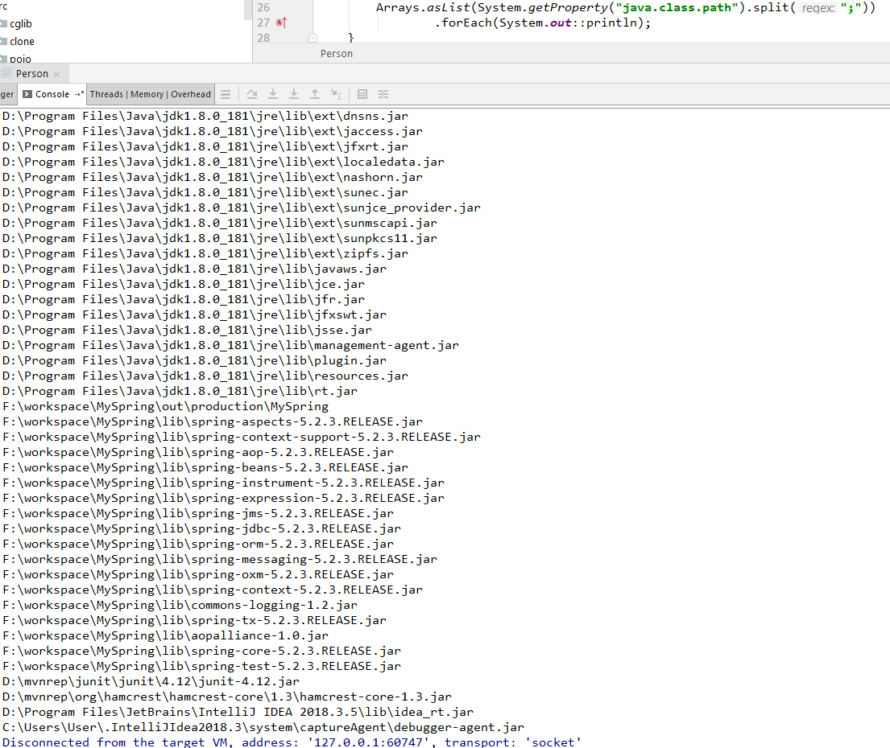

#### 双亲委派模型

我们现在已经对三个类加载器有了个基本的认识，接下来我们来看一段代码，来进一步认识三个类加载器之间是怎么协调工作的。

```java
/**
  *name: 代表我们想加载的类的全限定名
  *resolve: 是否想解析该类
  */
protected Class<?> loadClass(String name, boolean resolve)
    throws ClassNotFoundException
{
    synchronized (getClassLoadingLock(name)) {
        //查看期望中的类是否被当前类加载器加载，已经加载了就直接返回
        // First, check if the class has already been loaded
        Class<?> c = findLoadedClass(name);
        if (c == null) {
            long t0 = System.nanoTime();
            try {
                /**
                  *当父类加载器不为空，意味着父类加载器不是BootstrapClassLoader,
                  *因为它是由c++实现的，满足当前类的
                  */
                //使用父类构造器调用loadClass方法
                if (parent != null) {    
                    c = parent.loadClass(name, false);
                } else {
                    //使用引导类构造器查看当前类是否已经被加载
                    c = findBootstrapClassOrNull(name);
                }
            } catch (ClassNotFoundException e) {
                // ClassNotFoundException thrown if class not found
                // from the non-null parent class loader
            }
			//当该类依旧未被加载的时候，当前类加载器尝试加载。
            if (c == null) {
                // If still not found, then invoke findClass in order
                // to find the class.
                long t1 = System.nanoTime();
                c = findClass(name);

                // this is the defining class loader; record the stats
                sun.misc.PerfCounter.getParentDelegationTime().addTime(t1 - t0);
                sun.misc.PerfCounter.getFindClassTime().addElapsedTimeFrom(t1);
                sun.misc.PerfCounter.getFindClasses().increment();
            }
        }
        if (resolve) {
            resolveClass(c);
        }
        return c;
    }
}
```

通过上面的代码我们可以看到，在加载一个类的时候，首先自底向上，首先会去检查该类加载器是否加载了该类，是直接返回。否，以类似递归调用的方式，询问父类加载器是否有加载该类；当没有类加载的时候，从顶向下，由引导类加载器开始尝试加载该类，那么我们一起看，类加载器之间的父级关系。


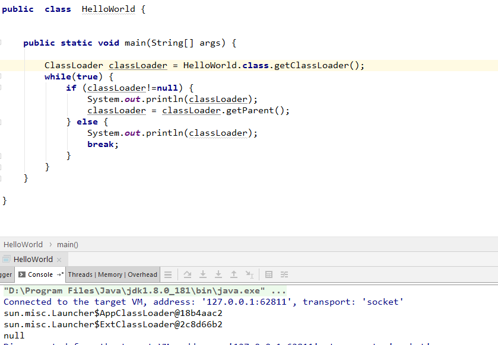

这边发现，加载HelloWorld的类加载器是`AppClassLoader`,其父类加载器是`ExtClassLoader`、父类是`BootstrapClassLoader`，在图示中显示为null，是可以理解的，因为这边是c++实现的。

我们再来思考一个问题:**之前我们查看源码发现`AppClassLoader`和`ExtClassLoader`都是Launcher类下的静态内部类，他们是怎样形成父级类加载器这层关系的？**

```java
public Launcher() {
    Launcher.ExtClassLoader var1;
    try {
        var1 = Launcher.ExtClassLoader.getExtClassLoader();
    } catch (IOException var10) {
        throw new InternalError("Could not create extension class loader", var10);
    }

    try {
        //将ExtClassLoader作为参数传入到AppClassLoader的获取方法中
        this.loader = Launcher.AppClassLoader.getAppClassLoader(var1);
    } catch (IOException var9) {
        throw new InternalError("Could not create application class loader", var9);
    }

    Thread.currentThread().setContextClassLoader(this.loader);
    String var2 = System.getProperty("java.security.manager");
    if (var2 != null) {
        SecurityManager var3 = null;
        if (!"".equals(var2) && !"default".equals(var2)) {
            try {
                var3 = (SecurityManager)this.loader.loadClass(var2).newInstance();
            } catch (IllegalAccessException var5) {
            } catch (InstantiationException var6) {
            } catch (ClassNotFoundException var7) {
            } catch (ClassCastException var8) {
            }
        } else {
            var3 = new SecurityManager();
        }

        if (var3 == null) {
            throw new InternalError("Could not create SecurityManager: " + var2);
        }

        System.setSecurityManager(var3);
    }

}


static class ExtClassLoader extends URLClassLoader {
    private static volatile Launcher.ExtClassLoader instance;

    public static Launcher.ExtClassLoader getExtClassLoader() throws IOException {
        if (instance == null) {
            Class var0 = Launcher.ExtClassLoader.class;
            synchronized(Launcher.ExtClassLoader.class) {
                if (instance == null) {
                    instance = createExtClassLoader();
                }
            }
        }

        return instance;
    }

    private static Launcher.ExtClassLoader createExtClassLoader() throws IOException {
        try {
            return (Launcher.ExtClassLoader)AccessController.doPrivileged(new PrivilegedExceptionAction<Launcher.ExtClassLoader>() {
                public Launcher.ExtClassLoader run() throws IOException {
                    File[] var1 = Launcher.ExtClassLoader.getExtDirs();
                    int var2 = var1.length;

                    for(int var3 = 0; var3 < var2; ++var3) {
                        MetaIndex.registerDirectory(var1[var3]);
                    }

                    return new Launcher.ExtClassLoader(var1);
                }
            });
        } catch (PrivilegedActionException var1) {
            throw (IOException)var1.getException();
        }
    }
    
     public ExtClassLoader(File[] var1) throws IOException {
         //ExtClassLoader的parent参数传的是null
            super(getExtURLs(var1), (ClassLoader)null, Launcher.factory);
            SharedSecrets.getJavaNetAccess().getURLClassPath(this).initLookupCache(this);
        }
}


static class AppClassLoader extends URLClassLoader {
    final URLClassPath ucp = SharedSecrets.getJavaNetAccess().getURLClassPath(this);

    public static ClassLoader getAppClassLoader(final ClassLoader var0) throws IOException {
        final String var1 = System.getProperty("java.class.path");
        final File[] var2 = var1 == null ? new File[0] : Launcher.getClassPath(var1);
        return (ClassLoader)AccessController.doPrivileged(new PrivilegedAction<Launcher.AppClassLoader>() {
            public Launcher.AppClassLoader run() {
                URL[] var1x = var1 == null ? new URL[0] : Launcher.pathToURLs(var2);
                return new Launcher.AppClassLoader(var1x, var0);
            }
        });
    }
	//ExtClassLoader实例作为参数传入到构造方法中
    AppClassLoader(URL[] var1, ClassLoader var2) {
        super(var1, var2, Launcher.factory);
        this.ucp.initLookupCache(this);
    }
}
//URLClassLoader类
public URLClassLoader(URL[] urls, ClassLoader parent,
                      URLStreamHandlerFactory factory) {
    super(parent);
    // this is to make the stack depth consistent with 1.1
    SecurityManager security = System.getSecurityManager();
    if (security != null) {
        security.checkCreateClassLoader();
    }
    acc = AccessController.getContext();
    ucp = new URLClassPath(urls, factory, acc);
}
//SecureClassLoader类
protected SecureClassLoader(ClassLoader parent) {
    super(parent);
    // this is to make the stack depth consistent with 1.1
    SecurityManager security = System.getSecurityManager();
    if (security != null) {
        security.checkCreateClassLoader();
    }
    initialized = true;
}
//ClassLoader类
protected ClassLoader(ClassLoader parent) {
    this(checkCreateClassLoader(), parent);
}
private ClassLoader(Void unused, ClassLoader parent) {
    this.parent = parent;
    if (ParallelLoaders.isRegistered(this.getClass())) {
        parallelLockMap = new ConcurrentHashMap<>();
        package2certs = new ConcurrentHashMap<>();
        domains =
            Collections.synchronizedSet(new HashSet<ProtectionDomain>());
        assertionLock = new Object();
    } else {
        // no finer-grained lock; lock on the classloader instance
        parallelLockMap = null;
        package2certs = new Hashtable<>();
        domains = new HashSet<>();
        assertionLock = this;
    }
}
```

我们在源代码中一直跟到最后面发现，实际上，就是将父类加载器作为参数传入再赋值给当前类加载器实例中的parent属性。

---------------------------------------待续-----------------------------（晚上回来继续写）