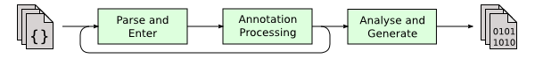

### 浅析JVM第一篇: JVM定义与编译器

#### 1.定义

关于JVM, google给出的定义是:

> **Java Virtual Machine** (**JVM**) is a engine that provides runtime environment to drive the Java Code or applications. It converts Java bytecode into machines language. **JVM** is a part of Java Run Environment (JRE). In other programming languages, the compiler produces machine code for a particular system.

JVM 是一个提供运行时环境加载java代码或者应用程序的引擎。将java的字节码转化为机器语言。JVM也是JRE的一部分，在其他编程语言中，编译器为特定系统生成机器码。

所以JVM的工作就是将字节码编译成相应系统的机器码，JVM不在乎源代码是什么语言，只在乎是否是符合期望的字节码。换句话讲，如果你开发一款很好的编译器能将Ruby语言变成符合期望的字节码，JVM也能够识别。

JVM始终关注的是字节码文件。那么我们先关注从源代码编译成机器码中间发生的过程。

#### 2.编译器

编译器大致可以分为三种。前端编译器（Sun的javac、Eclipse JDT增量式编译器(ECJ)）、JIT编译器(HotSpot VM的c1、c2)、AOT编译器(GNU Compiler for the Java (GCJ)、Excelsior JET)

##### 2.1前端编译器: 从源代码到字节码

在我们JDK的bin文件目录下有个javac的可执行文件，它可以将源代码编译成字节码文件


相对于JIT将字节码文件编译成为机器码、AOT直接将源代码编译成机器码来说，javac的将源代码编译成字节码处于编译的前期，所以这边称为前端编译器。



javac 将源代码编译成字节码文件总共分为三个阶段。

> 1. All the source files specified on the command line are read, parsed into syntax trees, and then all externally visible definitions are entered into the compiler's symbol tables.
> 2. All appropriate annotation processors are called. If any annotation processors generate any new source or class files, the compilation is restarted, until no new files are created.
> 3. Finally, the syntax trees created by the parser are analyzed and translated into class files. During the course of the analysis, references to additional classes may be found. The compiler will check the source and class path for these classes; if they are found on the source path, those files will be compiled as well, although they will not be subject to annotation processing.

上文摘自[OpenJDK](http://openjdk.java.net/groups/compiler/doc/compilation-overview/index.html)

第一阶段: 读取命令行中指定的源文件，转化为语法树。外部可见的定义将被输入到编译器的符号表。

第二阶段: 调用所有合适的注解处理器。如果任何的注解处理器生成了新的资源或者类文件，将会重新编译，直到没有任何新的文件被创建。

第三阶段: 由解析器生成的语法树将会被分析并被转变成class文件。在分析的过程中，指向额外的类的引用可能会被发现。编译器将会检查这些类的源路径和类路径，如果发现他们在源路径上，这些文件也将会被编译，尽管他们不受制于注解处理。

---

这是官网的关于javac编译过程的解释，那么我们来一起动手实践一下。

首先我们先下载Javac的源码，[OpenJDK8](http://hg.openjdk.java.net/jdk8/jdk8/langtools/)  然后点击红色处，进行解压 创建project 导入 *langtools-1ff9d5118aae/src/share/classes*下的文件


或者[点击此处](https://github.com/barry32/learn_javac) 使用git下载我上传的javac源码文件，并配置相应的环境变量

点击main方法之后，开始解析命令行和其他的校验，之后进入以下的方法。

```java
public void compile(List<JavaFileObject> sourceFileObjects,
                    List<String> classnames,
                    Iterable<? extends Processor> processors)
{
    if (processors != null && processors.iterator().hasNext())
        explicitAnnotationProcessingRequested = true;
    // as a JavaCompiler can only be used once, throw an exception if
    // it has been used before.
    if (hasBeenUsed)
        throw new AssertionError("attempt to reuse JavaCompiler");
    hasBeenUsed = true;

    // forcibly set the equivalent of -Xlint:-options, so that no further
    // warnings about command line options are generated from this point on
    options.put(XLINT_CUSTOM.text + "-" + LintCategory.OPTIONS.option, "true");
    options.remove(XLINT_CUSTOM.text + LintCategory.OPTIONS.option);

    start_msec = now();

    try {
        //初始化插入处理器
        initProcessAnnotations(processors);

        // These method calls must be chained to avoid memory leaks
        /**
          *这边的操作总共分为三个部分
          *1.词法和语法的分析
          *2.输入到符号表 （比如:记录该符号的符号名，作用域，类型，存储分配信息等等）
          *3.处理在注解单元中发现的注解，在此过程中如果生成了新的资源或者类，就需要再次调用1，2
          */
        delegateCompiler =
            processAnnotations(
                enterTrees(stopIfError(CompileState.PARSE, parseFiles(sourceFileObjects))),
                classnames);
        //语义分析和字节码生成
        delegateCompiler.compile2();
        delegateCompiler.close();
        elapsed_msec = delegateCompiler.elapsed_msec;
    } catch (Abort ex) {
        if (devVerbose)
            ex.printStackTrace(System.err);
    } finally {
        if (procEnvImpl != null)
            procEnvImpl.close();
    }
}

public List<JCCompilationUnit> parseFiles(Iterable<JavaFileObject> fileObjects) {
    if (shouldStop(CompileState.PARSE))
        return List.nil();

    //parse all files
    ListBuffer<JCCompilationUnit> trees = new ListBuffer<>();
    Set<JavaFileObject> filesSoFar = new HashSet<JavaFileObject>();
    for (JavaFileObject fileObject : fileObjects) {
        if (!filesSoFar.contains(fileObject)) {
            filesSoFar.add(fileObject);
            //核心调用
            trees.append(parse(fileObject));
        }
    }
    return trees.toList();
}
public JCTree.JCCompilationUnit parse(JavaFileObject filename) {
    JavaFileObject prev = log.useSource(filename);
    try {
        //核心调用
        JCTree.JCCompilationUnit t = parse(filename, readSource(filename));
        if (t.endPositions != null)
            log.setEndPosTable(filename, t.endPositions);
        return t;
    } finally {
        log.useSource(prev);
    }
}
//开始词法和语法的解析
protected JCCompilationUnit parse(JavaFileObject filename, CharSequence content) {
    long msec = now();
    JCCompilationUnit tree = make.TopLevel(List.<JCTree.JCAnnotation>nil(),
                                           null, List.<JCTree>nil());
    if (content != null) {
        if (verbose) {
            log.printVerbose("parsing.started", filename);
        }
        if (!taskListener.isEmpty()) {
            TaskEvent e = new TaskEvent(TaskEvent.Kind.PARSE, filename);
            taskListener.started(e);
            keepComments = true;
            genEndPos = true;
        }
        //具体解析类，规定那些词符合Java语言规范
        //内部创建了Scanner扫描仪用来扫描token
        Parser parser = parserFactory.newParser(content, keepComments(), genEndPos, lineDebugInfo);
        //词法分析
        tree = parser.parseCompilationUnit();
        if (verbose) {
            log.printVerbose("parsing.done", Long.toString(elapsed(msec)));
        }
    }

    tree.sourcefile = filename;

    if (content != null && !taskListener.isEmpty()) {
        TaskEvent e = new TaskEvent(TaskEvent.Kind.PARSE, tree);
        taskListener.finished(e);
    }
    return tree;
}

/**
  *这边需要补充一下token的信息，token是Scanner单次读取源代码的最小单位
  * int a=10;
  * 这边的话,Scanner读取依次是: int 、a、=、10、;
  * int 可以在tokenKind的枚举中找到，所以可以作为一个token
  *
  *这个方法主要的作用就是将源码通过Scanner按token流来读取，并将相应的token连接起来创建JCTree，
  *再把这些JCTree连接起来 最后生成JCCompilationUnit，完成词法和语法分析
  */
public JCTree.JCCompilationUnit parseCompilationUnit() {
    Token firstToken = token;
    //储存package信息
    JCExpression pid = null;
    JCModifiers mods = null;
    boolean consumedToplevelDoc = false;
    boolean seenImport = false;
    boolean seenPackage = false;
    List<JCAnnotation> packageAnnotations = List.nil();
    if (token.kind == MONKEYS_AT)
        mods = modifiersOpt();

    if (token.kind == PACKAGE) {
        seenPackage = true;
        if (mods != null) {
            checkNoMods(mods.flags);
            packageAnnotations = mods.annotations;
            mods = null;
        }
        nextToken();
        pid = qualident(false);
        accept(SEMI);
    }
    /**
      *新创建一个JCTree类型的数组，JCTree是多个token连接起来的语句
      *比如: import java.lang.annotation.Native;
      * 拆分为单个token: import、java、. 、lang、.、annotation、.、Native、; 
      * 这边JavaCompiler 会将这些token连成语句(import java.lang.annotation.Native;)
      *生成JCTree,并将JCTree添加到defs
      */
    ListBuffer<JCTree> defs = new ListBuffer<JCTree>();
    boolean checkForImports = true;
    boolean firstTypeDecl = true;
    while (token.kind != EOF) {
        if (token.pos > 0 && token.pos <= endPosTable.errorEndPos) {
            // error recovery
            skip(checkForImports, false, false, false);
            if (token.kind == EOF)
                break;
        }
        //tokenKind类型是import
        if (checkForImports && mods == null && token.kind == IMPORT) {
            seenImport = true;
            defs.append(importDeclaration());
        } else {
            Comment docComment = token.comment(CommentStyle.JAVADOC);
            if (firstTypeDecl && !seenImport && !seenPackage) {
                docComment = firstToken.comment(CommentStyle.JAVADOC);
                consumedToplevelDoc = true;
            }
            //这边将单个token连接起来成为有意义的语句，并生成JCTree
            JCTree def = typeDeclaration(mods, docComment);
            if (def instanceof JCExpressionStatement)
                def = ((JCExpressionStatement)def).expr;
            defs.append(def);
            if (def instanceof JCClassDecl)
                checkForImports = false;
            mods = null;
            firstTypeDecl = false;
        }
    }
    //这边会将package信息和JCTree数组一同生成JCCompilationUnit类型的语法树
    JCTree.JCCompilationUnit toplevel = F.at(firstToken.pos).TopLevel(packageAnnotations, pid, defs.toList());
    if (!consumedToplevelDoc)
        attach(toplevel, firstToken.comment(CommentStyle.JAVADOC));
    if (defs.isEmpty())
        storeEnd(toplevel, S.prevToken().endPos);
    if (keepDocComments)
        toplevel.docComments = docComments;
    if (keepLineMap)
        toplevel.lineMap = S.getLineMap();
    this.endPosTable.setParser(null); // remove reference to parser
    toplevel.endPositions = this.endPosTable;
    return toplevel;
}
```

（TokenKind 枚举附图）


在第三阶段中，JavaCompiler会调用compile2的方法

```java
private void compile2() {
    try {
        switch (compilePolicy) {
        case ATTR_ONLY:
            attribute(todo);
            break;

        case CHECK_ONLY:
            flow(attribute(todo));
            break;

        case SIMPLE:
            generate(desugar(flow(attribute(todo))));
            break;

        case BY_FILE: {
                Queue<Queue<Env<AttrContext>>> q = todo.groupByFile();
                while (!q.isEmpty() && !shouldStop(CompileState.ATTR)) {
                    generate(desugar(flow(attribute(q.remove()))));
                }
            }
            break;

        case BY_TODO:
            while (!todo.isEmpty())
                /*
                 *开始逻辑语法分析、流处理、解语法糖、生成字节码
                 *1. 在逻辑语法分析这块主要负责的是: 变量使用前是否已经赋值或者变量和赋值之间类型是否匹					*配的上,另外就是常量折叠的情况(int b=10+3; 转化为int b=13;)
                 *2.(流处理在下面会展开)
                 *3.解语法糖(比如说基本数据类型的拆装箱、泛型、循环当中的forEach)
                 *4.生成字节码
                 */
                generate(desugar(flow(attribute(todo.remove()))));
            break;

        default:
            Assert.error("unknown compile policy");
        }
    } catch (Abort ex) {
        if (devVerbose)
            ex.printStackTrace(System.err);
    }

    if (verbose) {
        elapsed_msec = elapsed(start_msec);
        log.printVerbose("total", Long.toString(elapsed_msec));
    }

    reportDeferredDiagnostics();

    if (!log.hasDiagnosticListener()) {
        printCount("error", errorCount());
        printCount("warn", warningCount());
    }
}

public Queue<Env<AttrContext>> flow(Queue<Env<AttrContext>> envs) {
    ListBuffer<Env<AttrContext>> results = new ListBuffer<>();
    for (Env<AttrContext> env: envs) {
        flow(env, results);
    }
    return stopIfError(CompileState.FLOW, results);
}
//执行数据流化
protected void flow(Env<AttrContext> env, Queue<Env<AttrContext>> results) {
        try {
            if (shouldStop(CompileState.FLOW))
                return;

            if (relax || compileStates.isDone(env, CompileState.FLOW)) {
                results.add(env);
                return;
            }

            if (verboseCompilePolicy)
                printNote("[flow " + env.enclClass.sym + "]");
            JavaFileObject prev = log.useSource(
                                                env.enclClass.sym.sourcefile != null ?
                                                env.enclClass.sym.sourcefile :
                                                env.toplevel.sourcefile);
            try {
                make.at(Position.FIRSTPOS);
                TreeMaker localMake = make.forToplevel(env.toplevel);
                //核心方法
                flow.analyzeTree(env, localMake);
                compileStates.put(env, CompileState.FLOW);

                if (shouldStop(CompileState.FLOW))
                    return;

                results.add(env);
            }
            finally {
                log.useSource(prev);
            }
        }
        finally {
            if (!taskListener.isEmpty()) {
                TaskEvent e = new TaskEvent(TaskEvent.Kind.ANALYZE, env.toplevel, env.enclClass.sym);
                taskListener.finished(e);
            }
        }
}
/**
 *1.检查每条语句是否是可以访问,语句是否能执行到那边
 *2.检查树是否被分配值
 *3.异常分析判断，确保异常是否被声明或者捕获
 *4.检查来自lambda或者本地内部类的每个局部变量引用是是否被final修饰
 */
public void analyzeTree(Env<AttrContext> env, TreeMaker make) {
    new AliveAnalyzer().analyzeTree(env, make);
    new AssignAnalyzer(log, syms, lint, names).analyzeTree(env);
    new FlowAnalyzer().analyzeTree(env, make);
    new CaptureAnalyzer().analyzeTree(env, make);
}
```

##### 2.2JIT编译器(just in time compiler): 从字节码到机器码

当源代码编译成为字节码，等待它的就是两种情况，一是经由java解释器解释直接执行字节码，另外一种就是使用JIT将字节码编译成为机器码，然后执行。

这两者的不同之处在于，java解释器启动速度快因为它不需要像JIT一样将字节码编译成机器码，但是执行比较慢，是因为机器码的执行肯定是比java解释器来解释执行字节码来的快的。而JIT的代表 HotSpot VM的c1、c2之间的区别是什么呢？


> These two systems are different binaries. They are essentially two different compilers (JITs)interfacing to the same runtime system. The client system is optimal for applications which need fast startup times or small footprints, the server system is optimal for applications where the overall performance is most important. In general the client system is better suited for interactive applications such as GUIs. Some of the other differences include the compilation policy,heap defaults, and inlining policy.

这边c1指的是Client VM,c2指的是Server VM, 在32位操作系统上用的是Client VM，64位操作系统的用的是Server VM。这两个系统是不同的二进制文件，Client VM面向的是快速启动和占用较小空间的情况，Server VM面向的是着重于总体性能的应用。总体来说，Client VM 更加适合交互型的应用诸如GUI之类的，两者的其他区别在于编译政策、堆的默认值、内联政策。

Client VM 和Server VM指的是两种不同类型的VM。

这是我自己在本地安装的32位的JDK: ([JVM命令](https://docs.oracle.com/javase/8/docs/technotes/tools/windows/java.html#BABHDABI))


这边是64位的JDK:


可以看到，对于资源配置Server VM都是高于Client VM的。并且也是可以使用*java -client* 或者 *java -server* 来进行切换的。

那么对于同一类型的VM也是存在不同的模式的。

* 混合模式(mixed mode 默认) 

使用*java -Xmixed -version* (*java -version*)就可以在命令行当中可以看到，这个模式是集合了解释模式和编译模式的的长处。对于那些多次被调用的字节码（诸如循环之类的）会使用编译模式，将其编译成为机器码，这样也方便下次使用，提高效率。对于那些基本只会被执行一次的字节码会使用解释模式，直接解释执行。

* 解释模式(interpreted mode)

使用*java -Xint -version*就可以在命令行中看到，这个模式是直接解释执行字节码。

* 编译模式(compiled mode)

使用*java -Xcomp -version*就可以在命令行中看见，这个模式是先将字节码编译成为机器码，然后执行。

-----------

通过以下的测试代码，我们一起来看三种模式的执行效率。

```java
public class Test {

    private static void test() {
        for (int i =0;i<1000000000;i++) {
        }
    }
    public static void main(String[] args) {
        long start = System.currentTimeMillis();
        System.out.println("ready?");
        System.out.println("GO!");
        test();
        long end = System.currentTimeMillis();
        System.out.println("total cost time:"+(end-start));
    }
}
```


从这边可以看到，对于如果解释模式执行速度一旦遇到需要多次执行的字节码，执行效率就会很低。同样的，当编译模式遇到只需要执行一次的字节码仍然采用先将字节码编译成机器码方法，也会导致执行效率遍地。而java默认采用混合模式。

##### 2.3 AOT编译器(ahead of time compiler)

顾名思义就是提前编译，AOT可以直接将源代码编译成机器码,相比较JIT不同的是，AOT不是在运行时动态编译，而是提前编译。提前编译的好处，AOT不会出现编译时占用运行时资源的情况，而相应的短板是，并不是将那些经常用的方法进行编译而是全编译，同时也牺牲了对于平台的无关性。

关于本篇文章的总结，我们知道了java是如何做到跨平台的，以及前端编译器将源代码编译成字节码，首先先用Scanner来读取单个token并将这些token连成句子生成JCTree，再用JCTree生成JCCompilationUnit，接着填充符号表，再处理注解。接着开始逻辑语义分析、流处理、解语法糖、生成字节码。JIT编译器，是在运行期间将字节码编译成机器码。另外，AOT是提前将源代码编译成机器码，不会在运行时执行编译操作占用资源。

