### 浅析JVM第七篇: 常见VM启动参数与性能监控命令

首先我们先回顾一下基本常见的命令。

* -Xms

这个是堆的初始大小配置，我们这么来记忆-X 表示非标准，ms表示 memory start up。比如: -Xms1g表示堆的初始化容量为1G

* -Xmx

这个是堆的最大值配置，我们可以这么来记忆。-X表示非标准，mx表示memory maximum。比如: -Xmx1g表示堆的最大容量为1G

* -Xss

这个命令是用来配置内存模型中栈的大小，我们这么来记忆-X表示非标准，ss表示Stack Space。比如:-`Xss512k`，这样栈的空间就配置为512k。

* -XX:NewRatio

这个命令是用来配置年轻代与老年代的容量在堆内存中的占比。默认配置`老年代:年轻代=2:1`, 比如: `-XX:NewRatio=2`， 这么来记忆，-XX表示advance高级配置，New表示年轻代Ratio就是比率了。

* -XX:SurvivorRatio

这个命令是用来配置Eden区域与Survivor区域的占比，默认配置8:1。比如: `-XX:SurvivorRatio=8`，表示Eden区域占总Young区域的8份，两个Survivor区域各占1份，总份10份。

* -XX:MetaspaceSize

这个命令是用来配置元空间（JDK1.8向后）的初始大小。比如:`-XX:MetaspaceSize=1g`

* -XX:MaxMetaspaceSize

这个命令是用来配置元空间的最大容量的。比如:`-XX:MaxMetaspaceSize=1g`

**上面的是关于内存空间的划分，如果我们需要查看GC日志的话，如何配置？**

* -XX:+PrintGCDetails

这个命令表示答应GC的详细日志，我们这样来记忆。-XX表示advance，+表示enable，PrintGCDetails这个就显而易见了。

* -XX:+PrintGCDateStamps

这个命令使用来打印GC日志日期时间的，记忆方式还是跟之前一样。-XX表示advance，+表示enable，PrintGCDateStamps 这个就不解释了。

* -XX:+PrintGCTimeStamps

这个命令是用来打印GC时间的，建议配合`-XX:+PrintGCDateStamps`

**那么如何选择我想用的垃圾回收器呢？**

* -XX:+UseSerialGC

这个表示年轻代和老年代都使用线性的垃圾收集器

* -XX:+UseParNewGC

这个表示年轻代使用Parallel New，老年代使用线性的垃圾收集器

* -XX:+UseConcMarkSweepGC

这个表示年轻代使用Parallel New，老年代使用CMS当出现Concurrent Model Failure的时候，老年代采用线性的垃圾回收器，CMS是面向低延时的垃圾回收器。

* -XX:+UseParallelGC

这个表示年轻代使用Parallel Scavenge收集器（与CMS不适配），老年代使用线性的垃圾回收器

* -XX:+UseParallelOldGC

这个表示年轻代使用Parallel Scavenge收集器，老年代使用Parallel Old收集器。这个也是JDK1.8版本默认的垃圾回收器，主要是面向吞吐量的垃圾回收器。

* -XX:+UseG1GC

这个是使用G1垃圾收集器，面向老年代与年轻代的垃圾收集器，可以称为是软实时的一款垃圾收集器。

#### 常见性能监控命令

* jps

jps 全称为JVM Process Status Tool，可以用来打印进程的pid。

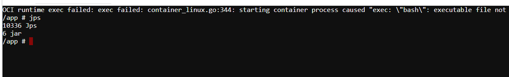

* jstat

jstat 全称是JVM Statistics Monitoring Tool，用来打印JVM统计信息，比如gc情况，类加载情况。`jstat [option] VMID [interval] [count]`, option是一些常见的选项，以下举一些常见的例子，`VMID` - 如果是本地虚拟机进程，则 VMID 与 LVMID 是一致的；如果是远程虚拟机进程，那 VMID 的格式应当是：`[protocol:][//]lvmid[@hostname[:port]/servername]`，interval是时间间隔，count是打印次数且两者为可选项。

我们拿pid为6的为案例以例子方式来看一些常见的命令。

1. `jstat -class <pid>`

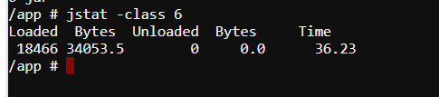

这边表示当前已经加载的类为18466个，所占字节为34053.5。未加载的类为0，所占字节为0，耗时为36.23s

2. `jstat -gc <pid> interval count`
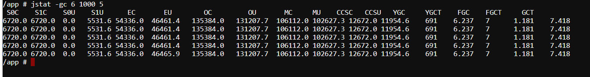

这个命令表示打印JVM中关于GC的统计信息且每1000ms也就是 1s打印一次，打印次数为5次。如果想让该信息一直打印把后面的5去掉即可。

打印出来的统计信息的如下:

| 名称 |                             解释                             |
| :--: | :----------------------------------------------------------: |
| S0C  |             S0Capacity，为幸存区S0容量（单位KB）             |
| S1C  |            S1Capacity，为幸存区S1的容量（单位KB）            |
| S0U  |            S0Usage,为S0幸存区的内存使用（单位KB）            |
| S1U  |            S1Usage，为S1幸存区内存使用（单位KB）             |
|  EC  |          Eden Capacity，为Eden区域的容量（单位KB）           |
|  EU  |          Eden Usage，为Eden区域的内存使用（单位KB）          |
|  OC  |           Old Capacity，为Old区域的容量（单位KB）            |
|  OU  |           Old Usage，为Old区域的内存使用（单位KB）           |
|  MC  |         Metaspace Capacity，为元空间的容量（单位KB）         |
|  MU  |        Metaspace Usage，为元空间的内存使用（单位KB）         |
| CCSC | Compressed Class Space Capacity,表示压缩类空间容量（单位KB） |
| CCSU | Compressed Class Space Usage，表示压缩类空间内存使用（单位KB） |
| YGC  |                 Young GC，表示年轻代GC的次数                 |
| YGCT |         Young GC Time，表示年轻代GC的时间（单位秒）          |
| FGC  |                  Full GC，表示Full GC的次数                  |
| FGCT |        Full GC Time，表示Full GC 的时间耗费（单位秒）        |
| GCT  |            GC Time，表示GC的总耗费时间（单位秒）             |

3. `jstat -gccause <pid>`

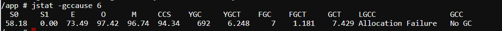

这个命令字如其名，用来打印GC总结信息和上次GC的诱因。

| 名称 |                  解释                  |
| :--: | :------------------------------------: |
|  S0  | 表示S0区域使用率（S0Usage/S0Capacity） |
|  S1  |              表示S1使用率              |
|  E   |             表示Eden使用率             |
|  O   |             表示Old使用率              |
|  M   |          表示Metaspace使用率           |
| CCS  |          表示压缩类空间使用率          |
| YGC  |            表示Young GC次数            |
| YGCT |            表示YGC耗费时间             |
| FGC  |            表示Full GC次数             |
| FGCT |       表示Full GC时间（单位秒）        |
| GCT  |      表示GC耗费的总时间（单位秒）      |
| LGCC |   cause of last GC，表示上次GC的原因   |
| GCC  |   cause of current GC，当前GC的原因    |

* jinfo

jinfo的全称是JVM Configuration Info，可以用来打印JVM的配置信息，以及动态修改配置信息。

`jinfo <option> <pid>`，option的可以是 `-flag <name>` 用来展示配置信息 , `-flag [+|-]<name>`用来启用或禁用配置信息、`-flag <name>=<value>`用来动态修改配置信息且无需重启。

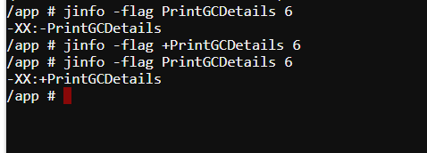

从上图可以看到，我们可以动态的修改JVM参数。首先，先查看pid为6的进程是否配置GC日志，再手动配置GC日志的情况。

* jstack

jstack全名是  Java thread stack traces，也就是用来打印栈信息的。命令是`jstack [option] <pid>`，还是来举例说明。

`jstack -l <pid>`

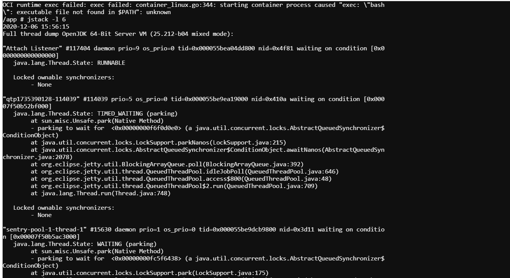

这边展示了JVM版本的信息和生成快照的时间，以及JVM内部线程的信息。

* jmap

jmap的全名是JVM Memory Map，可以用来打印堆内存信息的，同时生成dump文件。所以，在此选择本地演示。其命令是`jmap [option] <pid> `,举个例子来说明一下。

1. `jmap -heap <pid>`

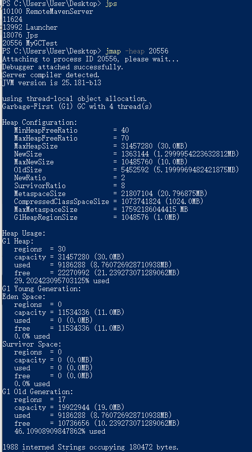

上图是展示堆内存信息。

2. `jmap -dump:format=b,file=<name> <pid> ` 该命令是dump导出堆内存信息为文件到本地，这边format=b，b指的是binary文件

   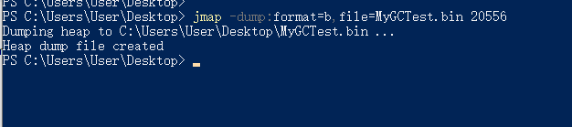

此时已经导出bin文件到本地。

* jhat

全名是JVM heap analysis Tool，是用来分析jmap 生成的dump文件的。

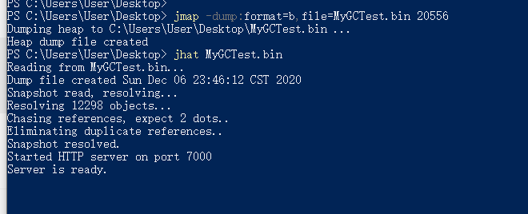

我们打开`localhost:7000`查看一下。

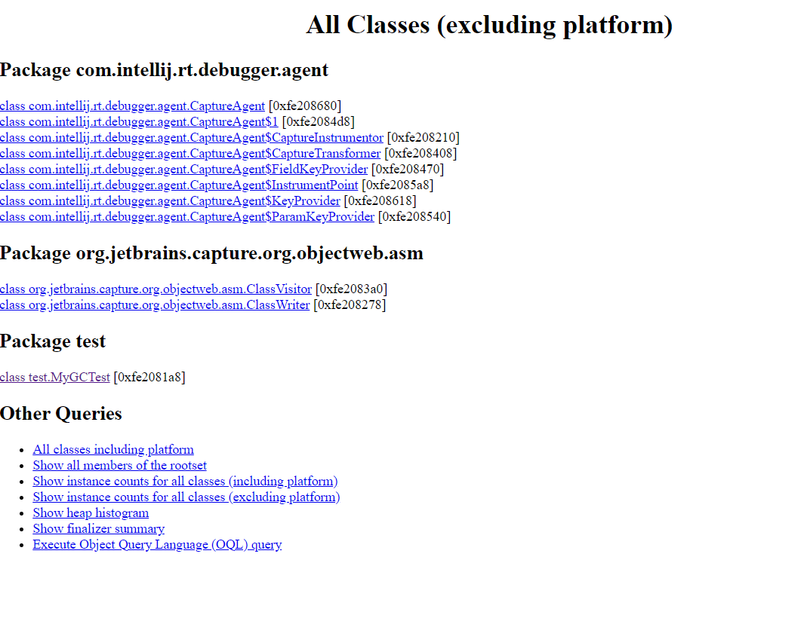

最后附上[oracle性能监控链接](https://docs.oracle.com/javase/8/docs/technotes/tools/)找到下方信息查看更详细信息。

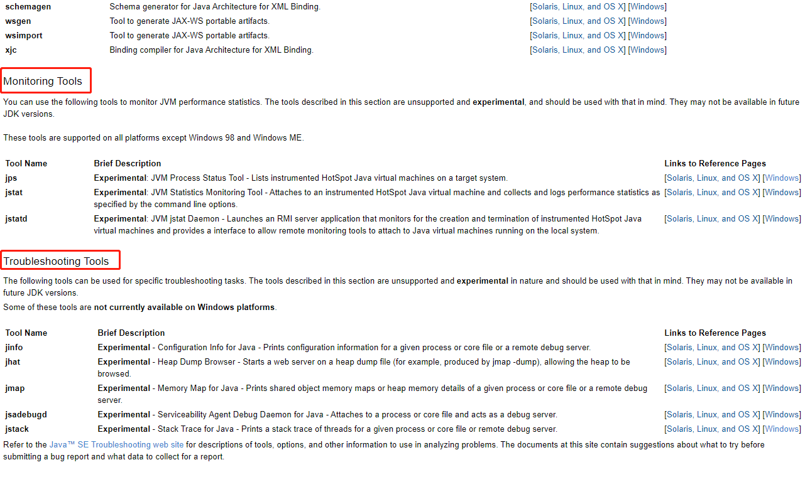

**最后想说的**

关于这些性能监控命令，我们只需记住我列出来的和比较常见的命令即可，无需记忆所有的命令。如果真的需要更多命令，点击oracle官网即可。