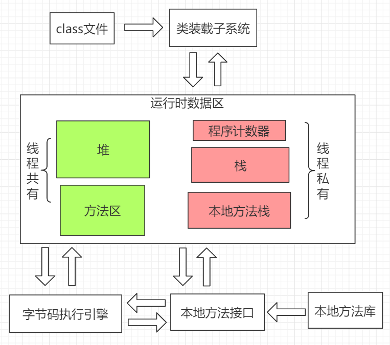
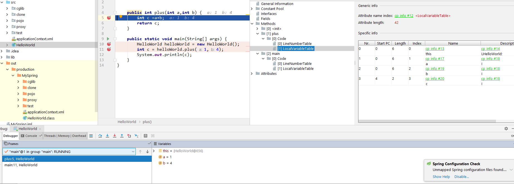
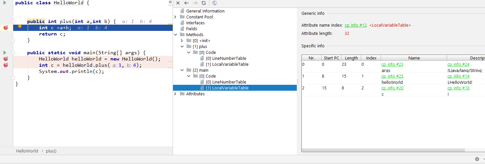
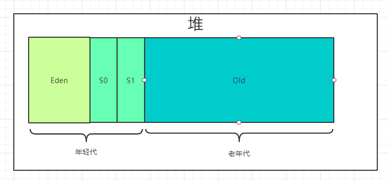
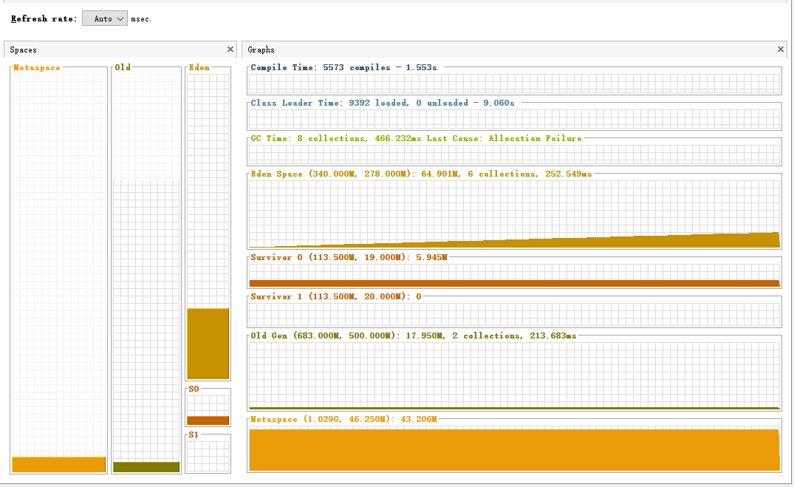

### 浅析JVM第三篇: JVM内存模型

相比于JVM内存模型，运行时数据区这个称谓显得更加官方一点。

> 运行时数据区: Java虚拟机定义了若干程序运行期间会使用到的运行时数据区，其中有一些会随着虚拟机的启动而创建，随着虚拟机退出而销毁。另外一些则是于线程一一对应的，这些与线程对应的数据区域会随着线程开始和结束而创建和销毁。

从上文中，我们可以得知，JVM内存模型可以分为两大类，一类是与线程有关(为线程所私有)，一类是跟虚拟机有关（为所有线程共有）。JVM内存模型分为5块，其中Program Counter Register（也叫程序计数器或PC寄存器）、Native Method Stack（本地方法栈）、JVM Stack（也叫虚拟机栈或者更直接称之为栈）所线程所私有；Heap（堆）和Method Area（方法区）为所有线程所共有。从下图中我们可以一目了然。



<p align='center'>内存模型</p>

#### 程序计数器

程序计数器也叫pc寄存器，存储了下一条指令（即将要执行的指令代码）的地址，由字节码执行引擎读取下 一条指令。程序计数器是为每个线程所私有。线程正在执行的方法，被称为当前方法，如果线程正在执行的是Java方法，程序计数器记录的是JVM字节码指令地址，如果是native方法，程序计数器存储的就是undefined。同时也是一处不会出现`OOM`的区域。因为多线程的出现，CPU需要不断的切换线程，程序计数器就是用来记录当前线程下一条应该是什么指令被执行。这同时也解释了，为什么程序计数器为每个线程所拥有。

#### 虚拟机栈

虚拟机栈就是我们平常所说的栈，每个线程都有自己的栈。栈是一种后进先出的数据结构。随着方法开始执行对应着入栈操作，方法执行结束返回伴随着出栈操作。栈中存储的基本单位是栈帧，java中的每个方法对应一个栈帧，栈帧是由***局部变量表***、***操作数栈***、***动态链接***、***方法返回地址***组成。

* 局部变量表

局部变量表的长度是由编译器决定的，通过方法中的code属性保存提供给栈帧使用，主要用来存储方法参数和定义在方法体内的局部变量，每个方法对应一个栈帧，栈帧中的局部变量表只在当前方法调用中生效。局部变量表的基本存储单元是Slot（变量槽），32位以内的类型占用一个slot，比如byte、short 、int、float、boolean、引用数据类型、returnAddress类型，64位的类型占用两个slot，比如long、double。局部变量表存储的起始位置位index为0，一直到数组长度-1为止。当调用类方法时，参数会依次从局部变量表的index为0处存储，调用实例方法时，第0个局部变量用来保存该实例方法所在对象的引用（java中的this关键词）。

* 操作数栈

在栈帧内部还包含先进后出的操作数栈，操作数栈的最大深度是在编译期间决定的。在方法执行期间，跟据字节码指令，往栈中写入数据或提取数据，对应操作数栈中的入栈和出栈。操作数栈用来存储计算过程中的中间状态的值。32位类型的变量占用1个栈深度，64位类型的变量占用2个栈深度。如果被调用的方法有返回值，返回值会被压入操作数栈，同时更新程序计数器中下一条需要执行的字节码指令的地址。

* 动态链接

栈帧内部包含指向运行时常量池中当前方法的引用。当方法需要调用其他方法或者成员变量时，通过符号引用来表示，动态链接作用在于将符号引用换为实际方法的直接引用。与动态链接相对应的有静态链接，当一个字节码被装到JVM中，被调用的方法在编译期间可知，在运行期保持不变。这种情况，将调用方法的符号引用换为直接引用的过程称为静态链接 。相对应的，在编译期间，被调用的方法在编译器无法被确定，此时将调用方法的符号引用换为直接引用的过程称为动态链接。与之对应的，绑定就是字段、方法、类的符号引用被替换为直接引用的过程。绑定也相应分为早期绑定、晚期绑定。

* 方法返回地址

用来存放调用该方法的程序计数器的值。当方法退出后会回到该方法被调用的位置。方法的结束分为两种，正常执行退出、出现未处理异常，导致方法退出。当方法正常退出，返回地址存储为调用该方法的下一条指令。异常退出，返回地址由异常表确定。两者的区别在于，异常退出，不给方法的调用者返回值。

我们现在举一个例子，来将知识点串起来。

```java
public class HelloWorld {

    public int plus(int a,int b) {
        int c =a+b;
        return c;
    }
}
```

生成字节码之后，使用`javap -verbose HelloWorld ` 打印出java堆栈、方法的局部变量和入参等信息，如下:

```java
Classfile /D:/HelloWorld.class
  Last modified 12-Nov-2020; size 257 bytes
  MD5 checksum be633861713af2489564492986c7c243
  Compiled from "HelloWorld.java"
public class HelloWorld
  minor version: 0
  major version: 52
  flags: ACC_PUBLIC, ACC_SUPER
Constant pool:
   #1 = Methodref          #3.#12         // java/lang/Object."<init>":()V
   #2 = Class              #13            // HelloWorld
   #3 = Class              #14            // java/lang/Object
   #4 = Utf8               <init>
   #5 = Utf8               ()V
   #6 = Utf8               Code
   #7 = Utf8               LineNumberTable
   #8 = Utf8               plus
   #9 = Utf8               (II)I
  #10 = Utf8               SourceFile
  #11 = Utf8               HelloWorld.java
  #12 = NameAndType        #4:#5          // "<init>":()V
  #13 = Utf8               HelloWorld
  #14 = Utf8               java/lang/Object
{
  public HelloWorld();
    descriptor: ()V
    flags: ACC_PUBLIC
    Code:
      stack=1, locals=1, args_size=1
         0: aload_0
         1: invokespecial #1                  // Method java/lang/Object."<init>":()V
         4: return
      LineNumberTable:
        line 1: 0

  public int plus(int, int);
    descriptor: (II)I
    flags: ACC_PUBLIC
    Code:
      stack=2, locals=4, args_size=3
         0: iload_1
         1: iload_2
         2: iadd
         3: istore_3
         4: iload_3
         5: ireturn
      LineNumberTable:
        line 4: 0
        line 5: 4
}
SourceFile: "HelloWorld.java"
```

我们把目光放在plus方法身上，由于plus是实例方法，第一个参数是this，加上方法的a，b两个参数，所以入参是3个。此时局部变量表的index为0处为this，index为1处是a, index 为2处的是b，开始读取指令。[点击查询指令集](https://docs.oracle.com/javase/specs/jvms/se8/html/jvms-6.html)

* 程序计数器中为0，表示执行第0行字节码，对应指令是iload_1，指的是从局部变量表中读

  取index为1的int类型变量也就是a，压入操作数栈中。

* 程序计数器为1，表示执行第1行字节码，对应指令是iload_2，从局部变量表中读取index为2的int类型也就是b，压入操作数栈中。
* 程序计数器为2，表示执行第2行字节码，对应指令是iadd，从操作数栈中弹出两个int类型值，将两值相加再压入栈中（弹出的值第一个是b对应值、第二个是a对应值，此时栈的深度由2变为0，再由0变为1）。
* 程序计数器为3，表示执行第3行字节码，对应指令是istore_3，表示从栈顶弹出int类型值，并将该值存放在局部变量表index为3的位置(该值为变量c，所对应的值)
* 程序计数器为4，表示执行第4行字节码，对应的指令是iload_3，表示从局部变量表中读取index为3int类型也就是c，将其压入操作数栈中。
* 程序计数器为5，表示执行第5行字节码，对应的指令是ireturn，表示从操作数栈中弹出int值返回。

我们通过main方法来测试一下，



此时方法执行到实例方法plus内部，VM Stack 也就是栈中的栈帧为plus和main，此时plus方法中的局部变量表中拥有4个变量，分别为this、a、b、c。对应的，静态方法对应的局部变量表中，index为0不再是this。



main方法属于静态方法不属于实例方法，对应的局部变量表的变量依次为args、helloWorld、c。

#### 本地方法栈

在了解本地方法栈之前，我们先来看本地方法。本地方法是Java调用非Java代码的接口，可以用c语言来实现该接口，执行速度快。Java虚拟机栈相对于java方法， 正如本地方法栈相对于本地方法。同样的，本地方法栈也是为线程私有，当线程请求分配栈的容量擦欧总本地方法栈的最大容量，就会跟虚拟机栈一样抛出StackOverlowError异常。

#### 堆

堆是JVM中每个线程共享的内存区域，可以用来存放类实例和数组对象。随着虚拟机启动而创建，如果所需的堆超过了最大容量，会抛出OOM异常。在JDK1.8中，堆是由Eden、S0、S1、Old组成，Eden、S0、S1 称为年轻代，Old称为老年代。



* 年轻代（Young Generation）

排除大对象的问题（在Eden中分配空间失败并且对象是不含任何对象的打数组或者超过`-XX:PretenureSizeThreshold`的u阈值）,新创建的对象会存放到Eden区域。S0 和S1指的是幸存区，当Eden剩余空间不够存储新创建的对象时，不考虑分配担保机制的话，会调用minor GC 也就是young GC，会回收年轻代（包含Eden、Survivor）。每经历一次GC，对象的年龄会加1，达到阈值的时候，会将对象放到老年代。

* 老年代（Old Generation）

老年代是堆的一部分，用来存储年龄大于15岁的对象，或者大对象，又或者是复制算法中，新生代无法存放的对象。

我们通过思考几个问题来，理解堆中的空间的划分。

1. 老年代与年轻代的空间占用比默认是2:1，或者说老年代为什么不能设置的很小？

如果老年代占用空间很小的话，每次年轻代出现young GC，Survivor区域无法存放多余存活的对象，就会将对象存放到老年代，将会频繁导致Full GC，而full GC会触发两次STW，导致线程挂起，虽然Young GC也会导致STW，但是Young GC也就是minor GC采用复制算法可以快速进行垃圾回收，而老年代采用的是标记整理算法，Full GC时间相对较长。

2. 为什么需要两个Survivor区域？

我们在想这个问题之前，先想为什么需要Survivor区域。如果没有Survivor区域，依次Minor GC之后，存活的对象将会存放到老年代中，这样原本一些经历几次GC就可以被回收的对象进入了老年代，导致Full GC的频率变大。所以Survivor存在的意义在于让那些存活时间不是很长的对象，能够在进入老年代之前被Minor GC回收。年轻代采用的是复制算法来进行垃圾回收，这样当Eden区域空间满了，会将Minor GC后存活的对象放到S0、S1中的其中一个为空的区域（此区域作为下次Minor GC的From Space），当下次Minor GC会将from space和Eden区域中间存活的对象存放到To Space。这样进行复制算法，就不会出现碎片化区域，当需要开辟连续空间的时候，导致GC的次数变多。由于Eden中存活的对象相对较少，也不需要像老年代一样，使用标记整理算法，可以提高效率。

3. 为什么Eden中区域与Survivor区域的比例是8:1?

这是因为大量数据的统计发现，年轻代中创建的对象能存活下来的大致是5%-10%，又加上复制算法需要两个Survivor区域，所以默认比例是8:1。

#### 方法区

在JDK1.8之前方法区的实现是永久代，在JDK1.8之后方法区的实现是元空间（Metaspace）。永久代存放在JVM中，而云空间是存放在直接内存中。发生这样的变化的原因是之前的硬件是32位，对应的内存是2^32（4G内存），如果直接存在内存中，将会导致计算机内存不够。而现在的硬件是64位的，内存空间有了很大的发展，同时现在的业务逻辑变得更加得复杂，单一个Spring框架就占用很大的空间，元空间存放在的内存中，可以更好得适应业务的发展。方法区用于存放被虚拟机加载的类信息(修饰符、全限定名、被加载的是类还是接口信息)、字段信息(包含字段名、修饰符、字段类型等等)、方法信息(方法名、修饰符、方法返回值)、常量池(包括直接常量、符号引用)、静态变量的信息，还有方法表以及对class对象的引用和类加载器引用信息。当类被加载的时候，将会在元空间中分配空间存放元数据，当类被卸载的时候也就是该类没有存活的对象的时候，没有到达该类的引用的时候，相应的空间就会被释放。

最后奉上一张图，帮助理解。



