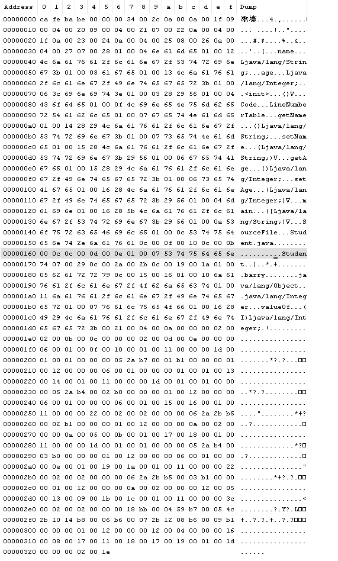
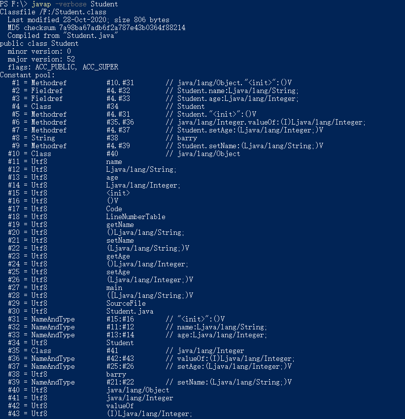
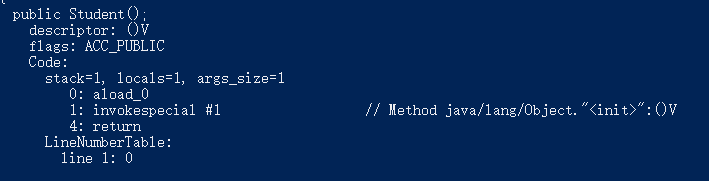
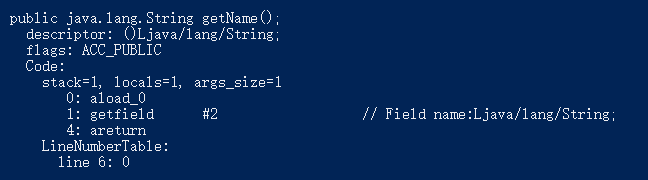
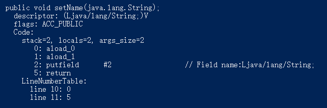
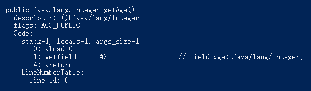
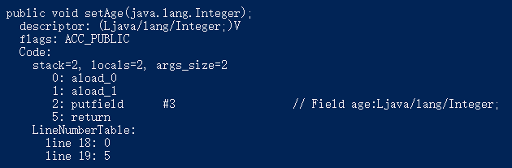
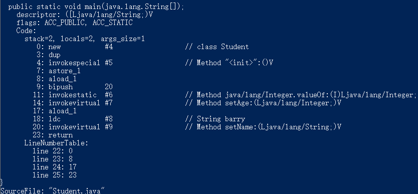

### 浅析JVM第二篇: class文件格式

这一篇文章我们一起来看字节码文件内部的组成结构，首先我们先编写一个java源代码。

```java
public class Student {
    private String name;
    private Integer age;

    public String getName() {
        return name;
    }

    public void setName(String name) {
        this.name = name;
    }

    public Integer getAge() {
        return age;
    }

    public void setAge(Integer age) {
        this.age = age;
    }

    public static void main(String[] args) {
        Student student = new Student();
        student.setAge(20);
        student.setName("barry");
    }
}
```

使用<font color='green'>*javac Student.java*</font>命令生成<font color='green'>*Student.class*</font>之后我们选择记事本并以16进制方式(class文件是使用16进制编写的，16进制以*0x*开头，x是Hex缩写)



class文件是由字节流(八个二进制数为一个字节)组成，每个数据项目中间没有任何分隔符并且紧凑的排列在class文件中。class文件中有两种基本的数据类型--无符号数和表。

***无符号数***

无符号数是相对于有符号数讲的，无符号数与有符号数之间的区别是最高位数（左高右低）是用来表示数值还是正负。如果是用于数值，那么就是无符号数。那么此时一个字节可以表示的范围是0-255（2^8-1），也就是00000000-11111111。如果最高位是用来表示正负，我们规定最高位为1表示负数，为0表示正数，那么此时一个字节可以表示的范围是-128-127,也就是11111111-01111111。

无符号数是class文件的基本数据类型。在class文件中用u1、u2、u4、u8来表示1、2、4、8节字符，可以用来表示数字、索引的引用、数值、UTF-8格式的字符串。

***表***

表是由多个符号数或者其他的表作为其中的数据项构成的数据结构。按照Java虚拟机规范中的定义,表的命名是以<font color='green'>_info</font>结尾，表是用来表示描述可变数据的复合结构。

每个class文件都对应一个classFile的结构。

|      类型      |                 名称                 |     解释     |
| :------------: | :----------------------------------: | :----------: |
|       u4       |                magic                 |     魔数     |
|       u2       |            minor_version             |   次版本号   |
|       u2       |            major_version             |   主版本号   |
|       u2       |         constant_pool_count          | 常量池计数器 |
|    cp_info     | constant_pool[constant_pool_count-1] |    常量池    |
|       u2       |             access_flag              |   访问标志   |
|       u2       |              this_class              |  当前类索引  |
|       u2       |             super_class              |   父类索引   |
|       u2       |           interfaces_count           |   接口计数   |
|       u2       |     interfaces[interface_count]      |   接口数组   |
|       u2       |             fields_count             |   字段计数   |
|   field_info   |         fields[fields_count]         |   字段数组   |
|       u2       |            methods_count             |   方法计数   |
|  method_info   |        methods[method_count]         |   方法数组   |
|       u2       |           attributes_count           |   属性计数   |
| attribute_info |     attributes[attributes_count]     |   属性数组   |

我们按照上述classFile中item的顺序依次来读字节码文件，由于class文件采用的16进制，2^4=16,所以两个16进制数即为1个字节。class的第1-4个字节*ca fe ba be*表示魔数, 魔数的作用是表示这是一个能被虚拟机接受的class文件，魔数的值为*0xCAFEBABE*

接下的两个字节00 00表示副版本号，00 34表示主版本号

| JDK版本 | 次版本 | 主版本 |
| :-----: | :----: | :----: |
| JDK1.2  |  0000  |  002E  |
| JDK1.3  |  0000  |  002F  |
| JDK1.4  |  0000  |  0030  |
| JDK1.5  |  0000  |  0031  |
| JDK1.6  |  0000  |  0032  |
| JDK1.7  |  0000  |  0033  |
| JDK1.8  |  0000  |  0034  |

通过查表我们得知，这是一个JDK1.8版本生成的java字节码文件。接下来的两个字节是00 2c表示常量池计数器，换算成十进制为44，又因为常量池表结构中成员数等于constant_pool_count-1,所以实际上常量池中的个数为43,这是因为常量池中的索引计数是从1开始到constant_pool_count-1结束，常量池将值为0的位置空出来，这样当其他用到常量池的数据结构可以引用0来表达，该数据结构不引用任何一个常量池中的常量的意思。

在继续阅读字节码前，我们先来看下常量池的相关知识点。常量池中包含constant_pool_count-1个item。每个item的有一个通用的格式，

```java
u1 tag;
u1 info[];
```

tag占用一个字节，tag中的值对应各自的常量类型，而info[]数组中内容由tag值决定。

|          常量类型           |  值  |
| :-------------------------: | :--: |
|       CONSTANT_Class        |  7   |
|      CONSTANT_Fieldref      |  9   |
|     CONSTANT_Methodref      |  10  |
| CONSTANT_InterfaceMethodref |  11  |
|       CONSTANT_String       |  8   |
|      CONSTANT_Integer       |  3   |
|       CONSTANT_Float        |  4   |
|        CONSTANT_Long        |  5   |
|       CONSTANT_Double       |  6   |
|    CONSTANT_NameAndType     |  12  |
|        CONSTANT_Utf8        |  1   |
|    CONSTANT_MethodHandle    |  15  |
|     CONSTANT_MethodType     |  16  |
|   CONSTANT_InvokeDynamic    |  18  |

我们继续往下读取这43个常量信息。

<font color='green'>第一个常量</font>tag是0a, 也就是10。通过查表得知属于CONSTANT_Methodref。

CONSTANT_Methodref_info(常量池中的项命名通常以_info结尾)的数据结构，

```java
u1 tag;
u2 class_index;//指向的是CONSTANT_Class_info,表示类或者接口信息
u2 name_and_type_index;//指向的是CONSTANT_NameAndType_info,表示当前字段或者方法的名字和类型信息
```

class_index 是00 0a 指向常量池中第10个常量*java/lang/Object* (在JVM规范中用来分隔各个标识符不是. 而是/，所以这边，在类Object引用是通过字符串java/lang/Object 的CONSTANT_Utf8_info的结构来实现的),  name_and_type_index是001f指向常量池中第31个变量*"<init>":()V*,两者结合起来 java/lang/Object."<init>":()V，也就是Object的init初始化方法。

<font color='green'>第二个常量</font>tag是09，也就是9，查询表格发现属于CONSTANT_Fieldref类型

对应CONSTANT_Fieldref_info的数据结构是,

```java
u1 tag;
u2 class_index;
u2 name_and_type_index;
```

此处class_index是00 04指向常量池中第四个常量*Student*，name_and_type_index是00 20 为10进制的32指向常量池中第32个常量*name:Ljava/lang/String*;，两者结合起来是*Student.name:Ljava/lang/String*;，就是在Student类中段名为name并且类型为String的字段。

<font color='green'>第三个常量</font>的tag是09，查询表格发现属于CONSTANT_Fieldref类型

对应CONSTANT_Fieldref_info的数据结构是,

```java
u1 tag;
u2 class_index;
u2 name_and_type_index;
```

此处class_index是00 04指向常量池中第四个常量*Student*，name_and_type_index是00 21为十进制中的33指向常量池中的第33个常量*age:Ljava/lang/Integer;*，两者结合起来是*Student.age:Ljava/lang/Integer;*，这边是在Student中字段名为age类型名为Integer的字段

<font color='green'>第四个常量</font>的tag是07，查询表格发现变量属于CONSTANT_Class类型

对应CONSTANT_Class_info的数据结构是，

```java
u1 tag;
u2 name_index;//指向常量池的索引，在此索引处的成员是CONSTANT_Utf8_info结构
```

此处的name_index是00 22换算为十进制为34，指向常量池中的第34个常量Student，这边是Student的类

<font color='green'>第五个常量</font>的tag是0a，换算十进制为10，查询表格属于CONSTANT_Methodref类型

对应CONSTANT_Methodref_info的数据结构是,

```java
u1 tag;
u2 class_index;
u2 name_and_type_index;
```

class_index是00 04换算十进制为4 指向常量池中的第4个常量*Student*, name_and_type_index是00 1f换算为十进制为31 指向常量池中第31个常量*"<init>":()V*，连起来是*Student."<init>":()V*，指的是Student的init方法

<font color='green'>第六个常量</font>的tag是0a，换算十进制为10，查询表格属于CONSTANT_Methodref类型

对应CONSTANT_Methodref_info的数据结构是,

```java
u1 tag;
u2 class_index;
u2 name_and_type_index;
```

class_index是0023 换算为十进制为35，指向常量池中第35个常量*java/lang/Integer*，name_and_type_index是

00 24换算为十进制为36，指向常量池中第36，指向常量池中第36个常量*valueOf:(I)Ljava/lang/Integer;*，连起来的意思是*java/lang/Integer.valueOf:(I)Ljava/lang/Integer*; 指的是Integer.valueOf方法

<font color='green'>第七个常量</font>的tag是0a，依旧属于CONSTANT_Methodref类型，对应CONSTANT_Methodref_info的数据结构是,

```java
u1 tag;
u2 class_index;
u2 name_and_type_index;
```

class_index是00 04，指向常量池中第4个常量*Student*，name_and_type_index是00 25换算十进制为37，指向常量池中的第37个常量*setAge:(Ljava/lang/Integer;)V*，连起来就是*Student.setAge:(Ljava/lang/Integer;)V*，指的是Student.setAge方法

<font color='green'>第八个常量</font>的tag是08，指向表格中的CONSTANT_String类型,对应CONSTANT_String_info的数据结构是，

```java
u1 tag;
u2 string_index//是指向常量池CONSTANT_Utf8_info的索引
```

string_index 的字节码是00 26，换算为十进制38，指向常量池中第38的常量*barry*，指的是名字为barry的字符。

<font color='green'>第九个常量</font>的tag是0a,指向表格中CONSTANT_Methodref类型，对应CONSTANT_Methodref_info的数据结构是，

```java
u1 tag;
u2 class_index;
u2 name_and_type_index;
```

class_index 对应的字节码是00 04，指向常量池中第4个常量*Student*，name_and_type_index对应的字节码是00 27换算为十进制为39，指向常量池中第39个常量*setName:(Ljava/lang/String;)V*，连起来就是*Student.setName:(Ljava/lang/String;)V*，指的是Student类中的setName方法

<font color='green'>第十个常量</font>的tag是07，指向表格中的CONSTANT_Class类型，对应CONSTANT_Class_info的数据结构是

```java
u1 tag;
u2 name_index;
```

name_index 对应的字节码是00 28，换算为十进制为40，指向常量池中的第40个常量*java/lang/Object*，这表示Object这个超级父类的常量

<font color='green'>第十一个常量</font>的tag是01，查询表格得知指向CONSTANT_Utf8类型，对应CONSTANT_Utf8_info的数据结构是

```java
u1 tag;
u2 length;//使用两个字节的长度来表表示bytes数组的长度
u1 bytes[length];//表示字符串值得byte数组，数组中单个元素占1字节
```

这边我们可以看到CONSTANT_Utf8对应CONSTANT_Utf8_info的特殊性,它不再指向常量池中常量，而是真正用来存储数据。length对应的字节码是00 04，也就是说bytes的数组长度为4，又因为每个数组中的元素占1个字节。所以我们继续往后读取4个字节6e 61 6d 65，所以这个bytes数组连起来 0x6E616D65，将16进制转为字符串得到的结果是*name*, 所以这边表示的是最终指向name这个常量，是真实的值不再是常量池的索引。

<font color='green'>第十二个常量</font>的tag是01，查询表格属于CONSTANT_Utf8类型，对应CONSTANT_Utf8_info的数据结构是

```java
u1 tag;
u2 length;
u1 bytes[length];
```

length对应的字节码是00 12换算为十进制为18说明bytes数组长度为18。单个元素占1个字节，我们继续往后读取18个字节连接起来0x4c6a6176612f6c616e672f537472696e673b,将16进制转为字符串结果为*Ljava/lang/String;* 

<font color='green'>第十三个常量</font>的tag是01，查询表格属于CONSTANT_Utf8类型，对应CONSTANT_Utf8_info的数据结构是

```java
u1 tag;
u2 length;
u1 bytes[length];
```

length 对应的字节码为00 03,说明bytes数组长度为3，单个元素占1个字节，继续向后取3个字节连接起来0x616765，将16进制转换成字符串结果为*age*

<font color='green'>第十四个常量</font>的tag是01,依旧属于CONSTANT_Utf8类型，对应CONSTANT_Utf8_info的数据结构是

```java
u1 tag;
u2 length;
u1 bytes[length];
```

length对应的字节码为00 13，转换成十进制为19，说明bytes数组的长度为19并且单个元素占1个字节，继续向后读取19个字节并连接起来0x4c6a6176612f6c616e672f496e74656765723b,将16进制转换为字符串结果为

*Ljava/lang/Integer;*

<font color='green'>第十五个常量</font>的tag依旧是01，属于CONSTANT_Utf8类型，对应的CONSTANT_Utf8_info的数据结构是

```java
u1 tag;
u2 length;
u1 bytes[length];
```

向后读取两个字节00 06 说明bytes数组的长度为6，单个元素占1个字符，向后读取6个字节连接起来3c696e69743e，将16进制转换成字符串结果为*<init>*

<font color='green'>第十六个常量</font>的tag 是01，属于CONSTANT_Utf8类型，对应的CONSTANT_Utf8_info的数据结构是

```java
u1 tag;
u2 length;
u1 bytes[length];
```

向后读取两个字节00 03表明bytes数组的长度为3，单个元素占1个字节，向后读取3个字节并连接起来282956

转换为字符串为*()V*

<font color='green'>第十七个常量</font>的tag是01，属于CONSTANT_Utf8类型，对应CONSTANT_Utf8_info的数据结构是

```java
u1 tag;
u2 length;
u1 bytes[length];
```

length对应的字节码是00 04，表明bytes长度为4加上数组中单个元素占用1个字节，继续向后读取4个字节，

并将其拼接起来436f6465，并将其转化为字符串*Code*

<font color='green'>第十八个常量</font>的tag是01，属于CONSTANT_Utf8类型，对应CONSTANT_Utf8_info的数据结构是

```java
u1 tag;
u2 length;
u1 bytes[length];
```

length对应的字节码是00 0f, 表明bytes长度为15 数组中单个元素占用1个字节，向后读取15个字节。拼接完之后4c696e654e756d6265725461626c65，转化为字符串为*LineNumberTable*

<font color='green'>第十九个常量</font>的tag是01，还是属于CONSTANT_Utf8类型，对应CONSTANT_Utf8_info的数据结构是

```java
u1 tag;
u2 length;
u1 bytes[length];
```

length对应字节码是00 07，表明bytes数组的长度为7，数组中单个元素占用1字节，向后读取7个字节，拼接完之后为6765744e616d65转换为字符串为*getName*

<font color='green'>第二十个常量</font>的tag是01，表明属于CONSTANT_Utf8类型，对应CONSTANT_Utf8_info的数据类型是

```java
u1 tag;
u2 length;
u1 bytes[length];
```

length对应的字节码是00 14，换算为十进制20，向后读取20个字符并连接起来28294c6a6176612f6c616e672f537472696e673b 转化为字符串为*()Ljava/lang/String;*

<font color='green'>第二十一个常量</font>tag是01，属于CONSTANT_Utf8类型，对应CONSTANT_Utf8_info的数据类型是

```java
u1 tag;
u2 length;
u1 bytes[length];
```

length对应字节码为00 07，向后读取7个字符连接起来，7365744e616d65，转换成字符串为*setName*

<font color='green'>第二十二个常量</font> 的tag是01依旧属于CONSTANT_Utf8类型，对应CONSTANT_Utf8_info的数据结构是

```java
u1 tag;
u2 length;
u1 bytes[length];
```

length对应字节码为00 15，为十进制中的21，向后读取21个字符，并拼接起来为284c6a6176612f6c616e672f537472696e673b2956转化为*(Ljava/lang/String;)V*

<font color='green'>第二十三个常量</font>的tag是01,属于CONSTANT_Utf8类型，对应CONSTANT_Utf8_info的数据结构是

```java
u1 tag;
u2 length;
u1 bytes[length];
```

length对应的字节码为00 06，表明bytes数组的长度为6，向后读取6个字节并拼装起来67 65 74 41  67 65 转换为字符串*getAge*

<font color='green'>第二十四个常量</font>的tag是01，属于CONSTANT_Utf8类型，对应CONSTANT_Utf8_info的数据结构是

```java
u1 tag;
u2 length;
u1 bytes[length];
```

length对应字节码为00 15换算十进制为21，表明bytes数组的长度为21，向后读取二十一个字符28 29 4c 6a 61 76 61 2f 6c 61 6e  67 2f 49 6e 74 65 67 65 72 3b ，将字节码转换为字符串*()Ljava/lang/Integer;*

<font color='green'>第二十五个常量</font>的tag是01，属于CONSTANT_Utf8类型，对应CONSTANT_Utf8_info的数据结构是

```java
u1 tag;
u2 length;
u1 bytes[length];
```

length对应字节码为00 06，向后读取6个字节73 65 74  41 67 65  转换成字符串*setAge*

<font color='green'>第二十六个常量</font>的tag是01，属于CONSTANT_Utf8类型，对应CONSTANT_Utf8_info的数据结构是

```java
u1 tag;
u2 length;
u1 bytes[length];
```

length对应字节码为00 16，换算为十进制为22，向后读取22个字节码，28 4c 6a 61 76 61 2f 6c 61 6e  67 2f 49 6e 74 65 67 65 72 3b 29 56  ,转换成字符串为*(Ljava/lang/Integer;)V*

<font color='green'>第二十七个常量</font>tag是01，属于CONSTANT_Utf8类型，对应CONSTANT_Utf8_info的数据结构是

```java
u1 tag;
u2 length;
u1 bytes[length];
```

length对应字节码00 04，向后读取4个字节，6d  61 69 6e  ，转换成字符串为*main*

<font color='green'>第二十八个常量</font>tag是01，属于CONSTANT_Utf8类型，对应CONSTANT_Utf8_info的数据结构是

```java
u1 tag;
u2 length;
u1 bytes[length];
```

length对应字节码00 16，换算为十进制22，向后读取22个字节，28 5b 4c 6a 61 76 61 2f 6c 61  6e 67 2f 53 74 72 69 6e 67 3b 29 56  ，转换成字符串*([Ljava/lang/String;)V*

<font color='green'>第二十九个常量</font>tag是01，属于CONSTANT_Utf8类型，对应CONSTANT_Utf8_info的数据结构是

```java
u1 tag;
u2 length;
u1 bytes[length];
```

length对应字节码00 0a, 换算为十进制10，向后读取10个字节，53  6f 75 72 63 65 46 69 6c 65  转换成字符串是

*SourceFile*

<font color='green'>第三十个常量</font>tag是01，属于CONSTANT_Utf8类型，对应CONSTANT_Utf8_info的数据结构是

```java
u1 tag;
u2 length;
u1 bytes[length];
```

length的长度是00 0c，换算为十进制12，向后读取12个字节码，53 74 75 64 65 6e 74 2e 6a 61 76 61转换成字符串*Student.java*

<font color='green'>第三十一个常量</font>的tag是0c，换算十进制为12，查询表格属于CONSTANT_NameAndType类型，对应CONSTANT_NameAndType_info的数据结构是

```java
u1 tag;
u2 name_index;//表示方法名或者是有效的字段，指向常量池中的元素
u2 descriptor_index;//表示字段描述符，或者方法描述符，指向常量池中的元素
```

那么name_index对应的字节码是00 0f 转换成十进制为15，指向常量池中的第十五个常量*<init>*

descriptor_index对应的字节码是00 10转为十进制为16，指向常量池中的第十六个常量*()V*, 此时这边是一个方法的描述符()v **默认格式: *({Parameter Descriptor})ReturnDescriptor*  **, 这边没有入参，不返回任何数据所以为V表示**void**  （Parameter Descriptor是由FieldType构成的，ReturnDescriptor是由 FieldType/void Descriptor构成）

<font color='green'> 第三十二个常量</font>的tag是0c, 换算为十进制中的12，查询表格属于CONSTANT_NameAndType类型，对应CONSTANT_NameAndType_info的数据结构是

```java
u1 tag;
u2 name_index;
u2 descriptor_index;
```

name_index 对应字节码是00 0b, 为十进制中的11，指向常量池中的第11个常量*name*，descriptor_index对应字节码是00 0c，换算为十进制12，指向常量池中第12个变量（CONSTANT_Utf8类型） *Ljava/lang/String;*

这边是一个字段描述符，FieldType 对应表格如下:

| FieldType中字符描述 |   类型    |
| :-----------------: | :-------: |
|          B          |   byte    |
|          C          |   char    |
|          D          |  double   |
|          F          |   float   |
|          I          |    int    |
|          J          |   long    |
|    L ClassName;     | reference |
|          S          |   short   |
|          Z          |  boolean  |
|          [          | reference |

注: L ClassName; 指的是类的引用，比如 String 类型的实例，对应的FieldType 是 Ljava/lang/String;

[ 指的是 数组的引用，比如 int [][] [] [] 类型的实例变量，对应FieldType是[ [ I

<font color='green'>第三十三个常量</font>的tag是0c, 转换为十进制为12，查询表格属于CONSTANT_NameAndType类型，对应CONSTANT_NameAndType_info的数据结构是

```java
u1 tag;
u2 name_index;
u2 descriptor_index;
```

name_index 对应字节码是 00 0d，为十进制中的13，指向常量池中的第13个常量 *age*，descriptor_index对应的字节码是00 0e，为十进制中的14，指向常量池中的第十四个常量*Ljava/lang/Integer;*  这边是 Integer的FieldType。

<font color='green'>第三十四个常量</font>的tag是01，属于CONSTANT_Utf8类型，对应CONSTANT_Utf8_info的数据结构是

```java
u1 tag;
u2 length;
u1 bytes[length];
```

length对应的字节码是 00 07，表明bytes数组长度为7，继续向后读取7个字节并连接起来*53 74 75 64 65 6e 74* ，转换成字符串Student

<font color='green'>第三十五个常量</font>的tag是07 ，属于CONSTANT_Class类型，对应CONSTANT_Class_info的数据结构是

```java
u1 tag;
u2 name_index;
```

name_index 对应字节码是00 29 为十进制中的41，指向常量池中的第四十一个常量 *java/lang/Integer* ，用于表示Integer类

<font color='green'>第三十六个常量</font>的tag是0c，属于CONSTANT_NameAndType类型，对应CONSTANT_NameAndType_info的数据结构是

```java
u1 tag;
u2 name_index;
u2 descriptor_index;
```

name_index 对应的字节码是 00 2a, 为十进制中的42，指向常量池中的第四十二个常量 valueOf ，descriptor_index 对应的字节码是00 2b, 为十进制的43，指向第四十三个常量*(I)Ljava/lang/Integer;*

这边属于方法描述符，入参是int类型，回参是Integer类型

<font color='green'>第三十七个常量</font>的tag是 0c，属于CONSTANT_NameAndType类型，对应CONSTANT_NameAndType_info的数据结构是

```java
u1 tag;
u2 name_index;
u2 descriptor_index;
```

name_index对应的字节码是 00 19，为十进制中的25，指向常量池中的第二十五个常量*setAge* ，descriptor_index 对应的字节码是 00 1a，为十进制中的26，指向常量池中的第二十六个常量*(Ljava/lang/Integer;)V*  ,这边属于方法描述符，入参是Integer 类型，没有回参。

<font color='green'>第三十八个常量</font>的tag是01，属于CONSTANT_Utf8类型，对应CONSTANT_Utf8_info的数据结构是

```java
u1 tag;
u2 length;
u1 bytes[length];
```

length对应的长度是 00 05，继续向后读取5个字节并拼接起来*62 61 72 72 79* ，将16进制转为字符串barry

<font color='green'>第三十九个常量</font>的tag 是0c，属于CONSTANT_NameAndType类型，对应CONSTANT_NameAndType_info的数据结构是

```java
u1 tag;
u2 name_index;
u2 descriptor_index;
```

name_index 对应字节码是00 15 为十进制中的21，指向常量池中第二十一个常量*setName* ，descriptor_index对应字节码是00 16，指向常量池中第二十二个常量*(Ljava/lang/String;)V*，这里是作为一个方法的描述符，入参为String类型，回参为void

<font color='green'>第四十个常量</font>的tag是01，属于CONSTANT_Utf8类型，对应CONSTANT_Utf8_info的数据结构是

```java
u1 tag;
u2 length;
u1 bytes[length];
```

length对应的字节码是 00 10，为十进制的16，向后读取16个字节并拼接起来*6a 61 76 61 2f 6c 61 6e 67 2f 4f 62 6a 65 63 74*  ，转为字符串java/lang/Object

<font color='green'>第四十一个常量</font>的tag是01，属于CONSTANT_Utf8类型，对应CONSTANT_Utf8_info的数据结构是

```java
u1 tag;
u2 length;
u1 bytes[length];
```

length对应的字节码为00 11，为十进制中的17，向后读取17个字节并拼接起来*6a 61 76 61 2f 6c 61 6e 67 2f 49 6e 74 65 67 65 72*  将其转为字符串java/lang/Integer

<font color='green'>第四十二个常量</font>的tag是01，属于CONSTANT_Utf8类型，对应CONSTANT_Utf8_info的数据结构是

```
u1 tag;
u2 length;
u1 bytes[length];
```

length对应的字节为00 07，向后读取7个字节*76 61 6c 75 65 4f 66*  并将其转为字符串valueOf

<font color='green'>第四十三个常量</font>的tag是01，属于CONSTANT_Utf8类型，对应CONSTANT_Utf8_info的数据结构是

```java
u1 tag;
u2 length;
u1 bytes[length];
```

length对应的字节数为 00 16 ，是为十进制中的22，向后读取22个字节*28 49 29 4c 6a 61 76 61 2f 6c 61 6e 67 2f 49 6e 74 65 67 65 72 3b*，转为字符串*(I)Ljava/lang/Integer;*

到目前为止，常量池中43个常量已经手动读完了，我们使用**javap -verbose Student**来验证一下。



---

我们继续向后读取两个字节00 21，作为访问标识。

|     标志名     |   值   |                 含义                  |
| :------------: | :----: | :-----------------------------------: |
|   ACC_PUBLIC   | 0x0001 |             声明为public              |
|   ACC_FINAL    | 0x0010 |              声明为final              |
|   ACC_SUPER    | 0x0020 | 调用invokespecial，对父类方法特殊处理 |
| ACC_INTERFACE  | 0x0200 |             定义的是接口              |
|  ACC_ABSTRACT  | 0x0400 |            声明为abstract             |
| ACC_SYNTHETIC  | 0x1000 | 表示该class文件不是由java源代码生成的 |
| ACC_ANNOTATION | 0x2000 |              为注解类型               |
|    ACC_ENUM    | 0x4000 |               枚举类型                |

<p align='center'>类访问权限</p>

查阅表格，发现ACC_PUBLIC 和ACC_SUPER做或运算 可以得到00 21，说明该类是public修饰并可以调用invokespecial

继续向后读取两个字节00 04作为类索引，类索引是指向常量池中CONSTANT_Class_info，当前指向常量池中第四个常量Student类型为CONSTANT_Class。接下来的，00 0a 是父类索引，为常量中第10个常量Object 类型为CONSTANT_Class （父类索引要么是指向常量池中类型为CONSTANT_Class的常量，要么等于0代表当前类为Object超类）。继续读取俩个字节00 00作为接口索引的计数，代表当前没有类没有接口，interfaces这个接口表

里面存储的也是常量池中的类型为CONSTANT_Class ，由于当前没有接口，所以接口表不在字节码中显示而是只显示接口的计数。

接下来的两个字节00 02是字段计数，说明当前类中一共定义了2个字段。每个字段对应field_info的数据结构

```java
u2 access_flags;//表示字段的访问权限和基本属性
u2 name_index;//字段名字，指向常量池中类型为CONSTANT_utf8_info结构
u2 descriptor_index;//表示这个字段是什么类型，指向常量池中CONSTANT_Utf8结构
u2 attributes_count;// 属性计数器
attribute_info attributes[attributes_count];//属性表
```

| 标志符        | 值     | 说明                     |
| ------------- | ------ | ------------------------ |
| ACC_PUBLIC    | 0x0001 | 声明为public             |
| ACC_PRIVATE   | 0x0002 | 声明为private            |
| ACC_PROTECTED | 0x0004 | 声明为protected          |
| ACC_STATIC    | 0x0008 | 声明为static             |
| ACC_FINAL     | 0x0010 | 声明final                |
| ACC_VOLATILE  | 0x0040 | volatile，该字段无法缓存 |
| ACC_TRANSIENT | 0x0080 | transient                |
| ACC_SYNTHETIC | 0x1000 | 编译器生成的字段         |
| ACC_ENUM      | 0x4000 | 该字段为枚举类型成员     |

<p align='center'>字段访问权限</p>

此时表明字段表中有2个field_info类型的项。

<font color='green'>第一个字段</font>的access_flags 对应的字节码是*00 02*，表示该字段被声明为private，name_index 对应的字节码是*00 0b*, 为十进制的11，指向常量池中第11个常量*name* ，而常量name确为CONSTANT_utf8类型，descriptor_index 对应的字节码是00 0c指向常量池中第12个常量*Ljava/lang/String;*表明name的类型。attributes_count 对应的字节码是*00 00*, 表示该字段没有属性, 所以此时没有属性表。

<font color='green'>第二个字段</font>的access_flags对应的字节码是*00  02*，表明该字段被声明为private，name_index 对应的字节码是*00 0d*， 为十进制中的13，指向常量池的第13个常量*age* ，descriptor_index对应的字节码是*00 0e*, 为十进制中的14，指向常量池中的第14个常量*Ljava/lang/Integer;* ，attributes_count 对应的字节码是*00 00*，表示该字段没有属性。现在我们得知，这边定义了 Integer 类型的age 字段。

接下来的两个字节00 06就是方法的计数，表明该类定义了6个方法, 也就是说methods数组中有6个项。每个项对应method_info数据结构是

```java
u2 access_flags;//定义当前类的访问权限
u2 name_index;//表示方法的名字，是对常量池中的引用
u2 descriptor_index;//表示方法的描述符，也是对常量池中的引用
u2 attributes_count;//属性计数
attribute_info attributes[attributes_count];//属性数组
```

| 标志名           | 值     | 说明                                     |
| ---------------- | ------ | ---------------------------------------- |
| ACC_PUBLIC       | 0x0001 | public                                   |
| ACC_PRIVATE      | 0x0002 | private                                  |
| ACC_PROTECTED    | 0x0004 | protected                                |
| ACC_STATIC       | 0x0008 | static                                   |
| ACC_FINAL        | 0x0010 | final                                    |
| ACC_SYNCHRONIZED | 0x0020 | 声明synchronized                         |
| ACC_BRIDGE       | 0x0040 | bridge(泛型方法生成字节码与之前版本兼容) |
| ACC_VARARGS      | 0x0080 | 变长参数                                 |
| ACC_NATIVES      | 0x0100 | 声明native                               |
| ACC_ABSTRACT     | 0x0400 | abstract                                 |
| ACC_STRICT       | 0x0800 | strictfp                                 |
| ACC_SYNTHETIC    | 0x1000 | 编译器合成                               |

<p align='center'>方法访问权限</p>
<font color='green'>第一个方法</font>的access_flags对应的字节码是*00 01*,查询表格当前方法为public类型，name_index对应的字节码是*00 0f*，为十进制中的15，指向常量池中第15个常量*<init>*，<init>是编译器命名的，属于实例构造器，会将变量初始化、语句块、构造函数依次放到init方法执行。与之对应的有<clinit> 属于类构造器，也会将静态变量、静态语句块依次放到<Clinit>方法去执行，<Clinit>是在类加载过程中执行，而<init>在对象实例化过程中执行，所以<Clinit> 在之前被执行。descriptor_index 对应的字节码是*00 10*，对应十进制中的16，指向常量池中第16个常量*()v* ,表示没有入参且没有回参。attributes_count对应的字节码是*00 01* ，表示attributes数组中拥有1个属性，属性对应的attribute_info通用的数据结构是

```java
u2 attribute_name_index;//指向常量池中的结构为CONSTANT_Utf8_info
u4 attribute_length;//表示info数组的长度（不包含attribute_name_index、attribute_length的长度）
u1 info[attribute_length];
```

attribute_name_index对应的字节码是00 11，为十进制中的17，指向常量池中的第17个常量*Code*, Code属性包含某个方法、实例初始化方法、类或接口初始化方法。Code对应的数据结构是

```java
u2 attribute_name_index;//指向常量池中的结构为CONSTANT_Utf8_info
u4 attribute_length;//表示info数组的长度（不包含attribute_name_index、attribute_length的长度）
u2 max_stack; // stack的最大深度
u2 max_locals;//在当前方法中的局部变量个数
u4 code_length;//code数组字节数
u1 code[code_length];
u2 exception_table_length;// 异常表的个数
{
    u2 start_pc;
    u2 end_pc;
    u2 handler_pc;
    u2 catch_type;//常量池中的索引
} exception_table[exception_table_length];
u2 attributes_count;//attributes个数
attribute_info attributes[attributes_count];//属性数组
```

attribute_length对应的字节码是*00 00 00 1d*，为十进制中的29，表示info中的长度为29个字节。max_stack对应字节码*00 01* ，表示操作树的深度为1，max_locals对应字节码是*00 01*表示只有一个局部变量。code_length的字节码是*00 00 00 05*，表示code数组中有5个项，code数组中单个项占1字节，向后读取5个字节。*2a b7 00 01 b1*, 我们挨个查询指令集，*0x2a* 表示aload_0(为将第0个引用类型本地变量推送至栈顶)。*0xb7*,表示invokespecial , 当class文件的版本号大于等于52（jdk1.8的版本为52）,即当jdk版本为1.8及其以上的时候，invokespecial所指向常量池中的有效索引的类型必须是CONSTANT_Methodref 或者CONSTANT_InterfaceMethodref，invokespecial调用超类构造方法，实例初始化方法，私有方法。*0x00 01*所指向的常量池中的第一个常量*java/lang/Object."<init>":()V* , 所以此处调用超类Object的<init> , *0xb1*  查询指令集表格为return，从当前方法返回void。向后读取两个字节，00 00 表示当前异常表中没有项，所以exception_table中元素个数为0，故此不在字节码中显示。向后读取两个字节*00 01*表示属性计数，表示attributes数组中还有一个属性。继续向后读取2个字节，00 12，为十进制中18，指向常量池中第18个常量*LineNumberTable* ，LineNumberTable位于Code属性中，用于确定java源代码中的行数与code数组中的下标的关系。当java程序报错的时候，就会通过LineNumberTable中的信息来定位出错行数。LineNumberTable的结构为

```java
u2 attribute_name_index;//对应常量池中结构为CONSTANT_Utf8_info的常量索引
u4 attribute_length;//除了attribute_name_index和attribute_length之外的属性长度
u2 line_number_table_length;
{
	u2 start_pc;// code数组的索引下标
	u2 line_number;//java源代码中的行数
}line_number_table[line_number_table_length];
```

接着读取4个字节*00 00 00 06*，表示不包含attribute_name_index和attribute_length之外的属性长度。向后读取2 个字节为*line_number_table_length* 为1，表示line_number_table当中只有1项。读取两个字节*00 00* 表示start_pc , 读取两个字节为*00  01*表示line_number, 就是说java源代码第一行对应code[0] 也就是 *aload_0* ，此时info中29个字节码读完，也就是第一个方法解析完，我们一起来验证一下。



<font color='green'>第二个方法</font>的access_flags对应的字节码是*00 01*，查询表格访问权限是public。name_index对应的字节码是*00 13*，为十进制中的19，指向常量池中第19个常量*getName* ，表示方法的名字为getName，descriptor_index对应的字节是为00 14，为十进制中的20，指向常量池中第20个常量*()Ljava/lang/String;* ，表示getName 没有入参信息，回参类型为String，attributes_count对应的字节码是00 01，表示属性表中的个数只有一个。attribute_name_index对应的字节码是*00 11* 为十进制中的17,指向常量池中的第17个常量*Code*  (Code属性参照图上) ，继续向后读取4个字节*00 00 00 1d* ,为十进制中29，表示除了*attribute_name_index* 和*attribute_length* 所占字节外，info数组的长度占用29个字节。max_stack对应的字节码为*00 01*，表示stack的最大深度为1，max_locals对应的字节码为*00 01* ，表示getName的局部变量为1。code_length对应的字节码为*00 00 00 05*，表明code数组中的有五个所占字节为1的项。继续向后读取五个字节*2a b4 00 02 b0* 。code数组中包含的是指令集的信息，0x2a 表示*aload_0* ，将第0个引用类型本地变量推送至栈顶。0xb4 表示*getfield*，getfield的输出类型是FieldType，获取指定类的实例域，并将其值压入栈顶。0x00 02 指向常量池中的第二个常量 Student.name:Ljava/lang/String; 0xb0 对应的指令集是 *areturn* ，表示从当前对象返回对象引用。exception_table_length对应的字节码是*00 00*，表示没有异常表中没有异常的项，此处异常表为空。继续向后读取 两个字节00 01为*attributes_count*的计数，表示属性表中的个数为1。继续向后读取两个字节*00 12*，是为十进制中的18，指向常量池中的第18个常量*LineNumberTable* ，attribute_length对应的字节码是*00 00 00 06*，表示除了前面6个字节(attribute_name和attribute_length之外)，info信息还占6个字节。line_number_table_length对应的字节是 00 01，表示line_number_table 数组中只有1个项，确切说。只有一组关于code数组中指令和java源代码之间的对应关系。start_pc的字节码是*00 00*，line_number的字节码是*00 06* ，表示源代码中第六行对应code[0] 也就是*2a* 。我们来验证一下。



<font color='green'>第三个方法</font>的access_flags对应的字节码是*00 01* ，查询表格发现其访问权限为public ,查询name_index向后读取两个字节*00 15* ，为十进制中的21，指向常量池中的第21个常量setName，表示当前方法为setName。descriptor_index的字节码是*00 16*，为十进制中22，指向常量池中第22个常量*(Ljava/lang/String;)V* ，表示入参为String 类型参数，没有回参。attributes_count 对应的字节码是*00 01* 表示属性表中的只有1个项。开始读取属性，attribute_name_index 对应的字节码是*00 11* ，为十进制中的17，指向常量池中的第17个常量*Code* ，attribute_length对应的字节是*00 00 00 22*，为十进制中34, 表明info的剩余长度为34，max_stack对应的字节码是00 02，说明stack的最大深度为2，max_locals 对应的字节码是00 02，说明当前方法的局部变量为2 。code_length对应的字节码是00 00 00 06，说明code数组长度为6，又因为code数组中的每个项所占1字节，所以code数组占 6字节。code数组对应字节码*2a 2b b5 00 02 b1* , 用来表示指令集。0x2a 对应的指令 *aload_0* ，表示将第0个引用类型本地变量推送至栈顶。0x2b，对应的指令是*aload_1* ，表示将第1个引用类型本地变量推送至栈顶。0xb5对应的指令是*putfield* ，指的是弹出操作数栈中与FieldType类型匹配的类型。00 02 指向常量池中的第二个常量*Student.name:Ljava/lang/String;* ，0xb1 为return ，表示从当前方法返回void。 exception_table_length对应的字节码是*00 00*，表示当前没有异常。继续读取两个字节*00 01*，表示*attributes*数组中只有1个项，并且该项的类型是attribute_info。attribute_name_index对应的字节码是00 12，为十进制中的18，指向常量池中的第18个常量*LineNumberTable* ，attribute_length对应的字节码*00 00 00 0a* ，是为十进制中的10，表明后续还有10个字节。line_number_table_length对应的字节码是*00 02* ,说明line_number_table中还有两个项。继续读取字节码，*00 00* 表示code[0] , *00 0a* 为十进制中的10，指的是java源代码中的第10行。*00 05*表示code[5] , *00 0b* 为十进制中的11，指的是java源代码中的第11行。我们来验证一下，



<font color='green'>第四个方法</font>的access_flags对应的字节码是*00 01* ，查询表格访问权限为public。name_index对应的字节码是*00 17* ，为十进制中的23，指向常量池中的第23个常量*getAge* ，descriptor_index对应的字节码是*00 18* ，是为十进制中的24，指向常量池中的第24个常量*()Ljava/lang/Integer;* ，表示getAge的方法没有入参，回参类型为Integer。attributes_count对应的字节码是*00 01* ，说明属性数组中只有一个项。继续向后读取，00 11，是为十进制中的17，指向常量池中的第17个常量*Code*，attribute_length对应的字节码是*00 00 00 1d*，是为十进制中的29，说明后面info数组中还有29个字节。max_stack对应的字节码是*00 01*，说明stack栈中最大深度为1。max_locals对应的字节码是*00 01*，说明局部变量中个数为1。code_length对应的字节码是*00 00 00 05*，说明code数组中项的个数为5(指令集的个数为5) ，继续读取5个字节，*2a b4 00 03 b0* 。0x2a 的指令是*aload_0* ，为将第0个引用类型本地变量推送至栈顶。0xb4的指令是，getfield, 获取指定类的实例域，并将其值压入栈顶。0x00 03指向常量池中的第三个常量Student.age:Ljava/lang/Integer; ，0xb0的指令为*areturn* ，指的是从当前方法返回对象引用。继续读取字节码，exception_table_length的对应的字节码是*00 00*，表明异常表中的项为0（没有异常）。attributes_count对应的字节码是*00 01*，表示属性数组中的项为1。attribute_name_index对应的字节码是*00 12*，是为十进制中的18，指向常量值中的第18个常量*LineNumberTable* ，*attribute_length*对应的字节码是*00 00 00 06* ，说明除了attribute_name_index和attribute_length，info数组中还包含6个字节，*line_number_table_length* 对应的字节码是*00 01*，表明*line_number_table*中只有1个项。start_pc对应的字节码是*00 00* 指向code[0] 也就是aload0，line_number对应的字节码是*00 0e*，是为十进制中的14，指的是java源代码中的第14行。至此，我们来验证一下。



<font color='green'>第五个方法</font>的access_flags对应的字节码是*00 01*，访问权限为public，name_index对应的字节码是*00 19* ，是为十进制中的25，指向常量池中的第25个常量*setAge*，*descriptor_index*对应的字节码是*00 1a* ，是为十进制中的26，指向常量池中的第26个常量*(Ljava/lang/Integer;)V* ，表示setAge方法的入参是Integer且没有回参。attributes_count对应的字节码是*00 01* ，表示属性数组内只有1个项。attribute_name_index对应的字节码是*00 11*，是为十进制中的17，指向常量池中的第17个常量*Code*，attribute_length对应的字节码是*00 00 00 22*，是为十进制中的34，说明info数组中长度为34个字节（不包含attribute_name_index和attribute_length）。max_stack对应的字节码是*00 02*，表明stack的最大深度为2。max_locals对应的字节码是*00 02*表明局部变量的个数为2。code_length对应的字节码是*00 00 00 06* 表示code数组中的字节数为6 。code数组包含的指令集是为*2a 2b b5 00 03 b1* ，0x2a 对应的指令为*aload_0* ，表示将第0个引用类型本地变量推送至栈顶。0x2b对应的指令为*aload_1*，表示将第1个引用类型本地变量推送至栈顶。0xb5 对应的指令为*putfield*，表示为指定的类的实例域赋值。0x00 03指向常量池中的第三个常量Student.age:Ljava/lang/Integer;，0xb1对应的指令为return，表示从当前方法返回void。exception_table_length对应的字节码是*00 00*，表示当前没有异常，所以异常表也为空。继续向前读取字节码，attributes_count对应的字节码是*00 01*，表示属性表中的项为1。attribute_name_index对应的字节码是*00 12*，是为十进制中的18，指向常量池中的第18个常量*LineNumberTable*，attribute_length对应的字节码是*00 00 00 0a*，表示info表中的字节码个数为10。line_number_table_length对应的字节码为*00 02*，表明line_number_table包含两个项。start_pc对应的字节码是*00 00*，代表code[0]即为aload_0。line_number对应的字节码是*00 12*，是为十进制中的18，表明java源代码中的第18行。第二个项的start_pc对应的字节码是*00 05*，指向code[5]，line_number对应的字节码是*00 13*，是为十进制中的19，表示java源代码中的第19行。至此，第五个方法字节码读取完毕，我们来验证一下。



<font color='green'>第六个方法</font>的access_flags对应的字节码是*00 09*，表示该方法的访问权限是public、static。name_index对应的字节码是*00 1b*，是为十进制中的27，指向常量池中的第27个常量*main*，descriptor_index对应的字节码为*00 1c*是为十进制中的28，指向常量池中的第28个常量*([Ljava/lang/String;)V*。至此，说明这边定义了main方法并且访问权限是public、static，入参类型为String，没有回参信息。*attributes_count*对应的字节码是*00 01*，表示属性表中只有1项。attribute_name_index对应的字节码为*00 11*，是为十进制中的17，指向常量池中的第17个常量*Code*，attribute_length对应的字节码为*00 00 00 3c* ，是为十进制中的60。max_stack对应的字节码是*00 02*，表示栈的最大深度为2，max_locals对应的字节码是*00 02* ，表示局部变量的个数为2。code_length对应的字节码是*00 00 00 18*，是为十进制中的24，表示code数组中还有24个指令。向后读取24个字节，*bb 00 04 59 b7 00 05 4c 2b 10 14 b8 00 06 b6 00 07 2b 12 08 b6 00 09 b1*,0xbb 对应的指令是new，表示创建一个对象，并将其引用值压入栈顶。0x00 04指向常量池中的第4个常量Student。0x59，对应的指令是dup，表示复制栈顶数值并将复制值压入栈顶。0xb7，指令是invokespecial，表示调用超类构造方法，实例初始化方法，私有方法。0x00 05对应的常量池中的第5个常量Student."<init>":()V，这边调用了初始化方法。0x4c 对应指令astore_1，表示将栈顶引用型数值存入第1个本地变量。0x2b，对应指令aload_1，表示将第1个引用类型本地变量推送至栈顶。0x10 ，对应的指令是bipush，表示将常量值推送到栈顶。0x14为十进制20 指向常量池中第20个常量()Ljava/lang/String;，0xb8 的指令为invokestatic，调用静态方法，0x00 06指向常量池中第6个常量，java/lang/Integer.valueOf:(I)Ljava/lang/Integer; ，0xb6对应的指令invokevirtual，表示调用实例方法，0x00 07指向常量池中的Student.setAge:(Ljava/lang/Integer;)V，0x2b的指令为aload_1，将第1个引用类型本地变量推送至栈顶。0x12的指令是ldc，表示将int, float或String型常量值从常量池中推送至栈顶。0x08指向常量池中第8个常量barry，0xb6的指令为invokevirtual，表示调用实例方法。0x00 09指向常量池中第9个常量 Student.setName:(Ljava/lang/String;)V，0xb1对应的指令为return，表示从当前方法返回void。exception_table_length对应的字节码是*00 00*，表示异常表中的个数为0。attributes_count对应的字节码是*00 01*，表示属性表中含有1个属性。继续读取字节码，attribute_name_index对应的字节是*00 12*，是为十进制中的18，指向常量池中的第18个常量*LineNumberTable*，LineNumberTable这个属性主要保存code指令数组中的下标为与java源代码中对应位置。attribute_length对应的字节码是*00 00 00 12*，是为十进制中的18，表示剩余属性长度(除了attribute_name_index、attribute_length之外)为18。line_number_table_length对应的字节码是*00 04*，表示line_number_table中有4个项来表示code数组与java源代码行之间的关系(java代码执行出错, 用于展示对应错误行信息)。第一项start_pc对应的字节码是*00 00*，表示code[0] ,line_number对应字节码是*00 16*，为十进制中的22，指向java源代码中的22行。第二项start_pc对应的字节码是*00 08* ，表示code[8]，line_number对应的字节码是*00 17*，是为十进制中的23，指向源代码中的第23行。第三项start_pc对应的字节码是*00 11*，是为十进制中的17，表示code[17]，line_number对应的字节码是*00 18*，是为十进制中的24，指向java源代码中的24行。第四项start_pc对应的字节码是*00 17*，是为十进制中的23，指的是code[23]，line_number对应的字节码是*00 19*，是为十进制中的25指向java源代码的第25行。

继续读取字节码，attributes_count (此处为类属性)对应的字节码是*00 01*，表示属性表中还有一个项。attribute_name_index对应的字节码是*00 1d*，是为十进制中的29，指向常量池的第29个常量*SourceFile*。

sourceFile属性的结构是

```java
u2 attribute_name_index;// 对应常量中的引用
u4 attribute_length;//该值必须为2
u2 sourcefile_index;//对于常量池中的引用，该常量为CONSTANT_Utf8_info结构，表示class文件的源文件名字
```

attribute_length对应的字节码是*00 00 00 02*，表示属性剩余长度为2字节。sourcefile_index对应的字节码是*00 1e* 是为十进制中的30，指向常量池中的第三十个常量*Student.java*。我们来验证一下。



至此字节码已经阅读完毕，让我们来梳理一下知识点。

----

字节码的组成部分:

magic （魔数），一般指cafe babe占4个字节

minor_version （副版本号），占2字节

major_version (主版本号)， 占2字节

constant_count(常量池计数器)，占2字节

cp_info constant_pool[constant_count-1]

cp_info 中的通用结构是

```java
u1 tag
u1 info[];    
```

常量池中的常量可以分为两种:

* 字面型常量(5种)
  * CONSTANT_utf8_info
  * CONSTANT_Integer_info
  * CONSTANT_Long_info
  * CONSTANT_Float_info
  * CONSTANT_Double_info

* 引用型常量(9种)
  * CONSTANT_String_info
  * CONSTANT_Class_info
  * CONSTANT_NameAndType_info
  * CONSTANT_Fieldref_info
  * CONSTANT_Methodref_info
  * CONSTANT_Interfaceref_info
  * CONSTANT_MethodHandle_info
  * CONSTANT_MethodType_info
  * CONSTANT_InvokeDynamic_info

access_flags(访问权限)，占2字节

this_class(当前类引用)，占2字节

super_class(父类引用)，占2字节

interface_count(接口计数)，占2字节

interfaces[interface_count]

field_count(字段计数)，占2字节

field_info fields[field_count]

field_info的结构是

```java
u2 access_flags;
u2 name_index;
u2 descriptor_index;
u2 attribute_count;
attributes[attribute_count];
```

method_count(方法计数)，占2字节

methods[method_count]

method_info的结构是

```java
u2 access_flags;
u2 name_index;
u2 descriptor_index;
u2 attribute_count;
attributes[attribute_count];
```

attribute_count (属性计数)，占2字节

attributes[attribute_count]

attribute_info的结构是

```java
u2 attribute_name_index;
u4 attribute_length;
u1 info[attribute_length];
```