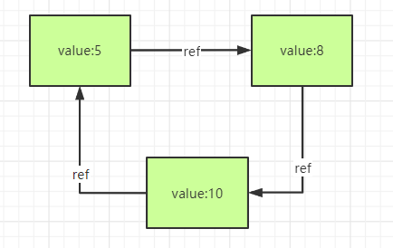
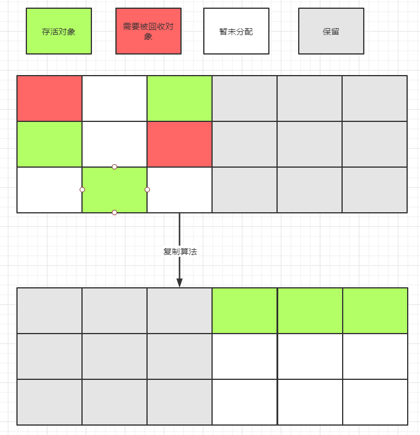
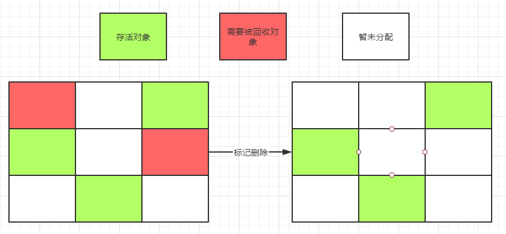
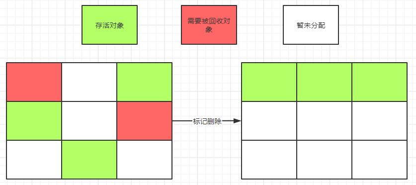
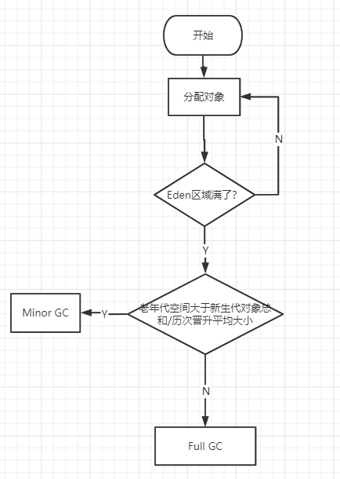

### 浅析JVM第五篇: 垃圾回收机制

在我们继续学习垃圾回收机制之前，我们先来想一下，什么是垃圾。

一种想法认为，当没有引用指向一个对象的时候，认为该对象需要被回收。这一种想法可以引申出`引用计数算法`(按照对象的引用来进行计数，当有一个引用指向该对象时，引用计数+1，当一个引用不再指向该对象的时候，引用计数-1，当没有引用指向该对象的时候，认为该对象可以被回收。)，这一种思想是无法避免循环引用这种情况的。举例子，

```java
class Demo {
	String value;
    Demo ref;
}
```

现有三个关于Demo这个类的对象，`value=5`指向`value=8`，`value=8`指向`value=10`，`value=10`指向`value=5`，此外再无任何引用指向这三个对象，但是这种情况，在引用计数算法里该三个对象是无法被回收的。



与此相对应的是另外一种思想（GC Roots Tracing），从`GC Roots` 出发，向下进行搜索，能够到达的对象就是存活的对象，不能抵达的对象说明该对象不可以达，也就是需要被回收的对象。当前JVM采用也是GC Roots Tracing的方式。

那么什么是`GC Roots`呢？

> The so-called GC (Garbage Collector) roots are objects special for garbage collector. Garbage collector collects those objects that are not GC roots and are not accessible by references from GC roots.

GC Roots 是为垃圾收集器所特有的对象，并且垃圾收集器会收集那些不是GC Roots并且不能通过GC roots来访问的对象。换句话说，这些对象肯定是存活的。

可以作为GC Roots 的对象

* 虚拟机栈中引用的对象

* 方法区中的类静态属性引用对象
* 方法区常量引用的对象
* 本地方法栈中引用对象

#### 复制算法

复制算法是将内存分为两份，每次只使用其中的一份，当被使用的那一份内存使用完后，JVM 触发STW，将存活的对象复制到另外一份空闲内存当中，并且更新内存引用地址，并清除该份内存空间，然后重复此操作。



复制算法方法简单运行高效，不需要考虑内存碎片的问题，但是需要浪费一半的内存空间，而且如果需要复制的对象数量过于庞大也会导致变慢。复制算法现在被应用在新生代的垃圾回收中，新生代的对象总是朝生夕死，存活下来的对象较少，JVM默认Eden区域与Survivor区域比例是8:1, 当Eden区域空间占满并触发Minor GC的时候，Eden区域存活的对象会被复制到Survivor区域，Survivor区域内存不够存放的存活对象将会放到Old区域。

#### 标记删除

标记删除算法，是先遍历GC Roots将存活的对象进行标记，然后对未标记的对象进行清理。



标记删除的缺点在于标记和删除的效率不高，同时当删除后会出现内存空间不连续的情况，如果下次，需要分配一片连续空间的时候，导致GC。

### 标记整理

标记整理算法，标记阶段跟标记删除类似，都是将存活对象进行标记，整理阶段然后将存活对象向一端移动并清理以外的区域的内存。



标记整理可以应用于老年代的垃圾回收，老年代对象存活时间很长，标记算法不需要像复制算法来复制大量对象，同时也不会产生内存碎片。

#### 分代算法

分代算法不是一种具体的算法，而是根据新生代和老年代的特点（存活周期），分别采取合适的算法。新生代存活率低，采用复制算法。老年代对象存活率高，采用标记删除、标记整理的方法。

#### 分区算法

分区算法是将堆内存分成多个大小相等的独立区域，每个小区域独立使用、对立回收，与此同时可以控制一次回收多少区域。

在我们继续学习下面的内容之前，我们先来看几个名词的定义。

* Minor GC

也就是我们平时说的Young GC，首先创建新对象时，并且该对象没有大于`PretenureSizeThreshold`的阈值，对象会在Eden区域存储，当Eden区域满的时候，在触发Minor GC之前，需要判断老年代剩余连续空间是否大于新生代对象总空间或者历次平均晋升大小，如果大于，直接触发Minor GC，将Eden区域存活对象和Survivor 区域(from) 一起放到Survivor区域(to)，如果此时Survivor区域(to)，放不下将剩余对象放在Old区域，此时Survivor区域中的存活的对象年龄+1,代表经历了一次GC，默认当对象年龄达到15岁，将对象存到Old区域。

* Major GC

也就是Old GC，当创建的对象超出`PretenureSizeThreshold`的阈值，对象会存放在Old区域，当Survivor区域中的对象年龄达到15岁，会将该对象存储到Old区域，或者Old区域剩余的连续空间比新生代对象所占空间小的时候，会导致Major GC。

* `Full GC = Minor GC + Major GC`

* 空间分配担保

当准备Minor GC时，JVM回去检查老年代剩余连续空间是否大于年轻代的对象总和或者历次平均晋升的空间大小，如果大于选择Minor GC，小于的话，转而进行Full GC，以此来避免当Minor GC 过后，晋升到Old 区域的对象比剩余空间大的时候，再次触发Major GC。

**但是为什么需要空间担保？**

当发生Minor GC时，Eden区域中存活的对象可能会大于Survivor区域的空间，此时需要老年代来进行空间担保。




