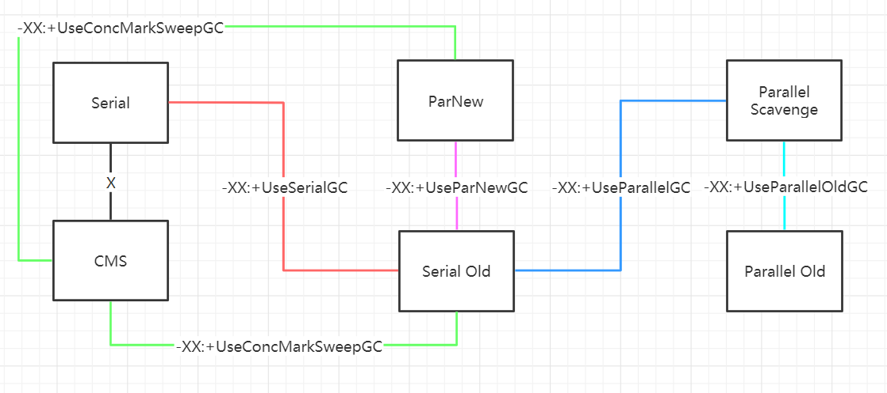

### 浅析JVM第六篇: 垃圾回收器

上一篇文章我们一起学到复制算法、标记删除、标记整理算法，复制算法被应用在年轻代垃圾回收之中，标记整理、标记删除被应用在老年代的垃圾回收当中。

**那我们想一下，如果让你来编写一个垃圾回收器你会有什么样的思路？**

* Serial GC

第一个思路就是串行的方式来执行垃圾回收算法。针对于年轻代时候复制算法，对于老年代使用标记整理算法。在执行垃圾回收的时候触发STW挂起应用线程，然后开启一个线程来执行相应的垃圾回收算法。启用这种算法对应的JVM参数是` -XX:+UseSerialGC`

我们来具体操作一下，为了方便操作查看GC时间和GC具体的日志，我们配上`-XX:+PrintGCDetails` 、`-XX+PrintGCDateStamps`、`-XX:+PrintGCTimeStamps`再加上`-XX:+UseSerialGC`一起来看查看GC日志

```java
2020-11-28T15:10:56.108+0800: 0.464: [GC (Allocation Failure) 2020-11-28T15:10:56.108+0800: 0.464: [DefNew: 7656K->904K(9216K), 0.0032368 secs] 7656K->3976K(29696K), 0.0032952 secs] [Times: user=0.00 sys=0.00, real=0.00 secs] 
2020-11-28T15:11:01.112+0800: 5.468: [GC (Allocation Failure) 2020-11-28T15:11:01.112+0800: 5.468: [DefNew: 8394K->0K(9216K), 0.0019440 secs] 11466K->5922K(29696K), 0.0019782 secs] [Times: user=0.00 sys=0.00, real=0.00 secs] 
2020-11-28T15:11:06.114+0800: 10.470: [GC (Allocation Failure) 2020-11-28T15:11:06.114+0800: 10.470: [DefNew: 7319K->0K(9216K), 0.0006347 secs] 13241K->6946K(29696K), 0.0006662 secs] [Times: user=0.00 sys=0.00, real=0.00 secs] 
2020-11-28T15:11:11.115+0800: 15.471: [GC (Allocation Failure) 2020-11-28T15:11:11.115+0800: 15.471: [DefNew: 7322K->0K(9216K), 0.0007164 secs] 14268K->6946K(29696K), 0.0008338 secs] [Times: user=0.00 sys=0.00, real=0.00 secs] 
2020-11-28T15:11:11.118+0800: 15.474: [GC (Allocation Failure) 2020-11-28T15:11:11.118+0800: 15.474: [DefNew: 7324K->0K(9216K), 0.0097433 secs] 14270K->14114K(29696K), 0.0098379 secs] [Times: user=0.00 sys=0.02, real=0.01 secs] 
2020-11-28T15:11:16.128+0800: 20.484: [GC (Allocation Failure) 2020-11-28T15:11:16.128+0800: 20.484: [DefNew: 7327K->7327K(9216K), 0.0000165 secs]2020-11-28T15:11:16.128+0800: 20.484: [Tenured: 14114K->6945K(20480K), 0.0026746 secs] 21441K->6945K(29696K), [Metaspace: 3958K->3958K(1056768K)], 0.0027372 secs] [Times: user=0.00 sys=0.00, real=0.00 secs] 
```

上面是一串GC信息，我们来挑两条看一下。

```java
2020-11-28T15:10:56.108+0800: 0.464: [GC (Allocation Failure) 2020-11-28T15:10:56.108+0800: 0.464: [DefNew: 7656K->904K(9216K), 0.0032368 secs] 7656K->3976K(29696K), 0.0032952 secs] [Times: user=0.00 sys=0.00, real=0.00 secs] 
```

`2020-11-28T15:10:56.108+0800` 表示GC开始时间为2020-11-28，`0.464`这边已经精确到秒的级别了。

`GC (Allocation Failure` GC是用来区别Minor GC 和Major GC的标志，此处是Minor GC，`2020-11-28T15:10:56.108+0800: 0.464`这边是Minor GC的开始时间，`[DefNew: 7656K->904K(9216K), 0.0032368 secs]` ,这边的信息比较多，`DefNew`指的是**default new generation**也就是使用的垃圾收集器的名字，此处为Serial，内存使用量由7656k变为904k，年轻代的总容量是9216K，耗时0.0032368秒。` 7656K->3976K(29696K), 0.0032952 secs] ` 对应的信息是，整个堆使用量由7656K变为3976K，此外堆容量的总大小是29696K，GC耗时为0.0032952 secs。` [Times: user=0.00 sys=0.00, real=0.00 secs] ` GC耗时的类别衡量，user是垃圾收集器消耗的CPU总时间，sys是OS调用或者等待系统事件的时间花费。real是应用被停止的时间，由于当前垃圾回收器是串行，所以real = sys + user

我们再来看另外一条，

```java
2020-11-28T15:11:16.128+0800: 20.484: [GC (Allocation Failure) 2020-11-28T15:11:16.128+0800: 20.484: [DefNew: 7327K->7327K(9216K), 0.0000165 secs]2020-11-28T15:11:16.128+0800: 20.484: [Tenured: 14114K->6945K(20480K), 0.0026746 secs] 21441K->6945K(29696K), [Metaspace: 3958K->3958K(1056768K)], 0.0027372 secs] [Times: user=0.00 sys=0.00, real=0.00 secs]
```

`2020-11-28T15:11:16.128+0800` 这边还是表示的是GC的开始时间， `20.484`这边将开始时间具体到秒数，`[GC (Allocation Failure) 2020-11-28T15:11:16.128+0800: 20.484` 这边依旧是Young GC，GC的原因是内存分配失败，`2020-11-28T15:11:16.128+0800: 20.484: [DefNew: 7327K->7327K(9216K), 0.0000165 secs]` 表示 年轻代串行垃圾收集，内存使用量7327变为7327，耗时为`0.0000165 secs`， 这边其实指的是，当前年轻代已经满了。`[Tenured: 14114K->6945K(20480K), 0.0026746 secs] 21441K->6945K(29696K)` 这边指的是 单线程的标记整理的垃圾收集器的名字，老年代的内存使用量由14114K变成6945K，老年代的总容量为20480K，老年代串行垃圾回收耗时为 0.0026746 secs，整个堆内存使用量由21441K变成6945K，整个堆内存的总容量是29696K。`[Metaspace: 3958K->3958K(1056768K)], 0.0027372 secs` , 元空间的信息，当前没有垃圾被回收，耗时为0.0026746 secs , `Times: user=0.00 sys=0.00, real=0.00 secs` 垃圾收集器消耗的CPU总时间为0， OS调用时间为0，应用被停止的时间为0。

```java
2020-11-29T20:31:20.868+0800: 0.807: [Full GC (Allocation Failure) 2020-11-29T20:31:20.868+0800: 0.807: [Tenured: 903K->880K(20480K), 0.0024428 secs] 903K->880K(29696K), [Metaspace: 3956K->3956K(1056768K)], 0.0024834 secs] [Times: user=0.00 sys=0.00, real=0.00 secs] 
```

这个例子是直接触发了Full GC，这边不再赘述。

* Parallel GC

串行方式的垃圾回收往往不能令人满意，于是人们就会想到并行方式的垃圾回收。并行式的垃圾回收适用于多核的机器可以用来提高吞吐量，使用并行方式的垃圾回收，JVM还是会触发STW，来挂起应用线程，并启动多个线程来进行垃圾回收，至于使用多少线程来进行垃圾回收可以通过`-XX:ParallelGCThreads=XXX` (`-XX:ParallelGCThreads=4`)来进行配置，默认为机器的核心数。对此我们的JVM参数配置先设定为`-XX:+UseParallelGC`、`-XX:+UseParallelOldGC`、`-XX:ParallelGCThreads=4` ,为了更好的来观察并行方式的GC，我们继续使用`-XX:+PrintGCDetails`、`-XX:+PrintGCDateStamps`、`-XX:+PrintGCTimeStamps`这些参数来配合使用，然后我们一起来查看GC日志。

```java
2020-11-29T21:09:38.022+0800: 0.533: [GC (Allocation Failure) [PSYoungGen: 7663K->1023K(9216K)] 7663K->4103K(29696K), 0.0016500 secs] [Times: user=0.00 sys=0.00, real=0.00 secs] 
2020-11-29T21:09:43.025+0800: 5.535: [GC (Allocation Failure) [PSYoungGen: 8513K->888K(9216K)] 11593K->6016K(29696K), 0.0009643 secs] [Times: user=0.00 sys=0.00, real=0.00 secs] 
2020-11-29T21:09:48.027+0800: 10.537: [GC (Allocation Failure) [PSYoungGen: 8289K->856K(9216K)] 13417K->7008K(29696K), 0.0007085 secs] [Times: user=0.00 sys=0.00, real=0.00 secs] 
2020-11-29T21:09:53.028+0800: 15.538: [GC (Allocation Failure) [PSYoungGen: 8177K->888K(9216K)] 14330K->7040K(29696K), 0.0006895 secs] [Times: user=0.00 sys=0.00, real=0.00 secs] 
2020-11-29T21:09:53.029+0800: 15.539: [GC (Allocation Failure) [PSYoungGen: 8212K->872K(9216K)] 14364K->14192K(29696K), 0.0017337 secs] [Times: user=0.00 sys=0.00, real=0.00 secs] 
2020-11-29T21:09:58.031+0800: 20.541: [GC (Allocation Failure) [PSYoungGen: 8198K->888K(9216K)] 21519K->20352K(29696K), 0.0024651 secs] [Times: user=0.00 sys=0.00, real=0.00 secs] 
2020-11-29T21:09:58.034+0800: 20.544: [Full GC (Ergonomics) [PSYoungGen: 888K->0K(9216K)] [ParOldGen: 19464K->6945K(20480K)] 20352K->6945K(29696K), [Metaspace: 3959K->3959K(1056768K)], 0.0081908 secs] [Times: user=0.00 sys=0.00, real=0.01 secs] 
2020-11-29T21:10:03.042+0800: 25.552: [GC (Allocation Failure) [PSYoungGen: 7319K->32K(9216K)] 14264K->14145K(29696K), 0.0009307 secs] [Times: user=0.00 sys=0.00, real=0.00 secs] 
2020-11-29T21:10:03.043+0800: 25.553: [Full GC (Ergonomics) [PSYoungGen: 32K->0K(9216K)] [ParOldGen: 14113K->5898K(20480K)] 14145K->5898K(29696K), [Metaspace: 3960K->3960K(1056768K)], 0.0045204 secs] [Times: user=0.00 sys=0.00, real=0.00 secs]
```

当前的GC的日志比较多，我们还是老规矩，挑两条具有代表性的GC日志一起来分析一下。

```java
2020-11-29T21:09:38.022+0800: 0.533: [GC (Allocation Failure) [PSYoungGen: 7663K->1023K(9216K)] 7663K->4103K(29696K), 0.0016500 secs] [Times: user=0.00 sys=0.00, real=0.00 secs] 
```

`2020-11-29T21:09:38.022+0800: 0.533` 这边依旧指的是GC开始的时间且开始时间精确到秒。`GC (Allocation Failure)` 这边指的是Minor GC也就是Young GC，GC的原因是内存分配失败。`[PSYoungGen: 7663K->1023K(9216K)] 7663K->4103K(29696K), 0.0016500 secs] ` ， 首先PSYoungGen这边指的垃圾收集器的名字，全名是**Parallel Scavenge Young Generation* ，内存使用量由7663K变成1023K，年轻代的容量是9216k，整个堆的内存使用情况是7663K变成4103k，整个堆的容量是29696K。` [Times: user=0.00 sys=0.00, real=0.00 secs] ` 这边 GC的花费的CPU时间是0，OS调用时间是0，real此时应该是接近于user+sys再除以GC线程数。

我们再来看一个例子。

```java
2020-11-29T21:10:03.043+0800: 25.553: [Full GC (Ergonomics) [PSYoungGen: 32K->0K(9216K)] [ParOldGen: 14113K->5898K(20480K)] 14145K->5898K(29696K), [Metaspace: 3960K->3960K(1056768K)], 0.0045204 secs] [Times: user=0.00 sys=0.00, real=0.00 secs]
```

`2020-11-29T21:10:03.043+0800: 25.553`这边还是GC开始时间并且开始时间精确到秒，`Full GC (Ergonomics) `这边是触发了Full GC 原因是JVM内部的Ergonomics认为当前是触发Full GC的最佳时机。`[PSYoungGen: 32K->0K(9216K)]` 这边PSYoungGen 指的是垃圾收集器的名字，年轻代内存使用情况由32k变成0k，年轻代的总容量是9216k。`[ParOldGen: 14113K->5898K(20480K)] 14145K->5898K(29696K)` 这边ParOldGen指的是Parallel Old Generation，内存使用量由14113k变成5898k，老年代的容量为2048k。整个堆的内存使用情况由14145k变成5898k且堆的容量是29696K。` [Metaspace: 3960K->3960K(1056768K)], 0.0045204 secs] `元空间内存使用情况没有发生变化，元空间的内存容量为1056768K，此次GC耗时为0.0045204 secs。` [Times: user=0.00 sys=0.00, real=0.00 secs]` GC消耗CPU时间为0，OS调用时间为0，real时间为0。

* CMS

CMS是针对老年代的。当我们使用`-XX:+UseConcMarkSweepGC`，JVM会对新生代采用`ParNew`的收集方式(`-XX:+UseParNewGC`)，当出现`Concurrent Mode Failure` JVM采用备用的Serial Old来收集老年代。为了更好的观察GC日志，我们连带设置`-XX:+PrintGCDetails`、`-XX:+PrintGCDateStamps`、
`-XX:+PrintGCTimeStamps`、`-XX:+UseConcMarkSweepGC`。

```java
2020-12-02T20:38:07.258+0800: 15.433: [GC (Allocation Failure) 2020-12-02T20:38:07.258+0800: 15.433: [ParNew: 7335K->2K(9216K), 0.0108323 secs] 14355K->14190K(29696K), 0.0109463 secs] [Times: user=0.05 sys=0.02, real=0.01 secs] 
2020-12-02T20:38:07.269+0800: 15.444: [GC (CMS Initial Mark) [1 CMS-initial-mark: 14187K(20480K)] 15214K(29696K), 0.0004009 secs] [Times: user=0.00 sys=0.00, real=0.00 secs] 
2020-12-02T20:38:07.270+0800: 15.445: [CMS-concurrent-mark-start]
2020-12-02T20:38:07.271+0800: 15.446: [CMS-concurrent-mark: 0.002/0.002 secs] [Times: user=0.00 sys=0.00, real=0.00 secs] 
2020-12-02T20:38:07.271+0800: 15.446: [CMS-concurrent-preclean-start]
2020-12-02T20:38:07.271+0800: 15.446: [CMS-concurrent-preclean: 0.000/0.000 secs] [Times: user=0.00 sys=0.00, real=0.00 secs] 
2020-12-02T20:38:07.272+0800: 15.447: [GC (CMS Final Remark) [YG occupancy: 1026 K (9216 K)]2020-12-02T20:38:07.272+0800: 15.447: [Rescan (parallel) , 0.0001789 secs]2020-12-02T20:38:07.272+0800: 15.447: [weak refs processing, 0.0000875 secs]2020-12-02T20:38:07.272+0800: 15.447: [class unloading, 0.0003868 secs]2020-12-02T20:38:07.272+0800: 15.447: [scrub symbol table, 0.0006424 secs]2020-12-02T20:38:07.273+0800: 15.448: [scrub string table, 0.0002025 secs][1 CMS-remark: 14187K(20480K)] 15214K(29696K), 0.0016477 secs] [Times: user=0.00 sys=0.00, real=0.00 secs] 
2020-12-02T20:38:07.273+0800: 15.449: [CMS-concurrent-sweep-start]
2020-12-02T20:38:07.274+0800: 15.449: [CMS-concurrent-sweep: 0.001/0.001 secs] [Times: user=0.00 sys=0.00, real=0.00 secs] 
2020-12-02T20:38:07.274+0800: 15.449: [CMS-concurrent-reset-start]
2020-12-02T20:38:07.274+0800: 15.449: [CMS-concurrent-reset: 0.000/0.000 secs] [Times: user=0.00 sys=0.00, real=0.00 secs] 
```

以上是使用CMS回收器后的GC日志。我们可以看到，对于Young GC 也就是Minor GC确实是使用的`ParNewGC`。

我们把目光放在CMS的GC日志上比如:

```java
2020-12-02T20:38:22.294+0800: 30.469: [GC (CMS Initial Mark) [1 CMS-initial-mark: 13099K(20480K)] 15306K(29696K), 0.0002876 secs] [Times: user=0.00 sys=0.00, real=0.00 secs] 
2020-12-02T20:38:22.295+0800: 30.470: [CMS-concurrent-mark-start]
2020-12-02T20:38:22.295+0800: 30.470: [CMS-concurrent-mark: 0.001/0.001 secs] [Times: user=0.00 sys=0.00, real=0.00 secs] 
2020-12-02T20:38:22.295+0800: 30.470: [CMS-concurrent-preclean-start]
2020-12-02T20:38:22.295+0800: 30.470: [CMS-concurrent-preclean: 0.000/0.000 secs] [Times: user=0.00 sys=0.00, real=0.00 secs] 
2020-12-02T20:38:22.295+0800: 30.470: [CMS-concurrent-abortable-preclean-start]
2020-12-02T20:38:27.296+0800: 35.471: [GC (Allocation Failure) 2020-12-02T20:38:27.296+0800: 35.471: [ParNew: 7326K->2K(9216K), 0.0044137 secs] 20426K->16173K(29696K), 0.0045481 secs] [Times: user=0.05 sys=0.00, real=0.00 secs] 
 CMS: abort preclean due to time 2020-12-02T20:38:27.300+0800: 35.476: [CMS-concurrent-abortable-preclean: 0.005/5.005 secs] [Times: user=0.05 sys=0.00, real=5.00 secs] 
2020-12-02T20:38:27.301+0800: 35.476: [GC (CMS Final Remark) [YG occupancy: 5280 K (9216 K)]2020-12-02T20:38:27.301+0800: 35.476: [Rescan (parallel) , 0.0000922 secs]2020-12-02T20:38:27.301+0800: 35.476: [weak refs processing, 0.0000487 secs]2020-12-02T20:38:27.301+0800: 35.476: [class unloading, 0.0003058 secs]2020-12-02T20:38:27.301+0800: 35.476: [scrub symbol table, 0.0003767 secs]2020-12-02T20:38:27.301+0800: 35.477: [scrub string table, 0.0001026 secs][1 CMS-remark: 16171K(20480K)] 21451K(29696K), 0.0009950 secs] [Times: user=0.00 sys=0.00, real=0.00 secs] 
2020-12-02T20:38:27.302+0800: 35.477: [CMS-concurrent-sweep-start]
2020-12-02T20:38:27.302+0800: 35.477: [CMS-concurrent-sweep: 0.000/0.000 secs] [Times: user=0.00 sys=0.00, real=0.00 secs] 
2020-12-02T20:38:27.302+0800: 35.477: [CMS-concurrent-reset-start]
2020-12-02T20:38:27.302+0800: 35.477: [CMS-concurrent-reset: 0.000/0.000 secs] [Times: user=0.00 sys=0.00, real=0.00 secs] 
```

1. Initial Mark

`2020-12-02T20:38:22.294+0800: 30.469:` 这边依旧指的是Initial Mark的开始时间并且精确到秒，`[GC (CMS Initial Mark)`这边指的是CMS执行的第一阶段也就是Initial Mark阶段，这一阶段会触发STW也就是Stop The World来挂起用户线程，除此以外Initial Mark会遍历GC Roots找到直达的老年代对象和新生代引用的老年代对象，关于GC Roots我们可以认为是一直存活的对象，比如: 类的静态属性指向的对象、虚拟机栈栈帧中的局部变量表里的变量指向的对象。`[1 CMS-initial-mark: 13099K(20480K)] 15306K(29696K), 0.0002876 secs]` 老年代中已使用的空间为13099k，老年代总容量为2048k。整个堆的已使用的内存空间是15306k，整个堆的总空间为29696k，此次阶段的耗时为0.0002876 secs，`[Times: user=0.00 sys=0.00, real=0.00 secs] ` 关于三个时间，上文已经解释多次，不再赘述。

2. Concurrent Mark

`2020-12-02T20:38:22.295+0800: 30.470:` 这边指的是Concurrent Mark开始的时间并且精确到秒，`[CMS-concurrent-mark-start]` 这里是CMS回收器的第二阶段(并发标记)，在此处JVM的工作就是从GC Roots出发并标记所有存活的对象，当前JVM会并发的运行应用线程而不是停止它。`2020-12-02T20:38:22.295+0800: 30.470: [CMS-concurrent-mark: 0.001/0.001 secs] [Times: user=0.00 sys=0.00, real=0.00 secs] ` 这边是并发标记的耗时，0.001/0.001secs 表示CPU 耗时0.001S，垃圾收集器线程耗时为0.001S。

3. Concurrent Preclean

`2020-12-02T20:38:22.295+0800: 30.470:` 这边指的是并发预清理开始时间并且精确到秒。`[CMS-concurrent-preclean-start]` 这边CMS回收器的第三阶段(并发预清理)。因为在上一阶段(并发标记)，用户线程没有停止，存在对象的引用发生变化、新生代对象晋升到老年代的情况。对于这些引用发生变化的对象，JVM会将它标记为dirty，也就是所谓的卡片标记。那么在此阶段，CMS回收器任务就是这些对象标志为存活(比如: 原来老年代中有A、B两个对象，A满足可达性算法也就是可以从GC Roots向下找到它。在并发标记阶段，A指向B，JVM将A标记为dirty。在预清理阶段，B对象就会被标记为存活，并去掉A对象的dirty标识) 。`2020-12-02T20:38:22.295+0800: 30.470: [CMS-concurrent-preclean: 0.000/0.000 secs] [Times: user=0.00 sys=0.00, real=0.00 secs] ` 这里是预清理阶段统计耗时，CPU耗时为0.000S，垃圾收集器线程耗时为0.000S。

4. Concurrent Abortable Preclean

`2020-12-02T20:38:22.295+0800: 30.470: [CMS-concurrent-abortable-preclean-start]`这里指的是并发可中断预清理阶段开始的时间，这个阶段主要是为了减轻Final Remark的工作，继续处理那些被标记为dirty的对象。该阶段相比之前的阶段来说是可以被打断的。打断的条件可以三种。

* 循环的次数

  可以通过`-XX:CMSMaxAbortablePrecleanLoops`来配置，例如:`-XX:CMSMaxAbortablePrecleanLoops=1`循环的次数为一次。
  
* 执行的时间

  可以通过`-XX:CMSMaxAbortablePrecleanTime`来配置，比如:`-XX:CMSMaxAbortablePrecleanTime=5000`,设置执行的时间为5s
  
* Eden区域内存使用率
  
  可以通过`-XX:CMSScheduleRemarkEdenSizeThreshold` 来设置当Eden区域达到该阈值开始可中断预清理，`-XX:CMSScheduleRemarkEdenPenetration`来设置当Eden使用率达到该值退出可中断预清理阶段。
  
  `-XX:CMSScheduleRemarkEdenSizeThreshold=2m`当Eden区域使用了2M才可以进入可中断预清理阶段。
  
  `-XX:CMSScheduleRemarkEdenPenetration=50`当Eden区域使用率达到50退出可中断预清理阶段。

我们继续看日志，`2020-12-02T20:38:27.296+0800: 35.471: [GC (Allocation Failure) 2020-12-02T20:38:27.296+0800: 35.471: [ParNew: 7326K->2K(9216K), 0.0044137 secs] 20426K->16173K(29696K), 0.0045481 secs] [Times: user=0.05 sys=0.00, real=0.00 secs] `此时触发Young GC，相应的GC收集器是ParNewGC ，年轻代内存使用量由7326k变成2K，总大小为9216K。整个堆的内存使用情况是20426K变成16173K，整个堆的大小是29696K。`CMS: abort preclean due to time 2020-12-02T20:38:27.300+0800: 35.476: [CMS-concurrent-abortable-preclean: 0.005/5.005 secs] [Times: user=0.05 sys=0.00, real=5.00 secs] `，在此处可中断预清理阶段是由于执行时间达到阈值上限而中断退出，CPU耗时为0.005，GC收集器耗时为5.005S。

5. Final Remark

这是CMS中第二次也是最后一次触发STW, 此时需要做的工作是完成标记所有在老年代中存活的对象。此时需要从GC Roots出发重新标记，以及遍历新生代标记新生代中引用老年代中的对象，且继续处理被标记为dirty的对象。此时为了避免在Final Remark阶段中出现Young GC也就是Minor GC，导致STW的时间过长。可以配置`XX:+CMSScavengeBeforeRemark`的参数，在Final Remark阶段之前触发Minor GC，以此来减少Final Remark扫描年轻代中引用老年代的时间开销。 我们继续来看Final Remark阶段的日志。`2020-12-02T20:38:27.301+0800: 35.476: [GC (CMS Final Remark)`这边指的是开始的时间。`[YG occupancy: 5280 K (9216 K)]`表示年轻代内存使用为5280K，总大小为9216K。`2020-12-02T20:38:27.301+0800: 35.476: [Rescan (parallel) , 0.0000922 secs]`这边是完成对存活对象的标记工作并且采用的是并行的方式。`2020-12-02T20:38:27.301+0800: 35.476: [weak refs processing, 0.0000487 secs]2020-12-02T20:38:27.301+0800: 35.476: [class unloading, 0.0003058 secs]2020-12-02T20:38:27.301+0800: 35.476: [scrub symbol table, 0.0003767 secs]2020-12-02T20:38:27.301+0800: 35.477: [scrub string table, 0.0001026 secs]` 这边处理弱引用，卸载未使用的类，字符串表、符号表。`[1 CMS-remark: 16171K(20480K)] 21451K(29696K), 0.0009950 secs] [Times: user=0.00 sys=0.00, real=0.00 secs] `这边老年代内存使用是16171K，老年代总大小是20480k。整个堆的使用情况是21451K，整个堆的总大小是29696k。

6. Concurrent Sweep

`2020-12-02T20:38:27.302+0800: 35.477: [CMS-concurrent-sweep-start]
2020-12-02T20:38:27.302+0800: 35.477: [CMS-concurrent-sweep: 0.000/0.000 secs] [Times: user=0.00 sys=0.00, real=0.00 secs] `这边是并发的处理那些已经未被标记的对象，也就是垃圾对象。当时在此阶段中是无法处理浮动垃圾的。比如，在A对象指向B，在标记阶段。A、B都被标记。在并发清理阶段，`A.B=null`那么此时，B对象就变成了垃圾，这个被称为浮动垃圾。

7. Concurrent Reset

该阶段是字如其名用来重置CMS内部数据结构，为下次做准备。`2020-12-02T20:38:27.302+0800: 35.477: [CMS-concurrent-reset-start]
2020-12-02T20:38:27.302+0800: 35.477: [CMS-concurrent-reset: 0.000/0.000 secs] [Times: user=0.00 sys=0.00, real=0.00 secs] `

**这就是CMS垃圾收集的7个阶段，但是我们在上文说当我们使用`-XX:+UseConcMarkSweepGC`，JVM在年轻代使用`ParNewGC`, 在老年代使用CMS。但是为什么又说使用了`SerialOldGC`呢？**

在回答这个问题之前，我们先介绍一个`-XX:CMSInitiatingOccupancyFraction`参数，这个参数表示当老年代达到特定的阈值（`-XX:CMSInitiatingOccupancyFraction=99`当老年代使用率达到99触发CMS）触发CMS。如果该参数设置的过大，当老年代使用率达到99，我们才开始CMS，那么此时，应用线程还在运行的时候，将对象放到老年代的时候但是老年代剩余空间只剩下 1%，对象放不下出现**concurrent mode failure**, 此时调用`SerialOldGC`并触发STW。



总结一下: 从上图我们可以发现`-XX:+UseSerialGC`，将在年轻代使用Serial（Mark-Copy），在老年代使用Serial Old（Mark-Sweep-Compact），两者都是线性的，需要GC时触发STW应用线程挂起，然单线程完成GC。`-XX:+UseConcMarkSweepGC`,在年轻代使用ParNew(Mark-Copy)，老年代使用CMS(Mark-Sweep)在出现`Concurrent Mode Failure` ，采用备用的Serial Old（Mark-Sweep-Compact)，当出现GC时，对于Minor GC也是触发STW挂起应用线程，并行的去完成GC，对于Major GC，开始时触发STW 单线程进行Initial Mark，然后Concurrent Mark阶段包括后面的Concurrent Preclean和Concurrent Abortable Preclean，与应用线程一起执行，进行到Final Remark阶段，此时又是一次STW，此时会起多个线程并行完成remark阶段，之后Concurrent Sweep以及Concurrent Reset阶段，CMS垃圾回收器线程又会与应用线程一起运行。当我们使用`-XX:+UseParNewGC`, 实际上年轻代使用的是ParNew（Mark-Copy）,老年代使用的是Serial Old（Mark-Sweep-Compact），年轻代在GC的过程中会触发STW，然后并行完成Minor GC，老年代还是起单线程并且会触发STW，完成GC流程。`-XX:+UseParallelGC`垃圾回收器采用的组合时Parallel Scavenge和Serial Old。`-XX:+UseParallelOldGC`垃圾回收器采用的是Parallel Scavenge和Parallel Old组合，都是需要触发STW，然后并行的完成GC。

**说明:**

Serial 是不能和CMS一起连用的(`-XX:+UseConcMarkSweepGC`、`-XX:+UseSerialGC`)，特此说明。

>3) How do I use "CMS" with "Serial"?
>
>`-XX:+UseConcMarkSweepGC` `-XX:-UseParNewGC`.
>Don't use `-XX:+UseConcMarkSweepGC` and `-XX:+UseSerialGC`. Although that's seems like
>a logical combination, it will result in a message saying something about
>conflicting collector combinations and the JVM won't start. Sorry about that.
>Our bad.

[勘误链接](https://blogs.oracle.com/jonthecollector/our-collectors)

-----

周末完成G1，调优的内容，JVM将暂时告一段落。

