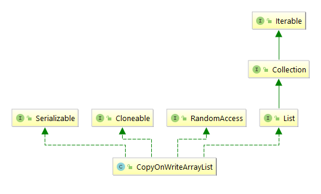
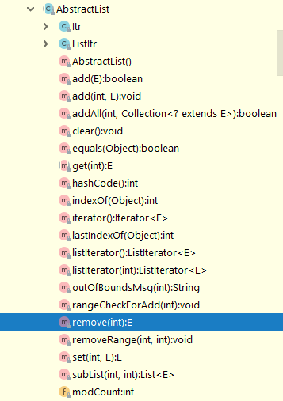

## CopyOnWriteArrayList源码分析

CopyOnWriteArrayList这个类是位于JUC (java.util.concurrent)包下的线程安全的集合实现类。




根据CopyOnWriteArrayList(以下简称COWArrayList)的名字，我们可以知道这个类跟ArrayList是有渊源的。通过族谱图，我们可以得知，COWArrayList同样实现了Serializable、Cloneable、RandomAccess、List接口，唯独没有继承AbstractList，我们可以先了解AbstractList的主要功能，以此来了解COWArrayList和ArrayList的区别，以及COWArrayList存在的意义。

> This class provides a skeletal implementation of the {@link List}
> interface to minimize the effort required to implement this interface
> backed by a "random access" data store (such as an array).  For sequential
> access data (such as a linked list), {@link AbstractSequentialList} should
>  be used in preference to this class.

根据JDK1.8中关于AbstractList的解释。AbstractList是List接口的基本骨架的实现类，并且尽可能的减少一部分的工作，该工作的内容是实现用于支撑RandomAccess数据类型的接口的。对于顺序访问数据诸如LinkedList这样的线性集合，优先推荐使用AbstractSequentialList。简单讲，AbstractList和AbstractSequentialList是用来简化一部分List接口的对于元素的添加、修改、删除的操作的。这样对于ArrayList和LinkedList这样的集合，只需要实现很少的抽象方法，并根据各自情况重写方法。只是AbstactList服务的是具有RandomAccess特性的对象，AbstractSeqAbuentialList面向的是具有顺序访问特性的对象，两者各为其主。

我们已经知道AbstractList是用来简化List接口的工作的，但是这句话讲出来还是很抽象。我们可以根据AbstractList的方法来看看它到底干嘛了。




上图是摘自JDK关于AbstractList的内部方法，可见AbstractList实现了对于元素添加、修改、删除的基本方法，我们知道但凡涉及到元素的新增、修改、删除都需要考虑线程安全问题。而COWArrayList是JUC包下的类，所以是属于线程安全的集合，这就是为什么COWArrayList没有去继承AbstractList的原因。

***COWArrayList构造方法***

```java
//无参构造方法，直接new数组
public CopyOnWriteArrayList() {
    setArray(new Object[0]);
}

public CopyOnWriteArrayList(Collection<? extends E> c) {
    Object[] elements;
    //判断C类型
    if (c.getClass() == CopyOnWriteArrayList.class)
        elements = ((CopyOnWriteArrayList<?>)c).getArray();
    else {
    //非CopyOnWriteArrayList类型的集合直接将其转为数组然后copy一份，替换当前数组。
        elements = c.toArray();
        // c.toArray might (incorrectly) not return Object[] (see 6260652)
        if (elements.getClass() != Object[].class)
            elements = Arrays.copyOf(elements, elements.length, Object[].class);
    }
    setArray(elements);
}


```

***COWArrayList元素添加***

```java
public boolean add(E e) {
    	/**
         * 这边定义了一个ReentrantLock可重入锁，对于可重入锁不在本篇文章的探讨范围之内。所以这边只做一个简单介绍。
         * ReentrantLock每次都需要手动加锁和手动释放。假设存在资源A并且A资源当前没有上锁，当B线程尝试访问A，并成功加锁，并且将加锁的计数定为1。
         * 然后此时C线程尝试访问资源A，发现A已经被加锁。C进入休眠状态。B线程还没有解锁，此时B又尝试访问A资源，此时锁的计数加1(当前为2)。等到B线程处理完
         * 所有与A资源相关的事情之后，B释放了关于A的锁（释放一次，锁的计数减1）此时锁的计数为0。C线程此时开始活跃起来了，访问了A资源并成功加锁，此时锁的计数为1
         */
    final ReentrantLock lock = this.lock;
    lock.lock();
    try {
        //获取当前的底层数组
        Object[] elements = getArray();
        int len = elements.length;
        //copy当前数组一份并令newElements指向当前数组，此时newElements指向的数组的长度为len+1。这就是为什么COWArrayList
        //底层虽然是数组，但是不需要扩容机制的原因。
        Object[] newElements = Arrays.copyOf(elements, len + 1);
        //将传入的元素e存储到新数组。
        newElements[len] = e;
        //替换原先数组
        setArray(newElements);
        return true;
    } finally {
        lock.unlock();
    }
}

final Object[] getArray() {
        return array;
}
final void setArray(Object[] a) {
    array = a;
}
```

***COWArrayList元素删除***

```java
public boolean remove(Object o) {
    //获取当前数组
    Object[] snapshot = getArray();
    //在数组当中去定位被删除元素的角标位置
    int index = indexOf(o, snapshot, 0, snapshot.length);
    return (index < 0) ? false : remove(o, snapshot, index);
}
final Object[] getArray() {
    return array;
}
private static int indexOf(Object o, Object[] elements,
                           int index, int fence) {
    if (o == null) {
        for (int i = index; i < fence; i++)
            if (elements[i] == null)
                return i;
    } else {
        for (int i = index; i < fence; i++)
            if (o.equals(elements[i]))
                return i;
    }
    return -1;
}

private boolean remove(Object o, Object[] snapshot, int index) {
    //获取可重入锁
    final ReentrantLock lock = this.lock;
    lock.lock();
    try {
        //获取当前数组
        Object[] current = getArray();
        int len = current.length;
        //如果底层数组的快照跟当前数组不一致，说明被其他线程操作过数据，需要判断所需要删除的元素是否还在当前数组当中，
        //又或者还是当初的那个下标。 这便是用的是goto，一旦break就会跳出当前{}的区域并继续执行后面的语句
        if (snapshot != current) findIndex: {
            //此处需要取最小值，防止当前数组的元素个数已经减少到比期望中的index下标还少的情况。
            int prefix = Math.min(index, len);
            for (int i = 0; i < prefix; i++) {
                //current[i] ==snapshot[i]说明该元素并未修改或者属于ABA的情况。
                //此处考虑的是数组在被修改的部分中是否存在需要被删除的元素
                if (current[i] != snapshot[i] && eq(o, current[i])) {
                    //找到期望中需要删除元素的index
                    index = i;
                    break findIndex;
                }
            }
            //需要被删除的位置，已经不存在元素了，说明该元素已经被删除无法继续删除
            if (index >= len)
                return false;
            //数组虽然被改变，但是期望中需要被删除的值处于当前的数组未发生变化的位置。
            if (current[index] == o)
                break findIndex;
            //在index到len剩余的部分寻找元素
            index = indexOf(o, current, index, len);
            if (index < 0)
                return false;
        }
        //新数组个数等于len-1，因为需要删除一个元素
        Object[] newElements = new Object[len - 1];
        //从当前数组中0的位置赋值index个新数组中去。
        //因为被删除的元素处在index位置，是当前数组的第index+1个,这样前面index个元素都复制完成了。
        System.arraycopy(current, 0, newElements, 0, index);
        //从当前数组的index+1的位置，复制len-index-1个到新的数组中去
        //因为需要被删除的元素处于index的位置，所以从index的后一个开始复制。因为需要被删除的元素是第index+1个，
        //所以需要复制len-（index+1）个
        System.arraycopy(current, index + 1,
                         newElements, index,
                         len - index - 1);
        setArray(newElements);
        return true;
    } finally {
        lock.unlock();
    }
}
```

关于CopyOnWriteArrayList的总结，该类的最大的亮点就是不选择继承AbstractList, 对于集合中的数组的新增与删除都是先copy一份snapshot，在snapshot上进行相应的数组操作，完成操作后直接替换原有的底层数组，真正做到读写分离的效果。其弊端就是，当A线程在操作该集合的时候，B线程来读取的数据。查询的数组不是最新的，或者说是查询到的数据是属于即将过期的历史数据。只有等到A线程操作完成以后，B线程查询的数据才是最新鲜的数据。其次，因为每次对数据的操作，集合内部都会copy一份底层数组的数据，如果这个集合中存储的数据量很大,就会过多的占用内存空间。

