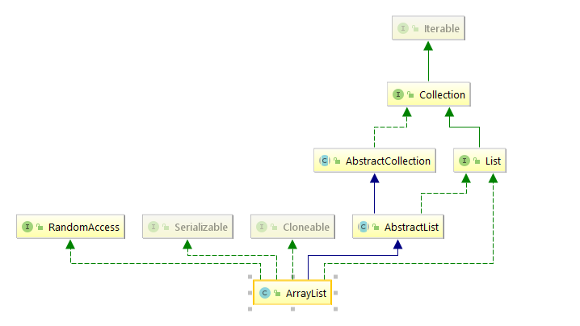

## ArrayList源码分析




本文默认JDK版本为1.8,从ArrayList 族谱图上可以看出，用虚线标记的是为接口实现，用实线标记的是为父类的继承。ArrayList 具有序列化、可克隆、Iterable游标、随机访问等特性。


> Resizable-array implementation of the <tt>List</tt> interface.  Implements
>
> all optional list operations, and permits all elements, including
>
> <tt>null</tt>.  In addition to implementing the <tt>List</tt> interface,
>
> this class provides methods to manipulate the size of the array that is
>
> used internally to store the list.  (This class is roughly equivalent to
>
> <tt>Vector</tt>, except that it is unsynchronized.)

上文摘自JDK的注释。ArrayList是对于List的接口的可变长度数组的实现，实现所有list可选操作，可以接收所有元素包含null值。除了实现List接口以外，该类还提供可以用于操作数组大小的方法，该数组在内部被用来存储list集合。并且该类除了线程不同步，其他特性大致与Vector相同。

***ArrayList 构造方法内部实现***

```java
//默认无参构造函数
public ArrayList() {
        this.elementData = DEFAULTCAPACITY_EMPTY_ELEMENTDATA;// 空数组
    }

//传入指定集合大小的构造函数
public ArrayList(int initialCapacity) {
        if (initialCapacity > 0) {
            //定义Object类型的数组
            this.elementData = new Object[initialCapacity];
        } else if (initialCapacity == 0) {
            this.elementData = EMPTY_ELEMENTDATA;
        } else {
            throw new IllegalArgumentException("Illegal Capacity: "+
                                               initialCapacity);
        }
    }
//入参为集合的构造函数
public ArrayList(Collection<? extends E> c) {
        elementData = c.toArray();
        if ((size = elementData.length) != 0) {
            // c.toArray might (incorrectly) not return Object[] (see 6260652)
            if (elementData.getClass() != Object[].class)
                elementData = Arrays.copyOf(elementData, size, Object[].class);
        } else {
            // replace with empty array.
            this.elementData = EMPTY_ELEMENTDATA;
        }
    }
```

***ArrayList添加元素以及扩容机制***

```java
public boolean add(E e) {
        ensureCapacityInternal(size + 1);  // Increments modCount!!
    	//尾插法
        elementData[size++] = e;
        return true;
    }

private void ensureCapacityInternal(int minCapacity) {
        ensureExplicitCapacity(calculateCapacity(elementData, minCapacity));
    }
//计算ArrayList底层数组容量
private static int calculateCapacity(Object[] elementData, int minCapacity) {
        if (elementData == DEFAULTCAPACITY_EMPTY_ELEMENTDATA) {
            return Math.max(DEFAULT_CAPACITY, minCapacity);
        }
        return minCapacity;
    }

private void ensureExplicitCapacity(int minCapacity) {
        //每当底层数组有变化，该变量就会发生变化。因为该变量的存在，所以在循环中变量删除元素，该数值未按照预期中的结果发生变化，就会抛出异常。
    	modCount++;
    
        // overflow-conscious code
    	//所需容量超过当前底层数组size，开始扩容
        if (minCapacity - elementData.length > 0)
            grow(minCapacity);
    }

private void grow(int minCapacity) {
        // overflow-conscious code
        int oldCapacity = elementData.length;
    	//新容量: 逻辑右移，扩容1.5倍。
        int newCapacity = oldCapacity + (oldCapacity >> 1);
    	//扩容之后还比所需的容量小，默认新容量等于所需容量
        if (newCapacity - minCapacity < 0)
            newCapacity = minCapacity;
        if (newCapacity - MAX_ARRAY_SIZE > 0)
            newCapacity = hugeCapacity(minCapacity);
        // minCapacity is usually close to size, so this is a win:
        elementData = Arrays.copyOf(elementData, newCapacity);
    }
```

***ArrayList元素删除***

```java
	public E remove(int index) {
    	//检查数组的范围    
    	rangeCheck(index);
		//修改数+1
        modCount++;
        E oldValue = elementData(index);
		//因为数组的存储是从0开始的，所以需要移动的数据个数是 size-(index+1)
        int numMoved = size - index - 1;
        if (numMoved > 0)
            //将elementData数组从index+1位置开始的元素，copy到elementData数组的index位置，总共移动size-(index+1)个元素，简单讲就是讲index后面的元素一起向前移动一个位置。
            System.arraycopy(elementData, index+1, elementData, index,
                             numMoved);
        elementData[--size] = null; // clear to let GC do its work

        return oldValue;
    }
    E elementData(int index) {
        return (E) elementData[index];
    }
    private void rangeCheck(int index) {
        if (index >= size)
            throw new IndexOutOfBoundsException(outOfBoundsMsg(index));
    }
```

到这里，我们可以总结一下。ArrayList 底层是个数组，默认大小是10，采用尾插法的方式，每当我们修改或者移除一个现有元素，又或是添加一个新的元素，modCount总是会增加一个。ArrayList的**扩容机制**是自身size加上size的逻辑右移（1/2 size）这样扩容1.5倍，删除某一个中间元素需要将后面的元素向前移动。ArrayList底层因为是数组，所有具有RandomAccess的特性，查询时间复杂度时O(1),所以ArrayList 面向的业务场景是查询次数较多但是，不是经常修改的数据。

