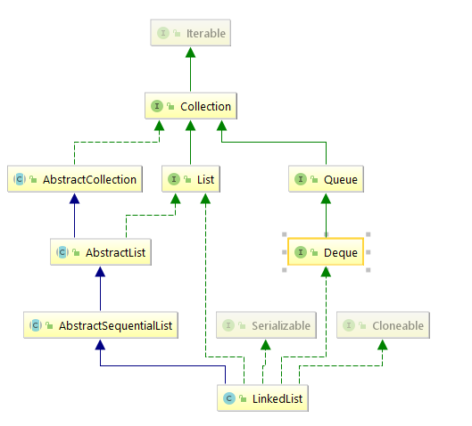

## LinkedList源码分析

在上一篇文章中我们一起学习了ArrayList核心方法的相关源码内容，现在我们继续探讨LinkedList底层实现。



根据族谱图可以看出，LinkedList跟ArrayList一样都继承了AbstractCollection，而AbstractCollection实现了Collection的基本框架，LinkedList底层是双向链表实现的而不是数组，所以不再具备RandomAccess的特性。但是相比较ArrayList，LinkedList实现了一个叫做Deque的接口，Deque直接继承了Queue接口。Queue是一种后进先出的数据结构，我们可以把关注点放在Deque上。

>A linear collection that supports element insertion and removal at
 both ends.  The name <i>deque</i> is short for "double ended queue"
 and is usually pronounced "deck".  Most {@code Deque}
 implementations place no fixed limits on the number of elements
  they may contain, but this interface supports capacity-restricted
 deques as well as those with no fixed size limit.

以上来自于JDK1.8关于Deque的解释。Deque是线性的集合，支持在两端进行数据的插入和删除。Deque的全名是double ended queue 双端队列，发音跟deck相似。大多数关于Deque接口的实现，对于他们可以包含的元素没有固定的数量限制。除此以外，这个接口也支持具有容量限制的Deque实现。

这样，LinkedList具有可以序列化、克隆，底层是双向链表的特性。

***LinkedList构造方法***

```java
//无参构造方法
public LinkedList() {
    }
//带参构造方法
public LinkedList(Collection<? extends E> c) {
        this();
        addAll(c);
    }
//此时size=0，将新传入指定集合的元素追加到list之后
public boolean addAll(Collection<? extends E> c) {
        return addAll(size, c);
    }
//index是第一个被插入的元素的位置
public boolean addAll(int index, Collection<? extends E> c) {
        //校验index位置的合法性
    	checkPositionIndex(index);

        Object[] a = c.toArray();
        int numNew = a.length;
        if (numNew == 0)
            return false;
		//此处定义两个Node节点，pred作为前驱节点，succ作为后继节点
        Node<E> pred, succ;
        //如果插入节点的起始位置是LinkedList的最后一个，就像按顺序排队一样，说明当前位置后面没有别人。
    	//直接将succ置为空，表示表示当前位置是队列的最后一个。前驱节点置为全局变量的last节点。
        if (index == size) {
            succ = null;
            //当前将pred前驱节点置为last，可能会存在pred为null的情况,即当前LinkedList一个元素都没有
            //在后面的逻辑中会有判断。反之，当前LinkedList中含有元素，pred置为last无可厚非。
            pred = last;
        } else {
        //说明插入的起始位置其实是有人的，那么本次元素的插入属于插队的形式。需要将该位置原来的元素保			
	//存起来最后后继节点。同样的当前元素的前一个元素位置即为前驱节点。
            succ = node(index);
            pred = succ.prev;
        }
        //遍历即将插入LinkedList的数组
        for (Object o : a) {
            @SuppressWarnings("unchecked") E e = (E) o;
            //以pred为前驱节点，可以理解为将e节点的前驱指针指向前驱节点。
            Node<E> newNode = new Node<>(pred, e, null);
            //前驱节点为空，所以这是新插入的第一个节点（适用于上一个index==size的判断）
            if (pred == null)
                first = newNode;
            else
                //将前驱节点的后继指针指向新创建的节点。
                pred.next = newNode;
            //前驱节点指向当前节点，为插入下一个节点做好准备
            pred = newNode;
        }
		//在集合所有的元素插入完当前LinkedList以后，pred已经指向了a数组的最后一个元素。
        //如果succ == null，说明本次插入操作属于正常排队现象，不存在插队现象。所以pred指向的元素即为LinkedList的最后一个节点。
        if (succ == null) {
            last = pred;
        } else {
            //本次批量插入属于插队情况，所以当前节点的后继节点指向该位置的原起始节点succ
            pred.next = succ;
            //原起始节点的前驱指向当前pred。
            succ.prev = pred;
        }
		
        size += numNew;
        modCount++;
        return true;
    }
private void checkPositionIndex(int index) {
        if (!isPositionIndex(index))
            throw new IndexOutOfBoundsException(outOfBoundsMsg(index));
    }
private boolean isPositionIndex(int index) {
        return index >= 0 && index <= size;
    }
```


***LinkedList的插入操作***

```java
//LinkedList数据的添加属于尾插法
public boolean add(E e) {
        linkLast(e);
        return true;
    }
void linkLast(E e) {
        final Node<E> l = last;
    	//将新插入的节点的前驱指向l，即为last
        final Node<E> newNode = new Node<>(l, e, null);
        last = newNode;
        //原last为null，说明当前插入的节点属于LinkedList的第一个节点。
        if (l == null)
            first = newNode;
        else
            //否则，将原last的后继指针指向当前元素
            l.next = newNode;
        size++;
        modCount++;
    }
```

***LinkedList的删除操作***

```java
public boolean remove(Object o) {
        if (o == null) {
            //开始遍历LinkedList列表
            for (Node<E> x = first; x != null; x = x.next) {
                if (x.item == null) {
                    unlink(x);
                    return true;
                }
            }
        } else {
            //跟上文类似
            for (Node<E> x = first; x != null; x = x.next) {
                if (o.equals(x.item)) {
                    unlink(x);
                    return true;
                }
            }
        }
        return false;
    }

E unlink(Node<E> x) {
        // assert x != null;
        final E element = x.item;
        final Node<E> next = x.next;
        final Node<E> prev = x.prev;
		//解除前驱节点与当前被删除节点的X的关系 
        if (prev == null) {
            first = next;
        } else {
            prev.next = next;
            x.prev = null;
        }
		//解除后继节点与当前节点X的关系
        if (next == null) {
            last = prev;
        } else {
            next.prev = prev;
            x.next = null;
        }
        //X节点的前驱指针、后驱指针以及当前元素都赋为null，此时只有element指向当前被删除节点。
        x.item = null;
        size--;
        modCount++;
        return element;
    }
```

关于LinkedList的总结，LinkedList在内部定义了一个名为Node静态内部类。Item存储当前元素，prev作为它的前驱指针，next作为它的后继指针，该内部类类似于c语言中的结构体类型。此外，LinkedList还定义了first、last的Node类型属性，用来作为LinkedList的头指针和尾指针。插入单个元素的时候，使用尾插法。删除的时候，开始遍历LinkedList，找到指定的Node解绑该节点与prev和next之间的关系。
