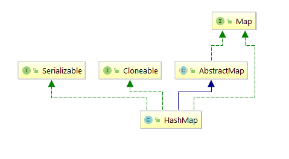

### HashMap源码分析

学过数据结构中散列表的同学，对于Hash应该不会陌生。本章我们一起来看HashMap，还是从先从族谱图看起。



看过族谱图之后，我们可以知道HashMap除了满足可序列化、克隆的性质外，还继承了AbstractMap。AbtractMap相对于HashMap正如AbstractList相对于ArrayList一样，是对于Map的基本骨架的实现类，用来减少HashMap一部分工作的。

>Hash table based implementation of the <tt>Map</tt> interface.  This
>implementation provides all of the optional map operations, and permits
><tt>null</tt> values and the <tt>null</tt> key.  (The <tt>HashMap</tt>
>class is roughly equivalent to <tt>Hashtable</tt>, except that it is
>unsynchronized and permits nulls.)  This class makes no guarantees as to
>the order of the map; in particular, it does not guarantee that the order
>will remain constant over time.

上文是摘自JDK1.8版本中对于HashMap的解释，HashMap是基于Map接口实现的哈希表，HashMap提供所有的可选的Map操作，并允许其中的元素存在key和value为null的情况。HashMap大致与Hashtable相同，除了HashMap不是线程安全的以及HashMap允许元素为null 的情况。HashMap不保证Map中的顺序。特别是，它不保证随着时间的推移，Map中元素的顺序仍然不变。

***HashMap构造函数***

```java
//装填因子满足于泊松分布，在7，8之间碰撞最少。
static final float DEFAULT_LOAD_FACTOR = 0.75f;
//逻辑左移4位，默认大小为16
static final int DEFAULT_INITIAL_CAPACITY = 1 << 4; // aka 16
static final int MAXIMUM_CAPACITY = 1 << 30;
public HashMap() {
    this.loadFactor = DEFAULT_LOAD_FACTOR; // all other fields defaulted
}
public HashMap(int initialCapacity) {
    this(initialCapacity, DEFAULT_LOAD_FACTOR);
}

public HashMap(int initialCapacity, float loadFactor) {
    if (initialCapacity < 0)
        throw new IllegalArgumentException("Illegal initial capacity: " +
                                           initialCapacity);
    if (initialCapacity > MAXIMUM_CAPACITY)
        initialCapacity = MAXIMUM_CAPACITY;
    if (loadFactor <= 0 || Float.isNaN(loadFactor))
        throw new IllegalArgumentException("Illegal load factor: " +
                                           loadFactor);
    this.loadFactor = loadFactor;
    this.threshold = tableSizeFor(initialCapacity);
}
  /**
    *tableSizeFor 方法就是将用户自定的初始化容量转变最接近的2的幂次的数字
    *那么为什么要让HashMap的容量为2的幂次呢？
    *在数据结构这门课程的散列表学习中，当我们向哈希表中插入的数据的时候。假设我们有一个length为7的表，
    *需要插入数值16到哈希表，我们用16取7的模为2，那么我们将16这个数存在放在哈希表中的index为2的位置
    *（index默认从0开始）
    * 然而在HashMap中的是采用的hash&(length-1)这样的位与元素来代替我们大学中学的取模运算的方式，
    *来获取所要存储元素的下标位置，而这一计算的前提都是依赖于HashMap的容量大小为2的幂次。
    *那么问题转化为，
    *假设HashMap的容量为2的幂次，证明hash&(length-1) = hash%length，其中2^n=length
    *解:
    *首先length是2的幂次，所以换算为二进制为1000...0,1 后面n个0，那么length-1必然是0111...1, 0后面n个1
    *那么hash&(length-1)的结果必然是hash二进制中的后n位数字。
    *hash/lenth等价于 hash/2^n等于二进制中hash右移n位，即移除二进制中hash的后n位数字。
    *（左移n位的话，右边需补n个0），被移除的hash中的后n位即为hash&（length-1），hash/lenth剩下的是商，
    *舍弃的是余数，而hash/lenth的余数等于hash%length。
    *所以hash&(length-1) = hash%length,当HashMap的容量为2的幂次的情况下成立。
    */
static final int tableSizeFor(int cap) {
    int n = cap - 1;
    n |= n >>> 1;
    n |= n >>> 2;
    n |= n >>> 4;
    n |= n >>> 8;
    n |= n >>> 16;
    return (n < 0) ? 1 : (n >= MAXIMUM_CAPACITY) ? MAXIMUM_CAPACITY : n + 1;
}
```

