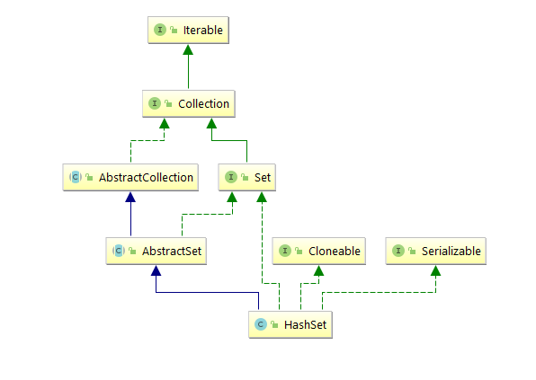

## HashSet源码分析

关于HashSet大家平时接触的还是蛮多的，关于它的基本用途这边先不赘述，我们还是先上族谱图。

看到族谱图的时候，HashSet还是给人有点似曾相识的感觉。实现Set接口、继承AbstractSet类，满足克隆、序列化等特性。AbstractSet相对于HashSet，就类似于AbstractList相对于ArrayList一样。都是都是对上层接口的基本骨架的实现，并且尽可能的简化后面继承类的工作。那我们先从Set接口关注起来。

> A collection that contains no duplicate elements.  More formally, sets
> contain no pair of elements <code>e1</code> and <code>e2</code> such that
> <code>e1.equals(e2)</code>, and at most one null element.  As implied by
> its name, this interface models the mathematical <i>set</i> abstraction.

上文参考JDK1.8的版本关于Set的介绍。Set是一个不会包含重复元素的集合