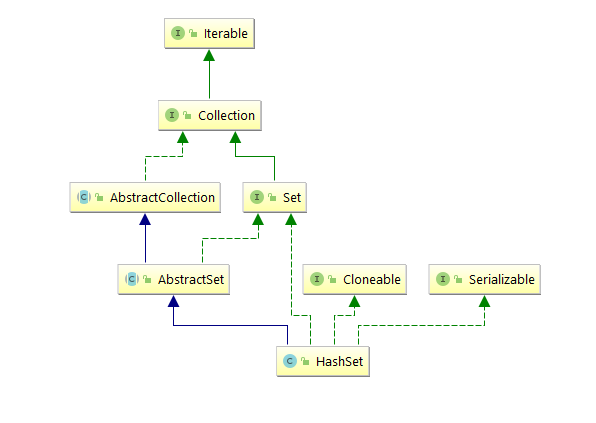

## HashSet源码分析

关于HashSet大家平时接触的还是蛮多的，关于它的基本用途这边先不赘述，我们还是先上族谱图。



看到族谱图的时候，HashSet还是给人有点似曾相识的感觉。实现Set接口、继承AbstractSet类，满足克隆、序列化等特性。AbstractSet相对于HashSet，就类似于AbstractList相对于ArrayList一样。都是都是对上层接口的基本骨架的实现，并且尽可能的简化后面继承类的工作。那我们先从Set接口关注起来。

> A collection that contains no duplicate elements.  More formally, sets
> contain no pair of elements <code>e1</code> and <code>e2</code> such that
> <code>e1.equals(e2)</code>, and at most one null element.  As implied by
> its name, this interface models the mathematical <i>set</i> abstraction.

上文参考JDK1.8的版本关于Set的介绍。Set是一个不会包含重复元素的集合，正式的讲，就是Set不包含一对元素，这两个元素满足调用equals方法返回值为true的情况，并且至多只会包含一个空元素该元素位于集合的第一个位置。顾名思义这个接口模拟了抽象的数据集。

***HashSet的构造方法***

```java
//这边是HashMap中定义的默认装填因子为0.75，至于原因的话，是因为在泊松分布下7到8之间的碰撞最小。JDK这边取了0.75
static final float DEFAULT_LOAD_FACTOR = 0.75f;
//默认容量16，逻辑左移4位数
static final int DEFAULT_INITIAL_CAPACITY = 1 << 4; // aka 16  
public HashMap() {
    this.loadFactor = DEFAULT_LOAD_FACTOR; // all other fields defaulted
}
//这边HashSet在底层new一个默认的HashMap用来存储元素，这样就可用通过HashMap的key不重复来保证HashSet中元素不重复的性质。
public HashSet() {    
    map = new HashMap<>();
}
//这边是将传入的用户自定义的capacity参数转换成2的幂次的值。至于为什么，我们到HashMap的那一节再详谈。
static final int tableSizeFor(int cap) {
    int n = cap - 1;
    n |= n >>> 1;
    n |= n >>> 2;
    n |= n >>> 4;
    n |= n >>> 8;
    n |= n >>> 16;
    return (n < 0) ? 1 : (n >= MAXIMUM_CAPACITY) ? MAXIMUM_CAPACITY : n + 1;
}
public HashMap(int initialCapacity, float loadFactor) {
    if (initialCapacity < 0)
        throw new IllegalArgumentException("Illegal initial capacity: " +
                                           initialCapacity);
    if (initialCapacity > MAXIMUM_CAPACITY)
        initialCapacity = MAXIMUM_CAPACITY;
    if (loadFactor <= 0 || Float.isNaN(loadFactor))
        throw new IllegalArgumentException("Illegal load factor: " +
                                           loadFactor);
    this.loadFactor = loadFactor;
    this.threshold = tableSizeFor(initialCapacity);
}
//这边可以看到HashSet内部的addAll是调用的Map中的put方法，然后把元素的值放在Map中的key中，用hashMap的
//key无序不重复的性质来保证HashSet的性质。
public boolean addAll(Collection<? extends E> c) {
    boolean modified = false;
    for (E e : c)
        if (add(e))
            modified = true;
    return modified;
}
//由于涉及到了hashMap中的put方法，关于put方法我们会在HashMap中展开详谈
public boolean add(E e) {
    return map.put(e, PRESENT)==null;
}
//由于了解了HashMap中的默认装填因子是0.75，默认大小是16所以这边就比较好理解了。
public HashSet(Collection<? extends E> c) {
    map = new HashMap<>(Math.max((int) (c.size()/.75f) + 1, 16));
    addAll(c);
}
public HashSet(int initialCapacity, float loadFactor) {
    map = new HashMap<>(initialCapacity, loadFactor);
}
public HashSet(int initialCapacity) {
    map = new HashMap<>(initialCapacity);
}
```

***HashSet的add方法***

```java
//这边是调用内部的map的put操作，会通过新添加的e元素来计算Hash，同时把e作为key添加到map中
//具体详细内容我们到HashMap一节展开
public boolean add(E e) {
    return map.put(e, PRESENT)==null;
}
```

***HashSet的remove方法***

```java
//remove操作也是调用的HashMap的remove操作，入参为HashMap的Key即为HashSet的元素
public boolean remove(Object o) {
    return map.remove(o)==PRESENT;
}
```

本章的篇幅不长，HashSet继承了AbstractSet的基本骨架类并具有可克隆、序列化的特性。同时HashSet内部是通过将新添加的元素作为内部HashMap的key来保证无序不重复的性质，从这一点，也解释了为什么HashSet会用Hash来修饰自己名字的缘故，至于底层中的Map的相关操作，在HashMap中一一展开。