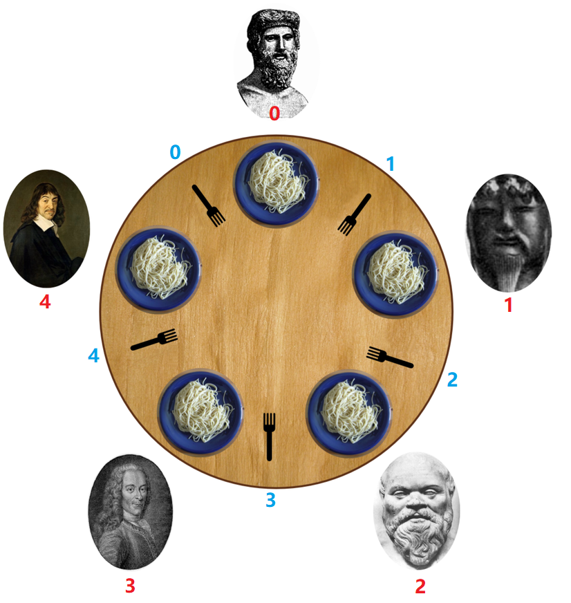

#### `ReentrantLock`番外篇：小练习之生产者消费者、哲学家进餐问题

在了解完`ReentrantLock`源码之后，我们再来练习一些题目。

1. 生产者消费者问题

   现有一个容量为10的容器，生产者每次将产品存进容器，但不得超过容器容量。消费者每次需在容器中存在产品的时候，消费产品。

   ```java
   public class ProducerConsumerTest {
   
       private static Integer MAX_SIZE = 10;
       private static final String PRODUCT = "featured_product";
       private static Integer serialNo = 0;
   
       private static List<String> container = new ArrayList<>(MAX_SIZE);
       private static ReentrantLock lock = new ReentrantLock();
       //一个ReentrantLock可以对应多个Condition对象
       private static Condition producerCondition = lock.newCondition();
       private static Condition consumerCondition = lock.newCondition();
   
   
       //基类
       public abstract static class CommonObject implements Runnable {
           protected List<String> container;
           protected ReentrantLock lock;
           protected Condition producerCondition;
           protected Condition consumerCondition;
   
           public CommonObject(List<String> container, ReentrantLock lock, Condition producerCondition, Condition consumerCondition) {
               this.container = container;
               this.lock = lock;
               this.producerCondition = producerCondition;
               this.consumerCondition = consumerCondition;
           }
   
           public abstract void doWork();
           @Override
           public void run() {
               while (true) {
                   doWork();
               }
   
           }
       }
   
       public static class Producer extends CommonObject {
   
           public Producer(List<String> container, ReentrantLock lock, Condition producerCondition, Condition consumerCondition) {
               super(container, lock, producerCondition, consumerCondition);
           }
   
           @Override
           public void doWork() {
               lock.lock();
               try {
                   //当容器占满，将当前线程生成Node节点添加到producerCondition 的condition queue
                   //中，并等待唤醒。
                   while (container.size() == MAX_SIZE) {
                       System.out.println("queue has no capacity.");
                       producerCondition.await();
                   }
                   LockSupport.parkNanos(1000000L);
                   String item = PRODUCT + serialNo++;
                   container.add(item);
                   System.out.println("finish produce "+item);
   				//唤醒consumerCondition中的线程节点
                   consumerCondition.signalAll();
               } catch (Exception e) {
                   System.out.println("producer occurs interrupt."+e.getMessage());
               } finally {
                   lock.unlock();
               }
           }
       }
   
       public static class Consumer extends CommonObject {
   
           public Consumer(List<String> container, ReentrantLock lock, Condition producerCondition, Condition consumerCondition) {
               super(container, lock, producerCondition, consumerCondition);
           }
   
           @Override
           public void doWork() {
               lock.lock();
               try {
                   //当容器为空，将当前线程生成Node节点添加到consumerCondition 的condition queue
                   //中，并等待唤醒。
                   while (container.size() == 0) {
                       System.out.println("queue has no product.");
                       consumerCondition.await();
                   }
                   LockSupport.parkNanos(1000000L);
                   String item = container.get(0);
                   container.remove(item);
                   System.out.println("finish consume "+item);
   				//唤醒producerCondition中线程节点
                   producerCondition.signalAll();
               } catch (Exception e) {
                   System.out.println("consumer occurs interrupt."+e.getMessage());
               } finally {
                   lock.unlock();
               }
           }
       }
   
       public static void main(String[] args) {
           Producer producerRunnable = new Producer(container, lock, producerCondition, consumerCondition);
           Consumer consumerRunnable = new Consumer(container, lock, producerCondition, consumerCondition);
   
           Thread producerThread = new Thread(producerRunnable);
           Thread consumerThread = new Thread(consumerRunnable);
   
           producerThread.start();
           consumerThread.start();
   
       }
   }
   ```

2. 哲学家进餐问题

   [本题来自于LeetCode](https://leetcode-cn.com/problems/the-dining-philosophers/)

   > 5 个沉默寡言的哲学家围坐在圆桌前，每人面前一盘意面。叉子放在哲学家之间的桌面上。（5 个哲学家，5 根叉子）

   > 所有的哲学家都只会在思考和进餐两种行为间交替。哲学家只有同时拿到左边和右边的叉子才能吃到面，而同一根叉子在同一时间只能被一个哲学家使用。每个哲学家吃完面后都需要把叉子放回桌面以供其他哲学家吃面。只要条件允许，哲学家可以拿起左边或者右边的叉子，但在没有同时拿到左右叉子时不能进食。假设面的数量没有限制，哲学家也能随便吃，不需要考虑吃不吃得下。

   > 设计一个进餐规则（并行算法）使得每个哲学家都不会挨饿；也就是说，在没有人知道别人什么时候想吃东西或思考的情况下，每个哲学家都可以在吃饭和思考之间一直交替下去。

   

   > 哲学家从 0 到 4 按 顺时针 编号。请实现函数 void wantsToEat(philosopher, pickLeftFork, pickRightFork, eat, putLeftFork, putRightFork)：

   > philosopher 哲学家的编号。
   > pickLeftFork 和 pickRightFork 表示拿起左边或右边的叉子。
   > eat 表示吃面。
   > putLeftFork 和 putRightFork 表示放下左边或右边的叉子。
   > 由于哲学家不是在吃面就是在想着啥时候吃面，所以思考这个方法没有对应的回调。
   > 给你 5 个线程，每个都代表一个哲学家，请你使用类的同一个对象来模拟这个过程。在最后一次调用结束之前，可能会为同一个哲学家多次调用该函数。

   示例：

   > 输入：n = 1
   > 输出：[[4,2,1],[4,1,1],[0,1,1],[2,2,1],[2,1,1],[2,0,3],[2,1,2],[2,2,2],[4,0,3],[4,1,2],[0,2,1],[4,2,2],[3,2,1],[3,1,1],[0,0,3],[0,1,2],[0,2,2],[1,2,1],[1,1,1],[3,0,3],[3,1,2],[3,2,2],[1,0,3],[1,1,2],[1,2,2]]
   > 解释:
   > n 表示每个哲学家需要进餐的次数。
   > 输出数组描述了叉子的控制和进餐的调用，它的格式如下：
   > output[i] = [a, b, c] (3个整数)
   > - a 哲学家编号。
   > - b 指定叉子：{1 : 左边, 2 : 右边}.
   > - c 指定行为：{1 : 拿起, 2 : 放下, 3 : 吃面}。
   > 如 [4,2,1] 表示 4 号哲学家拿起了右边的叉子。
   >

   解题思路：

   形成死锁的条件为：

   * 互斥条件
   * 不可剥夺条件
   * 请求与保持条件
   * 循环等待条件

   由于一根叉子每次只能被一个哲学家使用，不考虑抢夺叉子的方式，当前处理方式为**破坏请求与保持条件**。

   按照图示的方式给**哲学家i**标记顺序，则i为哲学家右手边叉子、i+1为哲学家左手边叉子。

   ```java
   class DiningPhilosophers {
   
       //设置五根叉子 每次只供一个哲学家使用
       private List<ReentrantLock>forkList = Arrays.asList(new ReentrantLock(), new ReentrantLock(),new ReentrantLock(),new ReentrantLock(),new ReentrantLock());
       //拿叉子之前，先锁住桌子。确保哲学家同时获取两把叉子
       private ReentrantLock tableLock = new ReentrantLock();
   
       public DiningPhilosophers() {
   
       }
   
       public void wantsToEat(int philosopher,
                              Runnable pickLeftFork,
                              Runnable pickRightFork,
                              Runnable eat,
                              Runnable putLeftFork,
                              Runnable putRightFork) throws InterruptedException {
   
   		//获取左手叉子的编号
           int leftIndex = (philosopher+1)%5;
           //获取右手叉子的编号
           int rightIndex = philosopher;
           //尝试获取叉子
           tableLock.lock();
           forkList.get(leftIndex).lock();
           forkList.get(rightIndex).lock();
           pickLeftFork.run();
           pickRightFork.run();
           tableLock.unlock();
   		//获取叉子成功，开始用餐
           eat.run();
           putLeftFork.run();
           putRightFork.run();
           forkList.get(leftIndex).unlock();
           forkList.get(rightIndex).unlock();
       }
   }
   ```