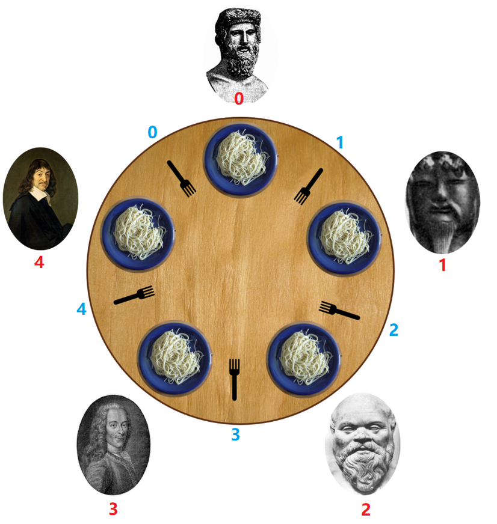

#### `Semaphore`番外篇：小练习之哲学家进餐问题

在了解完了Semaphore源码之后，我们一起来练习一下。

1. 哲学家进餐问题

   [本题来自于LeetCode](https://leetcode-cn.com/problems/the-dining-philosophers/)

   > 5 个沉默寡言的哲学家围坐在圆桌前，每人面前一盘意面。叉子放在哲学家之间的桌面上。（5 个哲学家，5 根叉子）
   >
   > 所有的哲学家都只会在思考和进餐两种行为间交替。哲学家只有同时拿到左边和右边的叉子才能吃到面，而同一根叉子在同一时间只能被一个哲学家使用。每个哲学家吃完面后都需要把叉子放回桌面以供其他哲学家吃面。只要条件允许，哲学家可以拿起左边或者右边的叉子，但在没有同时拿到左右叉子时不能进食。假设面的数量没有限制，哲学家也能随便吃，不需要考虑吃不吃得下。
   >
   > 设计一个进餐规则（并行算法）使得每个哲学家都不会挨饿；也就是说，在没有人知道别人什么时候想吃东西或思考的情况下，每个哲学家都可以在吃饭和思考之间一直交替下去。

   

   > 哲学家从 0 到 4 按 顺时针 编号。请实现函数 void wantsToEat(philosopher, pickLeftFork, pickRightFork, eat, putLeftFork, putRightFork)：

   > philosopher 哲学家的编号。
   > pickLeftFork 和 pickRightFork 表示拿起左边或右边的叉子。
   > eat 表示吃面。
   > putLeftFork 和 putRightFork 表示放下左边或右边的叉子。
   > 由于哲学家不是在吃面就是在想着啥时候吃面，所以思考这个方法没有对应的回调。
   > 给你 5 个线程，每个都代表一个哲学家，请你使用类的同一个对象来模拟这个过程。在最后一次调用结束之前，可能会为同一个哲学家多次调用该函数。

   示例：

   > 输入：n = 1
   > 输出：[[4,2,1],[4,1,1],[0,1,1],[2,2,1],[2,1,1],[2,0,3],[2,1,2],[2,2,2],[4,0,3],[4,1,2],[0,2,1],[4,2,2],[3,2,1],[3,1,1],[0,0,3],[0,1,2],[0,2,2],[1,2,1],[1,1,1],[3,0,3],[3,1,2],[3,2,2],[1,0,3],[1,1,2],[1,2,2]]
   > 解释:
   > n 表示每个哲学家需要进餐的次数。
   > 输出数组描述了叉子的控制和进餐的调用，它的格式如下：
   > output[i] = [a, b, c] (3个整数)
   >
   > - a 哲学家编号。
   > - b 指定叉子：{1 : 左边, 2 : 右边}.
   > - c 指定行为：{1 : 拿起, 2 : 放下, 3 : 吃面}。
   >   如 [4,2,1] 表示 4 号哲学家拿起了右边的叉子。

   解题思路:

   形成死锁的条件：

   * 互斥条件
   * 请求并保持条件
   * 不可剥夺条件
   * 循环等待

   由于一只叉子每次只能被一个哲学家拥有，所以不考虑破坏互斥条件，在哲学家用餐的过程中，不考虑剥夺其使用的叉子，所以在此也不考虑破坏不可剥夺条件。由于在`ReentrantLock`中我们通过破坏请求保持条件避免死锁，在此我们通过破坏循环等待，来避免死锁。

   ```java
   class DiningPhilosophers {
   
       //餐桌最大容许人数
       Semaphore numLimit = new Semaphore(4);
   
       //设置五根叉子 每次只供一个哲学家使用, 互斥条件也可以使用ReentrantLock
       private List<Semaphore> forkList = Arrays.asList(new Semaphore(1),
               new Semaphore(1),new Semaphore(1),new Semaphore(1),new Semaphore(1));
   
   
   
       public DiningPhilosophers() {
   
       }
   
       public void wantsToEat(int philosopher,
                              Runnable pickLeftFork,
                              Runnable pickRightFork,
                              Runnable eat,
                              Runnable putLeftFork,
                              Runnable putRightFork) throws InterruptedException {
   
           try {
               //哲学家先获取餐桌门票
               numLimit.acquire();
               //左手叉子
               int leftIndex = (philosopher + 1) % 5;
               //右手叉子
               int rightIndex = philosopher;
               forkList.get(leftIndex).acquire();
               pickLeftFork.run();
               forkList.get(rightIndex).acquire();
               pickRightFork.run();
               eat.run();
               putLeftFork.run();
               forkList.get(leftIndex).release();
               putRightFork.run();
               forkList.get(rightIndex).release();
           } finally {
               numLimit.release();
           }
       }
   }
   ```

   在本例子中通过Semaphore限制就餐人数破坏了循环等待条件，从而避免了死锁。