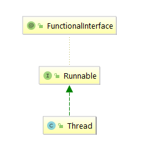
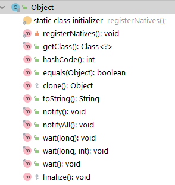

#### 并发基础知识1

1. 线程与进程

   程序是由数据结构和算法组成的，而进程是程序关于某个数据集的一次运行活动。同时也是资源分配的最小单位，而线程是CPU调度的最小单位。在`JVM`内存模型中程序计数器、虚拟机栈、本地方法栈为每个线程所私有，线程彼此之间共享进程在堆和方法区中开辟的资源。一个进程可以包含多个线程，进程比之线程，如同一个运行中的工厂比之工厂里的工人，工人可以共享工厂中的资源。

2. 线程的创建

   线程的创建方式大致有三种: 继承Thread类、实现Runnable接口、实现Callable接口。我们先来看相应的代码，再来观察他们之间的区别。

```java
public class CreatedThread {
    
    public static class MyThread extends Thread {
        @Override
        public void run() {
            System.out.println("MyThread......");
        }
    }

    public static class MyRunnable implements Runnable {
        @Override
        public void run() {
            System.out.println("My Runnable.....");
        }
    }

    public static class MyCallable implements Callable {
        @Override
        public Object call() throws Exception {
            return "MyCallable....";
        }
    }
    
    public static void main(String[] args) throws ExecutionException, InterruptedException {

        MyThread myThread = new MyThread();
        myThread.start();

        Thread thread1 = new Thread(new MyRunnable());
        thread1.start();
        
        FutureTask futureTask = new FutureTask(new MyCallable());
        Thread thread2 = new Thread(futureTask);
        thread2.start();

        myThread.join();
        thread1.join();
        thread2.join();
        
        System.out.println(futureTask.get());
    }
    
}
```

​	执行结果为:


* 继承Thread类

  

  通过族谱图，我们就可以看到其实Thread类本身也是去实现了Runnable接口并重写了run方法。

  > The <code>Runnable</code> interface should be implemented by any class whose instances are intended to be executed by a thread. The class must define a method of no arguments called <code>run</code>.This interface is designed to provide a common protocol for objects that wish to execute code while they are active.
  

上文是来自于`JDK`中关于Runnable的解释。当打算用一个线程去执行一个类的实例的时候，该类需要去实现Runnable接口，该类必须定义一个叫做run的无参方法。Runnable这个接口被设计来去提供一个公共的协议，该协议适用于那些期望在他们活跃的时候去执行代码的对象。

* 实现Runnable接口

  

  Runnable的族谱图上可以得知，Runnable接口添加了`FunctionalInterface`注解。我们来关注一下该注解。

  >An informative annotation type used to indicate that an interface type declaration is intended to be a <i>functional interface</i> as defined by the Java Language Specification. Conceptually, a functional interface has exactly one abstract method. 
  
  上文是来自于`JDK`中关于`FunctionalInterface`的解释。这是一种信息注解类型，用于展示一种接口类型的定义。根据Java语言规格的定义，该接口类型的定义应该是一个函数接口。从概念上讲，函数接口只有一个抽象方法。我们知道该抽象方法是`run()`方法，所以带有该`@FunctionalInterface`注解的接口，只有一个抽象方法。此外，Java支持单继承多实现的方式，实现Runnable接口的方式，来创建线程，该类还可以继承其他的类，只是Runnable接口中的run方法，没有返回值。Runnable接口介绍可以查看上文。
  
* 实现Callable接口

  

  根据族谱图，Callable接口也是带有`@FunctionalInterface`注解，也就是说Callable接口只有一个抽象方法，该方法是带有返回参数的call方法。
  
  > A task that returns a result and may throw an exception.`Implementors` define a single method with no arguments called call.
  >
  > The Callable interface is similar to `java.lang.Runnable`, in that both are designed for classes whose instances are potentially executed by another thread.  A Runnable, however, does not return a result and cannot throw a checked exception.

  以上是来自`JDK`关于Callable接口的解释。这是一个有返回结果并且可能抛出异常的任务，实现者定义了一个名叫call的单一的无参方法。Callable接口和Runnable接口很类似，相似之处在于两者都是为了那些类而设计。这些类的是实例是有可能被另外的线程执行。但是Runnable接口是没有任何返回值同时也不会抛出受检异常。

3. 线程间的通知和等待

     

  * `notify` \ `notifyAll`

       > Wakes up a single thread that is waiting on this object's monitor. If any threads are waiting on this object, one of them is chosen to be awakened. The choice is arbitrary and occurs at
       > the discretion of the implementation. A thread waits on an object's monitor by calling one of the wait methods.
       
       上文是来自于`JDK`关于notify方法的解释。notify方法用于唤醒一个等待该对象Monitor锁的线程。如果任何线程正在等待该对象，其中的一个线程将会被唤醒。这个选择是随机的并且发生在自由判定的情况之下。通过调用wait系列方法中的一个，线程来等待该对象的Monitor锁。notify在此处只会起到**通知**的作用并**不会真正释放Monitor锁**，需等到相关代码执行完成才释放Monitor锁。此外，`notifyAll`是用来唤醒所有在该对象上调用wait系列方法的线程。
       
* `wait`
  
  >Causes the current thread to wait until another thread invokes the `notify()` method or the `notifyAll()` method for this object. In other words, this method behaves exactly as if it simply
  >performs the call `wait(0)`.
  >
  > The current thread must own this object's monitor. The thread releases ownership of this monitor and waits until another thread notifies threads waiting on this object's monitor to wake up either through a call to the `notify` method or the `notifyAll` method. The thread then waits until it can
  >re-obtain ownership of the monitor and resumes execution.
  >
  >As in the one argument version, interrupts and spurious wakeups are
  > possible, and this method should always be used in a loop:
  >
  ><pre>
  > synchronized (obj) {
  >   while (&lt;condition does not hold&gt;)
  >       obj.wait();
  >    ... // Perform action appropriate to condition
  > }
  ></pre>
  
  上文是来自`JDK`中关wait方法的注释。`wait`方法会导致当前线程等待直到另外一个线程关于当前对象调用了  `notify`或者`notifyAll`方法。换句话讲，当前方法wait的行为就像是该对象简单执行了wait(0)的调用。当前线程必须拥有该对象的Monitor锁。当前线程释放Monitor锁并处于等待，直到另一个线程通过调用`notify` 系列方法来通知正在等待当前对象的Monitor锁的线程。当前线程然后处于等待直到它可以重新获得Monitor锁的所有权然后继续执行。和单参数版本一样，**线程打断**和**虚假唤醒**可能发生，然后该方法应该用在循环当中。
  
  我们知道出现线程打断的情况，当前wait方法会抛出`InterruptedException`。所以我们来关注**虚假唤醒**的这种情况。
  
  
  
  ```java
  public class NotifyAndWait {
  
      static class Product {
          private  static final Integer MAX_CAPACITY = 8;
          private  Integer productSize = 0;
  
          synchronized void produce() {
  
               if (productSize>=MAX_CAPACITY) {
                   System.out.println("reach the threshold of product size");
                   try {
                       this.wait();
                   } catch (InterruptedException e) {
                       e.printStackTrace();
                   }
               }
               System.out.println(Thread.currentThread()+" ---- current product num:"+ ++productSize);
               this.notifyAll();
  
          }
  
          synchronized void consume() {
                   if (productSize<= 0) {
                       System.out.println("no product for consume");
                       try {
                           this.wait();
                       } catch (InterruptedException e) {
                           e.printStackTrace();
                       }
                   }
                   System.out.println(Thread.currentThread()+" ---- current product num:"+ --productSize);
                   this.notify();
          }
      }
  
      public static void main(String[] args) throws InterruptedException {
          Product product = new Product();
  
          Thread thread1 = new Thread(()->{
              for (int i = 0; i< Product.MAX_CAPACITY*2; i++) {
                  try {
                      Thread.sleep(100);
                  } catch (InterruptedException e) {
                      e.printStackTrace();
                  }
                  product.produce();
              }
          });
  
          Thread thread2 = new Thread(()->{
              for (int i = 0; i< Product.MAX_CAPACITY*2; i++) {
                  product.produce();
              }
          });
  
          Thread thread3 = new Thread(()->{
              for (int i=0;i<Product.MAX_CAPACITY*2;i++) {
                  product.consume();
              }
              CompletableFuture<Void> voidCompletableFuture = CompletableFuture.allOf();
              try {
                  Void aVoid = voidCompletableFuture.get();
              } catch (InterruptedException e) {
                  e.printStackTrace();
              } catch (ExecutionException e) {
                  e.printStackTrace();
              }
          });
  
          Thread thread4 = new Thread(()->{
              for (int i=0;i<Product.MAX_CAPACITY*2;i++) {
                  product.consume();
              }
          });
  
          thread1.start();
          thread2.start();
          thread3.start();
          thread4.start();
  
          thread1.join();
          thread2.join();
          thread3.join();
          thread4.join();
      }
  }
  ```
  
  
  
  这边是控制台打印的日志，可以看到库存数量已经出现负数了，出现了虚假唤醒的情况。这边根据截取的日志可以看到，`Thread[-1,5,main]`属于生产者，`Thread[-2,5,main]`和`Thread[-3,5,main]`属于消费者。首先，`Thread[-2,5,main]`和`Thread[-3,5,main]`也就是消费者先运行发现当前没有库存可供消费，两个消费者线程都在关于Product类的实例对象上调用了wait方法并释放了Monitor锁。之后，生产者`Thread[-1,5,main]` 获取了Monitor锁开始调用`produce()`方法并添加库存，每次添加库存之后调用`notifyAll()`来通知关于Product实例对象的调用了`wait()`方法的对象，这边也就是`Thread[-2,5,main]`和`Thread[-3,5,main]`。此时`Thread[-2,5,main]`和`Thread[-3,5,main]`线程已经被唤醒，只是`Thread[-1,5,main]`在这两个线程之前获取了Monitor锁并继续添加库存。当库存量达到上限，生产者线程`Thread[-1,5,main]`关于Product类的实例对象调用了`wait()`方法，于是处于被唤醒状态的`Thread[-3,5,main]`抢到了Monitor锁，并不断消费直到库存为空，直到再次调用了`wait()方法`。**就在这时，`Thread[-2,5,main]`还处于被唤醒状态，成功获取了Monitor锁，接着当时被挂起的代码行，向下执行，但是已经没有库存了，所以此时库存信息出现了负数，并且调用了`notify()`方法唤醒了在Product类的实例对象调用`wait()`被挂起的线程。** 之后也调用了`wait()`然后挂起了当前线程。我们继续看，`Thread[-2,5,main]`是跟`Thread[-3,5,main]`一起被`Thread[-1,5,main]`的这个生产者线程唤醒的，在满库存的条件下。所以当时，`Thread[-2,5,main]`是在满足被唤醒条件之下，被生产者线程唤醒。**但是，随着`Thread[-3,5,main]`不断消费库存信息直到库存未零，此时`Thread[-2,5,main]`是不满足被唤醒的条件的，却已经处于唤醒状态。**之后，从被唤醒的代码行接着执行，这就是所谓的虚假唤醒。
  
  所以，`JDK`在此处建议使用循环的方式而不是条件判断的方式来判断唤醒条件。
  
4. join方法
   
    > Waits for this thread to die.
    
    上文是来自于`JDK`关于join的解释。等待该线程终结，也就是等待`XXX.join()`该线程实例执行完成然后销毁，再继续执行当前线程也就是`Thread.currentThread()`。相关demo在上一个例子中已经找到。但其实join方法有点类似于`CountDownLatch`的功能。
    
    我们一起来看下`CountDownLatch`这个类。
    
    ```java
    public class CountDownLatchDemo {
        static Integer COUNT_DOWN_LATCH_NUM = 4;
    
        static class MyRunnable implements Runnable {
            @Override
            public void run() {
                try {
                    //模拟线程处理业务逻辑的耗时
                    Thread.sleep(1000);
                } catch (InterruptedException e) {
                    e.printStackTrace();
                }
                System.out.println(Thread.currentThread()+" is die");
            }
        }
        public static void main(String[] args) throws InterruptedException {
    		//常用的记时工具
            StopWatch stopWatch = new StopWatch("Demo");
            stopWatch.start("[test countDownLatch]");
            MyRunnable myRunnable = new MyRunnable();
            CountDownLatch countDownLatch = new CountDownLatch(COUNT_DOWN_LATCH_NUM);
            for (int i=0;i<COUNT_DOWN_LATCH_NUM;i++) {
                Thread thread = new Thread(myRunnable);
                thread.start();
                while (true) {
                    if (!thread.isAlive()) {
                        countDownLatch.countDown();
                        break;
                    }
                }
            }
            countDownLatch.await();
            stopWatch.stop();
            System.out.println(stopWatch.prettyPrint());
        }
    }
    ```
    
    `CountDownLatch`在创建该对象的时候需要对于count赋初值作未门闩值，每次完成一项子任务就调用`countDown()`方法将门闩值减去一。调用`await()`方法将会使当前线程处于等待，直到门闩值为0。所以，每一个Thread实例对象执行完之后该线程实例不再存活此时门闩值减一。而`await()`方法执行之后，此时发现门闩值为0，故不用等待。所以，就使得当前线程处于等待直到满足条件之后再继续执行的性质，`CountDownLatch`与`join()`有点类似。
    
5. sleep方法
    >Causes the currently executing thread to sleep (temporarily cease execution) for the specified number of milliseconds, subject to the precision and accuracy of system timers and schedulers. The thread does not lose ownership of any monitors.
    
    以上来自于`JDK`的解释。导致当前正在执行的线程在指定的时间内睡眠，睡眠时间受制于

