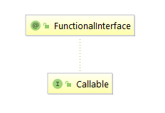

#### 并发基础知识1

1. 线程与进程

   程序是由数据结构和算法组成的，而进程是程序关于某个数据集的一次运行活动。同时也是资源分配的最小单位，而线程是CPU调度的最小单位。在JVM内存模型中程序计数器、虚拟机栈、本地方法栈为每个线程所私有，线程彼此之间共享进程在堆和方法区中开辟的资源。一个进程可以包含多个线程，进程比之线程，如同一个运行中的工厂比之工厂里的工人，工人可以共享工厂中的资源。

2. 线程的创建

   线程的创建方式大致有三种: 继承Thread类、实现Runnable接口、实现Callable接口。我们先来看相应的代码，再来观察他们之间的区别。

```java
public class CreatedThread {
    
    public static class MyThread extends Thread {
        @Override
        public void run() {
            System.out.println("MyThread......");
        }
    }

    public static class MyRunnable implements Runnable {
        @Override
        public void run() {
            System.out.println("My Runnable.....");
        }
    }

    public static class MyCallable implements Callable {
        @Override
        public Object call() throws Exception {
            return "MyCallable....";
        }
    }
    
    public static void main(String[] args) throws ExecutionException, InterruptedException {

        MyThread myThread = new MyThread();
        myThread.start();

        Thread thread1 = new Thread(new MyRunnable());
        thread1.start();
        
        FutureTask futureTask = new FutureTask(new MyCallable());
        Thread thread2 = new Thread(futureTask);
        thread2.start();

        myThread.join();
        thread1.join();
        thread2.join();
        
        System.out.println(futureTask.get());
    }
    
}
```

​	执行结果为:


* 继承Thread类

  

  通过族谱图，我们就可以看到其实Thread类本身也是去实现了Runnable接口并重写了run方法。

  > The <code>Runnable</code> interface should be implemented by any class whose instances are intended to be executed by a thread. The class must define a method of no arguments called <code>run</code>.
  > This interface is designed to provide a common protocol for objects that wish to execute code while they are active.

  上文是来自于JDK中关于Runnable的解释。当打算用一个线程去执行一个类的实例的时候，该类需要去实现Runnable接口，该类必须定义一个叫做run的无参方法。Runnable这个接口被设计来去提供一个公共的协议，该协议适用于那些期望在他们活跃的时候去执行代码的对象。

* 实现Runnable接口

  

  Runnable的族谱图上可以得知，Runnable接口添加了`FunctionalInterface`注解。我们来关注一下该注解。

  >An informative annotation type used to indicate that an interface type declaration is intended to be a <i>functional interface</i> as defined by the Java Language Specification. Conceptually, a functional interface has exactly one abstract method. 
  
  上文是来自于JDK中关于`FunctionalInterface`的解释。这是一种信息注解类型，用于展示一种接口类型的定义。根据Java语言规格的定义，该接口类型的定义应该是一个函数接口。从概念上讲，函数接口只有一个抽象方法。我们知道该抽象方法是`run()`方法，所以带有该`@FunctionalInterface`注解的接口，只有一个抽象方法。此外，Java支持单继承多实现的方式，实现Runnable接口的方式，来创建线程，该类还可以继承其他的类，只是Runnable接口中的run方法，没有返回值。Runnable接口介绍可以查看上文。
  
* 实现Callable接口

  

  根据族谱图，Callable接口也是带有`@FunctionalInterface`注解，也就是说Callable接口只有一个抽象方法，该方法是带有返回参数的call方法。
  
  > A task that returns a result and may throw an exception.`Implementors` define a single method with no arguments called call.
  >
  > The Callable interface is similar to `java.lang.Runnable`, in that both are designed for classes whose instances are potentially executed by another thread.  A Runnable, however, does not return a result and cannot throw a checked exception.

  以上是来自JDK关于Callable接口的解释。这是一个有返回结果并且可能抛出异常的任务，实现者定义了一个名叫call的单一的无参方法。Callable接口和Runnable接口很类似，相似之处在于两者都是为了那些类而设计。这些类的是实例是有可能被另外的线程执行。但是Runnable接口是没有任何返回值同时也不会抛出受检异常。

3. 线程间的通知和等待

     

     * `notify` \ `notifyAll`

       > Wakes up a single thread that is waiting on this object's
       > monitor. If any threads are waiting on this object, one of them
       > is chosen to be awakened. The choice is arbitrary and occurs at
       > the discretion of the implementation. A thread waits on an object's
       > monitor by calling one of the wait methods.

       上文是来自于JDK关于notify方法的解释。notify方法用于唤醒一个等待该对象Monitor锁的线程。如果任何线程正在等待该对象，其中的一个线程将会被唤醒。这个选择是随机的并且发生在自由判定的情况之下。通过调用wait系列方法中的一个，线程来等待该对象的Monitor锁。notify在此处只会起到通知的作用并不会真正释放Monitor锁，需等到相关代码执行完成。此外，`notifyAll`是用来唤醒所有在该对象上调用wait系列方法的线程。

     * `wait`

       
       
       
       
       
