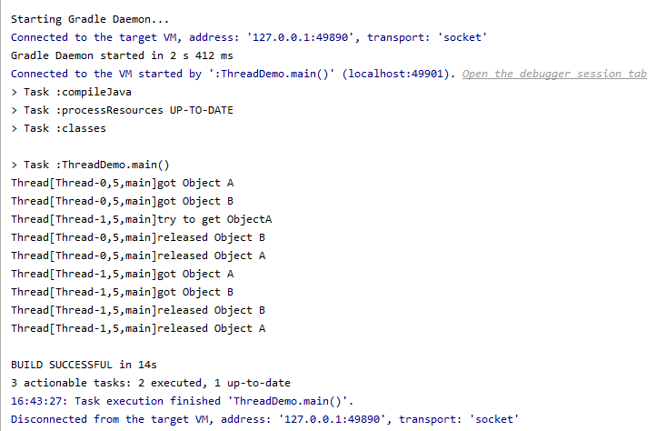
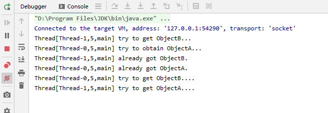

#### 浅析并发编程(一)前序

1. 线程与进程

   程序是由数据结构和算法组成的，而进程是程序关于某个数据集的一次运行活动。同时也是资源分配的最小单位，而线程是CPU调度的最小单位。在`JVM`内存模型中程序计数器、虚拟机栈、本地方法栈为每个线程所私有，线程彼此之间共享进程在堆和方法区中开辟的资源。一个进程可以包含多个线程，进程比之线程，如同一个运行中的工厂比之工厂里的工人，工人可以共享工厂中的资源。

2. 线程的创建

   线程的创建方式大致有三种: 继承Thread类、实现Runnable接口、实现Callable接口。我们先来看相应的代码，再来观察他们之间的区别。

```java
public class CreatedThread {
    
    public static class MyThread extends Thread {
        @Override
        public void run() {
            System.out.println("MyThread......");
        }
    }

    public static class MyRunnable implements Runnable {
        @Override
        public void run() {
            System.out.println("My Runnable.....");
        }
    }

    public static class MyCallable implements Callable {
        @Override
        public Object call() throws Exception {
            return "MyCallable....";
        }
    }
    
    public static void main(String[] args) throws ExecutionException, InterruptedException {

        MyThread myThread = new MyThread();
        myThread.start();

        Thread thread1 = new Thread(new MyRunnable());
        thread1.start();
        
        FutureTask futureTask = new FutureTask(new MyCallable());
        Thread thread2 = new Thread(futureTask);
        thread2.start();

        myThread.join();
        thread1.join();
        thread2.join();
        
        System.out.println(futureTask.get());
    }
    
}
```

​	执行结果为:


* 继承Thread类

  

  通过族谱图，我们就可以看到其实Thread类本身也是去实现了Runnable接口并重写了run方法。

  > The <code>Runnable</code> interface should be implemented by any class whose instances are intended to be executed by a thread. The class must define a method of no arguments called <code>run</code>.This interface is designed to provide a common protocol for objects that wish to execute code while they are active.
  

上文是来自于`JDK`中关于Runnable的解释。当打算用一个线程去执行一个类的实例的时候，该类需要去实现Runnable接口，该类必须定义一个叫做run的无参方法。Runnable这个接口被设计来去提供一个公共的协议，该协议适用于那些期望在他们活跃的时候去执行代码的对象。

* 实现Runnable接口

  

  Runnable的族谱图上可以得知，Runnable接口添加了`FunctionalInterface`注解。我们来关注一下该注解。

  >An informative annotation type used to indicate that an interface type declaration is intended to be a <i>functional interface</i> as defined by the Java Language Specification. Conceptually, a functional interface has exactly one abstract method. 
  
  上文是来自于`JDK`中关于`FunctionalInterface`的解释。这是一种信息注解类型，用于展示一种接口类型的定义。根据Java语言规格的定义，该接口类型的定义应该是一个函数接口。从概念上讲，函数接口只有一个抽象方法。我们知道该抽象方法是`run()`方法，所以带有该`@FunctionalInterface`注解的接口，只有一个抽象方法。此外，Java支持单继承多实现的方式，实现Runnable接口的方式，来创建线程，该类还可以继承其他的类，只是Runnable接口中的run方法，没有返回值。Runnable接口介绍可以查看上文。
  
* 实现Callable接口

  

  根据族谱图，Callable接口也是带有`@FunctionalInterface`注解，也就是说Callable接口只有一个抽象方法，该方法是带有返回参数的call方法。
  
  > A task that returns a result and may throw an exception.`Implementors` define a single method with no arguments called call.
  >
  > The Callable interface is similar to `java.lang.Runnable`, in that both are designed for classes whose instances are potentially executed by another thread.  A Runnable, however, does not return a result and cannot throw a checked exception.

  以上是来自`JDK`关于Callable接口的解释。这是一个有返回结果并且可能抛出异常的任务，实现者定义了一个名叫call的单一的无参方法。Callable接口和Runnable接口很类似，相似之处在于两者都是为了那些类而设计。这些类的是实例是有可能被另外的线程执行。但是Runnable接口是没有任何返回值同时也不会抛出受检异常。

3. 线程间的通知和等待

     

  * `notify` \ `notifyAll`

       > Wakes up a single thread that is waiting on this object's monitor. If any threads are waiting on this object, one of them is chosen to be awakened. The choice is arbitrary and occurs at
       > the discretion of the implementation. A thread waits on an object's monitor by calling one of the wait methods.
       
       上文是来自于`JDK`关于notify方法的解释。notify方法用于唤醒一个等待该对象Monitor锁的线程。如果任何线程正在等待该对象，其中的一个线程将会被唤醒。这个选择是随机的并且发生在自由判定的情况之下。通过调用wait系列方法中的一个，线程来等待该对象的Monitor锁。notify在此处只会起到**通知**的作用并**不会真正释放Monitor锁**，需等到相关代码执行完成才释放Monitor锁。此外，`notifyAll`是用来唤醒所有在该对象上调用wait系列方法的线程。
       
* `wait`
  
  >Causes the current thread to wait until another thread invokes the `notify()` method or the `notifyAll()` method for this object. In other words, this method behaves exactly as if it simply
  >performs the call `wait(0)`.
  >
  > The current thread must own this object's monitor. The thread releases ownership of this monitor and waits until another thread notifies threads waiting on this object's monitor to wake up either through a call to the `notify` method or the `notifyAll` method. The thread then waits until it can
  >re-obtain ownership of the monitor and resumes execution.
  >
  >As in the one argument version, interrupts and spurious wakeups are
  > possible, and this method should always be used in a loop:
  >
  ><pre>
  > synchronized (obj) {
  >   while (&lt;condition does not hold&gt;)
  >       obj.wait();
  >    ... // Perform action appropriate to condition
  > }
  ></pre>
  
  上文是来自`JDK`中关wait方法的注释。`wait`方法会导致当前线程等待直到另外一个线程关于当前对象调用了  `notify`或者`notifyAll`方法。换句话讲，当前方法wait的行为就像是该对象简单执行了wait(0)的调用。当前线程必须拥有该对象的Monitor锁。当前线程释放Monitor锁并处于等待，直到另一个线程通过调用`notify` 系列方法来通知正在等待当前对象的Monitor锁的线程。当前线程然后处于等待直到它可以重新获得Monitor锁的所有权然后继续执行。和单参数版本一样，**线程打断**和**虚假唤醒**可能发生，然后该方法应该用在循环当中。
  
  我们知道出现线程打断的情况，当前wait方法会抛出`InterruptedException`。所以我们来关注**虚假唤醒**的这种情况。
  
  ```java
  public class NotifyAndWait {
  
      static class Product {
          private  static final Integer MAX_CAPACITY = 8;
          private  Integer productSize = 0;
  
          synchronized void produce() {
  
               if (productSize>=MAX_CAPACITY) {
                   System.out.println("reach the threshold of product size");
                   try {
                       this.wait();
                   } catch (InterruptedException e) {
                       e.printStackTrace();
                   }
               }
               System.out.println(Thread.currentThread()+" ---- current product num:"+ ++productSize);
               this.notifyAll();
  
          }
  
          synchronized void consume() {
                   if (productSize<= 0) {
                       System.out.println("no product for consume");
                       try {
                           this.wait();
                       } catch (InterruptedException e) {
                           e.printStackTrace();
                       }
                   }
                   System.out.println(Thread.currentThread()+" ---- current product num:"+ --productSize);
                   this.notify();
          }
      }
  
      public static void main(String[] args) throws InterruptedException {
          Product product = new Product();
  
          Thread thread1 = new Thread(()->{
              for (int i = 0; i< Product.MAX_CAPACITY*2; i++) {
                  try {
                      Thread.sleep(100);
                  } catch (InterruptedException e) {
                      e.printStackTrace();
                  }
                  product.produce();
              }
          });
  
          Thread thread2 = new Thread(()->{
              for (int i = 0; i< Product.MAX_CAPACITY*2; i++) {
                  product.produce();
              }
          });
  
          Thread thread3 = new Thread(()->{
              for (int i=0;i<Product.MAX_CAPACITY*2;i++) {
                  product.consume();
              }
              CompletableFuture<Void> voidCompletableFuture = CompletableFuture.allOf();
              try {
                  Void aVoid = voidCompletableFuture.get();
              } catch (InterruptedException e) {
                  e.printStackTrace();
              } catch (ExecutionException e) {
                  e.printStackTrace();
              }
          });
  
          Thread thread4 = new Thread(()->{
              for (int i=0;i<Product.MAX_CAPACITY*2;i++) {
                  product.consume();
              }
          });
  
          thread1.start();
          thread2.start();
          thread3.start();
          thread4.start();
  
          thread1.join();
          thread2.join();
          thread3.join();
          thread4.join();
      }
  }
  ```
  
  
  
  这边是控制台打印的日志，可以看到库存数量已经出现负数了，出现了虚假唤醒的情况。这边根据截取的日志可以看到，`Thread[-1,5,main]`属于生产者，`Thread[-2,5,main]`和`Thread[-3,5,main]`属于消费者。首先，`Thread[-2,5,main]`和`Thread[-3,5,main]`也就是消费者先运行发现当前没有库存可供消费，两个消费者线程都在关于Product类的实例对象上调用了wait方法并释放了Monitor锁。之后，生产者`Thread[-1,5,main]` 获取了Monitor锁开始调用`produce()`方法并添加库存，每次添加库存之后调用`notifyAll()`来通知关于Product实例对象的调用了`wait()`方法的对象，这边也就是`Thread[-2,5,main]`和`Thread[-3,5,main]`。此时`Thread[-2,5,main]`和`Thread[-3,5,main]`线程已经被唤醒，只是`Thread[-1,5,main]`在这两个线程之前获取了Monitor锁并继续添加库存。当库存量达到上限，生产者线程`Thread[-1,5,main]`关于Product类的实例对象调用了`wait()`方法，于是处于被唤醒状态的`Thread[-3,5,main]`抢到了Monitor锁，并不断消费直到库存为空，直到再次调用了`wait()方法`。**就在这时，`Thread[-2,5,main]`还处于被唤醒状态，成功获取了Monitor锁，接着当时被挂起的代码行，向下执行，但是已经没有库存了，所以此时库存信息出现了负数，并且调用了`notify()`方法唤醒了在Product类的实例对象调用`wait()`被挂起的线程。** 之后也调用了`wait()`然后挂起了当前线程。我们继续看，`Thread[-2,5,main]`是跟`Thread[-3,5,main]`一起被`Thread[-1,5,main]`的这个生产者线程唤醒的，在满库存的条件下。所以当时，`Thread[-2,5,main]`是在满足被唤醒条件之下，被生产者线程唤醒。**但是，随着`Thread[-3,5,main]`不断消费库存信息直到库存未零，此时`Thread[-2,5,main]`是不满足被唤醒的条件的，却已经处于唤醒状态。**之后，从被唤醒的代码行接着执行，这就是所谓的虚假唤醒。
  
  所以，`JDK`在此处建议使用循环的方式而不是条件判断的方式来判断唤醒条件。
  
4. join方法
   
    > Waits for this thread to die.
    
    上文是来自于`JDK`关于join的解释。等待该线程终结，也就是等待`XXX.join()`该线程实例执行完成然后销毁，再继续执行当前线程也就是`Thread.currentThread()`。相关demo在上一个例子中已经找到。但其实join方法有点类似于`CountDownLatch`的功能。
    
    我们一起来看下`CountDownLatch`这个类。
    
    ```java
    public class CountDownLatchDemo {
        static Integer COUNT_DOWN_LATCH_NUM = 4;
    
        static class MyRunnable implements Runnable {
            @Override
            public void run() {
                try {
                    //模拟线程处理业务逻辑的耗时
                    Thread.sleep(1000);
                } catch (InterruptedException e) {
                    e.printStackTrace();
                }
                System.out.println(Thread.currentThread()+" is die");
            }
        }
        public static void main(String[] args) throws InterruptedException {
    		//常用的记时工具
            StopWatch stopWatch = new StopWatch("Demo");
            stopWatch.start("[test countDownLatch]");
            MyRunnable myRunnable = new MyRunnable();
            CountDownLatch countDownLatch = new CountDownLatch(COUNT_DOWN_LATCH_NUM);
            for (int i=0;i<COUNT_DOWN_LATCH_NUM;i++) {
                Thread thread = new Thread(myRunnable);
                thread.start();
                while (true) {
                    if (!thread.isAlive()) {
                        countDownLatch.countDown();
                        break;
                    }
                }
            }
            countDownLatch.await();
            stopWatch.stop();
            System.out.println(stopWatch.prettyPrint());
        }
    }
    ```
    
    `CountDownLatch`在创建该对象的时候需要对于count赋初值作未门闩值，每次完成一项子任务就调用`countDown()`方法将门闩值减去一。调用`await()`方法将会使当前线程处于等待，直到门闩值为0。所以，每一个Thread实例对象执行完之后该线程实例不再存活此时门闩值减一。而`await()`方法执行之后，此时发现门闩值为0，故不用等待。所以，就使得当前线程处于等待直到满足条件之后再继续执行的性质，`CountDownLatch`与`join()`有点类似。
    
    
    
5. sleep方法
    >Causes the currently executing thread to sleep (temporarily cease execution) for the specified number of milliseconds, subject to the precision and accuracy of system timers and schedulers. The thread does not lose ownership of any monitors.

    以上来自于`JDK`的解释。导致当前正在执行的线程在指定的时间内睡眠，睡眠时间受制于系统计时器的和调度器的精度和准确度。当前线程不会失去Monitor锁的所有权。如果当前线程被打断，则会抛出`InterruptedException`。

    我们简单来验证一下sleep方法的不会去释放Monitor锁的这一个特性。

    ```java
    public class ThreadDemo {
    
        private static final Object objectA = new Object();
        private static final Object objectB = new Object();
    
        public static void main(String[] args) throws InterruptedException {
            Thread thread1 = new Thread(() -> {
                synchronized (objectA) {
                    System.out.println(Thread.currentThread() + "got Object A");
                    synchronized (objectB) {
                        System.out.println(Thread.currentThread() + "got Object B");
                        try {
                            Thread.sleep(5000);
                        } catch (InterruptedException e) {
                            e.printStackTrace();
                        }
                    }
                    System.out.println(Thread.currentThread() + "released Object B");
                }
                System.out.println(Thread.currentThread() + "released Object A");
            });
    
            Thread thread2 = new Thread(() -> {
                try {
                    //delay current thread
                    Thread.sleep(2000);
                } catch (InterruptedException e) {
                    e.printStackTrace();
                }
                System.out.println(Thread.currentThread()+"try to get ObjectA");
                synchronized (objectA) {
                    System.out.println(Thread.currentThread() + "got Object A");
                    synchronized (objectB) {
                        System.out.println(Thread.currentThread() + "got Object B");
                    }
                    System.out.println(Thread.currentThread() + "released Object B");
                }
                System.out.println(Thread.currentThread() + "released Object A");
            });
            thread1.start();
            thread2.start();
            thread1.join();
            thread2.join();
        }
    }
    ```

    

    当`Thread[Thread-0,5,main]`获取了`ObjectA`和`ObjectB`两个对象之后调用了`sleep()`之后，**让出CPU**并处于阻塞状态但是**没有让出这两个对象的Monitor锁**。当`Thread[Thread-1,5,main]`尝试去获取`ObjectA`的Monitor锁的时候被阻塞，`Thread[Thread-0,5,main]`sleep时间到了之后，从**阻塞状态变成可运行状态**，执行完代码释放了对象的Monitor锁，此时`Thread[Thread-1,5,main]`拿到Monitor锁并处于可运行状态，CPU调度完成相关任务执行结束。

6. yield方法

   >A hint to the scheduler that the current thread is willing to yield
   >its current use of a processor. The scheduler is free to ignore this
   >hint.
   >Yield is a heuristic attempt to improve relative progression
   >between threads that would otherwise over-utilise a CPU. Its use
   >should be combined with detailed profiling and benchmarking to
   >ensure that it actually has the desired effect.
   >It is rarely appropriate to use this method. It may be useful
   >for debugging or testing purposes, where it may help to reproduce
   >bugs due to race conditions. It may also be useful when designing
   >concurrency control constructs such as the ones in the
   >`java.util.concurrent.locks` package.

   以上是来自与`JDK`中关于yield方法的解释。yield方法会给到调度器（CPU）一个提示，该提示是当前线程愿意让出它正在使用的处理器，调度器完全可以忽略这个提示。yield方法是一个改善在线程之间避免过度使用CPU的相对级数的启发性的尝试。它应该与详细的分析和基准来结合使用，以此来达到期望中的效果。当前方法很少被使用，出于调试和测试的目的，在这样的情况下该方法有助于重现因为竞争条件产生的bug。当设计并发控制来构造`java.util.concurrent.locks`包下的案例的时候，yield方法也可能会有帮助。

   我们在代码中来进一步了解这个方法。

   ```java
   public class YieldDemo {
   
       static class YieldRunnable implements Runnable {
           @Override
           public void run() {
               IntStream.rangeClosed(0,10).forEach(item->{
                   if (item==5) {
                       Thread.yield();
                       System.out.println(Thread.currentThread()+"yield cpu....");
                   }
               });
               System.out.println(Thread.currentThread()+"is over.");
           }
       }
       public static void main(String[] args) throws InterruptedException {
           YieldRunnable yieldRunnable = new YieldRunnable();
           Thread thread1 = new Thread(yieldRunnable);
           Thread thread2 = new Thread(yieldRunnable);
           Thread thread3 = new Thread(yieldRunnable);
   
           thread1.start();
           thread2.start();
           thread3.start();
   
           thread1.join();
           thread2.join();
           thread3.join();
           System.out.println("main thread is over.");
       }
   }
   ```
   
   
   
   `YieldRunnable`类中在run方法中，`foreach`的遍历方法体里面调用yield方法。`Thread[Thread-2,5,main]`的表现形式是调用了yield方法放弃CPU分配的剩余时间片并处于可运行状态，且与其他线程一同竞争CPU的调度，并且再次被调用，接着执行完剩余代码。`Thread[Thread-0,5,main]`和`Thread[Thread-1,5,main]`在调用并没有接着被CPU调度。所以，yield方法只是放弃当前的CPU分配的剩余时间片，线程的状态由运行中变成可运行状态，然后与其他线程一起竞争，可能会被再次调用也可能不会。
7. 线程中断
    
   
   线程中断的方法如图，`interrupt()`实例方法、`interrupted()`类方法、`isInterrupted()`实例方法、`isInterrupted(boolean ClearInterrupted)`作为私有方法供前面的方法调用这边就展示不考虑这个方法了。
* `interrupt()`

  > Interrupts this thread. Unless the current thread is interrupting itself, which is always permitted, the `checkAccess` method of this thread is invoked, which may cause a `SecurityExceSeption` to be thrown. If this thread is blocked in an invocation of the wait(), wait(long), or wait(long, int) methods of the Object class, or of the join(), join(long),join(long, int),sleep(long), or sleep(long, int),methods of this class, then its interrupt status will be cleared and it will receive an `InterruptedException`. If this thread is blocked in an I/O operation upon an `InterruptibleChannel` then the channel will be closed, the thread's interrupt status will be set, and the thread will receive a `java.nio.channels.ClosedByInterruptException`. If this thread is blocked in a `java.nio.channels.Selector` then the thread's interrupt status will be set and it will return immediately from the selection operation, possibly with a non-zero value, just as if the selector's `java.nio.channels.Selector` wakeup method were invoked.

  以上是来自于`JDK`的解释。打断当前线程，除非当前线程正在打断他自己，否则该打断总是被允许的。当前线程的`checkAccess`方法被调用，可能会抛出`SecurityExceSeption`。如果当前线程调用了Object类的wait系列方法或者该类下的join系列方法、sleep系列方法被阻塞了，interrupt方法会使得该线程的打断状态被清除并返回`InterruptedException`。如果该线程在I/O操作上被`InterruptibleChannel` 阻塞，然后管道将会关闭，线程会被设置中断状态，该线程也会收到`ClosedByInterruptException`。如果该线程在`java.nio.channels.Selector`被阻塞，当前线程会被设置打断状态。并且立即从选择操作中返回，此外可能携带非空的值，就像调用了选择器的唤醒方法。
  上面讲了这么多，无非要注意的点就是**打断该线程**、**打断状态**这两个关键点。

* `interrupted()`
  
  > Tests whether the current thread has been interrupted.  The interrupted status of the thread is cleared by this method.  In other words, if this method were to be called twice in succession, the second call would return false (unless the current thread were interrupted again, after the first call had cleared its interrupted status and before the second call had examined it).
  
  以上是来自与`JDK`的解释。测试当前线程是否已经被打断，当前方法将会**清除该线程的打断状态**。换句话说，如果当前方法被连续调用调用两次，第二次调用将会返回false（除非当前线程在第一次调用该方法，清除了它的打断状态之后且在第二次调用该方法再次检查之前，被再一次打断。）
  
* `isInterrupted()`

  > Tests whether this thread has been interrupted. The <i>interrupted
  >status</i> of the thread is unaffected by this method.

  以上是来自于`JDK`的解释。测试当前线程是否已经被打断，**该方法不会影响线程的打断状态**。

  由于上面三个方法都提到了**打断线程**和**线程的打断状态**，我们一起通过代码的方式来看下他们的关系。

  ```java
  public class InterruptDemo {
      public static void main(String[] args) {
  
          Thread threadA = new Thread(() -> {
              IntStream.rangeClosed(1,10).forEach(item->{
                  System.out.println("print number:"+item);
                  try {
                      Thread.sleep(item);
                  } catch (InterruptedException e) {
  
                      System.out.println("[inner]time to invoke Thread.interrupted()");
                      Thread.currentThread().interrupt();
                      System.out.println(Thread.currentThread()+" status:"+Thread.currentThread().isInterrupted());
                      System.out.println(Thread.currentThread()+" status:"+Thread.interrupted());
                      System.out.println(Thread.currentThread()+" status:"+Thread.currentThread().isInterrupted());
  
  
                  }
              });
          });
          threadA.start();
          System.out.println(threadA+"original status:"+threadA.isInterrupted());
          System.out.println(Thread.currentThread()+"original status:"+Thread.currentThread().isInterrupted());
  
          System.out.println("time to invoke interrupt()");
          threadA.interrupt();
          System.out.println(threadA+"stage1 status:"+threadA.isInterrupted());
          System.out.println(Thread.currentThread()+"stage1 status:"+Thread.currentThread().isInterrupted());
  
  
          System.out.println("[outter]time to invoke Thread.interrupted()");
          System.out.println(Thread.currentThread()+" status:"+Thread.currentThread().isInterrupted());
          System.out.println(Thread.currentThread()+" status:"+Thread.interrupted());
          System.out.println(Thread.currentThread()+" status:"+Thread.currentThread().isInterrupted());
  
      }
  }
  ```
  

  从日志中可以看出，`isInterrupted()`方法是判断该线程是否被打断，若未被打断返回值为false。当某线程实例调用了`interrupt()`方法，对应的线程实例的`isInterrupted()`返回为true否则为false。而`Thread.interrupted()`则比较特殊，该方法首先获取当前线程，然后调用`isInterrupted(true)`,**在调用完毕之后会清除打断的状态标识**，也就是将打断标识重置为false。而`isInterrupted()`方法调用的是`isInterrupted(false)`方法，不会清除对应线程实例的打断标识。这也就解释了为什么线程`[Thread-0,5,main]`前两次打断标识为true，而最后一次打断标识为false。

8. 上下文切换

   一般来说，我们创建的线程数是多于CPU数的，一个CPU在同一时刻只会执行一个线程。为了充分利用CPU，人们想到了并发去执行，也就是给人感觉线程在同时执行，每个线程会被分配对应的时间片。当时间片用完之后，该线程的状态将会由运行状态变为就绪状态。而为了保证该线程下次获得时间片可以继续执行当前任务，该线程的程序计数器中则保存了下一条代码指令的地址，具体内容可以查看本人写的`浅析JVM系列文章`。

9. 死锁

* 死锁的定义

   一般是指**两个或两个以上的线程**在执行过程中，由于**竞争资源**而造成的一种**阻塞**的现象。

* 死锁的条件
  
  * 互斥条件：同一时刻，一个资源只能被一个线程所占有，如果其他线程也请求该资源只能等待。
  
  * 请求并持有条件：当前线程已经持有资源，同时请求另外的资源且该资源被其他线程所占有，造成当前线程阻塞，但不释放持有资源。
  
  * 不可剥夺条件：当前线程在持有的资源未使用完之前不会释放该资源。
  
  * 环路等待条件: 线程死锁时，发生线程资源请求之间发生环形链的关系{A,B,C,D.....Z}，A等待B持有的资源，B等待C持有的资源......Z等待A持有的资源。
  
  我们通过一个简单的死锁的例子来理解死锁发生的这四个条件。
  
  ```java
  public class DeadLockDemo {
  
      private static Object objectA = new Object();
      private static Object objectB = new Object();
  
      public static void main(String[] args) throws InterruptedException {
  
  
          Thread threadA = new Thread(() -> {
              System.out.println(Thread.currentThread() + " try to obtain ObjectA...");
              synchronized (objectA) {
                  System.out.println(Thread.currentThread() + " already got ObjectA.");
                  try {
                      Thread.sleep(2000);
                  } catch (InterruptedException e) {
                      e.printStackTrace();
                  }
                  System.out.println(Thread.currentThread() + " try to get ObjectB....");
                  synchronized (objectB) {
                      System.out.println(Thread.currentThread() + "finish assignment.");
                  }
              }
          });
  
  
          Thread threadB = new Thread(()->{
              System.out.println(Thread.currentThread()+" try to get ObjectB...");
              synchronized (objectB) {
                  System.out.println(Thread.currentThread()+" already got ObjectB.");
                  try {
                      Thread.sleep(2000);
                  } catch (InterruptedException e) {
                      e.printStackTrace();
                  }
                  System.out.println(Thread.currentThread()+" try to get ObjectA....");
                  synchronized (objectA) {
                      System.out.println(Thread.currentThread()+" finish assignment.");
                  }
              }
          });
          threadA.start();
          threadB.start();
          threadA.join();
          threadB.join();
      }
  }
  ```
  
  
  
  这样死锁就形成了，那么我们对照形成死锁的四个条件。每个对象都有之对应的Monitor锁，保证同一时刻只有一个线程可以访问该对象，这边体现的是死锁中的互斥条件。在本例中`Thread[Thread-1,5,main]`获取了`ObjectB`Monitor锁之后，开始尝试访问`ObjectA`的Monitor锁。此时，`ObjectA`的Monitor锁已经被`Thread[Thread-0,5,main]`获取，造成`Thread[Thread-1,5,main]`阻塞，但该线程并不释放`ObjectB`的Monitor锁，这边满足死锁中的持有并请求条件。`Thread[Thread-1,5,main]`等待`Thread[Thread-0,5,main]`手中的`ObjectA`Monitor锁。对应的，`Thread[Thread-0,5,main]`等待`Thread[Thread-1,5,main]`手中的`ObjectB`Monitor锁，刚好形成一个闭环，此处满足死锁中环路等待条件。至于不可剥夺条件，我们再用一个例子来观察一下。
  
  ```java
  public class DeadLockDemo {
  
      private static Object objectA = new Object();
      private static Object objectB = new Object();
  
      public static void main(String[] args) throws InterruptedException {
  
  
          Thread threadA = new Thread(() -> {
              System.out.println(Thread.currentThread() + " try to obtain ObjectA...");
              synchronized (objectA) {
                  System.out.println(Thread.currentThread() + " already got ObjectA.");
                  try {
                      Thread.sleep(2000);
                  } catch (InterruptedException e) {
                      System.out.println("threadA has been interrupted successfully.");
                      e.printStackTrace();
                  }
                  System.out.println(Thread.currentThread() + " try to get ObjectB....");
                  synchronized (objectB) {
                      System.out.println(Thread.currentThread() + "finish assignment.");
                  }
              }
          });
  
  
          Thread threadB = new Thread(()->{
              System.out.println(Thread.currentThread()+" try to get ObjectB...");
              synchronized (objectB) {
                  System.out.println(Thread.currentThread()+" already got ObjectB.");
                  try {
                      Thread.sleep(2000);
                  } catch (InterruptedException e) {
                      System.out.println("threadB has been interrupted successfully.");
                      e.printStackTrace();
                  }
                  System.out.println(Thread.currentThread()+" try to get ObjectA....");
                  synchronized (objectA) {
                      System.out.println(Thread.currentThread()+" finish assignment.");
                  }
              }
          });
          threadA.start();
          threadB.start();
          Thread.sleep(3000);
          System.out.println("main thread try to interrupt threadA & threadB.");
          threadA.interrupt();
          threadB.interrupt();
  
          threadA.join();
          threadB.join();
      }
  }
  ```
  
  
  
  将`DeadLock`类简单修改一下，阻塞主线程确保两个线程都拿到对应对象的Monitor锁之后，主线程尝试打断两个线程，但死锁仍在进行。此处两个线程在未使用完对应的对象资源之前不释放其Monitor锁，满足死锁中的第三个条件不可剥夺条件，故此当前死锁满足四个基本条件。
  
* 如何避免死锁

   避免死锁无非是打破死锁的4个必要条件其中之一。而在当前的例子中，可以切实可行的方案也就是打破请求并持有条件和环路等待条件。相对比较好的避免死锁的方式就是按照顺序请求资源，也就是保证资源申请的有序性，以此来打破环路等待条件和请求并持有条件。我们再用一个例子展示资源的请求的有序性。

   ```java
   public class BreakDeadLockDemo {
   
       private static Object objectA = new Object();
       private static Object objectB = new Object();
   
       public static void main(String[] args) throws InterruptedException {
   
           Thread threadA = new Thread(() -> {
               System.out.println(Thread.currentThread() + " try to obtain ObjectA...");
               synchronized (objectA) {
                   System.out.println(Thread.currentThread() + " already got ObjectA.");
                   try {
                       Thread.sleep(2000);
                   } catch (InterruptedException e) {
                       System.out.println("threadA has been interrupted successfully.");
                       e.printStackTrace();
                   }
                   System.out.println(Thread.currentThread() + " try to get ObjectB....");
                   synchronized (objectB) {
                       System.out.println(Thread.currentThread() + "finish assignment.");
                   }
               }
           });
   
           Thread threadB = new Thread(()->{
               System.out.println(Thread.currentThread()+" try to get ObjectA...");
               synchronized (objectA) {
                   System.out.println(Thread.currentThread()+" already got ObjectA.");
                   try {
                       Thread.sleep(2000);
                   } catch (InterruptedException e) {
                       System.out.println("threadB has been interrupted successfully.");
                       e.printStackTrace();
                   }
                   System.out.println(Thread.currentThread()+" try to get ObjectB....");
                   synchronized (objectB) {
                       System.out.println(Thread.currentThread()+" finish assignment.");
                   }
               }
           });
           threadA.start();
           threadB.start();
           threadA.join();
           threadB.join();
       }
   }
   ```

   

   如图，`Thread[Thread-0,5,main]`和`Thread[Thread-1,5,main]`按照顺序依次来获取`ObjectA`和`ObjectB`的Monitor锁，没有形成闭环，此处打破环路等待条件。`Thread[Thread-1,5,main]`尝试获取`ObjectA`的Monitor锁，但是该对象已经被`Thread[Thread-0,5,main]`所占有，导致当前线程阻塞。而`Thread[Thread-1,5,main]`此时并没有持有对象，所以此处打破请求并持有条件。


10. `ThreadLocal`和`InheritableThreadLocal`

    **注:考虑到篇幅原因`ThreadLocal`和`InheritableThreadLocal`的底层源码分析会单独在新的篇章中阐述。**

    在多线程中，经常出现多个线程访问同一个变量，此时需要面临线程安全问题。针对线程安全问题，除了使用锁的方式来保证同一时刻只有一个线程访问该变量。另外一种思路是每个线程访问自己所拥有的该变量，此时需要用到`ThreadLocal`。通过`ThreadLocal`，线程访问该变量在本地的副本，线程访问自己拥有的本地变量，使用**线程之间的隔离性**和**同线程内部不同方法之间传递性**，以此来避免线程安全问题。我们用一个例子来展示`ThreadLocal`在该方面的特性。
    
  * `ThreadLocal`线程间隔离性

    ```java
    public class ThreadLocalDemo1 {
        private static ThreadLocal<String> threadLocal = new ThreadLocal<>();
        public static void main(String[] args) throws InterruptedException {
            Thread threadA = new Thread(() -> {
                doPrintInfo("threadA","threadAValue");
            });
            Thread threadB = new Thread(() -> {
                doPrintInfo("threadB","threadBValue");
            });
            threadA.start();
            threadB.start();
            threadA.join();
            threadB.join();
        }
        
        static void doPrintInfo(String threadName,String localInfo) {
            System.out.println("["+threadName+"]threadLocal original info:"+threadLocal.get());
            threadLocal.set(localInfo);
            System.out.println("["+threadName+"]threadLocal info:"+threadLocal.get());
            threadLocal.remove();
            System.out.println("["+threadName+"]after remove value:"+threadLocal.get());
        }
    }
    ```
    
    
     这边我们可以看到`threadA`和`threadB`两个线程此处对`threadLocal`变量进行赋值，并没有影响对方关于该变量的使用，两者都在操作该变量在自己本地的副本。

  * `ThreadLocal`的不可继承性和`InheritableThreadLocal`

    ```java
    public class ThreadLocalDemo2 {
    
        public static void main(String[] args) throws InterruptedException {
            ThreadLocal<String> threadLocal = new ThreadLocal<>();
            InheritableThreadLocal<String> inheritableThreadLocal = new InheritableThreadLocal<>();
            threadLocal.set("threadLocal--value1");
            inheritableThreadLocal.set("inheritableThreadLocal--value2");
            Thread threadA = new Thread(() -> {
                System.out.println("[inner thread]:"+threadLocal.get());
                System.out.println("[inner thread]:"+inheritableThreadLocal.get());
            });
            threadA.start();
            threadA.join();
            System.out.println("[main thread]:"+threadLocal.get());
            System.out.println("[main thread]:"+inheritableThreadLocal.get());
        }
    }
    ```
    
    
    
    该例子中，在主线程内部创建了`threadA`，而`InheritableThreadLocal`继承于`ThreadLocal`类，弥补了`ThreadLocal`父子线程不可继承的问题。
    
  * `ThreadLocal`的应用

    `ThreadLocal`的应用是根据`ThreadLocal`本身的特性而来的，`ThreadLocal`的特性有**线程之间的隔离性**、**同线程内部不同方法之间的传递性**。
    
    **线程之间的隔离性**的典型应用就是关于线程不安全的`SimpleDateFormat`类的使用，我们来看一个例子。
    
    ```java
    public class ThreadLocalDemo3 {
    
        public static void main(String[] args) {
            ExecutorService executorService = Executors.newFixedThreadPool(100);
            ThreadLocal<SimpleDateFormat> simpleDateFormatThreadLocal = ThreadLocal.withInitial(()->
                    new SimpleDateFormat("yyyy-MM-dd HH:mm:ss"));
            //SimpleDateFormat simpleDateFormat = new SimpleDateFormat("yyyy-MM-dd HH:mm:ss");
            for (int i=0;i<1000;i++) {
                executorService.submit(()->{
                    try  {
                        String dateString =  simpleDateFormatThreadLocal.get().format(new Date(Math.abs(new Random().nextLong())));
                        System.out.println(dateString);
                    } catch (Exception e) {
                        e.printStackTrace();
                        System.exit(1);
                    }
                });
            }
            executorService.shutdown();
            try {
                if (!executorService.awaitTermination(10, TimeUnit.SECONDS)) {
                    executorService.shutdownNow();
                }
            } catch (InterruptedException e) {
                executorService.shutdownNow();
                e.printStackTrace();
            }
            System.out.println("done!");
    
        }
    }
    ```
    
    
    
    这样关于每个线程都有自己对应的`SimpleDateFormat`类的实例，并未出现异常。
    
    关于**同线程内部不同方法之间的传递性**，我们一起再来看一个例子。
    
    ```java
    public class ThreadLocalDemo4 {
    
        static ThreadLocal<User> threadLocal = new ThreadLocal<>();
        static class User {
            private String userName;
            public String getUserName() {
                return userName;
            }
            public void setUserName(String userName) {
                userName = userName;
            }
            @Override
            public String toString() {
                return "User{" +
                        "userName='" + userName + '\'' +
                        '}';
            }
            public User(String userName) {
                this.userName = userName;
            }
        }
        static class Service1 {
            void doWork(User user) {
                //stimulate business operation
                try {
                    Thread.sleep(1000);
                } catch (InterruptedException e) {
                    e.printStackTrace();
                }
                threadLocal.set(user);
                System.out.println(Thread.currentThread().getName()+"  service1 got "+threadLocal.get());
                new Service2().doWork();
            }
        }
    
        static class Service2 {
            void doWork() {
                try {
                    Thread.sleep(1000);
                } catch (InterruptedException e) {
                    e.printStackTrace();
                }
                System.out.println(Thread.currentThread().getName()+"  service1 got "+threadLocal.get());
                threadLocal.remove();
            }
        }
    
        public static void main(String[] args) {
            Thread threadA = new Thread(() -> {
                User user = new User(Thread.currentThread().getName());
                new Service1().doWork(user);
            });
            Thread threadB = new Thread(() -> {
                User user = new User(Thread.currentThread().getName());
                new Service1().doWork(user);
            });
            threadA.start();
            threadB.start();
        }
    }
    ```
    
    
    
    这边先定义一个User的静态内部类，然后定义两个Service类用来模拟实际的业务逻辑。由于`ThreadLocal`具有相同线程内部不同方法之间的传递性。所以，当`Service1`调用`Service2`的业务逻辑时**不需要传入参数**，**因为这两套业务逻辑由同一线程完成执行**。而`ThreadA`和`ThreadB`两者结果互不干扰，是`ThreadLocal`线程之间隔离性造成的。
    
    至于`ThreadLocal`和`InheritableThreadLocal`底层源码分析我们在另一篇文章来展开。

