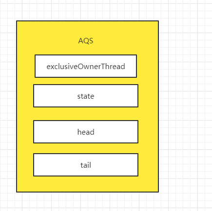

#### 浅析并发编程(七)RenntrantLock源码分析

1. 定义

在看`ReentrantLock`之前，我们先来看一个Lock的接口，而为了更好的了解Lock。我们先来看Lock的类图。


从图上可以看到，Lock本身作为一个同步工具的接口，其内部提供了加锁、解锁、尝试获取锁等方法。

我们继续来看ReentrantLock的类图。


因为在**浅析并发编程(六)AQS源码分析(一)独占锁模式**中有讲过AQS的类图，所以`ReentrantLock`的类图看起来并不陌生。ReentrantLock实现了Lock接口的加锁、解锁、尝试获取锁等抽象方法，并将这些接口的实现方式交给了其内部类`Sync`去实现，`Sync`继承自AQS，并拥有俩个子类`FairSync`、`NonfairSync`，这也使得`ReentrantLock`具备了公平锁和非公平锁的模式。

2. 公平锁和非公平锁

为了更好的帮助理解ReentrantLock中的公平锁和非公平锁，我们一起来看以下代码。

* 2.1非公平锁

```java
static final class NonfairSync extends Sync {
    private static final long serialVersionUID = 7316153563782823691L;
    final void lock() {
        if (compareAndSetState(0, 1))
            setExclusiveOwnerThread(Thread.currentThread());
        else
            acquire(1);
    }

    protected final boolean tryAcquire(int acquires) {
        return nonfairTryAcquire(acquires);
    }
}

final boolean nonfairTryAcquire(int acquires) {
    final Thread current = Thread.currentThread();
    int c = getState();
    if (c == 0) {
        if (compareAndSetState(0, acquires)) {
            setExclusiveOwnerThread(current);
            return true;
        }
    }
    else if (current == getExclusiveOwnerThread()) {
        int nextc = c + acquires;
        if (nextc < 0)
            throw new Error("Maximum lock count exceeded");
        setState(nextc);
        return true;
    }
    return false;
}
```

* 2.2公平锁

```java
    static final class FairSync extends Sync {
        private static final long serialVersionUID = -3000897897090466540L;

        final void lock() {
            acquire(1);
        }
        protected final boolean tryAcquire(int acquires) {
            final Thread current = Thread.currentThread();
            int c = getState();
            if (c == 0) {
                if (!hasQueuedPredecessors() &&
                    compareAndSetState(0, acquires)) {
                    setExclusiveOwnerThread(current);
                    return true;
                }
            }
            else if (current == getExclusiveOwnerThread()) {
                int nextc = c + acquires;
                if (nextc < 0)
                    throw new Error("Maximum lock count exceeded");
                setState(nextc);
                return true;
            }
            return false;
        }
    }
```

从上述两处代码可以看出，`FairSync`、`NonfairSync`不同的方法在于`lock()`和`tryAcquire(int acquires)`方法的实现，**所以公平锁和非公平锁的显著的差异在于获取锁的方式上**。

* 2.3公平锁和非公平锁的创建

公平锁和非公平锁的创建方式比较简单，代码如下。

```java
//公平锁
ReentrantLock fairLock = new ReentrantLock(true);
//非公平锁
ReentrantLock unfairLock = new ReentrantLock();
//通过其内部构造方法可以看出，ReentrantLock其默认生成非公平锁，只有显示定义参数为true
//才会创建公平锁，这样做的目的是为了提高效率。在下文当中会展开讲解。
public ReentrantLock() {
    sync = new NonfairSync();
}
public ReentrantLock(boolean fair) {
    sync = fair ? new FairSync() : new NonfairSync();
}
```

+ 2.4非公平锁和公平锁加解锁流程

  + 非公平锁加锁

    ```java
    final void lock() {
        //当非公平锁加锁的时候，首先尝试是否能使用CAS将state值从0置为1，如果可以
        //则将exclusiveOwnerThread指向当前线程表示获取锁成功。
        if (compareAndSetState(0, 1))
            setExclusiveOwnerThread(Thread.currentThread());
        else
            //否则进入acquire方法
    		acquire(1);
    }
    //此处传参值为1，由公平锁和非公锁的对比可知，公平锁和非公平锁的主要区别在于lock和tryAcquire
    public final void acquire(int arg) {
        if (!tryAcquire(arg) &&
            acquireQueued(addWaiter(Node.EXCLUSIVE), arg))
            selfInterrupt();
    }
    protected final boolean tryAcquire(int acquires) {
          return nonfairTryAcquire(acquires);
    }
    
    //从这边的代码可以看出，当一个线程尝试获取ReentrantLock的非公平锁的时候，首先会使用
    //CAS尝试将state值置为1，失败之后进入tryAcquire之后，还会尝试使用CAS去获取锁。
    //后一次尝试是为性能的优化，确保当前线程暂时不能获取锁之后，才会将当前节点生成Node节点
    //之后插入CLH链表。如果对于CLH链表不熟悉的同学
    //可以前去学习一下浅析并发编程(六)AQS源码分析(一)独占锁模式。
    //而如果当exclusiveOwnerThread已经指向当前线程，则当前属于ReentrantLock的重入模式。
    //state值自增即可。
    final boolean nonfairTryAcquire(int acquires) {
        final Thread current = Thread.currentThread();
        int c = getState();
        if (c == 0) {
            if (compareAndSetState(0, acquires)) {
                setExclusiveOwnerThread(current);
                return true;
            }
        }
        else if (current == getExclusiveOwnerThread()) {
            int nextc = c + acquires;
            if (nextc < 0)
                throw new Error("Maximum lock count exceeded");
            setState(nextc);
            return true;
        }
        return false;
    }
    
    //这边的代码已经在AQS中讲过，此处再复习一遍。
    //用当前线程生成Node节点，当CLH链表中有节点，直接使用CAS将当前节点尾插法到CLH链表中
    //由于每次CAS，只会有一个节点可以成功插入CLH中。所以当出现线程竞争之后，对于其实CAS失败的节点
    //进入enq()方法进行兜底。
    private Node addWaiter(Node mode) {
        Node node = new Node(Thread.currentThread(), mode);
        Node pred = tail;
        if (pred != null) {
            node.prev = pred;
            if (compareAndSetTail(pred, node)) {
                pred.next = node;
                return node;
            }
        }
        enq(node);
        return node;
    }
    //enq该方法一式两用。
    //1. 当CLH链表中没有节点时，此时初始化将head指针指向空节点，
    //之后再将当前节点使用尾插法插入到CLH链表中。
    //2. 当出现线程竞争的时候，在循环中每次通过CAS将当前节点插入CLH链表中。
    private Node enq(final Node node) {
        for (;;) {
            Node t = tail;
            if (t == null) {
                if (compareAndSetHead(new Node()))
                    tail = head;
            } else {
                node.prev = t;
                if (compareAndSetTail(t, node)) {
                    t.next = node;
                    return t;
                }
            }
        }
    }
    
    //该方法是公共的，在浅析并发编程(六)AQS源码分析(一)独占锁模式中也详细提到过。
    //当当前节点插入到CLH链表中之后，对于CLH链表中第一个节点将会再次尝试获取线程。
    //因为当前是非公平锁的情况，所以在tryAcquire中，直接尝试使用CAS将state值赋值为1。
    //而不关心，当前CLH链表中是否有节点正在排队。
    //而当当前节点或者锁之后，清空当前节点。head指针向后移动，对于其他线程或者是当前变成获取锁失败
    //之后。将前驱节点status值置为SIGNAL，之后park当前线程。
    //而当当前线程被打断或者被唤醒之后，将会重置线程状态，并记录线程是否被打断的记录。
    //之后继续判断当前线程是否是CLH中第一个等待的节点，如此循环。
    //执行完之后，又因为acquireQueued在执行过程中不对线程打断做出反应，所以failed为false
    //也就不会执行到cancelAcquire方法中。
    final boolean acquireQueued(final Node node, int arg) {
        boolean failed = true;
        try {
            boolean interrupted = false;
            for (;;) {
                final Node p = node.predecessor();
                if (p == head && tryAcquire(arg)) {
                    setHead(node);
                    p.next = null;
                    failed = false;
                    return interrupted;
                }
                if (shouldParkAfterFailedAcquire(p, node) &&
                    parkAndCheckInterrupt())
                    interrupted = true;
            }
        } finally {
            if (failed)
                cancelAcquire(node);
        }
    }
    //最后根据acquireQueued的返回值，决定是否需要打断当前线程，补偿线程被中断的状态。
    static void selfInterrupt() {
        Thread.currentThread().interrupt();
    }
    ```

  + 公平锁的加锁流程

    之前已经讲过，公平锁和非公平锁的主要区别在于`lock()`、`tryAcquire()`也就是加锁流程上的区别。

    ```java
    //公平锁加锁入口
    final void lock() {
      acquire(1);
    }
    //在公平锁中acquire入参值为1，公平锁没有像非公平锁一上来，就直接使用CAS尝试获取锁。
    //而是调用了tryAcquire方法，公平锁和非公平锁各自实现了该方法。
    //两者的主要差别在于非公平锁只要state状态值为0，就尝试获取锁。
    //而公平锁需要当前state值为0并且CLH链表中，当前节点是第一个等待获取锁的线程节点。
    //而当tryAcquire返回false时，将当前线程生成Node节点插入到CLH链表中。
    public final void acquire(int arg) {
        if (!tryAcquire(arg) &&
            acquireQueued(addWaiter(Node.EXCLUSIVE), arg))
            selfInterrupt();
    }
    
    //公平锁尝试获取锁，首先当state值为0，并且满足hasQueuedPredecessors方法
    //CLH链表中没有线程在当前线程节点之前，因为tryAcquire方法获取锁存在线程竞争的情况。
    //当前使用CAS的方式将state值从0变为待更新值，在当前案例中该值为1。
    //然后将exclusiveOwnerThread指向当前线程。
    //而如果exclusiveOwnerThread已经指向当前线程，当前为锁重入状态，
    //state值计数器加一。
    protected final boolean tryAcquire(int acquires) {
        final Thread current = Thread.currentThread();
        int c = getState();
        if (c == 0) {
            if (!hasQueuedPredecessors() &&
                compareAndSetState(0, acquires)) {
                setExclusiveOwnerThread(current);
                return true;
            }
        }
        else if (current == getExclusiveOwnerThread()) {
            int nextc = c + acquires;
            if (nextc < 0)
                throw new Error("Maximum lock count exceeded");
            setState(nextc);
            return true;
        }
        return false;
    }
    //查看CLH链表中head指针的下一个节点，也就是CLH链表中第一个排队等待获取锁的线程
    //是否是当前线程。
    public final boolean hasQueuedPredecessors() {
        Node t = tail;
        Node h = head;
        Node s;
        return h != t &&
            ((s = h.next) == null || s.thread != Thread.currentThread());
    }
    //该方法已经见过很多遍了，在当前案例中，首先将nextWaiter置为EXCLUSIVE，表示新增一个
    //独占锁模式的节点，然后使用尾插法将当前节点插入到CLH链表中，由于CAS算法的预期值指向
    //先前的tail指针的原因，所以只有一个节点使用插入了CLH链表中，但是在此处存在线程竞争的情况，
    //这也就是为什么需要enq()方法的作为兜底的原因了。
    private Node addWaiter(Node mode) {
        Node node = new Node(Thread.currentThread(), mode);
        Node pred = tail;
        if (pred != null) {
            node.prev = pred;
            if (compareAndSetTail(pred, node)) {
                pred.next = node;
              return node;
            }
      }
        enq(node);
      return node;
    }
    //看完addWaiter方法之后，也就不难理解为什么enq方法中是一个循环+ CAS的组合了。
    //在当前案例中，能进到enq方法的存在两种情况。
    //1. 当前锁已经被占用，CLH链表中尚没有节点，此时需要对CLH链表初始化，使用CAS算法，将head
    //指向空节点，并更新尾结点。在插入CLH链表的时候，可能出现线程竞争，使用CAS算法，使得Node节点
    //依次插入CLH链表中。
    //2. 当前链表被占用，存在线程竞争，所以只有一个节点成功使用CAS插入到了CLH链表中，其余节点
    //则进入enq()方法，使用CAS一次插入CLH链表当中。
    private Node enq(final Node node) {
        for (;;) {
            Node t = tail;
            if (t == null) {
                if (compareAndSetHead(new Node()))
                    tail = head;
            } else {
                node.prev = t;
                if (compareAndSetTail(t, node)) {
                    t.next = node;
                    return t;
                }
            }
        }
    }
    //其实在公平锁和非公平锁中，该方法是共用的 
    final boolean acquireQueued(final Node node, int arg) {
        boolean failed = true;
        try {
            boolean interrupted = false;
            //当节点成功插入CLH链表中，但是此时该节点，或者说刚插入CLH链表的所有节点，
            //都还占用着CPU，这也就是acquireQueued()该方法存在的意义。
            //首先获取node节点的直接前驱节点，当head指向该直接前驱节点时，说明当前节点
            //是CLH链表中第一个等待获取锁的Node线程节点。将调用tryAcquire尝试获取锁，
            //该方法已经讲过。在公平锁中，首先会去查看当前线程节点是否是第一个等待获取锁的线程.
            //成功获取锁后将会更新head节点，并将当前节点的前驱节点解绑。
            //而当当前线程获取锁失败，之后将会进入到shouldParkAfterFailedAcquire方法，尝试
            //将当前节点的前驱节点的状态置为SIGNAL。之后，调用LockSupport.park方法阻塞当前线程。
            //如果在park中该线程被打断，则记录打断状态而不是抛出异常，
            //因为该方法在执行过程中对于打断不做出响应, 所以就不会进入到cancelAcquire方法中。
            for (;;) {
                final Node p = node.predecessor();
                if (p == head && tryAcquire(arg)) {
                    setHead(node);
                    p.next = null;
                    failed = false;
                    return interrupted;
                }
                if (shouldParkAfterFailedAcquire(p, node) &&
                    parkAndCheckInterrupt())
                    interrupted = true;
            }
        } finally {
            if (failed)
                cancelAcquire(node);
        }
    }
    ```

  + 解锁流程

    在公平锁和非公锁中，两者的解锁流程是一样。

    ```java
    public void unlock() {
        //解锁默认传入1
        sync.release(1);
    }
    //解锁的流程比较简单，共分为两个步骤：
    //1. 释放锁
    //2. 唤醒下一个节点
    //我们在下俩个子方法中详细展开
    public final boolean release(int arg) {
        if (tryRelease(arg)) {
            Node h = head;
            //从CLH双向FIFO链表中唤醒下一个节点。
            if (h != null && h.waitStatus != 0)
                unparkSuccessor(h);
            return true;
        }
        return false;
    } 
    //首先尝试获取state状态值，校验exclusiveOwnerThread是否指向当前线程，
    //若没有指向当前线程，说明当前属于用户误操作，抛出异常IllegalMonitorStateException
    //当state待更新的值为0，说明当前线程已经可以释放锁了。否则，则为重入状态导致的结果，
    //仍然需要再次调用release系列方法。
    //释放锁具体步骤是：exclusiveOwnerThread置为NULL,并更新status值。
    protected final boolean tryRelease(int releases) {
        int c = getState() - releases;
        if (Thread.currentThread() != getExclusiveOwnerThread())
            throw new IllegalMonitorStateException();
        boolean free = false;
        if (c == 0) {
            free = true;
            setExclusiveOwnerThread(null);
        }
        setState(c);
        return free;
    }
    //当当前线程成功释放了锁之后，此时需要唤醒下一个线程。
    //此时，传入CLH的头结点，如果其waitStatus的值为负，表明当前是节点状态正常，
    //使用CAS将状态值重置为0。
    private void unparkSuccessor(Node node) {
        int ws = node.waitStatus;
        if (ws < 0)
            compareAndSetWaitStatus(node, ws, 0);
        //找到head的直接后继节点s，如果节点s被取消了
        //此时从tail指针开始，从后向前找到距离s节点最近的且是可用节点，
        //找到之后将其唤醒。
        Node s = node.next;
        if (s == null || s.waitStatus > 0) {
            s = null;
            for (Node t = tail; t != null && t != node; t = t.prev)
                if (t.waitStatus <= 0)
                    s = t;
        }
        if (s != null)
            LockSupport.unpark(s.thread);
    }
    ```

  * 非公平锁加解锁图示

     为了方便理解，我们使用`ThreadA`、`ThreadB`、`ThreadC`、`ThreadD`四个线程一起来过一遍。

    * ThreadA首先调用lock()系列方法。由于在非公平锁中，首先尝试使用CAS将state值从预期中的0变成为1，在成功之后，将`exclusiveOwnerThread`指向当前线程，表示当前线程成功获取锁。

      

    * 之后ThreadB尝试获取锁，也是调用了lock系列方法。在CAS变更state值失败之后，进入acquire方法。由于此时ThreadA并没有释放锁，所以state值不为0。在tryAcquire获取锁失败之后，将当前线程初始化Node节点并设置类型为EXCLUSIVE，在插入CLH链表之前，对CLH链表进行初始化，CLH链表中head和tail节点指向Node的空节点，之后成功的将当前节点插入CLH链表中。**此时ThreadB节点是CLH链表中第一个等待锁的线程，再次调用tryAcquire方法**，如果成功则head指针则指向当前节点，并清空当前节点，之后head指针向后移动。**但是此时ThreadB获取锁失败，首先将前驱节点也就是初始化节点状态置为SIGNAL，然后调用LockSupport.park阻塞当前线程，释放了CPU。**

      

    * ThreadC的此时尝试获取锁，再次调用lock()系列方法。在CAS变更state值失败之后，进入acquire方法。在tryAcquire获取锁失败之后，初始化ThreadC的Node节点并设置模式为EXCLUSIVE，由于CLH链表不为空，当前节点添加到该FIFO双向链表中。由于当前线程的直接前驱节点不是head。换句话说，当前节点不是CLH链表中第一个等待获取锁的节点，此时将前驱结点的状态置为SIGNAL，然后阻塞当前线程，并释放CPU。

      

    * **此时ThreadA执行完任务，准备释放锁。**release()方法共分为两步，首先调用tryRelease，由于是独占锁模式，所以直接将state值递减一。当变更后的值为0，则将`exclusiveOwnerThread`置为NULL。在当前例子中，ThreadA并没有出现锁重入现象，所以释放锁成功。**（对于ThreadA来讲任务还没有完成，当前只是释放了锁，还需要唤醒下一个节点。）**

      

    * **当ThreadA准备去唤醒CLH链表中的第一个节点之前，ThreadD尝试获取锁**，也是调用了lock()系列方法，此时非公平锁的作用就发挥出来了，由于当前没有线程占用锁且ThreadB还没有被唤醒，ThreadD使用CAS算法成功的将state值置为1, 之后`exclusiveOwnerThread`指向当前线程ThreadD。

      **所以ThreadD虽然是最后一个尝试获取锁的线程，但是并没有排队，而是在ThreadA成功释放锁之后，在准备唤醒下一个节点之前，成功获取了锁。**

      

    * **ThreadA继续完成唤醒CLH链表中下一个可用节点的任务，**首先将head指向的头节点的状态置为0，

      然后找到直接后继节点，如果直接节点被取消了，从CLH链表中的tail节点开始向前找到距离head最近的可用的节点，之后调用LockSupport.unpark取消阻塞，唤醒当前节点。在当前的例子中，ThreadB节点被唤醒。

      

    * ThreadD线程的任务很少，所以占用锁的时间也很少，所以准备释放锁。在本例子中，ThreadD没有出现锁重入的情况，且独占锁模式下直接将state值减一，而不需要使用CAS方法。由于，待更新的state值为0，此时直接将`exclusiveOwnerThread`置为NULL，完成锁的释放。**之后查看head节点状态不是SIGNAL而是0，说明下一个节点也就是ThreadB已经被唤醒，不需要额外操作。**

      

    * ThreadB被唤醒之后，继续执行acquireQueued方法中的循环的逻辑，ThreadB此时仍然是CLH链表中第一个等待获取锁的线程，将再次调用tryAcquire，由于此时锁并没有被占用，所以ThreadB成功获取了锁并清空存放ThreadB的节点信息，head指针向后移动，原head节点被释放方便GC回收。

      

    * ThreadB执行完任务之后，准备释放锁。首先将state值递减一，由于在该例子中并没有出现锁重入现象，所以待更新的state值为0，直接将`exclusiveOwnerThread`置为NULL，之后更新state值。之后进入下一个环节，由于head指向的节点状态为SIGNAL表示，需要唤醒下一个节点。首先使用将state值置为0，避免重复唤醒。之后找到下一个节点ThreadC并将其唤醒。

      

    * ThreadC被唤醒之后，继续执行acquireQueued中循环的逻辑，此时由于ThreadB的直接前驱节点是head，所以ThreadB尝试获取锁，使用CAS将state值从0置为1之后，再让`exclusiveOwnerThread`指向当前线程。之后head节点向后移，并清空当前节点，同时将ThreadC的前驱 节点解绑。

      

    * ThreadC执行完之后准备释放锁。还是调用tryRelease方法，将state值递减，当待更新的state值为0，此时将`exclusiveOwnerThread`置为0，之后更新state值，也就是释放锁。接着准备唤醒下一个线程，但是我们知道当前线程节点，在原来是CLH链表中最后一个线程Node，而每次新Node节点插入CLH链表中，都会将其前驱节点状态设置为SIGNAL，表示当直接前驱节点释放锁，回去唤醒当前线程Node节点。在本例子中，当前状态为0，所以不需要唤醒。

      

  * 公平锁加解锁图示

    为了对比学习，我们还是使用`ThreadA`、`ThreadB`、`ThreadC`、`ThreadD`四个线程一起来过一遍公平锁。

    * ThreadA尝试获取锁，之后会调用公平锁的lock系列方法，首先进入tryAcquire方法，该方法也是公平锁和非公平锁的主要区别之一。**由于没有线程在ThreadA之前尝试获取锁，所以state值为0。之后，校验CLH链表中第一个等待获取锁的线程是否是其他当前线程**，在当前例子中CLH链表中尚无节点，所以使用CAS算法尝试将state值递增一。成功之后，再将`exclusiveOwnerThread`指向当前线程，标志ThreadA成功获取了锁。

      

    * ThreadB此时尝试获取锁，最先也是进入到tryAcquire方法，此时state值不为0，所以tryAcquire返回false。接着为ThreadB创建EXCLUSIVE模式的Node节点，由于CLH链表为空，所以初始化空的Node节点并更新head和tail指针。之后使用尾插法，将当前的Node节点使用CAS算法插入CLH链表。之后进入acquireQueued方法，由于ThreadB是CLH链表中第一个等待获取锁的线程节点，再次调用tryAcquire失败后，将其直接前驱节点的waitStatus状态置为SIGNAL。表示当占用锁的节点释放锁的时候，需要唤醒其下一个节点。最后调用`LockSupport.park`阻塞当前线程。

      

    * ThreadC此时尝试获取锁，ThreadC的遭遇和ThreadB类似。最后也是获取锁失败，生成Node节点插入CLH链表中。

      

    * **当ThreadA业务执行完成准备释放锁，**首先进入tryRelease方法，由于`ThreadA`在本例中没有锁重入的情况，所以待更新的state的值为0，之后 `exclusiveOwnerThread`置为NULL，再更新state值。

      **（对于ThreadA来说，还需要唤醒下一个节点）**

      

    * **在ThreadA唤醒下一个线程之前，ThreadD尝试获取锁。**(为了方便对比学习，所以四个线程在公平锁和非公平锁的出场顺序保持相同)，**此时state值状态为0，接着检查CLH链表中第一个等待获取锁的线程节点，由于第一个等待获取锁的节点是ThreadB，所以tryAcquire失败，进入插入CLH链表的逻辑。**之后ThreadD的流程和ThreadC类似，首先生成EXCLUSIVE模式的Node节点再使用尾插法插入CLH链表中，tail指向向后移动。接着进入acquireQueued的逻辑，由于ThreadD不是CLH链表中第一个等待获取锁的线程节点，所以将其直接前驱节点状态置为SIGNAL，再调用`LockSupport.park`阻塞当前线程，释放CPU。
    
      
    
    * **ThreadA尝试唤醒下一个节点，**head指针指向的节点状态为SIGNAL，表示可以唤醒下一个节点。
    
      首先重置head指向节点的状态为0，找到直接后继，如果直接后继被取消，则从tail指针开始向前找到距离head最近的可用的节点，然后唤醒该节点。
    
      
    
    * **ThreadB被唤醒之后，继续执行acquireQueued中的逻辑。**由于ThreadB的直接前驱节点是head，表明ThreadB是CLH链表中第一个等待获取锁的线程。进入tryAcquire逻辑，此时state值为0，且ThreadB是CLH链表中第一个等待获取锁的线程，使用CAS更新完state值之后，exclusiveOwnerThread最后指向当前ThreadB线程。接着清空当前节点的线程信息，head指针向后移动，并将之前存放ThreadB节点和其前驱节点之间解绑，方便GC回收。
    
      
    
    * ThreadB任务执行结束，进入tryRelease方法装备释放锁。由于ThreadB在这个例子中并没有出现锁重入的情况，所以待更新的state值为0，此时将exclusiveOwnerThread置为空，再更新state值，表示释放锁成功。接着尝试唤醒下一个节点，head指向的state值为SIGNAL说明不存在重复唤醒的情况，将当前head指向节点的状态值重置为0，再唤醒下一个节点。**ThreadC被唤醒之后，继续执行acquireQueued中的逻辑**，其获取锁的逻辑和ThreadB相似，不再赘述。
    
      
    
    * ThreadC任务执行结束，其释放锁和唤醒下一个节点逻辑和ThreadB相似。而当ThreadD被唤醒之后获取锁，然后更新head指针也和之前ThreadC被唤醒之后逻辑如出一辙，也不再赘述。
    
      
    
    * **ThreadD任务执行结束，准备释放锁。**此时也是会进入到tryRelease的逻辑，由于ThreadD其本身也不存在锁重入的情况。所以待更新的state值为0，之后将exclusiveOwnerThread指向NULL，最后更新state值，释放锁成功。接着检查head指向的节点状态发现是初始化的0，所以无需唤醒下一节点。
    
      
    
3. `lockInterruptibly`和`lock`差别

   **按照申请锁的顺序来获取锁的角度，ReentrantLock可以分为公平锁和非公平锁。从获取锁的过程中是否响应打断的角度，ReentrantLock又有lock和lockInterruptibly的差别。**公平锁和非公平锁的差别体现在构造方法上，是否支持锁打断体现在方法的调用上。换句话说，ReentrantLock的公平锁和非公平锁都支持`lock`和`lockInterruptibly`的特性。

   由于我们之前看得都是**lock()方法也就是在执行过程中不响应打断，但是如果被打断了。将会在lock()方法执行后，调用selfInterrupt补偿打断。**所以，下面我们一起来看`lockInterruptibly`的逻辑。

   ```java
   //和lock相似调用Sync方法的时候都传入了参数为1的值，但是由于该方法本身是在执行过程中相应打断的，
   //所以方法可以抛出InterruptedException
   public void lockInterruptibly() throws InterruptedException {
       sync.acquireInterruptibly(1);
   }
   //执行过程中响应锁打断和不响应锁打断的主要区别在于：
   //相应锁打断的方法，被打断的时候，将不再继续尝试获取锁，而是执行被打断的逻辑，要么是抛出异常
   //要么是取消该节点。
   //不想应锁打断的方法，被打断的时候，会记录线程被打断的状态，之后继续执行获取锁的逻辑，等方法执行结束
   //再补偿性的打断当前线程。
   //
   //总结: 两者区别在于是否在当前方法中，执行打断逻辑。
   public final void acquireInterruptibly(int arg)
       throws InterruptedException {
    //Thread.interrupted()获取线程打断状态值之后，将会重置打断状态
       //当前线程被打断之后，将抛出InterruptedException，结束当前方法的执行逻辑。
    if (Thread.interrupted())
           throw new InterruptedException();
    //当当前线程在此刻没有被打断时，将会执行tryAcquire尝试获取锁，tryAcquire在公平锁和非公锁中
       //存在各自的逻辑，这边不再赘述。当获取锁成功之后，将会执行doAcquireInterruptibly的逻辑。
    if (!tryAcquire(arg))
           doAcquireInterruptibly(arg);
   }
   
   //当前方法和acquireQueued的逻辑相差不大，只是当线程被打断的时候，
   //acquireQueued只是记录打断状态，而当前方法抛出InterruptedException
   private void doAcquireInterruptibly(int arg)
       throws InterruptedException {
       //这边的代码，我们比较熟悉了。生成将当前节点插入CLH链表中。
       final Node node = addWaiter(Node.EXCLUSIVE);
       boolean failed = true;
       try {
           for (;;) {
               //获取当前节点的直接前驱，如果为head指向的节点，表明当前节点是CLH链表中，第一个等待获取
               //锁的线程节点，尝试获取锁，成功之后将head指针向后移动，并将其直接前驱节点解绑，方便GC
               //回收。
               final Node p = node.predecessor();
               if (p == head && tryAcquire(arg)) {
                   setHead(node);
                   p.next = null;
                   failed = false;
                   return;
               }
               //而如果锁并没有释放，尝试将其前驱节点置为SIGNAL，等到其释放锁的时候，将会唤醒当前线程。
               //之后，将调用LockSuport.park阻塞当前线程。而当当前线程被唤醒之后，将会继续执行
               //for循环中的内容。反之，如果当前线程被打断而中断阻塞，则抛出异常，最后进入到
               //cancelAcquire的逻辑。
               if (shouldParkAfterFailedAcquire(p, node) &&
                   parkAndCheckInterrupt())
                   throw new InterruptedException();
           }
       } finally {
           //当该线程在park阻塞的时候被打断，抛出异常，此时会进入到当前方法，
           //failed为true，用于取消当前节点。
           if (failed)
               cancelAcquire(node);
       }
   }
   
   private static boolean shouldParkAfterFailedAcquire(Node pred, Node node) {
       int ws = pred.waitStatus;
       //当直接前驱节点状态为SIGNAL，表明可以放心调用park方法进行阻塞等待唤醒。
       //该方法的特别之处在于，如果直接前驱节点状态不是SIGNAL且不是CANCELLED，
       //将会在后续逻辑中，使用CAS将其置为SIGNAL。考虑到其直接前驱节点可能会被打断的情况，
       //CAS算法可能会失败，该方法配合外部的for循环，等待下次该线程再次进入到该方法的时候，
       //将会校验其前驱节点是否已经被自己置为SIGNAL。所以在此处，当前是一个校验的逻辑。
       if (ws == Node.SIGNAL)
           return true;
       //因为Node节点状态只有CANCELLED为1，所以当直接前驱节点被取消的时候，
       //pred指针前移，之后当前节点的前驱指针前移，直到找到一个前驱节点是可用状态。
       //之后将前驱节点的后继指针指向当前节点。
       //由于CLH是FIFO双向链表，所以当该前驱节点释放锁的时候，将会跳过该前驱节点和当前节点中间的这些
       //节点，直接唤醒当前节点。
       if (ws > 0) {
           do {
               node.prev = pred = pred.prev;
           } while (pred.waitStatus > 0);
           pred.next = node;
       } else {
         	//使用CAS算法将其置为SIGNAL。当该直接前驱节点释放锁的时候，将会唤醒当前节点。
           //当然也会出现失败的情况，比如直接前驱节点被打断了，导致waitStatus变成了CANCEL，
           //导致预期值发生了变化，导致CAS失败。等待下次for循环进入，将跳过该直接前驱节点。
           compareAndSetWaitStatus(pred, ws, Node.SIGNAL);
       }
       return false;
   }
   //等到其前驱节点已经成功的被置为SIGNAL，当前线程可以放心的调用LockSupport.park来阻塞当前线程。
   private final boolean parkAndCheckInterrupt() {
       LockSupport.park(this);
       //代码执行到这个位置，存在两种情况。
       //1. 被唤醒
       //2. 被打断
       //所以直接返回是否被打断状态。
       return Thread.interrupted();
   }
   
   //当前线程在LockSupport.park阻塞过程中被打断，则会进入该方法
   //cancelAcquire中处理的逻辑有三种。
   //1. 当前Node节点为tail指向节点
   //	首先清空Node中的thread信息，然后校验node节点的前驱节点是否为CANCAL状态，
   //  如果是则更新Node节点的前驱指针，这里其实是lazy模式，后面详细展开。
   //  将当前节点的状态置为CANCELLED，之后tail指针前移。接着前驱节点的后继指针置为NULL
   //  当前Node节点的后继指针指向自己。
   //（tail节点的取消比较好理解。简单讲就是tail指针前移，前驱节点的后继指针置空，
   // 然后清空当前节点并将状态置为CANCEL）
   
   //2. 当前Node节点为head指针的后继节点
   //首先也是清空Node中的thread信息，由于当前节点的前继是head，对应的线程正在持有锁，
   //所以状态一般为SIGNAL。之后将当前节点的状态置为CANCEL。之后直接调用unparkSuccessor唤醒下一个节点
   //把事情交给下一个线程来做，也是属于lazy模式。最后将当前节点的Node指向自己，方便GC回收。
   
   //3. 当前Node节点既不是tail节点也不是head指针的直接后继节点
   //当前属于一般性的情况，首先还是清空节点的Thread信息。如果前驱节点状态为CANCEL，
   //更新当前节点的前驱指针。之后，将当前Node节点状态置为CANCEL。
   //接着将前驱节点的状态使用CAS算法置为SIGNAL，在此处是为兼容AQS的共享锁模式。
   //最后，将直接前驱的后继指针指向当前节点的直接后继。
   //
   //注意：此时直接后继节点的前驱指针还没有更新。而关于当前节点的前驱指针的更新将在
   //     shouldParkAfterFailedAcquire 或者 cancelAcquire中处理。
   private void cancelAcquire(Node node) {
       if (node == null)
           return;
   
       node.thread = null;
   
       Node pred = node.prev;
       while (pred.waitStatus > 0)
           node.prev = pred = pred.prev;
   
       Node predNext = pred.next;
   
       node.waitStatus = Node.CANCELLED;
   
       if (node == tail && compareAndSetTail(node, pred)) {
           compareAndSetNext(pred, predNext, null);
       } else {
           int ws;
           if (pred != head &&
               ((ws = pred.waitStatus) == Node.SIGNAL ||
                (ws <= 0 && compareAndSetWaitStatus(pred, ws, Node.SIGNAL))) &&
               pred.thread != null) {
               Node next = node.next;
               if (next != null && next.waitStatus <= 0)
                   compareAndSetNext(pred, predNext, next);
           } else {
               unparkSuccessor(node);
           }
           node.next = node;
       }
   }
   ```

  * 3.1 cancelAcquire图示

     `cancelAcquire`方法实现并不难，但其本身与AQS中的其他逻辑存在联动，所以我们用例子再来过一遍。

     * 当前为tail指针指向的节点

       

       当tail指针指向的节点准备取消时，由于前驱节点的状态不是CANCEL，所以不需要将当前节点的前驱指针向前移动。而是相应的**清空Thread信息**和**将状态置为CANCEL**。之后，tail指针向前移动，而前驱节点的后继指针将会置为NULL。

       

     * 当前为head指针的直接后继节点

       

       首先也是**清空Thread信息**和**将状态置为CANCELLED**，当前节点的属于head指针的后继，属于CLH中第一个等待获取线程的节点。会注意到去调用unparkSuccessor，尝试找到后继节点，然后将其唤醒。之后将当前节点的后继指针指向自己方便GC。

       

       由于ThreadC已经被正常唤醒了，所以将会继续执行`doAcquireInterruptibly`中的循环的逻辑，

       由于当前ThreadC的前驱节点不是head，所以会进入到**`shouldParkAfterFailedAcquire`逻辑**，

       

       **由于当前节点的前驱节点状态为CANCEL，所以当前节点的前驱指针将会向前异动并且前驱节点也会向前异动，之后最新的前驱节点的后继指针指向当前节点。**

       

       如此，ThreadC的前驱节点就变成了head指向的节点。而等到ThreadC成功获取锁的时候。将会变成以下情况。

       

     * 既不是head指针的直接后继，也不是tail指针指向的节点

       

       在当前例子中ThreadC将会被打断之后进入到cancelAcquire方法。首先还是会**清空thread信息**

       和**将节点状态置为CANCELLED**。

       

       接着会将其前驱节点的状态置为SIGNAL，在此处是为了兼容AQS共享模式。**然后将其前驱节点的后继指针指向其后继节点，最后将当前节点的后继节点指向自己，方便GC。**

       

       可能你会对紫色的箭头指针感觉到疑惑。但事实上，当ThreadD被唤醒**`shouldParkAfterFailedAcquire`逻辑**， 或者被打断。接着进入**cancelAcquire逻辑**，都会执行该逻辑。

       ```java
       while (pred.waitStatus > 0)
                   node.prev = pred = pred.prev;
       ```

       **所以当前其实是lazy模式，只将前驱节点的后继指针指向后继节点，而当后继节点被唤醒或被打断之后，会更新其前驱节点。**

       

4. tryLock系列方法

  * 4.1 tryLock()

    **相比较于lock()系列方法来说，`tryLock()`只是`lock()`中逻辑的一部分，只是尝试获取锁，不会插入CLH链表，也不会调用阻塞当前线程等待前驱节点的唤醒。也就是说，在当前锁被占用的情况下，当前线程还可以去完成其他的业务。tryLock本身是属于抢占式获取锁的方法，可以使ReentrantLock的公平锁更加的灵活。**

    我们还是继续从源码的角度，一起来看一遍。

    ```java
//tryAcquire是lock()方法中的子方法的逻辑，和tryLock()一样，都是交由nonfairTryAcquire实现。
    public boolean tryLock() {
    return sync.nonfairTryAcquire(1);
    }

    protected final boolean tryAcquire(int acquires) {
        return nonfairTryAcquire(acquires);
    }
    
    //这边的代码，不再赘述。就是查看state值是否为0，为0则使用CAS算法变更state值，
    //CAS具有原子性功能，而期望值为0，所以每次只有一个线程成功，之后将exclusiveOwnerThread置为
    //当前线程，表示成功获取锁。而当exclusiveOwnerThread已经指向当前线程，则表示当前为锁重入情况，
    //直接更新state值即可。
    final boolean nonfairTryAcquire(int acquires) {
        final Thread current = Thread.currentThread();
        int c = getState();
        if (c == 0) {
            if (compareAndSetState(0, acquires)) {
                setExclusiveOwnerThread(current);
                return true;
            }
        }
        else if (current == getExclusiveOwnerThread()) {
            int nextc = c + acquires;
            if (nextc < 0)
                throw new Error("Maximum lock count exceeded");
            setState(nextc);
            return true;
        }
        return false;
    }
    ```

* 4.2 `tryLock(long time, TimeUnit unit)`

  `tryLock(long time, TimeUnit unit)`比`tryLock`更加灵活，只要求当前在指定的容忍时间内获取锁即可。且TimeUnit是时间单位的枚举， 具体有`NANOSECONDS`、`MICROSECONDS`、`MILLISECONDS`、`SECONDS`

  `MINUTES`、`HOURS`、`DAYS`。

  我们还是接着从源码的角度，一起来过一下。

  ```java
  //首先将时间统一换算为纳秒的单位，之后进入主逻辑。
  public boolean tryLock(long timeout, TimeUnit unit)
      throws InterruptedException {
      return sync.tryAcquireNanos(1, unit.toNanos(timeout));
  }
  //当前方法也是属于执行期间可相应中断的方法，当当前线程被打断之后，抛出InterruptedException
  //中断执行当前方法，相应打断。
  //主逻辑业务是调用tryAcquire尝试获取锁，该方法我们已经很熟悉了，不在赘述。
  //我们把主要目光放在doAcquireNanos。
  public final boolean tryAcquireNanos(int arg, long nanosTimeout)
      throws InterruptedException {
      if (Thread.interrupted())
          throw new InterruptedException();
      return tryAcquire(arg) ||
          doAcquireNanos(arg, nanosTimeout);
  }
  //当获取锁失败，之后进入当前方法。
  private boolean doAcquireNanos(int arg, long nanosTimeout)
      throws InterruptedException {
      if (nanosTimeout <= 0L)
          return false;
      //首先记录DDL时间，之后将当前线程节点插入CLH链表。addWaiter方法之前有介绍，不再赘述。
      final long deadline = System.nanoTime() + nanosTimeout;
      final Node node = addWaiter(Node.EXCLUSIVE);
      boolean failed = true;
      try {
          //在循环中，如果当前节点的前驱节点为head，也就是说当前节点是CLH链表中第一个等待获取锁的节点。
          //会再次尝试获取锁，获取锁成功则会更新head指针，并解绑其前驱节点。
          //否则，由于已经插入了当前节点到CLH链表，之后更新前驱节点状态为SIGNAL。
          //之后只要剩余等待的时间大于1000纳秒，即带有时间限制的阻塞当前线程。
          //之后再尝试获取锁。准确的讲，当前方法的主要逻辑是，当第一次尝试获取锁失败之后，
          //将会在给定的时间之内，等待 当前线程变成CLH链表中第一个等待尝试获取锁的线程。
          //如果不满足，则获取锁失败。
          for (;;) {
              final Node p = node.predecessor();
              if (p == head && tryAcquire(arg)) {
                  setHead(node);
                  p.next = null;
                  failed = false;
                  return true;
              }
              nanosTimeout = deadline - System.nanoTime();
              if (nanosTimeout <= 0L)
                  return false;
              if (shouldParkAfterFailedAcquire(p, node) &&
                  nanosTimeout > spinForTimeoutThreshold)
                  LockSupport.parkNanos(this, nanosTimeout);
              //如果在阻塞期间，被打断还是会相应打断，抛出异常。最后取消当前节点。
              if (Thread.interrupted())
                  throw new InterruptedException();
          }
      } finally {
          if (failed)
              cancelAcquire(node);
      }
  }
  ```

  **那么现在我们可以知道，tryLock()方法将会使得公平锁突破排队的限制，使得公平锁更加的灵活。`tryLock(long time, TimeUnit unit)`则会在尝试获取锁的基础之上，允许线程在指定的时间之内变成CLH链表中第一个等待获取锁的线程，之后再次尝试获取线程。**但是，tryLock(long time, TimeUnit unit)

  并不会让公平锁具备抢占式获取锁的功能，只是给了当前线程的指定时间，看能否变成CLH链表第一个等待获取锁的线程。所以想让，公平锁具有抢占式功能，tryLock()更加合适。

  ReentrantLock的源码就其本身和synchronized的逻辑有相似之处。ReentrantLock会将获取锁失败的线程，插入到CLH链表中并阻塞释放CPU，synchronized则会将线程插入_cxq链表中。另外，ReentrantLock相比之下更加灵活，可以在主动释放锁，可以很好的解决死锁的问题。

  

  

  

