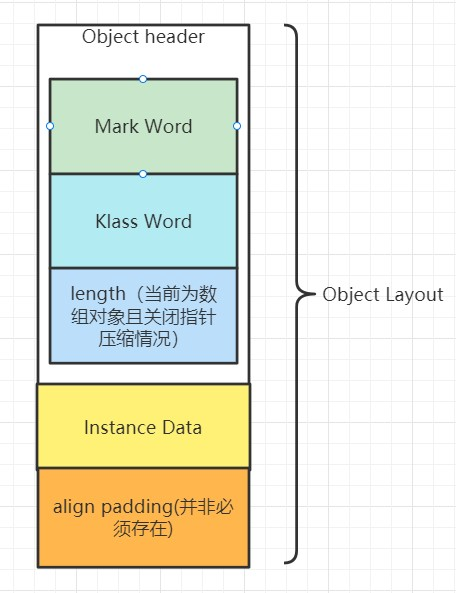

###### 浅析并发编程(三)对象布局

1. 对象布局

Java中的对象是类的实例，从总体的角度讲，对象的组成部分是分为object header、instance data、align padding。**align padding**就是对齐填充，严格来说该部分并不是必须的，按照虚拟机规范，只是用来保证该对象所占字节是8的整数倍，**方便高效寻址**。instance data里面存放的是该对象的是实例数据。在我们把主要目光放在object header之前，先来了解一个数据结构**Ordinary Object Pointers**（以下简称OOPS）。`HotSpot`使用OOPS来表示指向对象的指针，不同类的对象实例对应OOPS下的一种特殊的数据结构，该数据结构被称为`oopDesc`，虽然`oopDesc`就是我们认知中的object header对象头这一概念，但是在`HotSpot`源码中，它是一个公共的父类。不同类的对象实例对应的object header都继承该类。new 出来的Java类的实例对应的object header是`instanceOopDesc`， 数组对应的object header是`arrayOopDesc`。而这些都是对象头，OOPS则是对象头这一个概念的集合。

2. 对象头的组成

`oopDesc`中包含所有对象头的公共部分：`mark word`、`klass word`。以`JDK1.8版本 64位`为例，`mark word`用来描述**object header信息**，其所占大小为8个字节，主要包含`identity hashcode`、偏向锁、锁信息、GC年龄等信息。identity `hashcode`是以内存计算的`hashcode`，即便重写`hashcode`该值也不会改变，以此区别于`hashcode`。`klass word`用来**保存类元信息**，在`JDK1.8版本 64位`中默认开启指针压缩，所占大小为4个字节。关闭指针压缩时，所占大小为8个字节。数组的对象头也就是`arrayOopDesc`，除了包含`mark word`、`klass word`之外，还有`length`也就是数组长度，占用大小为4个字节。**当开启指针压缩的时候，length跟类元信息一起保存在`klass word`中，相反关闭指针压缩时，length只是保存在`arrayOopDesc`中**。

我们以图示的方式，稍微总结一下Java中的对象布局。



当我们对Java对象布局有了一个简单的认识之后，我们在项目中引入一个`JOL`依赖，来加深以下对于对象布局的理解，而`JOL`全名是Java Object Layout

```java
<!-- 内存布局信息-->
<dependency>
    <groupId>org.openjdk.jol</groupId>
    <artifactId>jol-core</artifactId>
    <version>0.10</version
</dependency>
```

引入依赖之后，我们编写一个名叫`ObjectHeaderTest`类。

```java
public class ObjectHeaderTest {


    /**
     * -XX:-UseCompressedOops 关闭指针压缩
     */
    public static class PackingFieldClass {
        byte byteObj = 1;
        short shortObj = 2;
        int intObj = 3;
        long longObj = 4;
        float floatObj = 5f;
        double doubleObj = 6.0;
        boolean booleanObj = false;
        char charObj = 'c';
        String strObj = "test";
    }

    public static void main(String[] args) {
        /**
         * normal Object
         */
        ClassLayout classLayout = ClassLayout.parseInstance(new Object());
        System.out.println(classLayout.toPrintable());
        /**
         * class
         */
        ClassLayout classLayout1 = ClassLayout.parseClass(Object.class);
        System.out.println(classLayout1.toPrintable());

        /**
         * primitive array
         */
        ClassLayout classLayout2 = ClassLayout.parseInstance(new int[]{1,2});
        System.out.println(classLayout2.toPrintable());

        /**
         * Obj array
         */
        ClassLayout classLayout3 = ClassLayout.parseInstance(new Integer[]{1,2});
        System.out.println(classLayout3.toPrintable());
        /**
         * packing Field Class
         */
        ClassLayout classLayout4 = ClassLayout.parseInstance(new PackingFieldClass());
        System.out.println(classLayout4.toPrintable());

    }
}
```

当前执行环境为`JDK 1.8 64位`，此时默认开启压缩指针。

```java
java.lang.Object object internals:
 OFFSET  SIZE   TYPE DESCRIPTION                               VALUE
      0     4        (object header)                           01 00 00 00 (00000001 00000000 00000000 00000000) (1)
      4     4        (object header)                           00 00 00 00 (00000000 00000000 00000000 00000000) (0)
      8     4        (object header)                           e5 01 00 f8 (11100101 00000001 00000000 11111000) (-134217243)
     12     4        (loss due to the next object alignment)
Instance size: 16 bytes
Space losses: 0 bytes internal + 4 bytes external = 4 bytes total

java.lang.Object object internals:
 OFFSET  SIZE   TYPE DESCRIPTION                               VALUE
      0    12        (object header)                           N/A
     12     4        (loss due to the next object alignment)
Instance size: 16 bytes
Space losses: 0 bytes internal + 4 bytes external = 4 bytes total

[I object internals:
 OFFSET  SIZE   TYPE DESCRIPTION                               VALUE
      0     4        (object header)                           01 00 00 00 (00000001 00000000 00000000 00000000) (1)
      4     4        (object header)                           00 00 00 00 (00000000 00000000 00000000 00000000) (0)
      8     4        (object header)                           6d 01 00 f8 (01101101 00000001 00000000 11111000) (-134217363)
     12     4        (object header)                           02 00 00 00 (00000010 00000000 00000000 00000000) (2)
     16     8    int [I.<elements>                             N/A
Instance size: 24 bytes
Space losses: 0 bytes internal + 0 bytes external = 0 bytes total

[Ljava.lang.Integer; object internals:
 OFFSET  SIZE                TYPE DESCRIPTION                               VALUE
      0     4                     (object header)                           01 00 00 00 (00000001 00000000 00000000 00000000) (1)
      4     4                     (object header)                           00 00 00 00 (00000000 00000000 00000000 00000000) (0)
      8     4                     (object header)                           45 62 00 f8 (01000101 01100010 00000000 11111000) (-134192571)
     12     4                     (object header)                           02 00 00 00 (00000010 00000000 00000000 00000000) (2)
     16     8   java.lang.Integer Integer;.<elements>                       N/A
Instance size: 24 bytes
Space losses: 0 bytes internal + 0 bytes external = 0 bytes total

ObjectHeaderTest$PackingFieldClass object internals:
 OFFSET  SIZE               TYPE DESCRIPTION                               VALUE
      0     4                    (object header)                           01 00 00 00 (00000001 00000000 00000000 00000000) (1)
      4     4                    (object header)                           00 00 00 00 (00000000 00000000 00000000 00000000) (0)
      8     4                    (object header)                           88 16 01 f8 (10001000 00010110 00000001 11111000) (-134146424)
     12     4                int PackingFieldClass.intObj                  3
     16     8               long PackingFieldClass.longObj                 4
     24     8             double PackingFieldClass.doubleObj               6.0
     32     4              float PackingFieldClass.floatObj                5.0
     36     2              short PackingFieldClass.shortObj                2
     38     2               char PackingFieldClass.charObj                 c
     40     1               byte PackingFieldClass.byteObj                 1
     41     1            boolean PackingFieldClass.booleanObj              false
     42     2                    (alignment/padding gap)                  
     44     4   java.lang.String PackingFieldClass.strObj                  (object)
Instance size: 48 bytes
Space losses: 2 bytes internal + 0 bytes external = 2 bytes total

```

* 对于normal Object，前8个字节表示`Mark Word`, 接下来的4个字节表示Object对象的`Klass Word`, 最后四个字节作为对齐填充，这样该对象所占字节正好是8+4+4=16字节，正好是8的整数倍。

* 对于class对应的布局，前12字节是object header，后4个字节为对齐填充。

* 对于int基本类型的数组，前8个字节指的是`Mark Word`，下面的4个字节指的是`Klass Word`, 再接下来的4个字节表示数组的长度，**最后四个字节为`instance Data`, 由于数组元素一共为2个，且单个int所占字节数为4。此时该对象所占字节数为24，已经是8的倍数，不需要对齐填充。**

* 对于Integer引用数据类型， 虽然所占字节数与int基本类型相同，但是使用对象头类型不同，这个我们在下文的`HotSpot`源码中再来讨论。

* 对于`packing Field Class`对象，前12个字节表示对象头，8个是`Mark Word`, 4个是`klass Word`, 接下来分别是int 占4个字节、long 占8个字节、float占4个字节、short占2个字节、char占2个字节、byte占1个字节、boolean占1个字节、下面两个字节是Instance Data的对齐填充， 最后四个字节是String所占4个字节。（注：当前默认开启指针压缩）

对于关闭指针压缩的情况需要加上**`-XX:-UseCompressedOops`**VM参数，可以看到`Klass Word`占用8个字节，String类型变量将占用8个字节。这边不再展示，大家可以自行尝试。

3. `HotSpot`角度继续了解object header


