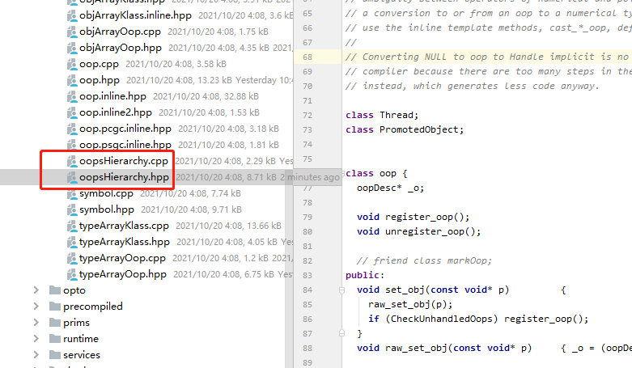
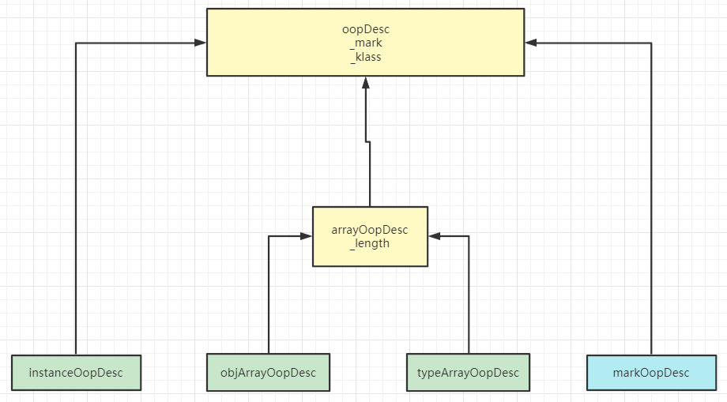
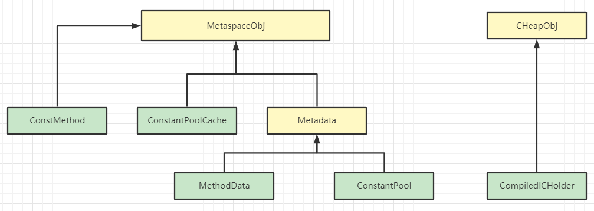
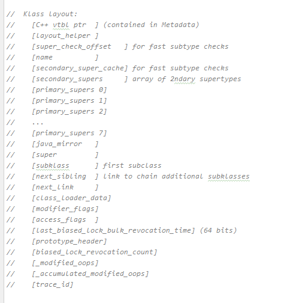
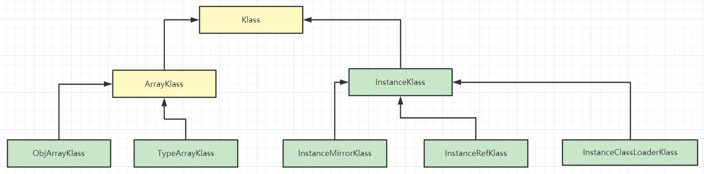
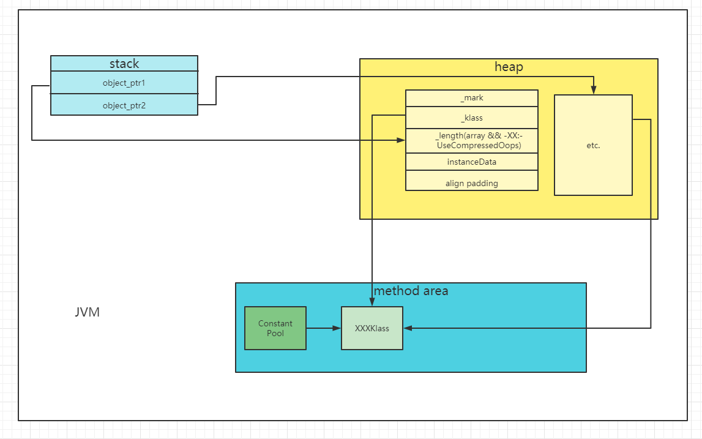

浅析并发编程(三)对象布局

1. 对象布局

Java中的对象是类的实例，从总体的角度讲，对象的组成部分是分为object header、instance data、align padding。**align padding**就是对齐填充，严格来说该部分并不是必须的，按照虚拟机规范，只是用来保证该对象所占字节是8的整数倍，**方便高效寻址**。instance data里面存放的是该对象的是实例数据。在我们把主要目光放在object header之前，先来了解一个数据结构**Ordinary Object Pointers**（以下简称OOPS）。`HotSpot`使用OOPS来表示指向对象的指针，不同类的对象实例对应OOPS下的一种特殊的数据结构，该数据结构被称为`oopDesc`，虽然`oopDesc`就是我们认知中的object header对象头这一概念，但是在`HotSpot`源码中，它是一个公共的父类。不同类的对象实例对应的object header都继承该类。例如，new 出来的Java类的实例对象对应的object header是`instanceOopDesc`， 数组对应的object header是`arrayOopDesc`。而这些都是对象头，OOPS则是对象头这一个概念的集合。

2. 对象头的组成

`oopDesc`中包含所有对象头的公共部分：`mark word`、`klass word`。以`JDK1.8版本 64位`为例，`mark word`用来描述**object header信息**，其所占大小为8个字节，主要包含`identity hashcode`、偏向锁、锁信息、GC年龄等信息。`identity hashcode`是以内存计算的`hashcode`，即便重写`hashcode`该值也不会改变，以此区别于`hashcode`。`klass word`用来**保存类元信息**，在`JDK1.8版本 64位`中默认开启指针压缩，所占大小为4个字节。关闭指针压缩时，所占大小为8个字节。数组的对象头也就是`arrayOopDesc`，除了包含`mark word`、`klass word`之外，还有`length`也就是数组长度，占用大小为4个字节。**当开启指针压缩的时候，length跟类元信息一起保存在`klass word`中，相反关闭指针压缩时，length只是保存在`arrayOopDesc`中**。

我们以图示的方式，稍微总结一下Java中的对象布局。


当我们对Java对象布局有了一个简单的认识之后，我们在项目中引入一个`JOL`依赖，来加深以下对于对象布局的理解，而`JOL`全名是Java Object Layout

```java
<!-- 内存布局信息-->
<dependency>
    <groupId>org.openjdk.jol</groupId>
    <artifactId>jol-core</artifactId>
    <version>0.10</version
</dependency>
```

引入依赖之后，我们编写一个名叫`ObjectHeaderTest`类。

```java
public class ObjectHeaderTest {


    /**
     * -XX:-UseCompressedOops 关闭指针压缩
     */
    public static class PackingFieldClass {
        byte byteObj = 1;
        short shortObj = 2;
        int intObj = 3;
        long longObj = 4;
        float floatObj = 5f;
        double doubleObj = 6.0;
        boolean booleanObj = false;
        char charObj = 'c';
        String strObj = "test";
    }

    public static void main(String[] args) {
        /**
         * normal Object
         */
        ClassLayout classLayout = ClassLayout.parseInstance(new Object());
        System.out.println(classLayout.toPrintable());
        /**
         * class
         */
        ClassLayout classLayout1 = ClassLayout.parseClass(Object.class);
        System.out.println(classLayout1.toPrintable());

        /**
         * primitive array
         */
        ClassLayout classLayout2 = ClassLayout.parseInstance(new int[]{1,2});
        System.out.println(classLayout2.toPrintable());

        /**
         * Obj array
         */
        ClassLayout classLayout3 = ClassLayout.parseInstance(new Integer[]{1,2});
        System.out.println(classLayout3.toPrintable());
        /**
         * packing Field Class
         */
        ClassLayout classLayout4 = ClassLayout.parseInstance(new PackingFieldClass());
        System.out.println(classLayout4.toPrintable());

    }
}
```

当前执行环境为`JDK 1.8 64位`，此时默认开启压缩指针。

```java
java.lang.Object object internals:
 OFFSET  SIZE   TYPE DESCRIPTION                               VALUE
      0     4        (object header)                           01 00 00 00 (00000001 00000000 00000000 00000000) (1)
      4     4        (object header)                           00 00 00 00 (00000000 00000000 00000000 00000000) (0)
      8     4        (object header)                           e5 01 00 f8 (11100101 00000001 00000000 11111000) (-134217243)
     12     4        (loss due to the next object alignment)
Instance size: 16 bytes
Space losses: 0 bytes internal + 4 bytes external = 4 bytes total

java.lang.Object object internals:
 OFFSET  SIZE   TYPE DESCRIPTION                               VALUE
      0    12        (object header)                           N/A
     12     4        (loss due to the next object alignment)
Instance size: 16 bytes
Space losses: 0 bytes internal + 4 bytes external = 4 bytes total

[I object internals:
 OFFSET  SIZE   TYPE DESCRIPTION                               VALUE
      0     4        (object header)                           01 00 00 00 (00000001 00000000 00000000 00000000) (1)
      4     4        (object header)                           00 00 00 00 (00000000 00000000 00000000 00000000) (0)
      8     4        (object header)                           6d 01 00 f8 (01101101 00000001 00000000 11111000) (-134217363)
     12     4        (object header)                           02 00 00 00 (00000010 00000000 00000000 00000000) (2)
     16     8    int [I.<elements>                             N/A
Instance size: 24 bytes
Space losses: 0 bytes internal + 0 bytes external = 0 bytes total

[Ljava.lang.Integer; object internals:
 OFFSET  SIZE                TYPE DESCRIPTION                               VALUE
      0     4                     (object header)                           01 00 00 00 (00000001 00000000 00000000 00000000) (1)
      4     4                     (object header)                           00 00 00 00 (00000000 00000000 00000000 00000000) (0)
      8     4                     (object header)                           45 62 00 f8 (01000101 01100010 00000000 11111000) (-134192571)
     12     4                     (object header)                           02 00 00 00 (00000010 00000000 00000000 00000000) (2)
     16     8   java.lang.Integer Integer;.<elements>                       N/A
Instance size: 24 bytes
Space losses: 0 bytes internal + 0 bytes external = 0 bytes total

ObjectHeaderTest$PackingFieldClass object internals:
 OFFSET  SIZE               TYPE DESCRIPTION                               VALUE
      0     4                    (object header)                           01 00 00 00 (00000001 00000000 00000000 00000000) (1)
      4     4                    (object header)                           00 00 00 00 (00000000 00000000 00000000 00000000) (0)
      8     4                    (object header)                           88 16 01 f8 (10001000 00010110 00000001 11111000) (-134146424)
     12     4                int PackingFieldClass.intObj                  3
     16     8               long PackingFieldClass.longObj                 4
     24     8             double PackingFieldClass.doubleObj               6.0
     32     4              float PackingFieldClass.floatObj                5.0
     36     2              short PackingFieldClass.shortObj                2
     38     2               char PackingFieldClass.charObj                 c
     40     1               byte PackingFieldClass.byteObj                 1
     41     1            boolean PackingFieldClass.booleanObj              false
     42     2                    (alignment/padding gap)                  
     44     4   java.lang.String PackingFieldClass.strObj                  (object)
Instance size: 48 bytes
Space losses: 2 bytes internal + 0 bytes external = 2 bytes total

```

* 对于normal Object，前8个字节表示`Mark Word`, 接下来的4个字节表示Object对象的`Klass Word`, 最后四个字节作为对齐填充，这样该对象所占字节正好是8+4+4=16字节，正好是8的整数倍。

* 对于class对应的布局，前12字节是object header，后4个字节为对齐填充。

* 对于int基本类型的数组，前8个字节指的是`Mark Word`，下面的4个字节指的是`Klass Word`, 再接下来的4个字节表示数组的长度，**最后四个字节为`instance Data`, 由于数组元素一共为2个，且单个int所占字节数为4。此时该对象所占字节数为24，已经是8的倍数，不需要对齐填充。**

* 对于Integer引用数据类型， 虽然所占字节数与int基本类型相同，但是使用对象头类型不同，这个我们在下文的`HotSpot`源码中再来讨论。

* 对于`packing Field Class`对象，前12个字节表示对象头，8个是`Mark Word`, 4个是`klass Word`, 接下来分别是int 占4个字节、long 占8个字节、float占4个字节、short占2个字节、char占2个字节、byte占1个字节、boolean占1个字节、下面两个字节是Instance Data的对齐填充， 最后四个字节是String所占4个字节。（注：当前默认开启指针压缩）

对于关闭指针压缩的情况需要加上**`-XX:-UseCompressedOops`**VM参数，可以看到`Klass Word`占用8个字节，String类型变量将占用8个字节。这边不再展示，大家可以自行尝试。

3. `HotSpot`角度继续了解object header【以JDK1.8 64位为例】

   首先，点击[JDK1.8hotspot](http://hg.openjdk.java.net/jdk8u/jdk8u/hotspot/)跳转以下对应页面

windows下载zip文件，解压并使用idea或者其他软件打开。之后找到`src/share/vm/oops`文件夹，



看到名叫oopsHierarchy的文件，该文件体现了对象整个层次结构。`.cpp`文件后缀存放函数的具体实现，`.hpp`文件后缀存放头文件和函数的实现。所以我们直接关注oopsHierarchy.hpp文件即可。

```c++
typedef class   markOopDesc*                markOop;

#ifndef CHECK_UNHANDLED_OOPS

typedef class oopDesc*                            oop;
typedef class   instanceOopDesc*            instanceOop;
typedef class   arrayOopDesc*                    arrayOop;
typedef class     objArrayOopDesc*            objArrayOop;
typedef class     typeArrayOopDesc*            typeArrayOop;

#else
```

首先先看关于oopDesc部分，

* oopDesc是所有XXXOopDesc的基类，该基类下定义了`_mark`、`_metadata` 两个变量，`_mark`变量是markOop类型，是用来描述object header，关于这个会在`markOopDesc`详细展开。`_metadata` 是一个结构体，里面存放着`_klass`、`_compressed_klass`两个变量，当使用`-XX:+UseCompressedOops`VM参数或者使用默认参数时，会使用`_compressed_klass`指向方法区中的Klass，当使用`-XX:-UseCompressedOops`VM参数关闭指针压缩时，将会使用`_klass`变量。


* instanceOopDesc是所有new出来的实例对象的对象头。可以从下图看出instanceOopDesc是oopDesc子类。

  

* arrayOopDesc是所有数组的基类，typeArrayOopDesc、objArrayOopDesc都是它的子类。**arrayOopDesc除了继承父类oopDesc的markOop、klass两个基本属性之外，还有length变量。**这个变量比较特殊，length并没有直接显式定义在arrayOop.hpp文件当中。而是当没有开启指针压缩的时候，会在arrayOopDesc中定义并分配4个字节的空间。相反，如果开启了指针压缩，length变量会存放在klass字段的后4个字节，此时klass属性存在放在对应的oopDesc中，并指向方法区中的Klass类元信息。

* objArrayOopDesc是引用类型的数组的对象头。

* typeArrayOopDesc是基本数据类型的对象头。

* **markOopDesc**是相对比较重要的一个，所以就最后来探讨。markOopDesc虽然也是oopDesc的子类，但实际上它并不是一个对象头，只是一个用来描述object header信息的`Mark Word`。


上图是整个mark word的组成部分。

* 普通对象前25个bit未使用，接着31bit用来表示identity_hashcode也就是根据内存计算的hashcode，后一个bit未使用，GC age占4个bit，4个bit的最大值是15，这也就解释了JVM中GC15次之后，对象晋升老年代的原因。偏向锁占1个字节，且因为是普通对象所以值为0，锁信息占2个字节，值为01。
* 偏向锁前54字节存储指向线程的指针，2个bit存储epoch，当偏向锁多次撤销，该值发生变化。接着1bit未使用，GC age占4个bit，偏向锁占1bit，且值为1，锁信息占2个bit且值为01。
* 匿名偏向锁大致与偏向锁相同，只是前54bit为0。
* 轻量锁前62bit为指针，锁信息值为00且占2bit。
* 膨胀锁也就是重量级锁占62bit，锁信息值为10且占2个字节。
* GC标记前62bit为指针，锁信息值为11且占2个bit。

关于oopDesc，我们用图示的方式总结一下。



我们接着往下看，上面的是JDK1.7版本，常量池、常量方法等等，还在oopDesc的家族中。到了下图JDK1.8版本已经迁移到了元空间。

```c++
typedef class oopDesc*                            oop;
typedef class   instanceOopDesc*            instanceOop;
typedef class   methodOopDesc*                    methodOop;
typedef class   constMethodOopDesc*            constMethodOop;
typedef class   methodDataOopDesc*            methodDataOop;
typedef class   arrayOopDesc*                    arrayOop;
typedef class     objArrayOopDesc*            objArrayOop;
typedef class     typeArrayOopDesc*            typeArrayOop;
typedef class   constantPoolOopDesc*            constantPoolOop;
typedef class   constantPoolCacheOopDesc*   constantPoolCacheOop;
typedef class   klassOopDesc*                    klassOop;
typedef class   markOopDesc*                    markOop;
typedef class   compiledICHolderOopDesc*    compiledICHolderOop;
```

```c++
//      class MetaspaceObj
class   ConstMethod;
class   ConstantPoolCache;
class   MethodData;
//      class Metadata
class   Method;
class   ConstantPool;
//      class CHeapObj
class   CompiledICHolder;
```

* ConstMethod 代表是Java方法中不变的一部分。它的基类是MetaspaceObj，而MetaspaceObj是存储在元空间中的对象的基类。
* ConstantPoolCache是运行时数据区也就是JVM内存模型预留给常量池的。它保存了字段的访问和字节码的调用的解释器运行时信息。在类加载的 <u>加载-校验-准备-解析-初始化</u> 流程中的解析阶段，ConstantPoolCache被创建和初始化。ConstantPoolCache也是MetaspaceObj子类。
* MethodData用来记录解释阶段、和第一次执行的计数和其他信息，比如第一次编译循环、阻塞的次数。MethodData是Metadata的子类，而Metadata又是MetaspaceObj的子类，是内部类元数据的基类。
* ConstantPool是包含类常量的数组，ConstantPool中大部分条目是在类解析的时候写入的，而对于Klass类型的常量，当条目被解析的时候被修改。而ConstantPool也是Metadata的子类。
* CompiledICHolder与内联缓存有关。是CHeapObj的子类，见名知意，它是C堆对象的基类。

关于metadata中的部分，我们也使用图示的方式总结一下。



4. oop-klass模型

在我们继续了解Klass之前，我们先来看看oop-klass模型。Mark Word是用来描述object header信息，而klass是语言层面的类对象。至于为什么使用Klass这个单词，是因为在c++中class已经是关键字。此外，klass给对象提供虚拟机的调度行为。

为什么会有oop-klass模型？

因为设计者不想虚函数表指针存在于每一个对象之中。这样，对于oopDesc中Mark word用来表示object header信息，klass word指向方法区的XXXKlass，把虚函数的功能交给Klass来完成。klass结构在下方展示。

```c++
class Klass;
class   InstanceKlass;
class     InstanceMirrorKlass;
class     InstanceClassLoaderKlass;
class     InstanceRefKlass;
class   ArrayKlass;
class     ObjArrayKlass;
class     TypeArrayKlass;
```

* Klass作为所有Klass的基类。是语言层面的类对象，可以给对象提供虚拟机的调度行为。



Klass的布局信息如上图，这边挑一些比较重点的讲一下。`_java_mirror`这个属性，其实是java.lang.Class类对象关于这个类的镜像。`_super `这个属性指向父类。 `_subklass`这属性指类的直接子类，就像链表中的直接后继一样。`_next_sibling`指向该类的所有子类。

* InstanceKlass是相对于instanceOopDesc而言的，代表着虚拟机层面的Java类，包含一个类在执行阶段的所有信息。InstanceKlass也是Klass类的子类。
* InstanceMirrorKlass是一个专门化的InstanceKlass，是java.lang.Class类的Klass，而java.lang.Class的实例，可以访问到对应类的所有静态属性。InstanceMirrorKlass本身也是InstanceKlass的子类。
* InstanceClassLoaderKlass也是一个专门化的InstanceKlass，看名字也知道跟类加载器脱不了干系。本身也是InstanceKlass的子类。
* InstanceRefKlass本身也是专门化的InstanceKlass，它所有是java.lang.ref.Reference子类的Klass。java.lang.ref.Reference的子类有PhantomReference、SoftReference、WeakReference，分别对应虚引用、软引用、弱引用。InstanceRefKlass也是InstanceKlass的子类。
* ArrayKlass是Klass的子类，是所有数组类的基类Klass。
* ObjArrayKlass是引用类型数组对象的Klass，本身也是ArrayKlass的子类。
* TypeArrayKlass是基本类型数组对象的Klass，同时也是ArrayKlass的子类。

我们还是以图示的方式稍作总结Klass的家族关系。



最后，我们使用图示的方式来帮助了解oop-Klass模型



