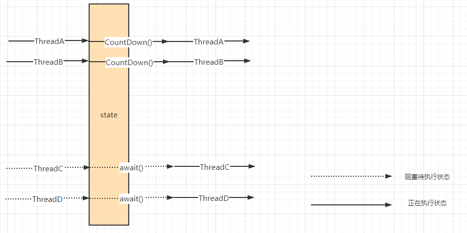
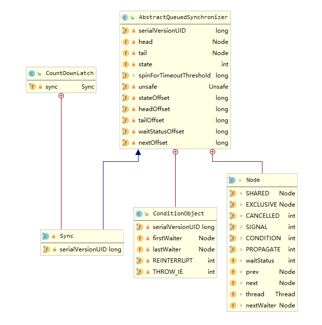
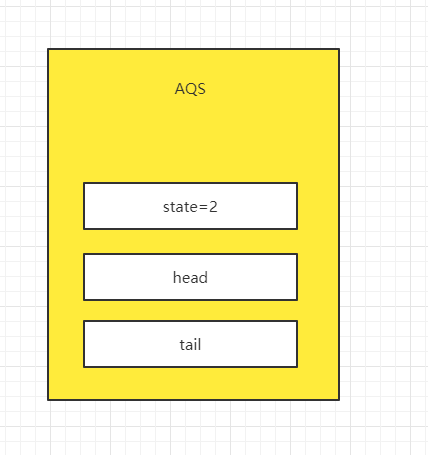
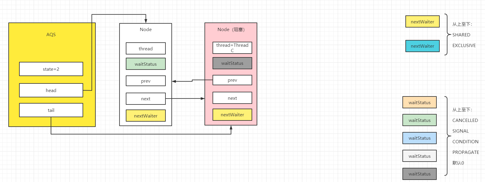
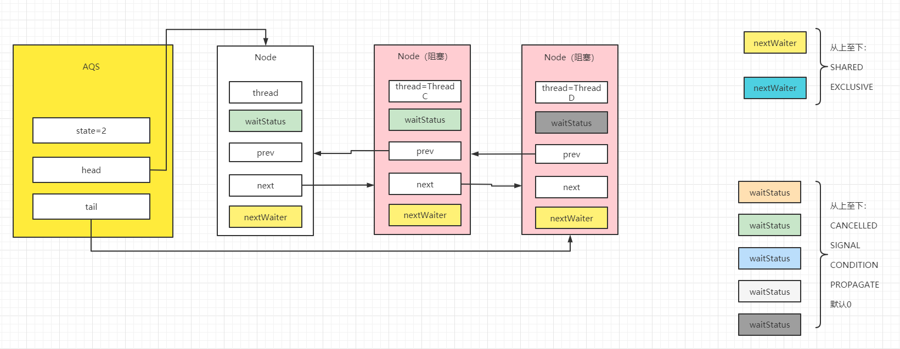
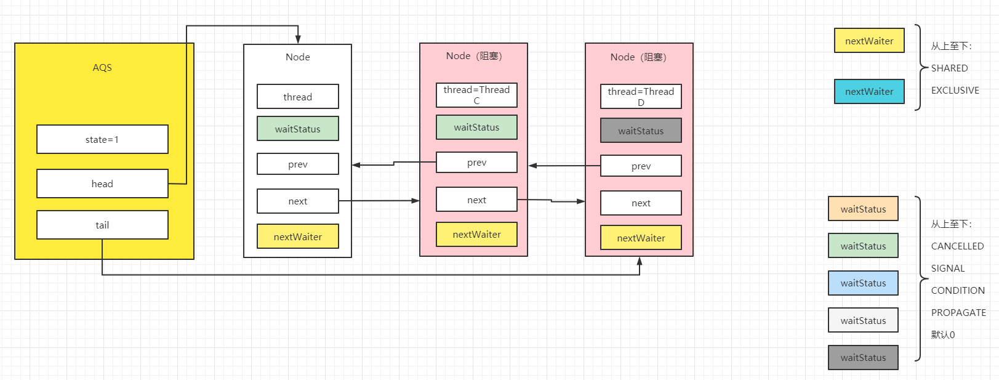
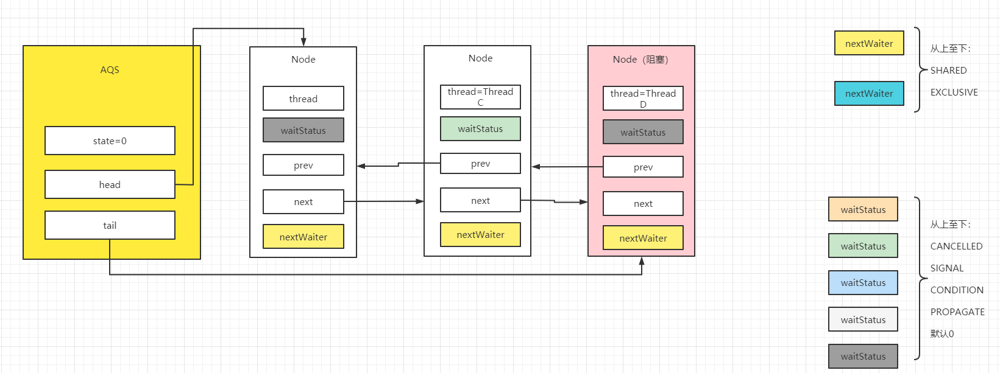
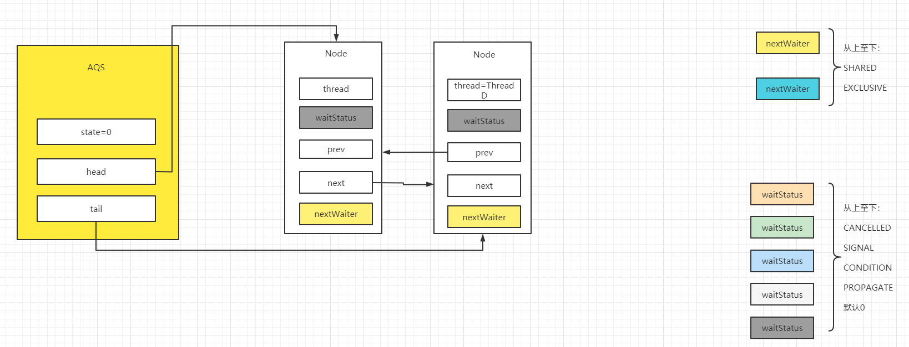
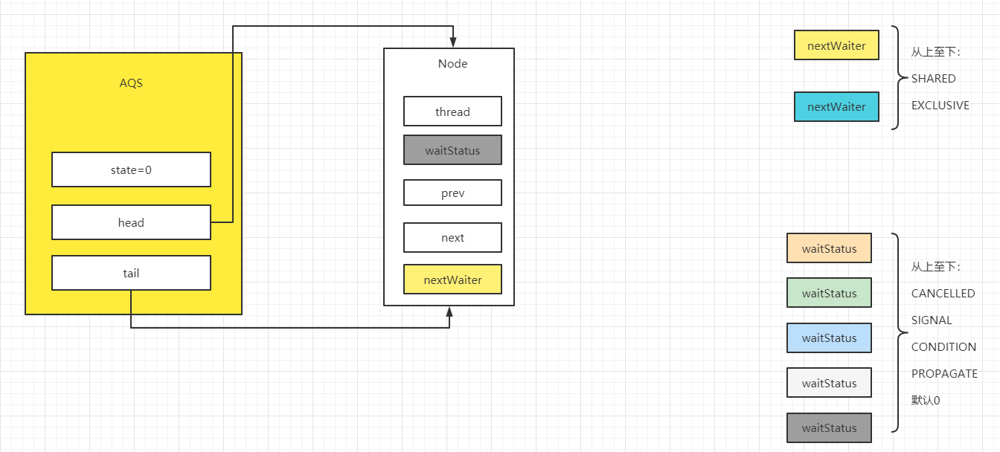

#### 浅析并发编程(九)AQS共享锁模式之CountDownLatch源码分析

0. 优势

    在我们一起来学习`CountDownLatch`之前， 我们来看一个案例。当前存在两个子线程，每个子线程都有各自两个子任务，且对应的任务需要在主线程的任务之前完成。

    解题思路：

    当前需要预先执行子任务，待子任务完成之后，执行主线程任务，可以使用join()

    ```java
    public class WorkTest {
    
        static void preFirstWork(String str) {
            System.out.println(str);
        }
    
        static void preSecondWork(String str) {
            System.out.println(str);
        }
        static void mainWork() {
            System.out.println("main work start");
            System.out.println("main work end");
        }
        public static void main(String[] args) {
    
            Thread subThreadA = new Thread(()->{
                LockSupport.parkNanos(10*100000000L);
                preFirstWork("preWork1"+Thread.currentThread().getName() + Thread.currentThread().getState());
                preSecondWork("preWork2"+Thread.currentThread().getName() + Thread.currentThread().getState());
            });
    
            Thread subThreadB = new Thread(() -> {
                LockSupport.parkNanos(10*100000000L);
                preFirstWork("preWork1"+Thread.currentThread().getName() + Thread.currentThread().getState());
                preSecondWork("preWork2"+Thread.currentThread().getName() + Thread.currentThread().getState());
            });
    
            //开启线程
            subThreadA.start();
            subThreadB.start();
    
            try {
                //子任务在主任务之前完成。
                subThreadA.join();
                subThreadB.join();
                mainWork();
            } catch (InterruptedException e) {
                e.printStackTrace();
            }
        }
    }
    ```

    **但是如果，我们希望subThreadA和subThreadB在执行完成`preFirstWork`任务之后，主线程就可以开始执行，没必要等到两个子线程完成所有任务才开始。**所以join()并不能很好的处理这件事情。

    而`CountDownLatch`其本身作为AQS共享锁模式的一员。在使用的时候，会将线程分为两类：

    (1) 预先执行的线程

    (2) 等待预先一系列工作完成之后，开始执行的线程

    预先执行的线程完成其核心任务之后，执行`countDown()`将AQS计数器中的值减一，而对于等待准备工作结束之后，才能开始的线程，在AQS的计数器变为0之后，才能开始执行，否则处与阻塞状态。

    我们再回到之前的案例，首先定义一个state值为2的`CountDownLatch`，我们可以在subThreadA和subThreadB完成`preFirstWork`任务之后，执行`countDown()`将AQS中state值扣减为0。此时等待预先工作完成的线程，将会从CLH链表中全部被唤醒，开始执行后续工作。这也就是`CountDownLatch`更为灵活的地方。

1. 定义

   CountDownLatch是一种同步辅助工具。它允许一些线程完成一系列操作之后，其他的一个或多个线程才会去执行，而在此之前这些线程将会阻塞。

   

   如上图所示，当前是一个state值为2的CountDownLatch。ThreadC和ThreadD在执行`await()`系列方法之后被阻塞了。此时只有ThreadA和ThreadB正在执行，当这两个线程执行完核心的前期准备任务之后，执行`CountDown()`系列方法。此时，ThreadC和ThreadD将被唤醒，继续完成后续的工作。

   接着我们一起来看`CountDownLatch`的类图，来加深对其数据结构的理解。

   

   从类图上可以看出，`CountDownLatch`内部类`Sync`继承自AQS基类，对于AQS该类中的属性介绍，参照**浅析并发编程(六)AQS源码分析(一)独占锁模式**， 在CountDownLatch中将调用`await()`系列方法的线程插入CLH链表中，且该类是AQS的共享锁模式，而condition queue其本身是为AQS的独占锁模式服务，这里并不介绍。

2. 构造方法

    `CountDownLatch`该类比较特殊，由于其将执行任务的线程分为两类：（1）预先执行任务的线程、（2）等预先任务执行结束再开始的线程。并且用state值标志需要预先执行的线程个数。在AQS中state值不为空的时候，调用`await()`系列的方法而进入CLH链表之后阻塞的线程，将在state值为空的时候出现传播唤醒，唤醒所有线程并清空CLH链表， 所以`CountDownLatch`并没有公平锁和非公平锁。其构造方法如下：

    ```java
    //构造方法
    //将传入的count值赋值给state值
    public CountDownLatch(int count) {
        if (count < 0) throw new IllegalArgumentException("count < 0");
        this.sync = new Sync(count);
    }
    
    Sync(int count) {
        setState(count);
    }
    protected final void setState(int newState) {
        state = newState;
    }
    ```

3. `countDown()`和`await()`系列方法

* 3.1 `countDown()`逻辑

  当预先执行任务的线程执行完关键逻辑之后，调用`countDown`方法将AQS中`state`值减一，而当`state`值为0之后，将唤醒CLH链表中的线程。

  ```java
  //countDown方法
  public void countDown() {
      sync.releaseShared(1);
  }
  //每当一个线程执行countDown都会进入tryReleaseShared方法，将state值减一。
  //而只有当state更新后的值为0，才会进入doReleaseShared方法，唤醒CLH链表节点。
  public final boolean releaseShared(int arg) {
      if (tryReleaseShared(arg)) {
          doReleaseShared();
          return true;
      }
      return false;
  }
  
  protected boolean tryReleaseShared(int releases) {
      //在countDown方法的调用过程中可能存在并发的情况，当前采用for循环+CAS的方式。
      //使得线程依次执行CAS，将state值进行递减，最后判断是否需要唤醒CLH链表中的线程。
      for (;;) {
          int c = getState();
          if (c == 0)
              return false;
          int nextc = c-1;
          if (compareAndSetState(c, nextc))
              return nextc == 0;
      }
  }
  
  private void doReleaseShared() {
      //doReleaseShared方法是AQS共享锁模式中唤醒下一个节点的公共方法。
      //在countDownLatch中，当线程将state值变更为0之后，进入当前方法。
      for (;;) {
          Node h = head;
          //CLH链表中保存的线程是调用了await()系列方法的线程，而当state值为0之后，将会唤醒这些线程。
          //CLH链表是FIFO的方式所以从队头出。当前一个节点状态为SIGNAL，表示释放锁成功的时候将会唤醒
          //下一个线程。所以在此，先将状态 置为0之后调用unparkSuccessor唤醒下一个线程。
          if (h != null && h != tail) {
              int ws = h.waitStatus;
              if (ws == Node.SIGNAL) {
                  if (!compareAndSetWaitStatus(h, Node.SIGNAL, 0))
                      continue;
                  unparkSuccessor(h);
              }
              //在countDownLatch的逻辑中，正常执行不到这里。而如果执行到这里则说明，
              //创建countDownLatch中的state值小于实际调用countDown()的次数，当前为代码兼容。
              else if (ws == 0 &&
                       !compareAndSetWaitStatus(h, 0, Node.PROPAGATE))
                  continue; 
          }
          //当head指针变化，则再次进入循环。
          if (h == head)
              break;
      }
  }
  
  //唤醒下一个节点线程的主逻辑，当前也是AQS中的公共代码
  private void unparkSuccessor(Node node) {
      int ws = node.waitStatus;
      //由于unparkSuccessor方法是AQS中的公共方法，当前判断的使用场景在于AQS独占锁模式的唤醒逻辑。
      if (ws < 0)
          compareAndSetWaitStatus(node, ws, 0);
      //使得s指向node节点的直接后继，如果该节点被取消，则从tail节点开始
      //寻找到距离node节点最近的 且未被取消的节点。
      //而在countDownLatch逻辑中,被取消的节点的场景在于, 当线程调用await()方法之后，
      //该线程随后又被打断。
      Node s = node.next;
      if (s == null || s.waitStatus > 0) {
          s = null;
          for (Node t = tail; t != null && t != node; t = t.prev)
              if (t.waitStatus <= 0)
                  s = t;
      }
      //找到节点后，将其唤醒。
      if (s != null)
          LockSupport.unpark(s.thread);
  }
  ```

* 3.2`await()`逻辑

  等待预先执行任务完成的其他线程将会执行到`await()`系列方法， 首先会添加到CLH链表中，之后将阻塞。而在`CountDownLatch`逻辑中，当state值为0时，当前方法的逻辑将会执行传播唤醒，最后清空CLH链表。

  ```java
  //await()的方法入口，await()方法在执行过程中会响应线程的打断。
  public void await() throws InterruptedException {
      sync.acquireSharedInterruptibly(1);
  }
  
  public final void acquireSharedInterruptibly(int arg)
      throws InterruptedException {
      //当前方法在执行过程中会响应线程打断，响应的方式是抛出异常。
      if (Thread.interrupted())
          throw new InterruptedException();
      //尝试获取共享锁，获取失败进入doAcquireSharedInterruptibly将当前节点插入CLH链表
      //将前驱节点的状态置为SIGNAL，然后阻塞当前线程Node节点。
      if (tryAcquireShared(arg) < 0)
          doAcquireSharedInterruptibly(arg);
  }
  //这边先注意出参为1 或 -1，将会在传播唤醒中用到。
  //获取共享锁的依据就是state值为0
  protected int tryAcquireShared(int acquires) {
      return (getState() == 0) ? 1 : -1;
  }
  
  private void doAcquireSharedInterruptibly(int arg)
      throws InterruptedException {
      //当获取锁失败之后，将当前线程生成Node节点，使用尾插法插入CLH链表中。
      final Node node = addWaiter(Node.SHARED);
      boolean failed = true;
      try {
          for (;;) {
              //当当前节点的直接前驱为head，也就是说当前节点是CLH链表中第一个等待获取共享锁的节点。
              //将会尝试获取锁，在countDownLatch中tryAcquireShared值要么是-1 要么是1
              //当值为1，表示state值为0，之后进入setHeadAndPropagate的逻辑，更新head指针，
              //同时会触发传播唤醒。
              final Node p = node.predecessor();
              if (p == head) {
                  int r = tryAcquireShared(arg);
                  if (r >= 0) {
                      setHeadAndPropagate(node, r);
                      p.next = null; 
                      failed = false;
                      return;
                  }
              }
              //对于CLH链表的其他节点，或者第一个等待获取共享锁的节点获取锁失败的时候，
              //进入shouldParkAfterFailedAcquire，将直接前驱节点的状态置为SIGNAL
              //再次执行循环中的逻辑，进入parkAndCheckInterrupt，将会阻塞当前线程。
              //等到当前线程被唤醒或者被打断，抛出异常。最后进入cancelAcquire，取消当前节点。
              if (shouldParkAfterFailedAcquire(p, node) &&
                  parkAndCheckInterrupt())
                  throw new InterruptedException();
          }
      } finally {
          if (failed)
              cancelAcquire(node);
      }
  }
  
  private Node addWaiter(Node mode) {
      //为当前线程生成Node节点，在countDownLatch中当前为共享模式
      //CLH链表采用尾插法，由于插入节点可能存在线程竞争，
      //所以enq()方法除了要处理完成CLH链表的初始化，还要作为线程竞争导致CAS失败的Node节点的兜底处理。
      Node node = new Node(Thread.currentThread(), mode);
      Node pred = tail;
      if (pred != null) {
          node.prev = pred;
          if (compareAndSetTail(pred, node)) {
              pred.next = node;
              return node;
          }
      }
      enq(node);
      return node;
  }
  
  private Node enq(final Node node) {
      //enq() 处理方式是采用for循环+CAS，使得线程Node节点依次一个一个的插入CLH链表中
      for (;;) {
          Node t = tail;
          //当前初始化一个空的Node节点，之后可以根据当前空节点的状态为SIGNAL去唤醒下一个节点。
          if (t == null) {
              if (compareAndSetHead(new Node()))
                  tail = head;
          } else {
              //使用尾插法，将当前插入CLH链表中
              node.prev = t;
              if (compareAndSetTail(t, node)) {
                  t.next = node;
                  return t;
              }
          }
      }
  }
  
  //注意:  tryAcquireShared的返回值要么是1，要么是-1，而进入setHeadAndPropagate
  //当前propagate的传参则必为1。
  private void setHeadAndPropagate(Node node, int propagate) {
      //head节点向后移动，同时情况情况当前节点的线程信息。
      Node h = head;
      setHead(node);
      //由于当前propagate的传参为1，也就是说当CountDownLatch共享锁模式中state值为0之际，
      //将传播唤醒CLH链表中的所有节点，直到CLH链表为空。
      //而对于 h == null || h.waitStatus < 0 或者(h = head) == null || h.waitStatus < 0
      //的判断逻辑说明参考浅析并发编程(八)AQS共享锁模式之Semaphore源码分析
      if (propagate > 0 || h == null || h.waitStatus < 0 ||
          (h = head) == null || h.waitStatus < 0) {
          Node s = node.next;
          if (s == null || s.isShared())
              doReleaseShared();
      }
  }
  
  private static boolean shouldParkAfterFailedAcquire(Node pred, Node node) {
      int ws = pred.waitStatus;
      //当直接前驱节点状态为SIGNAL，直接返回true，之后将直接调用LockSupport.park()方法
      //阻塞当前线程。
      if (ws == Node.SIGNAL)
          return true;
      //当前为配合cancelAcquire的方法，更新当前节点的前驱节点指针，属于lazy模式。
      if (ws > 0) {
          do {
              node.prev = pred = pred.prev;
          } while (pred.waitStatus > 0);
          pred.next = node;
      } else {
          //将当前节点状态置为SIGNAL
          compareAndSetWaitStatus(pred, ws, Node.SIGNAL);
      }
      return false;
  }
  
  private final boolean parkAndCheckInterrupt() {
      //阻塞当前节点，释放CPU
      LockSupport.park(this);
      //当当前节点被唤醒或被打断，获取并重置线程打断状态。
      return Thread.interrupted();
  }
  
  //线程在阻塞状态之后被打断，且抛出异常之后，将会进入到当前逻辑。
  private void cancelAcquire(Node node) {
  
      if (node == null)
          return;
  	//取消节点步骤1： 清空线程信息
      node.thread = null;
      //这边的逻辑和shouldParkAfterFailedAcquire中类似，更新当前节点的前驱指针，
      //当一个节点被取消之后，将会更新其直接前驱节点的后继指针，并将后一个节点的前驱指针的更新，
      //延后处理，属于lazy模式。其原因在于，如果该节点获取了锁，则直接情况节点的前驱指针，
      //并不需要再更新，节省了性能。而如果该节点并没有获取锁，将会在shouldParkAfterFailedAcquire
      //或者cancelAcquire中 更新该节点的前驱指针。
      Node pred = node.prev;
      while (pred.waitStatus > 0)
          node.prev = pred = pred.prev;
  
      Node predNext = pred.next;
  
  	//取消节点步骤2： 将当前节点状态置为CANCELLED
      node.waitStatus = Node.CANCELLED;
  
      //取消节点步骤3：更新节点的指针信息
      //当前被取消节点共分为3类：
      //1. CLH链表中的最后一个尝试获取锁的节点
      //首先将tail指针指向当前节点，然后清空其前驱节点的后继指针。
      //2. CLH链表中第一个尝试获取锁的节点
      //也就是CLH链表中head指针对应的下一个节点，直接唤醒下一个节点。之后将当前节点的后继指针指向自己，
      //注意：在此处下一个节点的前驱指针还未更新，而这也就对应了上述所说的lazy模式。
      //当被唤醒的节点在tryAcquireShared中成功获取了锁，AQS中的head指针将会后移，
      //同时直接清空前驱指针。而如果 被唤醒的节点没有获取锁，将会在shouldParkAfterFailedAcquire
      //更新其前驱指针，又或者该节点在LockSupport.park()被阻塞之后，出现线程打断的情况，
      //此时将会在cancelAcquire的前半段逻辑中更新该节点的前驱指针。
      //而使用lazy模式的好处在于，避免更新该节点的前驱指针之后，该节点后续成功获取锁，
      //又再次清空其前驱指针，导致浪费了性能。
      //3. 既不是CLH链表中第一个尝试获取锁的节点，也不是CLH链表中最后一个获取锁的节点
      //将前驱节点的状态置为SIGNAL，并将前驱节点的后继指针指向当前的后继节点，最后将当前节点的后继指针，
      //指向自己，方便GC。但是，后继节点的前驱指针尚未更新，其处理逻辑和 情况2 一样，采用了lazy模式。
      //此处不再赘述。
      if (node == tail && compareAndSetTail(node, pred)) {
          compareAndSetNext(pred, predNext, null);
      } else {
          int ws;
          if (pred != head &&
              ((ws = pred.waitStatus) == Node.SIGNAL ||
               (ws <= 0 && compareAndSetWaitStatus(pred, ws, Node.SIGNAL))) &&
            pred.thread != null) {
              Node next = node.next;
              if (next != null && next.waitStatus <= 0)
                  compareAndSetNext(pred, predNext, next);
          } else {
              unparkSuccessor(node);
          }
  
          node.next = node;
      }
  }
  ```
  

4. 举例

   为了方便理解`CountDownLatch`的源码逻辑，我们使用举例的方式。当前有四个线程`ThreadA`、`ThreadB`、`ThreadC`、`ThreadD`。其中`ThreadA`和`ThreadB`执行预先完成的任务，而当该预先任务执行结束，`ThreadC`、`ThreadD`开始执行其对应逻辑。所以在当前例子中，需要创建state值为2的`CountDownLatch`。

   

   * ThreadC执行`await()`方法阻塞，等待预先任务完成。

     ThreadC进入`acquireSharedInterruptibly`方法的子方法`tryAcquireShared`尝试获取锁，

     由于AQS中state值为2，获取锁共享锁失败。之后进入addWaiter逻辑，由于CLH链表为空，初始化

     一个空的Node节点，并更新head和tail指针，之后使用尾插法将ThreadC插入CLH链表。由于当前节点是

     CLH链表第一个等待获取锁的节点，再次尝试获取锁失败之后，先将其前驱节点的状态置为SIGNAL，当共享锁释放的时候，将会唤醒当前线程。之后调用`LockSupport.park()`系列方法，阻塞当前线程。

     

   * ThreadD执行`await()`方法阻塞，等待预先任务完成。

     ThreadD的处理逻辑和ThreadC相似，当获取锁失败之后，使用尾插法将当前创建的Node节点插入CLH链表中，之后更新其前驱节点的状态为SIGNAL，再次执行循环中的逻辑之后，调用`LockSupport.park()`系列方法，阻塞当前线程。

     

   * ThreadA执行完预先任务后，执行`countDown()`逻辑

     ThreadA进入`releaseShared`的子方法`tryReleaseShared`中，使用CAS算法更新完state值之后，

     由于当前state值为1，所以不用唤醒CLH链表中的下一个线程。

     

   * ThreadB执行完预先任务之后，执行`countDown()`逻辑

     ThreadB同样的也是进入`releaseShared`的子方法`tryReleaseShared`中，使用CAS更新state值，

     此时AQS中的state值为0，表明释放共享锁成功。之后进入`doReleaseShared()`方法，由于CLH链表不为空，所以将head指向的节点状态置为0，之后唤醒下一个线程ThreadC。

     

   * ThreadC被唤醒之后，尝试获取共享锁

     ThreadC被唤醒之后，继续执行`doAcquireSharedInterruptibly`中的逻辑，**调用`tryAcquireShared`成功获取锁，由于其返回值为1，在更新head指针之后，执行传播唤醒逻辑，将新的head节点状态置为0，再次唤醒下一个线程ThreadD。**

     

   * ThreadD被传播唤醒之后，尝试获取锁

     ThreadD被唤醒之后，继续执行`doAcquireSharedInterruptibly`中的逻辑，**调用`tryAcquireShared`成功获取锁之后，此处其返回值为1，更新完head指针之后，此时CLH链表中head指针和tail指针指向同一个空的节点，所以在此处无需唤醒下一个节点。**

     

5. 使用CountDownLatch解决案例中留下的问题

   ```java
public class WorkTest {
   
    static void preFirstWork(String str) {
           System.out.println(str);
    }
   
    static void preSecondWork(String str) {
           System.out.println(str);
    }
       static void mainWork() {
        System.out.println("main work start");
           System.out.println("main work end");
       }
       public static void main(String[] args) {
           CountDownLatch countDownLatch = new CountDownLatch(2);
   
           Thread subThreadA = new Thread(()->{
               LockSupport.parkNanos(10*100000000L);
               preFirstWork("preWork1"+Thread.currentThread().getName() + Thread.currentThread().getState());
               //核心方法执行结束，执行countDown扣减门栓
               countDownLatch.countDown();
               LockSupport.parkNanos(10*100000000L);
               preSecondWork("preWork2"+Thread.currentThread().getName() + Thread.currentThread().getState());
           });
   
           Thread subThreadB = new Thread(() -> {
               LockSupport.parkNanos(10*100000000L);
               preFirstWork("preWork1"+Thread.currentThread().getName() + Thread.currentThread().getState());
               //核心方法执行结束，执行countDown扣减门栓
               countDownLatch.countDown();
               LockSupport.parkNanos(10*100000000L);
               preSecondWork("preWork2"+Thread.currentThread().getName() + Thread.currentThread().getState());
           });
   
           subThreadA.start();
           subThreadB.start();
   
           try {
               //阻塞主线程，等待预先任务完成。
               countDownLatch.await();
               mainWork();
           } catch (InterruptedException e) {
               e.printStackTrace();
           }
       }
   }
   ```
   
 6. 总结

    `CountDownLatch`也是AQS中共享锁模式的一部分，其主要将执行任务的线程分为两类。一类是执行预先任务的线程，该类线程核心代码执行完毕之后执行`countDown()`扣减门栓数；而另一类线程是需要等待预先任务指向完毕之后，开始执行其相应逻辑，该类线程会调用`await()`系列方法阻塞该类线程，直等到AQS中的state值为0之后，将传播唤醒CLH链表中的所有线程。

   

​     

​     

​     

​     

​     

​     

​     

