#### 浅析并发编程(八)AQS共享锁模式之Semaphore源码分析

1. 定义  

  Semaphore又称为信号量，是AQS共享锁模式的一员，其主要完成限流的工作。在Semaphore内部的state值是permits许可的计数器，随acquire系列方法的调用而递减，随release系列方法的调用而递增。而当state值为0时，下一个调用acquire系列方法的线程，将会阻塞最后插入到CLH链表中，等待其他线程释放唤醒该线程。我们一起通过Semaphore的类图来认识这个类，
  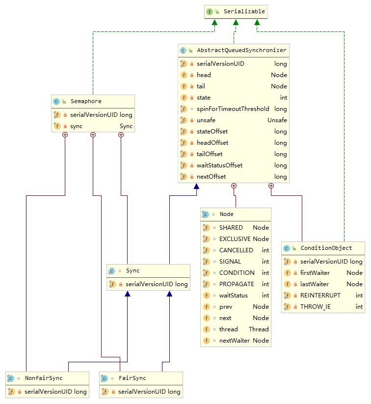
  Semaphore中的内部类`Sync`是AQS的子类，而`Sync`的子类`FairSync`和`NonfairSync`实现了Semaphore的公平锁模式和非公平锁模式的功能。**AQS中的ConditionObject是为独占锁模式服务的，在Semaphore中waitStatus将会用到`PROPAGATE`， 该状态用来继续传播唤醒CLH链表中的下一个线程节点。**  

2. 公平锁和非公锁的构造方法

  Semaphore中的静态内部类`FairSync`、`NonfairSync`实现了对应公平锁和非公平锁的功能。对应的构造方法如下：

  ```java
  //Semaphore可以显示生成公平锁和非公锁，其内部都会将传入的permits赋值给AQS中的state值，
  //表示当前锁的最多支持permits个线程同时持有该共享锁。
  //相比较而言，ReentrantLock中state值是记录当前占有锁的线程重入次数。
  public Semaphore(int permits, boolean fair) {
      sync = fair ? new FairSync(permits) : new NonfairSync(permits);
  }
  public Semaphore(int permits) {
      sync = new NonfairSync(permits);
  }
  FairSync(int permits) {
      super(permits);
  }
  NonfairSync(int permits) {
      super(permits);
  }
  Sync(int permits) {
      setState(permits);
  }
  ```

3. 公平锁和非公平锁获取锁流程

   公平锁和非公平锁的差别在于获取锁的流程中，由于我们之前学习过ReentrantLock对于其中的公平锁和非公锁也有一定的了解，我们以`acquire()`为例，一起来看一下。

   ```java
   //acquire其本身是在执行过程中响应打断的，这个我们待会关注。
   public void acquire() throws InterruptedException {
       sync.acquireSharedInterruptibly(1);
   }
   public final void acquireSharedInterruptibly(int arg)
       throws InterruptedException {
       //重置打断状态，如果当前线程被打断，因为acquire()方法其本身在执行过程中对于线程打断会做出响应，
       //所以这里直接抛出异常。
       if (Thread.interrupted())
           throw new InterruptedException();
       //尝试获取锁
       if (tryAcquireShared(arg) < 0)
           doAcquireSharedInterruptibly(arg);
   }
   //公平锁
   static final class FairSync extends Sync {
       private static final long serialVersionUID = 2014338818796000944L;
   
       FairSync(int permits) {
           super(permits);
       }
   	//公平锁版本的获取锁
       protected int tryAcquireShared(int acquires) {
           for (;;) {
               //首先是进入一个循环，因为在共享锁模式中，在获取锁的过程中可能存在线程竞争的情况。
               //方法执行hasQueuedPredecessors，检查CLH链表中第一个等待获取共享锁是否是当前线程。
               //当前是共享锁模式，需要保证先申请获取共享锁的线程，优先获取锁。
               //当CLH链表为空时，或者当前线程是CLH链表中第一个尝试获取锁的线程，
               //接着获取state值，扣除本次的permits值之后，若还有剩余许可量，则使用CAS的方式更新
               //state。因为共享锁本身是支持多个线程同时持有该锁。所以在此使用for循环+CAS的方式，
               //使得线程依次一个一个的获取该共享锁，直到remaining为0。
               //而如果remaining值小于0，表示Semaphore共享锁已经达到允许线程同时运行的最大个数，
               //进而获取锁失败。
               if (hasQueuedPredecessors())
                   return -1;
               int available = getState();
               int remaining = available - acquires;
               if (remaining < 0 ||
                   compareAndSetState(available, remaining))
                   return remaining;
           }
       }
   }
   //非公平锁
   static final class NonfairSync extends Sync {
       private static final long serialVersionUID = -2694183684443567898L;
   
       NonfairSync(int permits) {
           super(permits);
       }
   
       protected int tryAcquireShared(int acquires) {
           return nonfairTryAcquireShared(acquires);
       }
   }
   
   //从该方法可以看出，非公平锁和公平锁的主要区别在于，当尝试获取锁的过程中，非公平锁不会去检查CLH链表中
   //是否存在其他线程正在等待获取锁。
   final int nonfairTryAcquireShared(int acquires) {
       //非公平锁也是使用for循环+CAS的方式，保证当出现线程竞争的情况下，线程可以依次一个一个的获取锁，
       //直到remaining= 0。而当remaining <0表示共享锁已经达到允许线程同时运行的最大个数。
       for (;;) {
           int available = getState();
           int remaining = available - acquires;
           if (remaining < 0 ||
               compareAndSetState(available, remaining))
               return remaining;
       }
   }
   
   //当tryAcquireShared的返回值为小于0，表示当前线程获取Semaphore共享锁失败
   private void doAcquireSharedInterruptibly(int arg)
       throws InterruptedException {
       //addWaiter这个方法大家在看过ReentrantLock之后，就会比较熟悉。
       //用当前线程生成共享模式的Node节点，之后插入到CLH链表当中。
       final Node node = addWaiter(Node.SHARED);
       boolean failed = true;
       try {
           for (;;) {
               //当当前节点的直接前驱为head，表示当前线程是CLH链表中第一个等待获取锁的线程。
               //此时尝试获取锁。
               final Node p = node.predecessor();
               if (p == head) {
                   //获取锁成功之后，调用setHeadAndPropagate。其内部实现跟锁释放之前存在联动。
                   //我们在释放锁的环节展开。
                   int r = tryAcquireShared(arg);
                   if (r >= 0) {
                       setHeadAndPropagate(node, r);
                       p.next = null;
                       failed = false;
                       return;
                   }
               }
               //而如果当前线程不是CLH链表中第一个等待获取锁的线程，
               //又或者第一个等待获取锁的线程失败之后，将会进入到shouldParkAfterFailedAcquire
               //第一次使用CAS将其状态置为SIGNAL。成功之后调用parkAndCheckInterrupt阻塞当前线程。
               //以此多给一次线程尝试获取锁的机会。而如果当前节点在被阻塞的过程中被打断，由于当前方法在
               //执行过程中对于线程打断是做出响应的，将会抛出异常。最后执行到cancelAcquire中的逻辑，
               //来取消当前节点。
               if (shouldParkAfterFailedAcquire(p, node) &&
                   parkAndCheckInterrupt())
                   throw new InterruptedException();
           }
       } finally {
           if (failed)
               cancelAcquire(node);
       }
   }
   
   //在共享锁模式的情况下，此时mode的传参为Node.SHARED，将为当前线程生成共享模式的Node节点。
   //由于addWaiter方法，在共享锁模式当中也是会出现线程竞争的情况。此处使用CAS的方式，使得只有一个线程成功
   //添加到CLH链表的尾节点中。而当CLH链表为空的情况下，又或者CAS失败的线程都会进入到enq()的方法当中。
   private Node addWaiter(Node mode) {
       Node node = new Node(Thread.currentThread(), mode);
       Node pred = tail;
       if (pred != null) {
           node.prev = pred;
           if (compareAndSetTail(pred, node)) {
               pred.next = node;
               return node;
           }
       }
       enq(node);
       return node;
   }
   //enq方法内部就是for循环+CAS,使得获取锁失败的线程依次插入到CLH链表当中。
   private Node enq(final Node node) {
       for (;;) {
           Node t = tail;
           //CLH链表使用尾插法将节点插入，比较好理解。而当CLH链表为时，此时需要初始化插入一个空的Node节点
           //，之后将会根据该空的Node节点waitStatus状态，来唤醒后继子节点。这就是初始化Node插入链表
           //的意义。
           if (t == null) {
               if (compareAndSetHead(new Node()))
                   tail = head;
           } else {
               //对于其他节点使用CAS算法，通过尾插法的方式插入到CLH链表中。
               node.prev = t;
               if (compareAndSetTail(t, node)) {
                   t.next = node;
                   return t;
               }
           }
       }
   }
   
   //当前方法中存在三种逻辑，
   //1. 直接前驱节点状态为SIGNAL，表示之前已经执行shouldParkAfterFailedAcquire中的逻辑。
   //当之前前驱节点释放锁的时候，将唤醒当前节点。
   //2. 直接前驱节点状态大于0，表示前驱节点执行过cancelAcquire中的逻辑而取消。但是在cancelAcquire
   //中使用了Lazy模式，当节点取消只会情况Node的线程记录并标记状态为CANCELLED，之后将前驱节点的后继指针
   //指向当前节点的后继节点。所以，在此处需要更新当前节点的前驱指针。
   //3. 将当前前置节点的状态置为SIGNAL。前置节点状态由0变成SIGNAL，发生在新插入节点的情况。
   //前置节点的状态由PROPAGATE变成SIGNAL发生在共享锁连续释放锁的情况。
   private static boolean shouldParkAfterFailedAcquire(Node pred, Node node) {
       int ws = pred.waitStatus;
       if (ws == Node.SIGNAL)
           return true;
       if (ws > 0) {
           do {
               node.prev = pred = pred.prev;
           } while (pred.waitStatus > 0);
           pred.next = node;
       } else {
           compareAndSetWaitStatus(pred, ws, Node.SIGNAL);
       }
       return false;
   }
   //当节点的前驱节点的状态置为SIGNAL之后，将进入到该方法
   private final boolean parkAndCheckInterrupt() {
       //阻塞当前线程
       LockSupport.park(this);
       //当当前线程被唤醒或者被打断，将获取并重置打断状态。
       return Thread.interrupted();
   }
   
   //当线程在LockSupport.park()阻塞过程中被打断，之后抛出异常，
   //之后进入当前方法。
   private void cancelAcquire(Node node) {
       if (node == null)
           return;
   
       //取消节点步骤1: 清空线程信息
       node.thread = null;
   
       //当前和shouldParkAfterFailedAcquire中相似都是lazy模式，需要更新当前节点的前驱指针。
       Node pred = node.prev;
       while (pred.waitStatus > 0)
           node.prev = pred = pred.prev;
   
       Node predNext = pred.next;
   
   	//取消节点步骤2: 将当前节点状态置为CANCELLED
       node.waitStatus = Node.CANCELLED;
   
       //取消节点步骤3: 更新节点的指针
       //更新节点的指针分为三种情况。
       //1. 当前节点为tail指针指向节点，也就是CLH链表中最后等待获取锁的Node节点。
       //将tail指针前移指向直接前驱节点，之后将直接前驱的后继指针清空。
       
       //2. 当前节点为head指针的直接后继节点，也就是CLH链表中第一个等待获取锁的Node节点。
       //传入当前节点到unparkSuccessor，唤醒当前节点的下一个节点。之后处理当前取消节点的后继指针，
       //但是似乎，当前节点的后继节点的前驱指针还没有变更。但是实际上，对于后继节点来说，如果该节点
       //被唤醒之后将进入到shouldParkAfterFailedAcquire中更新节点的前驱指针，或者被取消进入到
       //cancelAcquire当前方法更新其前驱指针，这也就是上文讲的lazy模式。
       //而这种lazy模式的好处在于，当被唤醒的节点成功获取锁的时候，只需将其前驱指针清空。
       //而不需要当前驱节点被取消，之后重新赋值当前节点的前驱指针，之后等当前节点被唤醒之后成功获取锁，
       //再将当前节点的前驱指针置空，以此省略一个步骤。
       
       //3. 对于非tail指针指向的节点和非前驱指针为head的节点，换句话说CLH链表中等待锁释放的非首位节点
       //首先将前驱节点的状态置为SIGNAL，之后将前驱节点的后继指针指向直接后继节点。最后更新当前节点的后继
       //指针。同样的，后继节点的前驱指针没有在当前操作中更新，也是采用的lazy模式，
       //当前和跟情况2相似，不再赘述。
       if (node == tail && compareAndSetTail(node, pred)) {
           compareAndSetNext(pred, predNext, null);
       } else {
           int ws;
           if (pred != head &&
               ((ws = pred.waitStatus) == Node.SIGNAL ||
                (ws <= 0 && compareAndSetWaitStatus(pred, ws, Node.SIGNAL))) &&
               pred.thread != null) {
               Node next = node.next;
               if (next != null && next.waitStatus <= 0)
                   compareAndSetNext(pred, predNext, next);
           } else {
               unparkSuccessor(node);
           }
   
           node.next = node;
       }
   }
   ```

4. 释放锁流程

   无论是公平锁还是非公平锁在释放锁的流程中，处理方式相同。我们还是按照以下代码看一下

   ```java
   //释放锁的标准入口
   public void release() {
       sync.releaseShared(1);
   }
   //共享锁释放锁的逻辑大致分为两步
   //1. 归还permits给AQS中的state值
   //2. 唤醒后续节点
   public final boolean releaseShared(int arg) {
       if (tryReleaseShared(arg)) {
           doReleaseShared();
           return true;
       }
       return false;
   }
   //1. 归还permits给AQS中的state值
   protected final boolean tryReleaseShared(int releases) {
       for (;;) {
           //由于当前是共享锁模式，对于锁的释放依然存在线程竞争。当前采用for循环+CAS的方式，
           //当锁的释放出现线程竞争的时候，使得线程依次一个一个的释放锁，变更state值。
           int current = getState();
           int next = current + releases;
           if (next < current)
               throw new Error("Maximum permit count exceeded");
           if (compareAndSetState(current, next))
               return true;
       }
   }
   //2. 唤醒后续节点
   private void doReleaseShared() {
       for (;;) {
           Node h = head;
           //由于每次新节点插入CLH链表之后，先将前驱节点状态置为SIGNAL。标志当锁被释放时，唤醒当前节点
           //由于在释放锁的过程中，存在线程竞争。包证只有一个线程成功将head指针指向的节点状态由SIGNAL
           //变更为0，之后唤醒CLH链表中的第一个等待获取锁的节点。
           //而CAS失败的线程，将再次重新执行for循环中的内容，如果此时仍然存在线程竞争，仍旧只有一个线程
           //将CLH链表中的head指针指向的节点装态置为PROPAGATE。为后续的传播唤醒提供服务。
           //而CAS失败的线程，将重新执行for循环中的内容。头结点发生变化，则说明head指针向后移动，
           //在唤醒后续节点的过程中存在，新的Node节点获取了共享锁，再次重新执行for循环中的逻辑。
           if (h != null && h != tail) {
               int ws = h.waitStatus;
               if (ws == Node.SIGNAL) {
                   if (!compareAndSetWaitStatus(h, Node.SIGNAL, 0))
                       continue; 
                   unparkSuccessor(h);
               }
               else if (ws == 0 &&
                        !compareAndSetWaitStatus(h, 0, Node.PROPAGATE))
                   continue; 
           }
           if (h == head)
               break;
       }
   }
   ```

5. 传播唤醒逻辑

   传播唤醒本质上是，当共享锁释放锁之后，**如果满足特定条件（比如：共享锁的中state值仍然大于0）**,

   则会继续唤醒下一个节点，来获取当前可供使用的共享锁。

   在`release()`方法中，首先会释放并归还permits使得AQS中的state值将会增加。而当释放一个线程则将head指针指向的节点状态置为0。如果再释放一个permits则head指针指向的节点状态置为PROPAGATE表示

   为传播唤醒，暂不考虑存在新的节点尝试获取锁的情况，即便被唤醒的线程成功获取了锁，此时state值仍旧大于0，并允许线程被唤醒获取共享锁，以此提高吞吐量。

   现在我们一起来看，之前的一段代码。

   ```java
   private void doAcquireSharedInterruptibly(int arg)
       throws InterruptedException {
       //当前代码之前已经一起看过，将节点以共享模式插入到CLH链表中。
       //在此我们关注当线程被唤醒之后，从parkAndCheckInterrupt执行结束。
       //将再次进入for循环，且当线程成功获取锁，而此时remaining值必然大于等于0。
       //此时进入setHeadAndPropagate逻辑。
       final Node node = addWaiter(Node.SHARED);
       boolean failed = true;
       try {
           for (;;) {
               final Node p = node.predecessor();
               if (p == head) {
                   int r = tryAcquireShared(arg);
                   if (r >= 0) {
                       setHeadAndPropagate(node, r);
                       p.next = null;
                       failed = false;
                       return;
                   }
               }
               if (shouldParkAfterFailedAcquire(p, node) &&
                   parkAndCheckInterrupt())
                   throw new InterruptedException();
           }
       } finally {
           if (failed)
               cancelAcquire(node);
       }
   }
   
   //当前方法虽为传播唤醒的主逻辑，但存在不必要唤醒的情况。
   private void setHeadAndPropagate(Node node, int propagate) {
       //记录前head指针指向的节点
       Node h = head;
       //由于当前节点已经从tryAcquireShared中成功获取锁，此时需要将head节点向后移动。
       setHead(node);
       //doReleaseShared()将会继续唤醒下一个线程，也就是传播唤醒的主逻辑，
       //而进入传播唤醒大致分为三种情况。
       //1.propagate>0  表示当前AQS中的state值仍然大于0, 支持更多的线程来获取共享锁。
       
       //2. h == null || h.waitStatus < 0 当前情况为常规判空写法，也存在多种情况。
       //首先持有共享锁的A释放了锁，此时state值变为1, 而head指向的节点状态被置为0。
       // 被唤醒的节点X获取锁之后，刚准备进入setHeadAndPropagate方法。此时原来持有锁的线程B释放了锁，
       //由于head指向的节点state值为0，所以线程B直接将其置为PROPAGATE，但是对于线程X来说，
       //setHeadAndPropagate的入参此时为0，而实际上，当前state值为>0，所以将会进入到
       //propagate == 0 且 h == null || h.waitStatus < 0 的情况，此时仍旧需要传播唤醒,
       //且当前是有效唤醒。
       //在当前情况中，Node.PROPAGATE状态使得共享锁提高了吞吐量
       
       //3. (h = head) == null || h.waitStatus < 0 
       //(3.1)首先持有共享锁的A释放了锁，state值变为1，
       //head被指向的值置为0。此时CLH链表中有线程X和线程Y，由于线程Y是刚插入CLH链表中，还未来的将
       //线程X的状态由0变为SIGNAL，线程X被唤醒并获取锁之后，在head指针向后移动之后，此时线程
       //B释放了锁，而由于CLH链表中，新的head节点状态还为0，此时线程B将其置为propagate。
       //此时propagate== 0 且h.waitStatus == 0 且新head.waitStatus <0, 当前情况仍然为有效唤醒。
       
       //(3.2)首先持有共享锁的A释放锁，state值变为1，head被指向的值置为0，此时CLH链表中存在多个线程，
       //线程X的前驱节点为head，且线程X状态节点为SIGNAL。当线程X获取锁之后，
       //此时 propagate== 0 且  h.waitStatus == 0 而(h = head) == null || h.waitStatus<0
       //虽然满足传播唤醒的条件，但是此时state值为0，当前属于无必要唤醒
       if (propagate > 0 || h == null || h.waitStatus < 0 ||
           (h = head) == null || h.waitStatus < 0) {
           Node s = node.next;
           if (s == null || s.isShared())
               doReleaseShared();
       }
   }
   ```

6. 公平锁和非公锁加锁举例

   为了方便理解，我们使用几个例子一起来过一遍Semaphore的加锁模式。

* 6.1公平锁加锁和解锁流程

  以Semaphore信号量为2，ThreadA、ThreadB、ThreadC、ThreadD尝试获取公平共享锁。

  ```java
  Semaphore semaphore =new Semaphore(2, true);
  ```

  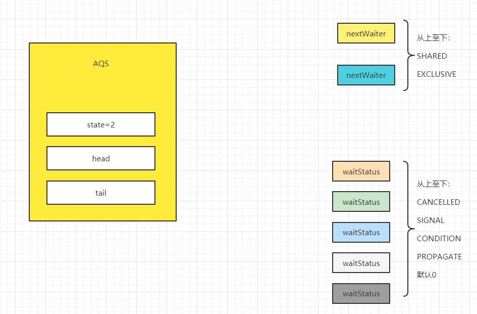

  * ThreadA获取锁

    首先ThreadA进入`acquire()`方法中子方法`tryAcquireShared`，由于CLH链表为空，表明当前CLH链表中没有线程在ThreadA之前排队，获取state值并使用CAS更新成功。

    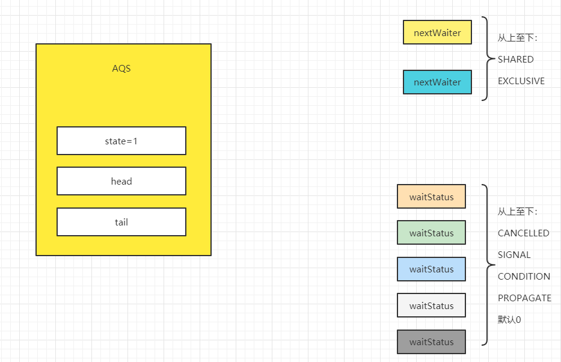

  * ThreadB获取锁

    ThreadB也是进入`acquire()`方法中的子方法`tryAcquireShared`， 同样的CLH链表此时为空，没有线程在ThreadB之前排队等待获取锁，

    直接获取state值，使用CAS更新成功。

    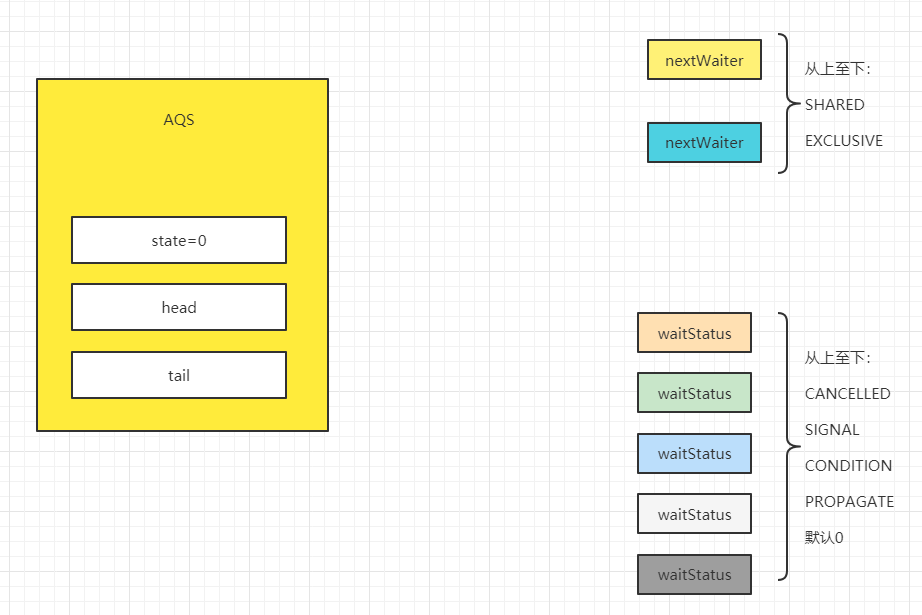

  * ThreadC获取锁

    ThreadC进入acquire()中的内部子方法`tryAcquireShared`， 此时CLH链表依然为空，在获取state值并计算remaining值，发现其小于0。顺势进入`doAcquireSharedInterruptibly`方法，首先进入`addWaiter`方法，由于CLH链表为空尚未初始化，所以再次进入`enq`方法。首先先向CLH链表中插入一个空节点，并使得head和tail节点都指向当前节点。之后再使用尾插法插入ThreadC当前节点并更新tail指针。由于ThreadC的前驱节点为head，再次调用`tryAcquireShared`获取锁失败之后。进入到`shouldParkAfterFailedAcquire`将直接前驱节点也就是head指向的空节点状态置为SIGNAL，等到再次执行循环中`parkAndCheckInterrupt`进行阻塞当前线程。

    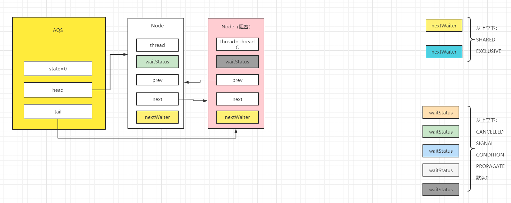

  * ThreadA释放锁

    ThreadA调用`release()`方法中的`tryReleaseShared`, 获取state值，并使用CAS更新state值。

    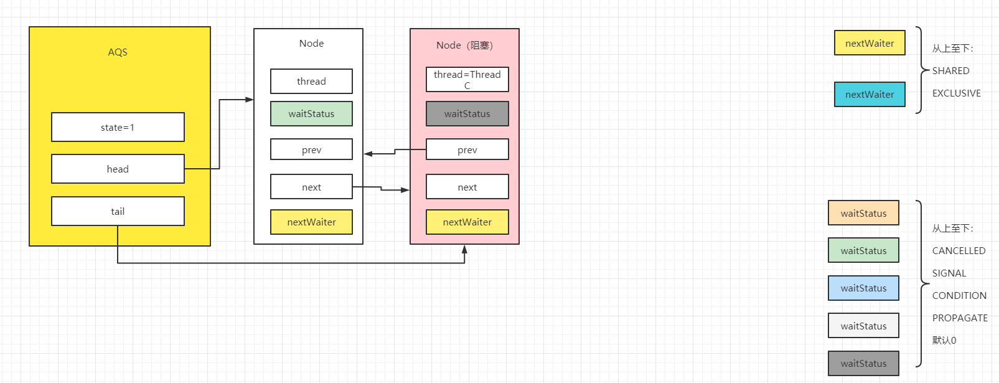

  * ThreadA唤醒下一个节点前，ThreadD尝试获取锁

    ThreadD在ThreadA释放锁之后，唤醒CLH链表head指向节点之前尝试获取锁，首先也是进入到acquire()方法中的子方法`tryAcquireShared`中，**由于当前是公平锁，CLH链表存排队在ThreadD之前的Node节点，导致获取锁失败。**之后进入到`doAcquireSharedInterruptibly`中，首先调用`addWaiter`方法将当前节点使用尾插法插入到CLH中。由于ThreadD的直接前驱节点不是head，之后进入`shouldParkAfterFailedAcquire`，将前驱节点的状态置为SIGNAL，再次执行循环之后，在`parkAndCheckInterrupt`中阻塞当前线程。

    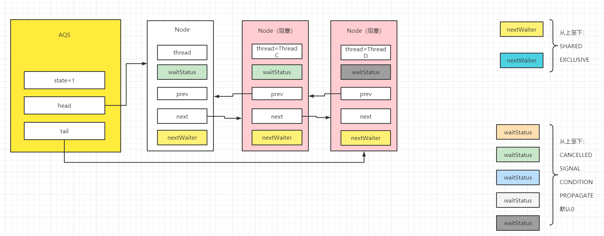

  * ThreadA唤醒下一个节点

    ThreadA进入`doReleaseShared()`，由于head的状态为SIGNAL，首先使用CAS将状态置为0。之后执行`unparkSuccessor`逻辑，唤醒下一个线程也就是ThreadC。

    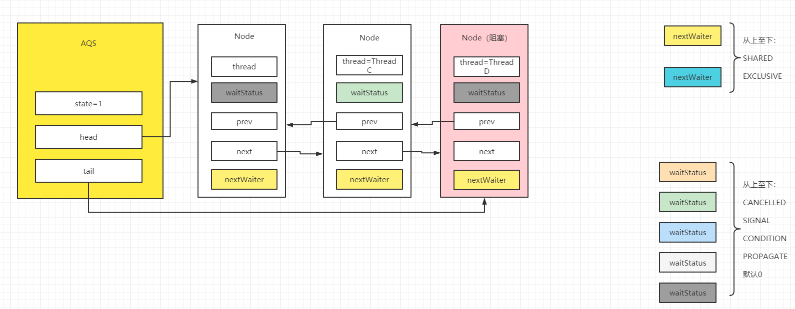

  * ThreadC再次尝试获取锁

    ThreadC被唤醒之后，再次执行`doAcquireSharedInterruptibly`中的循环逻辑，尝试获取锁之后，使用CAS将state值置为0，进入`setHeadAndPropagate`中逻辑。head节点后移，**此时发现propagate为0，h.waitStatus为0, 但是`(h = head) == null || h.waitStatus < 0`满足条件，此时出现传播唤醒的逻辑，也就是将唤醒head的下一个节点。**而即将被唤醒的节点为ThreadD。

    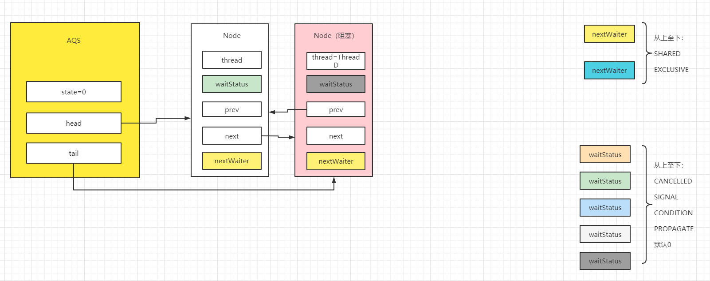

  * **ThreadD的传播唤醒（当前为不必要的传播唤醒）**

    ThreadD被唤醒之后，将再次执行`doAcquireSharedInterruptibly`中的逻辑，但是获取锁失败，发现前驱节点状态已经是SIGNAL，所以再次阻塞当前线程。

    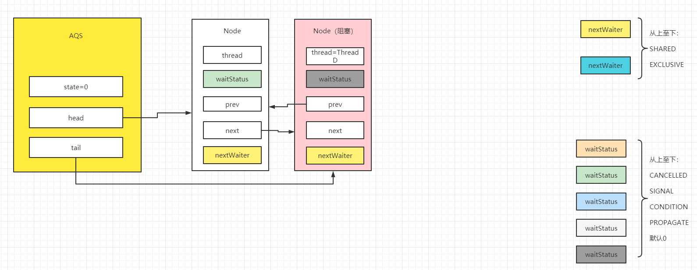

  * ThreadB尝试释放锁

    ThreadB进入到`release()`中子方法`tryReleaseShared`的逻辑，由于当前不存在线程竞争的情况，使用CAS直接将state值更新即可。之后进入`doReleaseShared`逻辑，由于head指向的节点状态为SIGNAL，将其置为0，并唤醒下一个节点。

    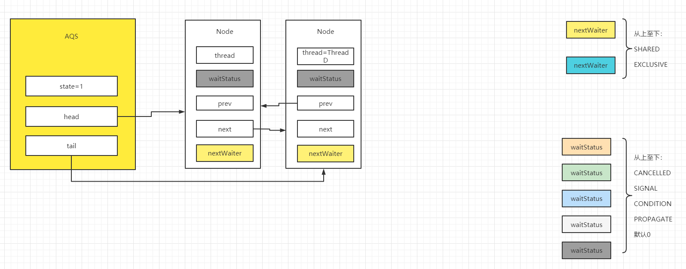

  * ThreadD被唤醒之后尝试获取锁

    ThreadD被唤醒之后，进入到`doAcquireSharedInterruptibly`中的循环逻辑，使用CAS获取锁之后，进入`setHeadAndPropagate`, 更新了head执行信息。当前propagate为0，`h == null || h.waitStatus < 0 `不满足并且`(h = head) == null || h.waitStatus < 0`也不满足。所以无需唤醒。

    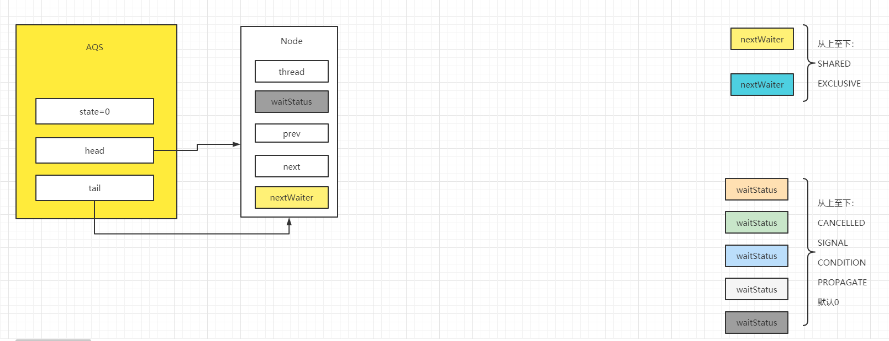

  * ThreadC释放锁

    ThreadC进入到`tryReleaseShared`的逻辑，使用CAS更新了state值。**之后进入`doReleaseShared`逻辑，发现head指针和tail指针指向同一个节点，表示CLH链表当前没有线程正在等待获取锁的Node节点。**

    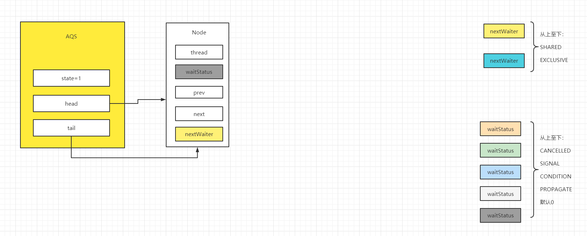

  * ThreadD释放锁

    ThreadD的情况和ThreadC类似，不再赘述。

    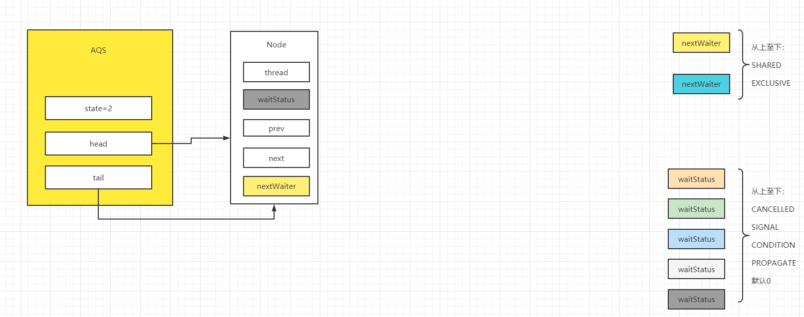

* 6.2非公平锁加锁和解锁流程

  为了方便对比学习，我们还是以Semaphore信号量为2，ThreadA、ThreadB、ThreadC、ThreadD尝试获取公平共享锁。其构造方法如下：

  ```java
  //Semaphore共享锁默认使用非公平锁是为了提高吞吐量
  Semaphore semaphore =new Semaphore(2, false);
  Semaphore semaphore =new Semaphore(2);
  ```

  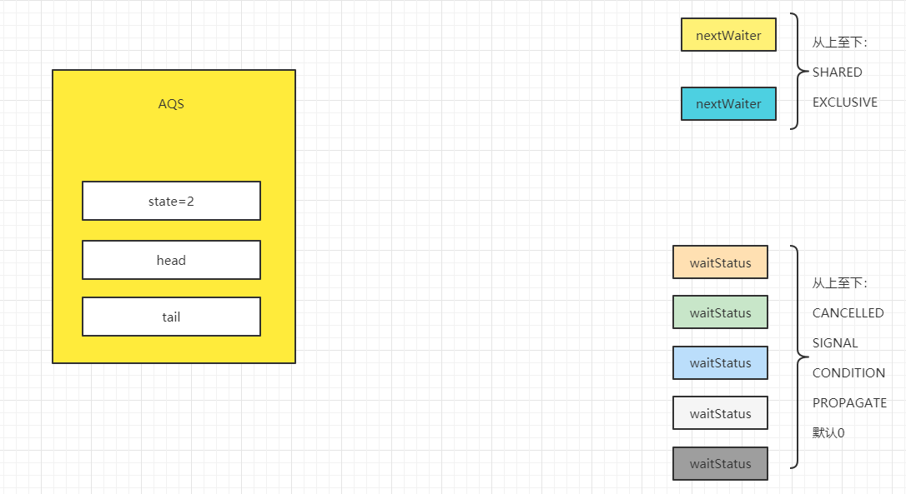

  * ThreadA尝试获取锁

    ThreadA进入`acquire()`中子方法`tryAcquireShared`的逻辑，对于非公平锁的逻辑相对简单，只需要获取state值在减去当前可用的permits能够大于等于0，也就是说共享锁中state值仍旧存在permits可供当前线程使用，即可使用CAS更新state值。

    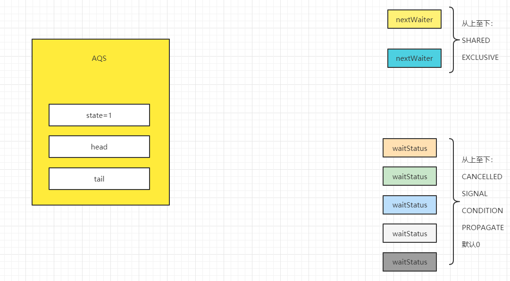

  * ThreadB尝试获取锁

    ThreadB执行`acquire()`中的子方法`tryAcquireShared`，计算得remaining值为0，表示ThreadB可以获取该共享锁，使用CAS更新state值即可。

    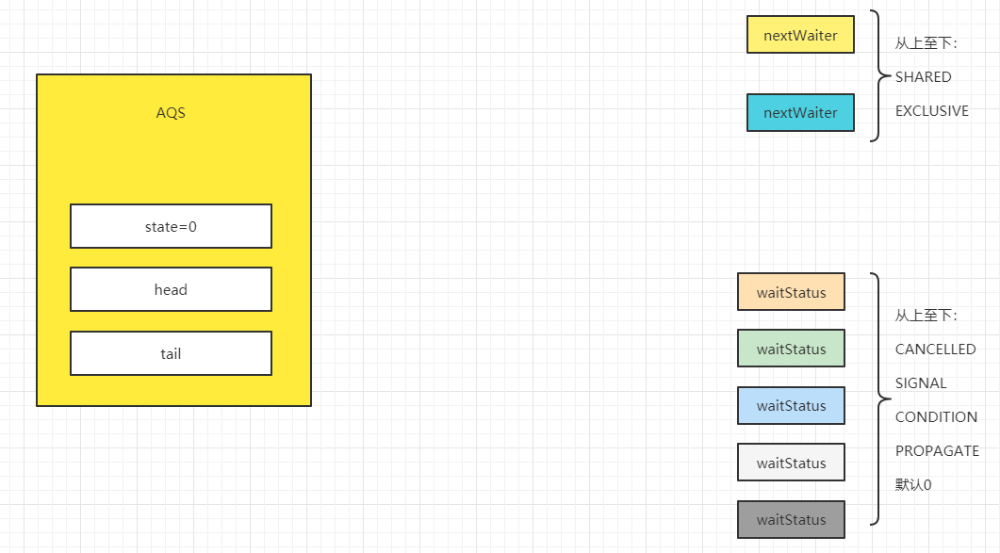

  * ThreadC尝试获取锁

    ThreadC执行`acquire()`中的子方法`tryAcquireShared`，由于当前共享锁中的state值为0，经计算得到的remaining值为-1，表示Semaphore共享锁中没有多余的permits供ThreadC获取。之后进入`doAcquireSharedInterruptibly`中的逻辑，首先是进入`addWaiter`子方法，由于CLH链表采用的是尾插法，且CLH链表还为初始化，进入`enq`中逻辑。首先先进行初始化Node节点，使得AQS中head和tail指针指向当前空Node节点，再使用尾插法将`ThreadC`生成的Node节点插入到CLH链表中并更新tail指针。

    **插入到CLH链表中，由于当前ThreadC还占用着CPU资源，所以继续往下执行。**`ThreadC`的前驱节点为head，当ThreadC再次尝试获取锁失败之后，将进入`shouldParkAfterFailedAcquire`将前驱节点的状态置为SIGNAL，表示当有线程释放共享锁之后，将唤醒当前节点。之后ThreadC再次执行`doAcquireSharedInterruptibly`中的循环，**之后调用`LockSupport.park()`阻塞当前线程，释放CPU资源。**

    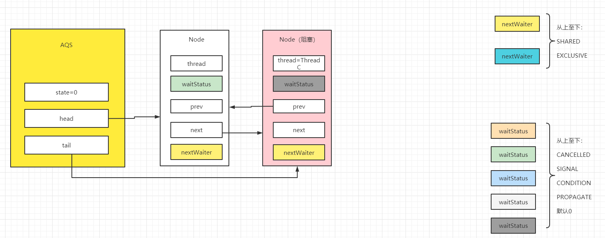

  * ThreadA释放锁

    ThreadA进入到`release()`中子方法`tryReleaseShared`中的逻辑，由于当前例子中不存在线程竞争的情况，所以ThreadA直接归还permits，使用CAS更新state值即可。

    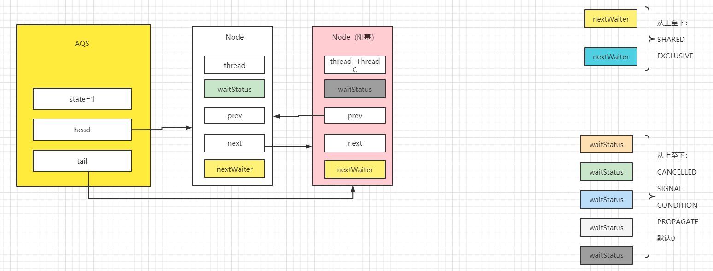

  * 在ThreadA唤醒下一节点前，ThreadD尝试获取共享锁

    ThreadD执行到`acquire()`的子方法`tryAcquireShared`的逻辑，**由于当前是非公平锁，不需要检查CLH链表中排队情况，所以只要AQS中state值存在permits可供当前线程使用，ThreadD使用CAS更新state值即可。**

    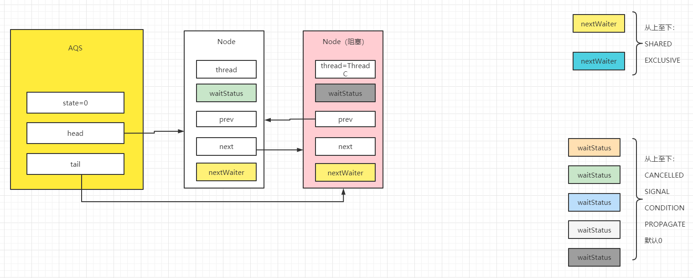

  * ThreadA尝试唤醒后继节点

    ThreadA执行到`doReleaseShared`中逻辑，由于当前AQS中含有Node节点且head指向的节点SIGNAL，首先使用CAS将state值置为0，接着执行`unparkSuccessor`唤醒CLH链表中的下一个节点当前为ThreadC。

    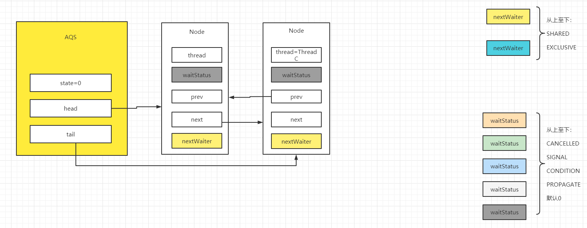

  * ThreadC被唤醒，尝试获取锁

    ThreadC将继续执行`doAcquireSharedInterruptibly`中的逻辑，由于前驱节点为head节点，尝试获取锁失败之后，将调用`shouldParkAfterFailedAcquire`方法将前驱节点的状态置为SIGNAL，并再次执行循环中的内容，并进入`parkAndCheckInterrupt`阻塞当前线程。

    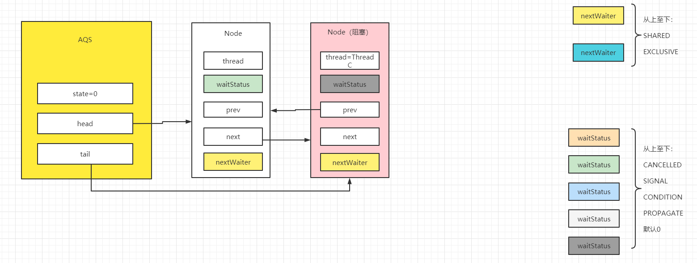

  * ThreadB释放锁

    ThreadB进入`release()`中的子方法`tryReleaseShared`， 当前锁释放不存在线程竞争，所以直接使用CAS更新state值。之后进入`doReleaseShared`逻辑，由于head指向的节点状态为SIGNAL，此处使用CAS将其置为0，并调用`unparkSuccessor`方法唤醒ThreadC。

    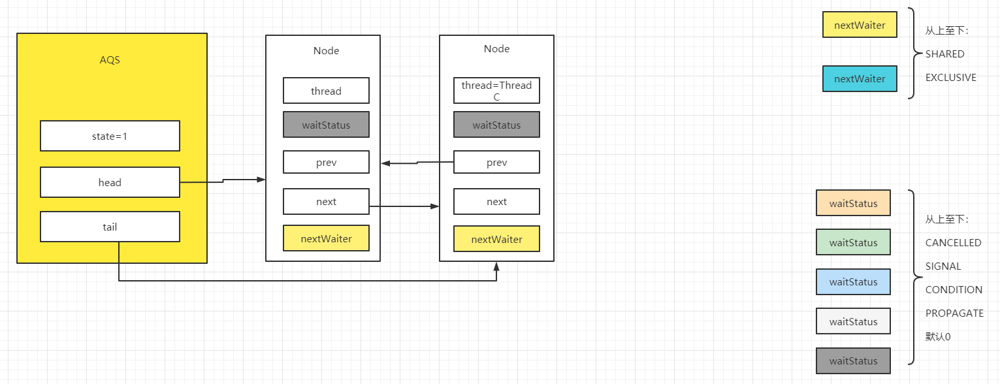

  * ThreadC被唤醒，再次尝试获取锁

    ThreadC被唤醒之后，继续执行`doAcquireSharedInterruptibly`中的逻辑。获取锁之后，进入setHeadAndPropagate的逻辑，更新了head节点之后，清空head线程信息，由于AQS中没有多余的permits所以propagate为0，且前head节点状态为0不满足`h == null || h.waitStatus < 0`， 当前head节点由于是CLH链表中最后一个节点状态为0，同样不满足`(h = head) == null || h.waitStatus < 0`所以无需唤醒下一节点。

    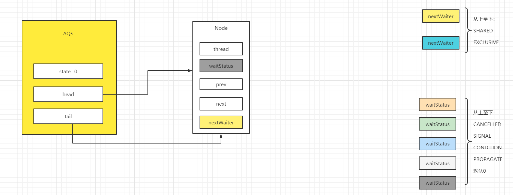

  * ThreadC释放锁

    ThreadC执行完业务逻辑，进入到`release()`中子方法`tryReleaseShared`，由于在当前例子中释放锁的流程不存在线程竞争，但是就即便出现线程竞争Semaphore采用的是for循环+CAS，使得共享锁依次一个一个的释放。最后使用CAS更新state值，ThreadC归还了permits。**之后进入到doReleaseShared逻辑中，由于tail指针和head指针指向同一个节点，这表明CLH链表为空，无需唤醒下一个节点。**

    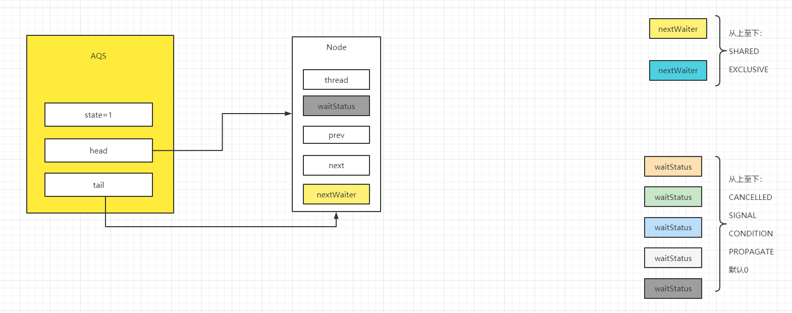

  * ThreadD释放锁

    ThreadD释放锁的流程和ThreadC相似，使用CAS更新完state值归还permits之后，由于CLH链表为空，不需要唤醒下一个节点。
7. `acquire()`和`acquireUninterruptibly`

   `acquire()`在共享锁中为执行过程中获取锁可中断，`acquireUninterruptibly`在共享锁中为执行中获取锁不可中断。我们一起来看下代码上差异。

   ```java
   //该方法在获取锁中的时候，对于线程的打断会有所响应
   public void acquire() throws InterruptedException {
       sync.acquireSharedInterruptibly(1);
   }
   //检查并重置线程打断状态，当线程被打断，抛出InterruptedException 中断方法的执行。
   public final void acquireSharedInterruptibly(int arg)
       throws InterruptedException {
       if (Thread.interrupted())
           throw new InterruptedException();
       if (tryAcquireShared(arg) < 0)
           doAcquireSharedInterruptibly(arg);
   }
   
   private void doAcquireSharedInterruptibly(int arg)
       throws InterruptedException {
       final Node node = addWaiter(Node.SHARED);
       boolean failed = true;
       try {
           for (;;) {
               final Node p = node.predecessor();
               if (p == head) {
                   int r = tryAcquireShared(arg);
                   if (r >= 0) {
                       setHeadAndPropagate(node, r);
                       p.next = null;
                       failed = false;
                       return;
                   }
               }
               //当线程被唤醒或打断之后，会检查线程打断状态，当线程被打断抛出
               //InterruptedException, 最后进入cancelAcquire方法，将CLH链表中
               //当前节点状态置为SIGAL,取消当前节点。
               if (shouldParkAfterFailedAcquire(p, node) &&
                   parkAndCheckInterrupt())
                   throw new InterruptedException();
           }
       } finally {
           if (failed)
               cancelAcquire(node);
       }
   }
   //当前方法为获取锁过程中，不响应线程的打断
   public void acquireUninterruptibly() {
       sync.acquireShared(1);
   }
   
   //当前不再检查线程是否被打断
   public final void acquireShared(int arg) {
       if (tryAcquireShared(arg) < 0)
           doAcquireShared(arg);
   }
   
   private void doAcquireShared(int arg) {
       final Node node = addWaiter(Node.SHARED);
       boolean failed = true;
       try {
           boolean interrupted = false;
           for (;;) {
               final Node p = node.predecessor();
               if (p == head) {
                   int r = tryAcquireShared(arg);
                   if (r >= 0) {
                       setHeadAndPropagate(node, r);
                       p.next = null;
                       if (interrupted)
                           selfInterrupt();
                       failed = false;
                       return;
                   }
               }
               //当线程被唤醒或者打断之后，只是检查并线程是否被打断的状态，
               //之后将继续执行for循环中的内容，不会因为线程被打断而进入cancelAcquire方法。
               if (shouldParkAfterFailedAcquire(p, node) &&
                   parkAndCheckInterrupt())
                   interrupted = true;
           }
       } finally {
           if (failed)
               cancelAcquire(node);
       }
   }
   ```

8. 总结

   Semaphore是AQS中共享锁模式的实现，相对于ReentrantLock来说，节点多了`propagate`状态，是为了传播唤醒更多的线程获取共享锁，提高吞吐量。同时AQS中Condition Queue也是为ReentrantLock服务，包括

   `exclusiveOwnerThread`也是为ReentrantLock服务，用来标志当前锁被那个线程占有。此外，Semaphore作为信号量可以完成限流的工作。