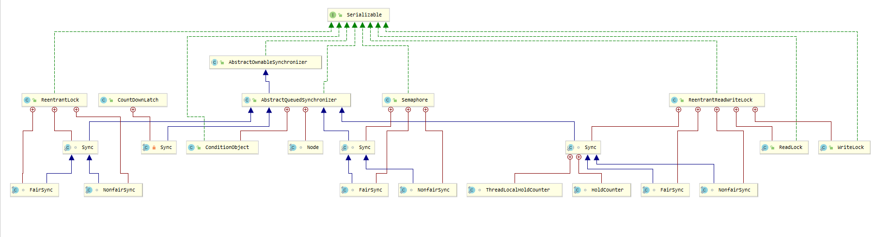
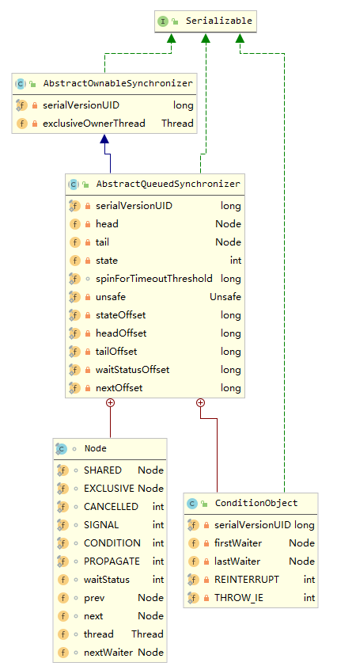

#### 浅析并发编程(六)AQS源码分析(一)独占锁模式

1. 定义

AQS全名`AbstractQueuedSynchronizer`，也叫抽象同步队列，是J.U.C.包下的成员，与`synchronized`一样，都是学习并发编程的重要的节点。

我们一起通过AQS的族谱图更直观的了解，



从图中可以得知，`ReentrantLock`中的内部类`Sync`继承自AQS，其子类有`FairSync`和`NonfairSync`用以实现`ReentrantLock`的公平锁和非公平锁的功能。此外，`CountDownLatch`的内部类`Sync`、`Semaphore`的内部类`Sync`，以及`ReentrantReadWriteLock`内部类`Sync`，都继承AQS。

了解完AQS以及其子类的继承关系之后，我们再一起来看AQS这个类的类图，



2. AQS中类的属性介绍

从图上可以看到，AQS其本身继承自`AbstractOwnableSynchronizer`，实现了序列化接口，且拥有两个内部类`Node`和`ConditionObject`。我们就其中的属性，逐一查看。

   	2.1 `AbstractOwnableSynchronizer`属性

* `exclusiveOwnerThread`: AQS就其本身分为独占模式和共享模式，当处于独占模式的时候，该字段用来保存占用其独占锁的线程。

* `head`:  用来指向CLH队列的头结点，而CLH就其名字来源于`Craig`、` Landin`、`Hagersten`的三个人名的缩写，CLH其实是由AQS内部类Node的节点组成的FIFO的双向链表。

* `tail`:  用来指向CLH队列的尾节点。

* `state`: 是为同步状态，在独占锁模式和共享锁模式作用不同。在`ReentrantLock`中表示当线程重入的次数， 在`Semaphore`中表示当前剩余可用量的计数。

* `spinForTimeoutThreshold`: 是为值为`1000L`的常量， 用于阻塞线程，纳秒级别的设定阈值。

* `unsafe`: 在当前类中用来实现CAS算法，以及获取某字段对于Java对象的偏移量。

* `stateOffset`: state字段相对于实例对象的偏移量，用于CAS算法的入参。

* `headOffset`: head字段相对于实例对象的偏移量，用于CAS算法的入参。

* `tailOffset`: tail字段相对于实例对象的偏移量，用于CAS算法的入参。

* `waitStatusOffset`: Node内部类`waitStatus`字段相对于实例对象的偏移量，用于CAS算法的入参。

* `nextOffset`: Node内部类`next`字段相对于实例对象的偏移量，用于CAS算法的入参。'

  2.2 `Node`内部类属性

Node节点是CLH双向链表和condition queue队列的组成部分。

* `SHARED`: 当Node节点加入CLH之前，将其赋值给`nextWaiter`, 表示当前节点为共享模式节点。

* `EXCLUSIVE`: 当Node节点加入CLH之前，将其赋值给`nextWaiter`, 表示当前节点为独占模式节点。

* `CANCELLED`: 常量值为1， 将值赋值给`waitStatus`字段，表示当前节点因为超时或者被打断，标记为取消状态。

* `SIGNAL`: 常量值为-1，将值赋值给`waitStatus`字段，当后一个节点调用park系列方法阻塞，设置当前节点为SIGNAL。而当当前节点释放或取消会`unpark`其后继节点。

* `CONDITION`: 常量值为-2， 将值赋值给`waitStatus`字段，表示当前Node因为调用await系列方法，进入到condition queue中，也就是`ConditionObject`中`firstWaiter`、`lastWaiter`指向的链表。而当其他线程调用了signal系列方法，当前节点就会进入到CLH链表中。

* `PROPAGATE`: 常量值为-3，也是将值赋值给`waitStatus`字段，共享模式节点下使用。比较而言`SIGNAL`状态只会唤醒其下一个节点，`PROPAGATE`会继续向后唤醒。

* `waitStatus`: 初始值为0，用以标记当前节点所处状态，常见状态共有：`CANCELLED`、 `SIGNAL`、`CONDITION`、`PROPAGATE`情况。

* `prev`: CLH是为双向链表，`prev`用于指向当前节点的直接前驱节点。

* `next` ：用于指向当前节点的直接后继节点。

* `thread`: 用于保存进入链表的线程，包括CLH链表和condition queue队列。

* `nextWaiter`: 该字段一式两用，在CLH链表中表示当前节点为独占模式或者共享模式，在condition queue中用来指向当前节点的直接后继。

  2.3内部类`ConditionObject`属性

`ConditionObject`为AQS中独占模式服务，当调用了`await()`系列方法，此时会生成`waitStatus`为`CONDITION`、thread为当前线程的Node节点，并将当前节点在Condition queue队列中入队。

* `firstWaiter`: 指向Condition queue队列中的第一个节点，且节点类型为Node。
* `lastWaiter`: 指向Condition queue队列中的最后一个节点，且节点类型为Node。
* `THROW_IE`: 常量值为-1，表示在调用`singal`系列方法之前被打断。
* `REINTERRUPT`: 常量值为1，表示在调用`signal`系列方法之后被打断。

3. 加锁、解锁流程

   因为AQS本身是一个抽象类，在此处我们以`ReentrantLock`的内部类`FairSync`也就是AQS的子类为例，了解一下加锁和解锁的流程。


 3.1 加锁流程

   ```java
static final class FairSync extends Sync {
    private static final long serialVersionUID = -3000897897090466540L;
    //重写父类Sync的lock方法，传入值为1。
    final void lock() {
        acquire(1);
    }
    ...
}

public final void acquire(int arg) {
    //tryAcquire获取锁失败之后，继续调用addWaiter()、acquireQueued()，生成关于当前线程的独占模式	//的节点，之后插入CLH的链表。然后将当前节点的直接前驱的waitStatus置为SIGNAL，而当前节点也会调用
    //LockSupport.park系列方法，处于阻塞状态。当被打断后，调用selfInterrupt方法。
    if (!tryAcquire(arg) &&
        acquireQueued(addWaiter(Node.EXCLUSIVE), arg))
        selfInterrupt();
}
//tryAcquire内部实现，当前入参为1
protected final boolean tryAcquire(int acquires) {
    //获取state值，当state值为0的时候，查看CLH队列中是否有其他线程的Node节点正在等待，如果没有，
    //使用CAS将state值从0赋值为入参，当前情况入参为1，所以对于第一个线程节点来说，
    //不需要进入CLH链表，并将exclusiveOwnerThread赋值为当前线程，完成之后退出。
    //而对于同一批进来的其他线程来说，state的预期值不再是0，所以也就保证了只有一个线程获取了
    //独占锁。
    final Thread current = Thread.currentThread();
    int c = getState();
    if (c == 0) {
        if (!hasQueuedPredecessors() &&
            compareAndSetState(0, acquires)) {
            setExclusiveOwnerThread(current);
            return true;
        }
    }
    //代码能走到这个地方，包括好几种情况。
    //1. 线程重入，此时将state递增，因为当前线程拥有ReentrantLock的锁，
    //所以此处直接将state直接置为新值，无需使用CAS，完成之后退出。
    //2. 其他线程尝试获取锁，exclusiveOwnerThread没有指向该线程跳过
    else if (current == getExclusiveOwnerThread()) {
        int nextc = c + acquires;
        if (nextc < 0)
            throw new Error("Maximum lock count exceeded");
        setState(nextc);
        return true;
    }
    return false;
}
//查看CLH链表中是否有存在排在当前线程之前的线程Node节点。
//在双向链表FIFO的CLH中，首先判断CLH是否有元素，也就是是否指向同一个节点，
//有元素之后，查看下一个节点是否是当前节点。
public final boolean hasQueuedPredecessors() {
    Node t = tail; 
    Node h = head;
    Node s;
    return h != t &&
        ((s = h.next) == null || s.thread != Thread.currentThread());
}

//当tryAcquire返回false之后，尝试将当前线程插入到CLH双向链表中
private Node addWaiter(Node mode) {
    //生成Node节点，对于独占锁来说，mode为Node.EXCLUSIVE，该独占模式的标记保存在nextWaiter中
    Node node = new Node(Thread.currentThread(), mode);
    //tail始终指向CLH链表中的最后一个元素，当tail为NULL时，
    //需要对CLH链表来进行初始化，同时将该节点插入到CLH链表中，这也就是为什么需要enq()方法的原因。
    //而如果CLH链表中已经存在线程节点之后，将当前节点的pre指向CLH链表的尾节点
    //之后使用CAS，将tail指向当前节点，之后将直接前驱节点的后继指针指向当前节点，完成之后退出。
    //考虑到多线程的情况，对于其他线程来说tail指针不再指向原先的尾部节点，导致预期值不一样，
    //无法完成入队。所以enq()这个方法，还需要完成兜底的工作。将CAS失败的其他线程节点，
    //插入到CLH双向链表中。
    Node pred = tail;
    if (pred != null) {
        node.prev = pred;
        if (compareAndSetTail(pred, node)) {
            pred.next = node;
            return node;
        }
    }
    enq(node);
    return node;
}
//当tail指向NULL，考虑到当多个线程节点插入CLH链表，而此时CLH链表中恰好没有线程Node节点，
//所以此时使用CAS将head从NULL指向一个空白的Node节点，完成初始化
//之后将多个线程节点使用CAS依次使用尾插法插入到CLH链表当中。
private Node enq(final Node node) {
    for (;;) {
        Node t = tail;
        if (t == null) {
            if (compareAndSetHead(new Node()))
                tail = head;
        } else {
            node.prev = t;
            if (compareAndSetTail(t, node)) {
                t.next = node;
                return t;
            }
        }
    }
}

//线程节点进入CLH双向链表当中之后，传参传入当前节点，以及state值的增量值
//当前的入口是lock()，所以arg此处为1。
final boolean acquireQueued(final Node node, int arg) {
    boolean failed = true;
    try {
        boolean interrupted = false;
        for (;;) {
            //获取node节点的直接前驱节点
            final Node p = node.predecessor();
            //当直接前驱节点为head，此时说明当前node节点，是CLH链表中等待获取锁的第一个。
            //对于当前节点再次尝试调用调用tryAcquire。当当前节点成功获取锁之后，
            //将清空当前节点，head指针向后移动指向当前被清空的节点，断开node直接前驱节点和
            //node节点的指针关联。所以当前节点在此处比CLH链表的后续节点多了一次获取锁的机会。
            if (p == head && tryAcquire(arg)) {
                setHead(node);
                p.next = null;
                failed = false;
                return interrupted;
            }
            //代码能够走到这个地方，存在多种可能。
            //1. 当前节点没有获取锁，此处需要判断当前线程是否需要被阻塞，从而释放CPU资源。
            //2. 当前节点的后继Node节点们，也会进入到这里。
            //所以在此处，当判断出当前节点需要被阻塞的时候，将会在parkAndCheckInterrupt
            //中阻塞当前线程Node节点。而当当前线程节点被unpark系列方法唤醒，
            //或者被中断并没有响应中断，而是再次执行循环中的逻辑。直到获取锁退出，
            //之后执行到finally中内容，failed值为false。
            //
            //但是，在doAcquireInterruptibly中的逻辑会对中断进行响应并抛出异常，此时会进入
            //到finally，此时将会更新当前节点状态为取消。关于这边的逻辑，
            //我们在ReentrantLock中进行展开。    
            if (shouldParkAfterFailedAcquire(p, node) &&
                parkAndCheckInterrupt())
                interrupted = true;
        }
    } finally {
        if (failed)
            cancelAcquire(node);
    }
}

private static boolean shouldParkAfterFailedAcquire(Node pred, Node node) {
    //首先获取node的直接前驱节点waitStatus状态。
    int ws = pred.waitStatus;
    //当为SIGNAL表示，当持有锁的线程节点释放锁的时候，会尝试唤醒当前节点
    //无需额外操作，当前节点可以安心调用park()系列方法，完成阻塞。
    if (ws == Node.SIGNAL)
        return true;
    //当ws大于0，也就是说前驱节点状态为cancelled，说明前驱节点被取消。
    //此时前驱节点指针向前移动，直到找到一个状态不为cancelled的节点。
    //并更新新的前驱节点和当前节点的指针。
    if (ws > 0) {
        do {
            node.prev = pred = pred.prev;
        } while (pred.waitStatus > 0);
        pred.next = node;
    } else {
        //代码能执行到这个地方存在两种可能
        //1. 前驱节点的waitStatus值为0，表示当前节点，是第一个在CLH链表中等待的节点。
        //而head节点指向的是初始化的空的Node节点，此时使用CAS的方式将该节点置为SIGNAL
        //2. 前驱节点的waitStatus值为PROPAGATE, 此时当前状态在AQS共享模式中会展开，
        //此时也是使用CAS的方式将状态变为SIGNAL
        //
        //注: CONDITION 状态节点不会出现在这个地方，首先只有调用了await()系列方法，
        //才会更新状态值为CONDITION，并将节点的插入到condition queue，
        //而调用await()系列方法的前提是，当先线程Node节点要先获取锁，所以不会出现在
        //CLH链表当中，自然也就不会出现在这里。而只有被调用了signal()系列方法之后，
        //才会进入到CLH链表中，而此时会将waitStatus值重置为0。
        compareAndSetWaitStatus(pred, ws, Node.SIGNAL);
    }
    return false;
}

private final boolean parkAndCheckInterrupt() {
    //shouldParkAfterFailedAcquire返回为true的时候，将会进入到该方法，
    //此时阻塞当前线程Node节点。而当当前节点被唤醒之后，需要检查当前线程是否被打断。
    //interrupted()方法会获取当前线程是否被打断值，然后重置打断状态。
    LockSupport.park(this);
    return Thread.interrupted();
}

//代码能够执行到这里说明，当前线程在park()方法中被打断，
//但是在acquireQueued中没有响应打断,而是继续执行循环中的逻辑，所以在此处响应打断。
static void selfInterrupt() {
    Thread.currentThread().interrupt();
}
   ```

  3.2解锁流程

   ```java
public void unlock() {
    sync.release(1);
}
//独占锁模式解锁流程如下所示，当前传参为1
public final boolean release(int arg) {
    //实现调用tryRelease方法，当成功释放锁之后，需要再唤醒下一个节点。
    if (tryRelease(arg)) {
        Node h = head;
        if (h != null && h.waitStatus != 0)
            unparkSuccessor(h);
        return true;
    }
    return false;
}

protected final boolean tryRelease(int releases) {
    //由于独占锁模式，锁的释放是单线程的方式，所以相对比较简单
    //在ReentrantLock为代表的独占锁模式中，每次调用tryRelease，都尝试将state递减一
    //直到当新的state值为0之后，才将exclusiveOwnerThread置为NULL
    //因为存在锁重入的现象，当每次调用lock()，state值就会加一，
    //自然每次调用unlock()，state就相应减一
    int c = getState() - releases;
    if (Thread.currentThread() != getExclusiveOwnerThread())
        throw new IllegalMonitorStateException();
    boolean free = false;
    if (c == 0) {
        free = true;
        setExclusiveOwnerThread(null);
    }
    setState(c);
    return free;
}

//只有当成功释放锁之后，才会进入到unparkSuccessor方法，
//来唤醒下一个CLH中的下一个线程Node，这也就说明了CLH是一个FIFO的双向链表
private void unparkSuccessor(Node node) {
    //head指向的是空节点，但是该节点的waitStatus被CLH中第一个等待锁的Node节点，置为SIGNAL
    //寓意当持有锁的线程节点释放锁的时候，唤醒其后继节点。
    //此处将该值重置为0
    int ws = node.waitStatus;
    if (ws < 0)
        compareAndSetWaitStatus(node, ws, 0);
    //找到head节点直接后继节点，校验s节点是否被被取消，也就是waitStatus是否大于0
    //当s节点的状态被取消，此时从tail指针指向的尾节点开始寻找，
    //找到一个距离head节点最近的且状态为未取消的节点。
    Node s = node.next;
    if (s == null || s.waitStatus > 0) {
        s = null;
        for (Node t = tail; t != null && t != node; t = t.prev)
            if (t.waitStatus <= 0)
                s = t;
    }
    //最后唤醒当前Node节点，而该节点之后其他Node节点，仍旧处于阻塞状态，并不占用CPU资源。
    if (s != null)
        LockSupport.unpark(s.thread);
}
   ```

   

   

4. `await()`和`signal()`系列方法

   通过独占锁的加解锁理解了AQS独占模式的加解锁流程，此外Condition其本身也是为AQS的独占模式服务的。而每一个独占锁实例对象可以拥有多个Condition对象，创建Condition对象的方式如下。

   ```java
   private final static ReentrantLock lock = new ReentrantLock(true);
   private final static Condition notFull = lock.newCondition();
   private final static Condition notEmpty = lock.newCondition();
   ```

   此外，Condition对象的中await()和signal()方法，作用与Object对象的wait()和notify()系列方法相似，用来完成线程之间同步作业。所以在此处，可以通过源码的方式一起来了解一下。

  4.1 `await()`源码

   ```java
public final void await() throws InterruptedException {
    //判断当前线程是否被打断，被打断则抛出异常，因为await()是对打断做出响应的方法。
    if (Thread.interrupted())
        throw new InterruptedException();
    //在此处先将Node节点插入到condition queue中，
    //完成之后再调用fullyRelease释放锁。
    Node node = addConditionWaiter();
    int savedState = fullyRelease(node);
    int interruptMode = 0;
    //此处尝试调用park方法阻塞当前线程，直到当前线程出现在CLH双向链表中
    //因为当调用了signal()系列方法，当前Node节点就会重新加入CLH链表
    //或者当前线程被打断，也会跳出循环。
    while (!isOnSyncQueue(node)) {
        LockSupport.park(this);
        if ((interruptMode = checkInterruptWhileWaiting(node)) != 0)
            break;
    }
    //代码执行到这个地方，说明当前线程节点已经被调用了signal()系列方法，或者被打断了
    //继续指向后续代码获取锁，获取锁成功之后，查看当前线程是否被打断。
    //THROW_IE表示在SIGNAL之前被打断，REINTERRUPT表示是在被调用了SIGNAL之后被打断。
    //最后按照被打断的情况来处理。
    if (acquireQueued(node, savedState) && interruptMode != THROW_IE)
        interruptMode = REINTERRUPT;
    if (node.nextWaiter != null)
        unlinkCancelledWaiters();
    if (interruptMode != 0)
        reportInterruptAfterWait(interruptMode);
}

private Node addConditionWaiter() {
    Node t = lastWaiter;
    //将condition queue中waitStatus状态不为CONDITION的节点，取消掉。
    if (t != null && t.waitStatus != Node.CONDITION) {
        unlinkCancelledWaiters();
        t = lastWaiter;
    }
    //此时关于当前线程新增Node节点且状态为CONDITION，使用尾插法插入到condition queue
    //队列中，节点之间使用nextWaiter作为关联。
    Node node = new Node(Thread.currentThread(), Node.CONDITION);
    if (t == null)
        firstWaiter = node;
    else
        t.nextWaiter = node;
    lastWaiter = node;
    return node;
}

private void unlinkCancelledWaiters() {
    Node t = firstWaiter;
    Node trail = null;
    //从firstWaiter指向的头结点开始，将已经取消的节点解绑。
    //变量t指向当前节点，变量next指向t的直接后继节点，
    //变量trail指向不需要解绑的、也就是状态为CONDITION的Node节点
    //如果condition queue中的头结点，需要取消则firstWaiter后移
    //如果已经遍历结束，因为trail始终指向状态为CONDITION的最后一个节点，
    //直接更新lastWaiter节点即可。
    while (t != null) {
        Node next = t.nextWaiter;
        if (t.waitStatus != Node.CONDITION) {
            t.nextWaiter = null;
            if (trail == null)
                firstWaiter = next;
            else
                trail.nextWaiter = next;
            if (next == null)
                lastWaiter = trail;
        }
        else
            trail = t;
        t = next;
    }
}


final int fullyRelease(Node node) {
    boolean failed = true;
    try {
        //在fullyRelease中首先获取state值，之后调用release
        //该方法我们已经看过，在此处再回顾一下，如果当前线程不是重入状态，
        //此时release方法必将返回true，直接返回即可。
        //若当前线程为重入状态，且state值超过1，且调用了await()方法，
        //将会抛出异常，最后将装填值置为CANCELLED
        int savedState = getState();
        if (release(savedState)) {
            failed = false;
            return savedState;
        } else {
            throw new IllegalMonitorStateException();
        }
    } finally {
        if (failed)
            node.waitStatus = Node.CANCELLED;
    }
}

//查看当前线程是否在CLH链表中
final boolean isOnSyncQueue(Node node) {
    if (node.waitStatus == Node.CONDITION || node.prev == null)
        return false;
    if (node.next != null)
        return true;
    return findNodeFromTail(node);
}
//从CLH尾结点开始遍历，因为一但其他线程调用了signal()方法，
//当前节点就会使用尾插法插入到CLH链表中，所以从尾结点开始遍历效率高一些。
private boolean findNodeFromTail(Node node) {
    Node t = tail;
    for (;;) {
        if (t == node)
            return true;
        if (t == null)
            return false;
        t = t.prev;
    }
}

//因为THROW_IE表示是在SIGNAL系列方法调用之前被打断，
//所以当时是在await()中，而线程因为park()系列方法被阻塞了，所以是打断了await()方法
//而await()方法在执行过程中是对线程做出响应的，所以抛出异常。
//REINTERRUPT表示是在SINGAL系列方法调用之后被打断了，之后当前线程进入
//acquireQueued()方法，而该方法在执行过程中不对线程打断做出响应，只是单纯的记录线程被打断。
//所以在此处调用selfInterrupt()打断线程，作为补偿。
private void reportInterruptAfterWait(int interruptMode)
    throws InterruptedException {
    if (interruptMode == THROW_IE)
        throw new InterruptedException();
    else if (interruptMode == REINTERRUPT)
        selfInterrupt();
}
   ```

  4.2signal()源码

   ```java
public final void signal() {
    //检查在调用signal核心方法之前，当前线程是否拥有该独占锁。
    if (!isHeldExclusively())
        throw new IllegalMonitorStateException();
    Node first = firstWaiter;
    if (first != null)
        doSignal(first);
}
//校验当前线程是否拥有该独占锁的方式，就是判断exclusiveOwnerThread是否指向当前线程。
protected final boolean isHeldExclusively() {
    return getExclusiveOwnerThread() == Thread.currentThread();
}

private void doSignal(Node first) {
    do {
        //前要信息：
        //在condition queue中，firstWaiter指向第一个Node节点，
        //lastWaiter指向最后一个Node节点。节点之间使用nextWaiter变量进行关联。
        //
        //doSignal逻辑:
        //1. 将first节点从condition queue中解绑
        //当first的下一个节点为空，说明first为condition queue中最后一个节点，
        //此时说明firstWaiter和lastWaiter指针都指向first节点，将两个指针清空。
        //但是，如果first的下一个节点不为空，此时只需要firstWaiter指针向后移动一个。
        //接着，将first节点从condition queue中解绑。
        //2. 将first节点加入CLH链表
        //在transferForSignal方法展开。当transferForSignal返回false
        //说明当前节点已经被取消，frist指向新的firstWaiter，此时需要重新
        //处理condition queue中的下一个节点，直到成功将当前节点插入到CLH链表中。
        if ( (firstWaiter = first.nextWaiter) == null)
            lastWaiter = null;
        first.nextWaiter = null;
    } while (!transferForSignal(first) &&
             (first = firstWaiter) != null);
}

final boolean transferForSignal(Node node) {

    //使用CAS的方式将当前当前节点也就是先前condition queue的头结点的状态重置为0
    //因为condition queue中节点的正常状态为Node.CONDITION，
    //所以如果CAS失败，说明当前节点已经被取消了，直接返回。
    if (!compareAndSetWaitStatus(node, Node.CONDITION,0))
        return false;
    //使用enq()方法将当前node节点插入到CLH链表中，同时该方法返回CLH前tail节点，
    //也就是当前node节点的直接前驱节点。而如果该前驱节点的waitStatus大于0，
    //也就是说该前驱节点已经被取消了。或者是该前驱节点的状态在if判断的时候，
    //发生了变化导致CAS失败，唤醒当前线程，再次尝试获取锁。相应代码查看await()方法后半段。
    //注：
    //代码虽然到这个地方结束了，但是还可以注意到小细节，如果CLH的链表的tail指向的尾节点
    //没有被取消，整个signal()方法的逻辑，就只是将condition queue中的头节点解绑，然后
    //加入到CLH双向链表中，而把唤醒的真正任务交给了持有锁的线程节点，当该节点释放锁的时候，
    //将会唤醒其后继节点。如果是看过浅析并发编程(四)Monitor重量级锁的同学，就会发现
    //signal()、await()和wait()、notify()的逻辑相似。只不过，notify()和wait()
    //使用了waitSetLock这个变量来进行加锁。而signal()和await()保证了调用该方法的线程
    //持有了锁，也就是exclusiveOwnerThread指向当前线程。
    Node p = enq(node);
    int ws = p.waitStatus;
    if (ws > 0 || !compareAndSetWaitStatus(p, ws, Node.SIGNAL))
        LockSupport.unpark(node.thread);
    return true;
}
   ```


4.3 `signalAll()`   

`signalAll()`和`signal()`类似，只是将condition queue队列全部清空，循环调用

   `transferForSignal`方法。

5. 总结

   AQS的独占模式其实和synchronize原理有点类似，也是比较重要的一个板块，AQS的掌握对于后续

   `ReentrantLock`的学习很有帮助。

   

