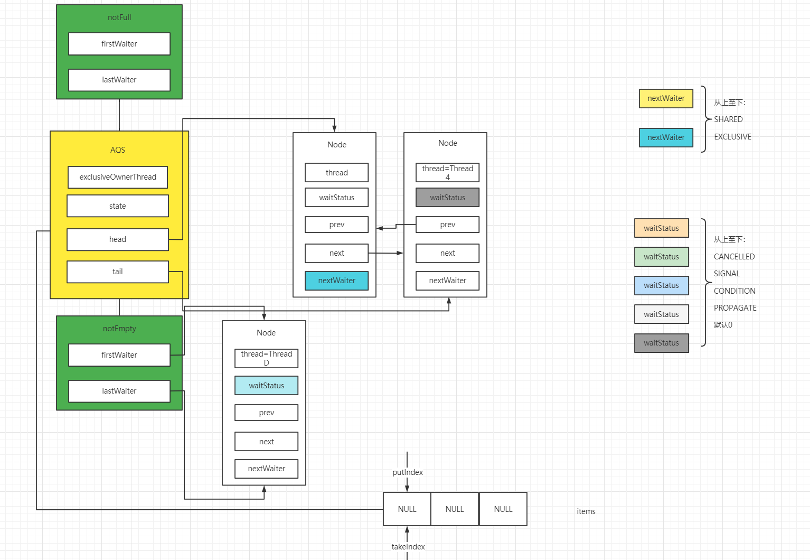
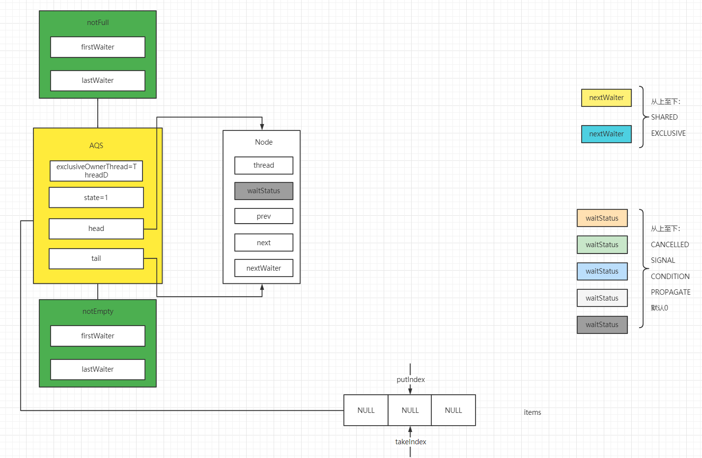

#### 浅析并发编程(十)阻塞队列之ArrayBlockingQueue源码分析

0. 前言

   Queue是一种队尾插入、队头弹出的数据结构，通常可以由数组或链表实现。在我们一起来看`ArrayBlockingQueue`之前，先来关注`BlockingQeuue`。

   > A [`Deque`](../../../java/util/Deque.html) that additionally  supports blocking operations that wait for the deque to become non-empty when  retrieving an element, and wait for space to become available in the deque when  storing an element.

    上述摘自JDK1.8 文档，`BlockingQueue`是一种支持阻塞操作的双端队列。当获取一个元素时，会阻塞并等待

   其变成一个非空队列。当存储一个元素时，会阻塞并等待其拥有可用空间。所以`BlockingQueue`的接口的实现类，可以用来实现生产者和消费者模式。

1. 定义

   `ArrayBlockingQueue`是一个数组实现的、有固定界限的FIFO阻塞队列。在队尾插入最新节点，在队头弹出数组中存在时间最长的节点。

   

   从类图上可以看出`ArrayBlockingQueue`具有迭代器、序列化、阻塞队列等功能。

* 1.1属性介绍

  * `items`: ` ArrayBlockingQueue`底层数组，数组长度为count。
  * `takeIndex`: 弹出或检索下一个节点的下标。
  * `putIndex`: 存储下一个节点的下标。
  * `count`: 底层`items`数组的长度。
  * `lock`: **`ArrayBlockingQueue`的全局锁，且类型是ReentrantLock，所以`ArrayBlockingQueue`将具有公平锁和非公平锁的特性，lock在该类中除了保证每次只有一个线程操作`ArrayBlockingQueue`外, 同时保证了内存的可见性。**
  * `notEmpty`: ReentrantLock的一个条件变量，当获取数据且数组为空，将当前线程插入condition queue中，可以用来实现`ArrayBlockingQueue`的阻塞功能。
  * `notFull`: ReentrantLock的一个条件变量，当添加数据且数组已满时，将当前线程插入condition queue中，可以用来实现`ArrayBlockingQueue`的阻塞功能。
  * `itrs`: 迭代器状态

* 1.2图示

  

  如上图所示，`ArrayBlockingQueue`内部维护了一个items数组用以实现队列，且当前队列是循环队列。在插入节点出现线程竞争时，将当前线程插入CLH链表，在队列已满的时候插入节点，当前线程将进入名为notFull的conditionQueue中等待唤醒。而在队列已空的时候弹出节点时，当前线程将进入名为notEmpty的conditionQueue中等待唤醒。

2. 构造方法

   ```java
   //默认使用非公平锁，以此提高吞吐量。当线程释放独占锁之后，将会唤醒CLH链表中的下一个节点。非公平锁情况下，
   //新来的线程只要在锁释放之后直接获取锁，节省步骤。
   public ArrayBlockingQueue(int capacity) {
       this(capacity, false);
   }
   //手动传入数组长度，并对lock以及condition queue进行初始化。
   public ArrayBlockingQueue(int capacity, boolean fair) {
       if (capacity <= 0)
           throw new IllegalArgumentException();
       this.items = new Object[capacity];
       lock = new ReentrantLock(fair);
       notEmpty = lock.newCondition();
       notFull =  lock.newCondition();
   }
   
   public ArrayBlockingQueue(int capacity, boolean fair,
                             Collection<? extends E> c) {
       //手动传入数组长度，并对锁以及condition queue进行初始化
       this(capacity, fair);
       final ReentrantLock lock = this.lock;
       //此处加锁，除了确保同一时刻只有一个线程操作以外。由于成员变量没有被volatile修饰，所以加锁
       //也解决了内存可见性的问题。
       lock.lock();
       try {
           int i = 0;
           //将集合中的值依次插入数据
           try {
               for (E e : c) {
                   checkNotNull(e);
                   items[i++] = e;
               }
           } catch (ArrayIndexOutOfBoundsException ex) {
               throw new IllegalArgumentException();
           }
           //count实时记录items数组中元素的个数，而capacity为items数组的最大容量
           //putIndex为items数组下一个节点存放下标，从0开始存放。
           //而putIndex = (i == capacity) ? 0 : i; 以及之后的takeIndex实现了循环队列的功能。
           count = i;
           putIndex = (i == capacity) ? 0 : i;
       } finally {
           lock.unlock();
       }
   }
   ```

3. 核心方法

   此处介绍核心的方法，比如`add(E e)`其内部主要逻辑交给`offer(E e)`方法完成，所以就只关注`offer(E e)`方法。

* 3.1非阻塞方法

  * offer()非阻塞插入式方法

  ```java
  public boolean offer(E e) {
      //当插入空节点，offer()方法抛出异常
      checkNotNull(e);
      //当前使用ReentrantLock加锁，默认情况下使用非公平锁，当出现线程竞争则插入CLH链表并阻塞等待
      //前驱节点释放锁，唤醒当前线程。
      final ReentrantLock lock = this.lock;
      lock.lock();
      try {
          //offer()方法被认定的为非阻塞式插入方法原因在于当count值达到items数组的最大容量时，
          //将直接返回，最后释放锁。
          if (count == items.length)
              return false;
          else {
              //当items数组中的元素个数未达到数组的最大容量时，插入当前元素。
              enqueue(e);
              return true;
          }
      } finally {
          lock.unlock();
      }
  }
  private static void checkNotNull(Object v) {
      if (v == null)
          throw new NullPointerException();
  }
  
  private void enqueue(E x) {
      final Object[] items = this.items;
      //对于items数组是先插入元素，后更新putIndex，所以putIndex始终指向下一个节点插入数组的位置
      items[putIndex] = x;
      //当前逻辑，实现了items数组循环队列的功能
      if (++putIndex == items.length)
          putIndex = 0;
      //更新完count计数之后，由于notEmpty 这个condition queue中存放的是弹出节点的线程，之前由于
      //items数组为空导致阻塞，在此唤醒并继续执行await()方法中阻塞后被唤醒的逻辑
      //: 校验是否从condition queue中加入到CLH链表中，之后尝试获取独占锁。
      count++;
      notEmpty.signal();
  }
  ```

  * `poll()`非阻塞式弹出方法

  ```java
  //poll是非阻塞式弹出方法。在弹出方法中阻塞和非阻塞的区别在于，当items数组为空时，
  //非阻塞方法直接返回并释放锁。而阻塞式弹出方法，将当前线程插入到notEmpty的condition queue中，
  //将其节点状态置为CONDITION并阻塞，等待被唤醒。
  public E poll() {
      //保证每次只有一个线程操作底层items数组，如果弹出节点出现线程竞争，将会插入到CLH链表中，
      //将其前驱节点状态置为SIGNAL，并阻塞当前线程等待被唤醒。
      final ReentrantLock lock = this.lock;
      lock.lock();
      try {
          return (count == 0) ? null : dequeue();
      } finally {
          lock.unlock();
      }
  }
  //takeIndex为弹出下一个元素的下标，弹出之后将items数组中对应下标位置置NULL,
  //if (++takeIndex == items.length) takeIndex = 0; 帮助items数组完成循环队列的功能
  //itrs为游标状态，当显示调用iterator()方法才进行初始化。
  //最后唤醒名为notFull的condition queue中的下一个节点。由于notFull中的Node节点因为items底层数组
  //实际个数达到最大容量时插入新节点，所以将对应节点状态置为CONDITION，
  //插入该conditon queue并阻塞当前节点。
  private E dequeue() {
      final Object[] items = this.items;
      @SuppressWarnings("unchecked")
      E x = (E) items[takeIndex];
      items[takeIndex] = null;
      if (++takeIndex == items.length)
          takeIndex = 0;
      count--;
      if (itrs != null)
          itrs.elementDequeued();
      notFull.signal();
      return x;
  }
  ```

  * 举例

    为了更加直观地理解非阻塞式的方法， 我们使用一个例子来过一遍流程。使用长度为3的非公平锁式的`ArrayBlockingQueue`， Thread1、Thread2、Thread3、Thread4插入对应元素（如Thread1插入元素1，Thread2插入元素2）。ThreadA、ThreadB、ThreadC、ThreadD将会消费items数组中的元素。

    

    * Thread1、Thread2开始插入元素

      Thread1首先获取了锁，AQS中的`exclusiveOwnerThread`指向Thread1，且state值自增。当前items数组中没有元素，所以Thread1在底层数组中插入元素1，`putIndex`指针向后移动，而名为notEmpty的condition queue中没有对应的线程。Thread2在Thread1未释放锁的时候，尝试获取锁并添加元素。Thread2获取锁失败，在插入CLH链表之前对其进行初始化，之后将其前驱节点也就是初始化的空节点的状态置为SIGNAL，接着阻塞当前线程。

      

    * Thread1释放锁期间，Thread3尝试获取锁

      Thread1添加元素成功之后，准备释放锁。AQS中的state值置为0，`exclusiveOwnerThread`置为NULL。Thread1释放锁之后，将CLH链表的head指向的节点状态置为0，尝试唤醒下一个节点。由于当前例子为非公平锁，Thread3尝试获取锁成功之后，将`exclusiveOwnerThread`置为Thread3，并更新state值为1。之后将元素3插入items数组后更新putIndex指针。而Thread2被唤醒之后，尝试获取锁失败。再次将前驱节点的状态置为SIGNAL，并阻塞Thread2线程。

      

    * Thread3释放锁，Thread2被唤醒

      Thread3添加元素之后，准备释放锁。将AQS中的state值置为0，`exclusiveOwnerThread`置为NULL。之后准备唤醒CLH链表中的下一个节点，先将

      head指向的节点状态置为0，再唤醒下一个线程即为Thread2。

      

    * Thread2尝试获取锁，添加元素

      Thread2被唤醒之后，获取锁成功之后，将AQS中state值置为1， 并将`exclusiveOwnerThread`指向Thread2，接着更新CLH链表的head指针。在items数组中添加元素2之后，更新putIndex下标，由于达到items数组的最大容量，故置为0，此处体现了循环队列的特性。名为notEmpty的condition queue为空，故无需唤醒。

      

    * Thread2释放锁，Thread4尝试获取锁

      Thread2将AQS中的state值置为0，并将`exclusiveOwnerThread`置为NULL，成功释放锁。由于CLH链表的head指向的节点状态为0，所以无需唤醒下一个节点。Thread4尝试获取锁，将state值状态置为1，并将`exclusiveOwnerThread`指向Thread4。

      

    * Thread4获取锁之后，尝试添加元素，并释放锁

      Thread4获取锁之后，由于items数组中元素已经达到最大容量，故不再添加。之后释放锁锁，将state值置为0，并`exclusiveOwnerThread`置为NULL。

      

    * ThreadA、ThreadB尝试获取锁，并弹出节点

      由于内置的lock锁的加锁流程类似，所以以下简单描述。Thread2将AQS中state值置为1，并将`exclusiveOwnerThread`置为ThreadA。之后尝试弹出节点，items数组中还有元素，弹出元素后，再更新takeIndex下标。名为notFull的conditon queue为空，无需唤醒。ThreadB尝试获取锁，失败之后，添加到CLH链表中，并将前驱节点的状态置为SIGNAL，然后阻塞当前线程。

      

    * ThreadA释放锁、ThreadC尝试获取锁

      ThreadA弹出元素后，准备释放锁。将AQS中state值置为0，然后`exclusiveOwnerThread`置为NULL。接着准备唤醒CLH链表的下一个节点之前，ThreadC尝试获取锁。ThreadC将state值置为1，

      `exclusiveOwnerThread`置为ThreadC。接着弹出Iitems中数组的元素3，并更新takeIndex下标。

      ThreadA执行唤醒下一个节点的逻辑，将head指针指向的节点状态置为0，然后唤醒其后继节点，也就是ThreadB。

      

    * ThreadC释放锁、ThreadB尝试获取锁

      ThreadC弹出元素成功之后，准备释放锁，同样的将AQS中的state值置为0，`exclusiveOwnerThread`置为NULL，之后尝试唤醒下一个线程。由于head指针指向的节点状态为0，所以无需唤醒。ThreadB此时尝试获取锁，也是将state值置为1，`exclusiveOwnerThread`指向ThreadB，并更新head指针。弹出元素2之后，takeIndex此时等于items数组的长度，重置为0。此处也是items数组循环队列的特性。

      

    * ThreadB释放锁，ThreadD尝试获取锁

      ThreadB释放锁逻辑与之前类似，将state值置为0，`exclusiveOwnerThread`重置为NULL。**由于head指针指向的节点状态为0，无需唤醒下一个节点。**ThreadD尝试获取锁，将AQS中state值置为1，`exclusiveOwnerThread`指向ThreadD。但是此时，由于items数组中count值为0，没有元素可以弹出，所以ThreadD也释放锁了，释放锁逻辑和ThreadB相似，不再赘述。

      

    我们稍作总结。**在当前例子中我们使用的是非阻塞式方法添加和弹出元素且使用的是非公平锁，所以Thread1、Thread2、Thread3、Thread4虽然按顺序尝试获取锁，items数组中的值为1、3、2。元素被插入items数组的顺序上，体现了ArrayBlockingQueue中使用的非公平锁。而插入过程中没有使用notEmpty的condition queue则体现了ArrayBlockingQueue中非阻塞的方法的功能。弹出节点的过程也是类似，ThreadA、ThreadB、ThreadC、ThreadD按顺序请求获取锁并弹出元素，弹出元素的顺序虽然为1、3、2。由于是非公平锁，所以是ThreadB弹出2，ThreadC弹出3。且当前是非阻塞式方法，也是没有用到notEmpty这个condition queue。此外在putIndex和takeIndex指针的变更过程中，也体现了items数组的循环队列的性质。**

* 3.2阻塞式方法

  * put()阻塞式插入方法

    ```java
    public void put(E e) throws InterruptedException {
        //校验非空
        checkNotNull(e);
        final ReentrantLock lock = this.lock;
        //lockInterruptibly方法支持在执行过程中响应线程的打断。
        lock.lockInterruptibly();
        try {
            //使用while条件判断，防止虚假唤醒，此外阻塞式方法和非阻塞式方法的差别在于，
            //当items数组元素个数达到容量最大时，阻塞式方法将当前线程插入condition queue并进行
            //阻塞，等到存在足够空间时，将其从condition queue中唤醒，继续插入元素。
            //而非阻塞式方法在items元素个数达到最大时，直接返回。
            //此外，await方法同样支持在执行过程中相应线程的打断，在SIGNAL调用之前，
            while (count == items.length)
                notFull.await();
            //满足条件，插入节点
            enqueue(e);
        } finally {
            lock.unlock();
        }
    }
    
    private void enqueue(E x) {
        //putIndex指向下一个元素插入位置，先插入后更新其下标
        final Object[] items = this.items;
        items[putIndex] = x;
        //实现了items数组循环队列的功能。
        if (++putIndex == items.length)
            putIndex = 0;
        count++;
        //唤醒因为items数组为空，导致进入notEmpty的condition queue阻塞等待的消费线程。
        notEmpty.signal();
    }
    ```

  * take阻塞式弹出方法

    ```java
    public E take() throws InterruptedException {
        final ReentrantLock lock = this.lock;
        //lockInterruptibly方法，在执行过程中响应打断
        lock.lockInterruptibly();
        try {
            //使用while判断，是为了防止虚假唤醒
            //在ArrayBlockingQueue中存在notFull和notEmpty两个condition queue，
            //两者均用于阻塞式方法。而当底层items数组为空且此时尝试弹出节点时，当前线程首先生成
            //状态为CONDITION的Node节点，使用尾插法插入到名为notEmpty的condition queue中。
            //之后释放锁并阻塞当前线程，等到signal()系列被调用或者被打断阻塞导致提前唤醒，
            //当前节点再次添加到CLH链表中，等到再次获取锁并继续完成弹出节点的逻辑。
            while (count == 0)
                notEmpty.await();
            return dequeue();
        } finally {
            lock.unlock();
        }
    }
    
    private E dequeue() {
        //takeIndex指向下一个待弹出节点的下标。在此处先弹出，后更新下标。
        final Object[] items = this.items;
        @SuppressWarnings("unchecked")
        E x = (E) items[takeIndex];
        items[takeIndex] = null;
        //实现了items数组循环队列的功能
        if (++takeIndex == items.length)
            takeIndex = 0;
        count--;
        if (itrs != null)
            itrs.elementDequeued();
        //尝试唤醒因为items数组容量已满，而添加到名为notFull的condition queue中线程Node
        //节点。之后并将其添加到CLH链表中，最后执行await()被唤醒之后的业务流程。
        notFull.signal();
        return x;
    }
    ```

  * 举例

    在此处为了和非阻塞式方法形成对照，我们使用容量为3的公平锁模式的ArrayBlockingQueue。其中，

    Thread1、Thread2、Thread3、Thread4添加节点（Thread1添加元素1，以此类推），而ThreadA、ThreadB、ThreadC、ThreadD弹出节点。

    * Thread1尝试获取锁添加节点

      Thread1获取了内置的ReentrantLock，将AQS中state值置为1，并将`exclusiveOwnerThread`指向当前线程，又因为items数组元素个数没有达到最大值从而进入`enqueue`逻辑。在items数组中添加了节点，并更新putIndex下标。  

      

    * Thread2、Thread3、Thread4尝试获取锁并添加元素

      由于此时Thread1还没有释放锁。所以Thread2、Thread3、Thread4获取锁失败，进入插入CLH链表的逻辑，在对CLH链表进行初始化之后，使用for循环+CAS的方式，使得Node节点依次一个一个的插入到CLH链表中，并将其前驱节点的状态置为SIGNAL，方便在前驱节点释放锁的时候，唤醒当前节点。最后，将这些线程阻塞。

      

    * Thread1释放锁并唤醒下一节点

      Thread1释放锁，将AQS中state值和`exclusiveOwnerThread`重置，之后将进入唤醒下一节点的逻辑。首先将head指向的节点的状态置为0，之后唤醒下一节点。

      

    * Thread2被唤醒后尝试获取锁并添加元素

      Thread2将state值置为1，并将`exclusiveOwnerThread`指向当前线程，从而成功获取锁，之后更新head节点指针。由于items数组元素个数没有达到其最大容量，所以继续添加元素2，之后再更新putIndex指针。

      

      .png

    * Thread2释放锁、Thread3被唤醒尝试添加元素

      释放锁的流程，大家已经很熟悉了。其实大致分为两部分，（1）重置AQS中state值和`exclusiveOwnerThread`（2）将head指向的节点状态置为0，并唤醒下一个节点。在当前例子中，

      Thread3被唤醒之后尝试获取锁，再次将state值置为1，`exclusiveOwnerThread`指向当前线程Thread3，清空Node中Thread信息，并更新head指针。由于count值没有达到items数组最大容量，插入元素3之后，并更新putIndex下标。由于底层items数组实现了循环队列功能，putIndex重置为0。

      

    * Thread3释放锁，Thread4获取锁

      Thread3释放锁并将AQS中state值置为0、`exclusiveOwnerThread`置为NULL，之后将head指向的下一个节点状态置为0，并唤醒Thread4。Thread4成功获取锁，将state值置为1，`exclusiveOwnerThread`指向当前线程节点，并清空节点的线程信息，更新head指针 。

      

    * Thread4在获取锁之后，尝试添加元素

      由于此时items底层数组items中元素个数达到最大容量，此时生成状态为CONDITION的Node节点，将其插入名为notFull的condition queue中。之后释放锁，并阻塞当前线程。

      

    * ThreadA、ThreadB、ThreadC、ThreadD尝试获取锁

      ThreadA、ThreadB、ThreadC、ThreadD尝试获取锁，ThreadA获取锁成功之后，将AQS中state值置为1，`exclusiveOwnerThread`指向当前线程。ThreadB、ThreadC、ThreadD获取锁失败之后，当前采用for循环+CAS的方式，使得线程Node依次一个一个的添加到CLH链表中。且此时CLH链表不需要初始化，插入CLH链表之后，将其直接前驱节点的状态置为SIGNAL，最后阻塞当前线程。

      

    * ThreadA弹出元素并释放锁

      ThreadA获取锁成功之后，由于items数组count值此时为3不为空，此时弹出items数组中的元素1，之后变更takeIndex下标。由于此时名为notFull的condition queue不为空，所以将其首节点解绑，

      **之后将节点状态由CONDITION重置为0，因为此时虽然Thread4在notFull的condition queue中，可能会被打断阻塞，执行await()被打断阻塞的逻辑（将节点添加到CLH链表中），导致当前ThreadA和被打断阻塞的Thread4 出现线程竞争。这就是将当前节点由CONDITION状态重置为0的意义。**之后将其重新添加到CLH链表中，将其前驱节点的状态置为SIGANL，并唤醒当前线程。被唤醒的Thread4，将再次尝试获取锁，在当前例子中，采用的是ReentrantLock的公平锁模式，CLH链表中存在排在Thread4之前的线程，所以获取锁失败，且其前驱节点状态为SIGANL，所以直接阻塞当前线程Thread4。另一方面，ThreadA弹出元素1之后，准备释放锁。首先，将AQS中state值置为0，`exclusiveOwnerThread`指针重置为NULL。之后将AQS中head指向的节点状态重置为0，并唤醒下一个线程ThreadB。

      

      **注意：此时你可能发现Thread4节点的从condition queue中再次添加到CLH链表之后，其nextWaiter字段并不是EXCLUSIVE，而是NULL。在condition queue中Node节点之前使用nextWaiter指针指向其直接后继节点，以此保持节点之前的关联。condition queue中的firstWaiter和lastWaiter作为头指针和尾指针。又因为condition queue只在ReentrantLock独占锁模式中存在，故此默认为EXCLUSIVE。**

      ```java
      //判断当前节点的模式的实现方式，默认为EXCLUSIVE。
      //虽然在本例子中Thread4的nextWaiter没有赋值，但并不影响其节点为独占模式的判断
      final boolean isShared() {
          return nextWaiter == SHARED;
      }
      ```

    * ThreadB获取锁并弹出元素

      ThreadB尝试获取锁，将AQS中state值置为1，`exclusiveOwnerThread`指向当前线程，接着清空ThreadB节点的线程信息，并更新head指针。此时，items数组中元素个数为2，可以继续弹出元素。先弹出元素2，再更新takeIndex。名为notFull的condition queue中没有节点无需唤醒。

      

    * ThreadB释放锁并唤醒下一个节点

      ThreadB将AQS中state值重置为0，`exclusiveOwnerThread`置为NULL。释放锁之后，将head指针指向的节点状态置为0，并唤醒下一个节点。

      

    * ThreadC获取锁并弹出下一个元素

      ThreadC获取锁并弹出元素的流程和ThreadB类似。将AQS中state值置为1，`exclusiveOwnerThread`指向当前线程。获取锁之后，更新head节点，由于此时items数组中不为空，先弹出元素3，之后更新takeIndex下标，由于items数组支持循环队列的功能，故takeIndex重置为0。

      

    * ThreadC释放锁并唤醒下一节点

      ThreadC准备释放锁，将AQS中state值重置为1，`exclusiveOwnerThread`重置为NULL。由于head指针指向的节点状态为SIGNAL，表示可以唤醒下一个节点。先将其状态置为0，接着唤醒下一个线程Node节点。

      

    * ThreadD获取锁、尝试弹出元素

      ThreadD将AQS中的state值置为1，`exclusiveOwnerThread`指向当前线程，之后重置Node节点的线程信息，并更新head指针。由于此时，items数组为空，所以进入await()逻辑。为ThreadD生成状态为`CONDITION`的Node节点，将当前节点插入名为`notEmpty`的condition queue中，并将`firstWaiter`和`lastWaiter`指向当前节点，此外原本在CLH链表中`nextWaiter`是用来标志Node节点是否为独占锁、共享锁模式，而在condition queue中用来连接当前节点和直接后继Node节点。

      接着释放锁，将state值置为0，`exclusiveOwnerThread`置为NULL，接着将head指针指向的节点状态置为0，并唤醒下一个节点。最后阻塞当前线程。

      

    * Thread4尝试获取锁，并添加元素4

      Thread4先将AQS中state值置为1，并将`exclusiveOwnerThread`指向当前线程，获取锁成功之后，清空Node线程信息，并更新head指针。由于items数组中元素个数没有达到最大容量，首先将元素4插入items数组中，然后更新putIndex指针。**接着，因为名为notEmpty的condition queue不为空，将其首节点解绑，并将其节点状态重置为0，因为当存放在notEmpty中ThreadD被打断阻塞时候，会将其从notEmpty解绑，之后插入CLH链表。此时与Thread4的signal()唤醒逻辑，出现线程竞争，所以signal()使用CAS将节点状态置为0，可以保证在执行节点重新加入CLH链表的业务时，只有一个线程正在操作当前节点。**接着将其插入CLH链表，并将前驱节点状态置为SINAL，最后唤醒该节点。当ThreadD被唤醒的时候，接着执行await()唤醒之后的逻辑，由于AQS锁被占用且其前驱节点的状态为SIGANL，所以直接阻塞。

      

    * Thread4释放锁，并唤醒下一个节点

      Thread4将AQS中state值置为0，`exclusiveOwnerThread`指向NULL。释放锁之后，因为head指针指向的节点状态为SIGANL，先将状态置为0，之后唤醒下一个节点。

      

    * ThreadD获取锁，尝试弹出节点

      ThreadD将AQS中state值置为1，并将`exclusiveOwnerThread`指向当前线程。获取锁成功之后，清空节点线程信息，并更新head指针。由于此时，items数组不为空，故先弹出元素4，之后更新takeIndex指针。

      

    * ThreadD释放锁

      ThreadD先将AQS中state值置为0，并将`exclusiveOwnerThread`置为NULL。释放锁之后，由于head节点指向的节点状态为0，所以无需唤醒下一节点。

      

      在此，我们稍作总结。在当前例子中，我们使用的是公平锁模式的ArrayBlockingQueue中阻塞式方法。阻塞式和非阻塞式方法区别主要在于，**当底层items数组达到最大容量时，此时若再添加元素，会将当前线程插入名为notFull的condition queue中并阻塞，等到其他线程调用signal方法将会从condition queue中弹出队首线程节点，并将其插入CLH链表，等待之后获取锁再添加元素。而非阻塞式方法，当items数组已满的时候，则直接返回并不会阻塞。而当底层数组为空时，此时若再尝试弹出节点，阻塞式方法会将当前线程节点插入notEmpty的condition queue中并阻塞。等到其他线程调用signal()之后，将notEmpty的队首节点弹出，重新加入CLH链表并等待获取锁继续完成弹出元素的工作。与之不同的是，非阻塞式方法在items数组为空，继续尝试弹出节点，则会直接返回并不会阻塞，而是会放弃当前弹出元素的任务。**

* 3.3其他方法

  * size()方法

    ```java
  //size()方法是用来获取items数组元素个数，此处仍然加锁的原因在于:
    //count元素并未被volatile修饰，加锁是为了线程的缓存可见性问题
  public int size() {
        final ReentrantLock lock = this.lock;
      lock.lock();
        try {
          return count;
        } finally {
          lock.unlock();
        }
  }
    ```

  * `remove(Object o)`方法
  
    ```java
    public boolean remove(Object o) {
        //首先是一些简单的判空处理
        //看到这里，我们其实知道items数组是一个循环队列，其中的元素存储从takeIndex 至putIndex-1
        //均保存元素。
        if (o == null) return false;
        final Object[] items = this.items;
        final ReentrantLock lock = this.lock;
        lock.lock();
        try {
            if (count > 0) {
                //从队尾takeIndex开始，一直找到putIndex-1。因为putIndex是为下一个元素插入的位置
                //找到对应的index下标之后，进入removeAt()的核心方法
                final int putIndex = this.putIndex;
                int i = takeIndex;
                do {
                    if (o.equals(items[i])) {
                        removeAt(i);
                        return true;
                    }
                    if (++i == items.length)
                        i = 0;
                } while (i != putIndex);
            }
            return false;
        } finally {
            lock.unlock();
        }
    }
    
    
    void removeAt(final int removeIndex) {
        final Object[] items = this.items;
        //待移除的节点位置存在以下几种情况：
        //1. 队尾位置。将其置空，count数实时减一，takeIndex需要递增。
        //2. 队首位置-1。此时清空该节点，putIndex递减。
        //3. 在队尾和队首-1之间，此时需要将items元素挨个后移并覆盖，且队首位置-1和队首位置-2，因为节	  //点迁移并覆盖的原因，两者保存元素相同。 而就在此时，当前将演变为情况2，之前情况队首位置-1的元素
        //即可。
        if (removeIndex == takeIndex) {
            items[takeIndex] = null;
            if (++takeIndex == items.length)
                takeIndex = 0;
            count--;
            if (itrs != null)
                itrs.elementDequeued();
        } else {
            final int putIndex = this.putIndex;
            for (int i = removeIndex;;) {
                int next = i + 1;
                if (next == items.length)
                    next = 0;
                if (next != putIndex) {
                    items[i] = items[next];
                    i = next;
                } else {
                    items[i] = null;
                    this.putIndex = i;
                    break;
                }
            }
            count--;
            if (itrs != null)
                itrs.removedAt(removeIndex);
        }
        notFull.signal();
    }
    ```
  
4. 总结

   `ArrayBlockingQueue`其底层使用items数组，在其阻塞式方法中，当数组容量达到最大，则会将其添加到notFull的condition queue中并阻塞当前线程，释放CPU。而当数组为空时，尝试弹出元素，也会将阻塞当前线程并添加到notEmpty的condition queue中之后阻塞当前线程释放CPU。等到满足条件，将其唤醒继续完成后续任务， 所以`ArrayBlockingQueue`也可以用来实现生产者和消费者模式。
