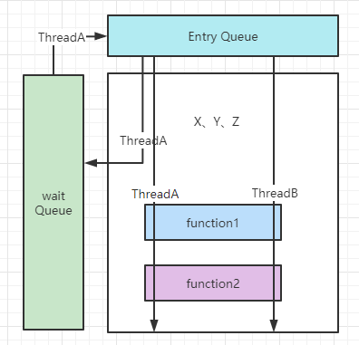
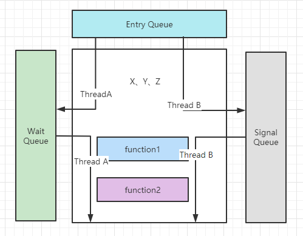
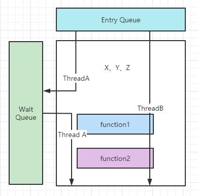
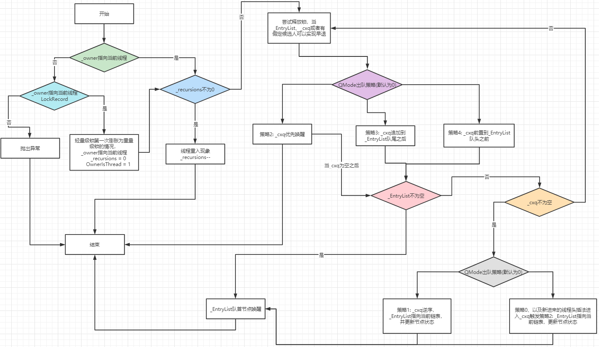

#### 浅析并发编程(四)Monitor

1. monitor定义

* Monitor也被称为管程，是一种同步工具。可以把Monitor想象成一个模块，在Monitor中有一些函数和一些共享变量。
* 这些共享变量只能被Monitor中的函数访问、操作，无法被Monitor外部所访问。
* 在同一时刻，Monitor中只有一个函数被执行。
* 每次只能有一个线程进入Monitor执行相应操作。

2. Monitor的版本

当线程A进入Monitor之后，经常需要访问共享资源，有时可能会遇到该资源被占用的情况。而此刻如果有线程B尝试访问Monitor，且该共享资源变成可以访问，此时的处理方式有多种，也相应的演化出Monitor的多种版本。

* Mesa 版本 Monitor

在介绍该版本之前，我们先来认识一下Wait Queue、Entry Queue。当线程正在排队且未获取Monitor锁之前，被存放在Entry Queue，而当线程调用wait()系列方法，该线程会进入Wait Queue。



（1）线程A从Entry Queue获取Monitor锁并进入Monitor执行相应的程序。

（2）共享资源X被占用，线程A进入Wait Queue。

（3）线程B从Entry Queue进入Monitor开始执行相应的程序。

（4）共享资源X变得可用，线程B通知线程A。此时线程A从Wait Queue进入Entry Queue。

（5）线程B执行结束退出Monitor。

（6）线程A再次进入Monitor。

（7）线程A执行结束退出Monitor。

Mesa版本的Monitor存在一种问题，当线程A再次从Entry Queue进入Monitor时，此时共享资源X可能再次被占用，就会再次进入Wait Queue。并且这种线程可能会持续下去。

* Hoare版本Monitor

Wait Queue、Entry Queue的概念已经清楚了，我们再来认识一下Signal Queue。在Hoare版本中，某资源变得可用，线程通知因资源不可用时阻塞的其他线程之后，进入到Signal Queue。而Signal Queue未清空之前，Entry Queue中线程不会进入到Monitor执行相应程序。



（1）线程A从Entry Queue中进入Monitor执行相应程序。

（2）资源X被占用，线程A进入Wait Queue。

（3）线程B从Entry Queue中进入Monitor。

（4）执行中资源X变得可用，线程B通知线程A之后，进入Signal Queue进行等待。

（5）线程A再次进入Monitor，执行结束并退出。

（6）Signal Queue中尚有线程待执行，线程B再次进入Monitor，执行结束并退出。

Hoare版本Monitor解决了Mesa版本的问题，但是增加了一次上下文的切换。

* Hanson版本Monitor

Hanson版本的Monitor综合前两者的优点。并将线程B通知线程A的时间推迟到程序执行结束之后，退出Monitor之前。



（1）线程A从Entry Queue中进入Monitor执行相应程序。

（2）资源X当前不可用，线程A进入Wait Queue。

（3）线程B从Entry Queue中进入Monitor。

（4）资源X变得可用，线程B一直执行完相应程序，通知线程A，之后退出Monitor。

（5）线程A再次进入Monitor。

（6）线程A执行结束后退出。

现在我们对Monitor有了一个基本的概念，一起从`HotSpot`源码的角度来看Java中的Monitor的实现方式。我们这里跟之前的文章一样，以JDK1.8版本为例子。

首先，我们打开`src/share/vm/runtime/objectMonitor.hpp`文件，找到以下代码。ObjectMonitor就是我们认知中Monitor类，当轻量级锁膨胀为重量级锁，Mark Word中会指向Monitor对象，也就是ObjectMonitor的实例。

```c++
  ObjectMonitor() {
    //记录对象的Mark Word  
    _header       = NULL;
    //计数器，该数字为_waitSet和_EntryList总和，之前我们介绍过Wait Queue和Entry Queue，两者的概念是等同的。  
    _count        = 0;
    //等待中线程计数器。线程调用park()方法阻塞并进入_waitSet，该计数器加一。线程被唤醒之后，重新竞争Monitor锁，该计数器减一。
    _waiters      = 0,
    //线程重入次数  
    _recursions   = 0;
    //指向实例对象的指针
    _object       = NULL;
    //如果是轻量级锁初次膨胀为重量级锁，_owner则会指向线程栈上LockRecord。之后_owner会指向拥有Monitor锁的线程。  
    _owner        = NULL;
    //线程调用park()方法进入到该等待队列，对应Java中的wait()方法  
    _WaitSet      = NULL;
    //操作_WaitSet时使用到的锁
    _WaitSetLock  = 0 ;
    //指向等待Monitor锁的第一个线程
    _Responsible  = NULL ;
    //获取Monitor锁的准线程，也被称为Heir presumptive thread
    _succ         = NULL ;
    //ContentionList， 当线程尝试获取Monitor锁，由于Monitor被占用，暂时保存的队列。
    _cxq          = NULL ;
    FreeNext      = NULL ;
    //一个等待Monitor锁的队列，队列里的元素来自于_cxq
    _EntryList    = NULL ;
   //自旋相关参数   
    _SpinFreq     = 0 ;
   //自旋相关参数 
    _SpinClock    = 0 ;
   //标记。表示当前重量级锁从轻量级膨胀而来，并且_owner之前指向该线程上的LockRecord   
    OwnerIsThread = 0 ;
    //_owner之前指向的线程ID  
    _previous_owner_tid = 0;
  }
```

我们在同文件下继续找到`src/share/vm/runtime/objectMonitor.hpp:38`，一起来看ObjectWaiter的定义，ObjectWaiter是用来存放等待线程对象的类。ObjectMonitor类中`_cxq`、`_EntryList`、`_WaitSet`字段都是指向ObjectWaiter的指针。

```c++
class ObjectWaiter : public StackObj {
 public:
  //线程状态的枚举
  enum TStates { TS_UNDEF, TS_READY, TS_RUN, TS_WAIT, TS_ENTER, TS_CXQ } ;
  //排序方式的枚举  
  enum Sorted  { PREPEND, APPEND, SORTED } ;
  //ObjectWaiter的后继节点  
  ObjectWaiter * volatile _next;
  //ObjectWaiter的前驱节点，这就表明ObjectWaiter是一个双向链表   
  ObjectWaiter * volatile _prev;
  //指向线程  
  Thread*       _thread;
  //通知的线程ID  
  jlong         _notifier_tid;
  //用以实现线程的park()、unpack()方法，实现线程的阻塞和唤醒
  ParkEvent *   _event;
  //当调用notify()之后，使用的标记字段。  
  volatile int  _notified ;
  //线程状态  
  volatile TStates TState ;
  //排序  
  Sorted        _Sorted ;           // List placement disposition
  bool          _active ;           // Contention monitoring is enabled
 public:
  ObjectWaiter(Thread* thread);

  void wait_reenter_begin(ObjectMonitor *mon);
  void wait_reenter_end(ObjectMonitor *mon);
};
```

当线程尝试获取monitor锁的时候，会调用`ObjectMonitor::enter`方法。所以我们从源码的角度一起来了解。

```c++
void ATTR ObjectMonitor::enter(TRAPS) {
  Thread * const Self = THREAD ;
  void * cur ;
  //这边使用的是CAS算法，简单介绍一下。在CAS中有三个值，exchange_value、dest、compare_value，将dest   //和compare_value进行对比。如果相等，则将exchange_value赋值给dest，函数返回compare_value。如果不
  //相等，dest不作更改，函数则返回dest。 此处Self、&_owner、NULL分别对应 exchange_value、dest、	
  //compare_value
  cur = Atomic::cmpxchg_ptr (Self, &_owner, NULL) ;
  //如果cur等于NULL，则表明当前线程已经获取到Monitor锁，并将_owner 指向当前线程  
  if (cur == NULL) {
     assert (_recursions == 0   , "invariant") ;
     assert (_owner      == Self, "invariant") ;
     return ;
  }
    
  //如果cur等于当前线程，表明当前线程之前已经获取Monitor锁，当前为线程重入现象。
  if (cur == Self) {
     _recursions ++ ;
     return ;
  }
  //需要先补充一下知识点，当只有一个线程访问共享资源，会从无锁膨胀为偏向锁。线程交替访问共享资源时，此时偏向锁
  //会膨胀成轻量级锁。会将当前对象的Mark Word复制到线程的栈帧上，而该位置被称为Lock Record，并且
  //MarkWord上有指针指向Lock Record。另外当 线程进入Monitor.enter 方法之前，Monitor对象已经初始化完   //成了。如果是轻量级锁膨胀为重量级锁，此时会初始化Monitor对象，并将Owner设置为线程的Lock Record。查看   //src/share/vm/runtime/synchronizer.cpp:1368所以如果是轻量级锁第一次膨胀为重量级锁，此时owner仍   //旧指向的是Lock Record。_recursions置为1，owner指向当前线程，OwnerIsThread = 1表示当前是轻量级锁   //膨胀为重量级锁的情况。
  if (Self->is_lock_owned ((address)cur)) {
    assert (_recursions == 0, "internal state error");
    _recursions = 1 ;
    _owner = Self ;
    OwnerIsThread = 1 ;
    return ;
  }

  //程序执行到这个地方仍旧没有获取Monitor锁
  assert (Self->_Stalled == 0, "invariant") ;
  Self->_Stalled = intptr_t(this) ;
    
  //尝试自旋的方式来获取Monitor锁  
  if (Knob_SpinEarly && TrySpin (Self) > 0) {
     assert (_owner == Self      , "invariant") ;
     assert (_recursions == 0    , "invariant") ;
     assert (((oop)(object()))->mark() == markOopDesc::encode(this), "invariant") ;
     Self->_Stalled = 0 ;
     return ;
  }

  assert (_owner != Self          , "invariant") ;
  assert (_succ  != Self          , "invariant") ;
  assert (Self->is_Java_thread()  , "invariant") ;
  JavaThread * jt = (JavaThread *) Self ;
  assert (!SafepointSynchronize::is_at_safepoint(), "invariant") ;
  assert (jt->thread_state() != _thread_blocked   , "invariant") ;
  assert (this->object() != NULL  , "invariant") ;
  assert (_count >= 0, "invariant") ;

  Atomic::inc_ptr(&_count);

  JFR_ONLY(JfrConditionalFlushWithStacktrace<EventJavaMonitorEnter> flush(jt);)
  EventJavaMonitorEnter event;
  if (event.should_commit()) {
    event.set_monitorClass(((oop)this->object())->klass());
    event.set_address((uintptr_t)(this->object_addr()));
  }

  { 
    JavaThreadBlockedOnMonitorEnterState jtbmes(jt, this);

    Self->set_current_pending_monitor(this);

    DTRACE_MONITOR_PROBE(contended__enter, this, object(), jt);
    if (JvmtiExport::should_post_monitor_contended_enter()) {
      JvmtiExport::post_monitor_contended_enter(jt, this);
    }

    OSThreadContendState osts(Self->osthread());
    ThreadBlockInVM tbivm(jt);

   //准备进入EnterI 核心方法
    for (;;) {
      jt->set_suspend_equivalent();
     
      EnterI (THREAD) ;

      if (!ExitSuspendEquivalent(jt)) break ;

          _recursions = 0 ;
      _succ = NULL ;
      exit (false, Self) ;

      jt->java_suspend_self();
    }
    Self->set_current_pending_monitor(NULL);  
      
  }
  //程序执行到这个位置，线程已经获取到了Monitor锁。
  Atomic::dec_ptr(&_count);
  assert (_count >= 0, "invariant") ;
  Self->_Stalled = 0 ;

  assert (_recursions == 0     , "invariant") ;
  assert (_owner == Self       , "invariant") ;
  assert (_succ  != Self       , "invariant") ;
  assert (((oop)(object()))->mark() == markOopDesc::encode(this), "invariant") ;
    
  DTRACE_MONITOR_PROBE(contended__entered, this, object(), jt);
  if (JvmtiExport::should_post_monitor_contended_entered()) {
    JvmtiExport::post_monitor_contended_entered(jt, this);
  }

  if (event.should_commit()) {
    event.set_previousOwner((uintptr_t)_previous_owner_tid);
    event.commit();
  }

  if (ObjectMonitor::_sync_ContendedLockAttempts != NULL) {
     ObjectMonitor::_sync_ContendedLockAttempts->inc() ;
  }
}
```

下面我们重点关注EnterI方法

```c++
void ATTR ObjectMonitor::EnterI (TRAPS) {
    Thread * Self = THREAD ;
    assert (Self->is_Java_thread(), "invariant") ;
    assert (((JavaThread *) Self)->thread_state() == _thread_blocked   , "invariant") ;

    //在使用ObjectWaiter保存当前线程之前，再次尝试获取Monitor锁，节约性能。
    if (TryLock (Self) > 0) {
        assert (_succ != Self              , "invariant") ;
        assert (_owner == Self             , "invariant") ;
        assert (_Responsible != Self       , "invariant") ;
        return ;
    }

    DeferredInitialize () ;

    
	//尝试自旋的方式获取Monitor锁。
    if (TrySpin (Self) > 0) {
        assert (_owner == Self        , "invariant") ;
        assert (_succ != Self         , "invariant") ;
        assert (_Responsible != Self  , "invariant") ;
        return ;
    }

    assert (_succ  != Self            , "invariant") ;
    assert (_owner != Self            , "invariant") ;
    assert (_Responsible != Self      , "invariant") ;
    
    //此时将当前线程放到ObjectWaiter当中，并将该对象的线程状态置为TS_CXQ
    ObjectWaiter node(Self) ;
    Self->_ParkEvent->reset() ;
    node._prev   = (ObjectWaiter *) 0xBAD ;
    node.TState  = ObjectWaiter::TS_CXQ ;

    //nxt变量指向_cxq,也就是ContentionList
    ObjectWaiter * nxt ;
    for (;;) {
        //使用头插法的方式，将当前线程放置在_cxq的头部，将当前节点next指向_cxq, 但是此处并没有将nxt的
        //pre指向node，形成双向链表。这是一个细节，先抛个问题在这里，我们等到下文再来解释。
        node._next = nxt = _cxq ;
        //使用CAS的方式让_cxq指向最新的队首-- 当前节点。
        if (Atomic::cmpxchg_ptr (&node, &_cxq, nxt) == nxt) break ;

        //代码能够执行到这里，说明_cxq当前没有指向nxt，也就是_cxq发生了变化，说明期间_cxq队列有其他节点 
        //使用了头插法进入该队列。此处再次尝试获取锁。
        if (TryLock (Self) > 0) {
            assert (_succ != Self         , "invariant") ;
            assert (_owner == Self        , "invariant") ;
            assert (_Responsible != Self  , "invariant") ;
            return ;
        }
    }
    //nxt为空或者_EntryList为空 都比较好理解，这表明当前线程是第一个获取Monitor锁没有成功，换句话说是第
    //一个等待Monitor锁释放的线程，尝试使用CAS方式将_Responsible指向当前线程。SyncFlags 是HotSpot定
    //义在src/share/vm/runtime/globals.hpp:1168 的一个同步标志。表示实验性的同步标志，默认值为0，所
    //以，下面if等同于只要判断 nxt为空或者_EntryList为空，参考相关代码：
    //product(intx, SyncFlags, 0, "(Unsafe, Unstable) Experimental Sync flags")
    if ((SyncFlags & 16) == 0 && nxt == NULL && _EntryList == NULL) {
        Atomic::cmpxchg_ptr (Self, &_Responsible, NULL) ;
    }

    TEVENT (Inflated enter - Contention) ;
    int nWakeups = 0 ;
    int RecheckInterval = 1 ;
    
    for (;;) {
        //此处再次尝试获取锁
        if (TryLock (Self) > 0) break ;
        assert (_owner != Self, "invariant") ;
        //尝试让_Responsible指向当前线程
        if ((SyncFlags & 2) && _Responsible == NULL) {
           Atomic::cmpxchg_ptr (Self, &_Responsible, NULL) ;
        }
        //当前_Responsible指向的是第一个等待获取Monitor锁的线程，RecheckInterval初始值为1，以后每
        //次会乘以8，而它的上限为1000，park()来实现线程的阻塞。连起来的理解意思是，第一个等待Monitor
        //锁的线程，会按照1，8，64 ... 1000,1000.. 这样的时间间隔来尝试获取锁。
        if (_Responsible == Self || (SyncFlags & 1)) {
            TEVENT (Inflated enter - park TIMED) ;
            Self->_ParkEvent->park ((jlong) RecheckInterval) ;
            // Increase the RecheckInterval, but clamp the value.
            RecheckInterval *= 8 ;
            if (RecheckInterval > 1000) RecheckInterval = 1000 ;
        } else {
           /**
             * 相应的其他线程就会一直阻塞下去，直到使用unpack（）方法唤醒该线程。
             */
            TEVENT (Inflated enter - park UNTIMED) ;
            Self->_ParkEvent->park() ;
        }
        //再次尝试获取Monitor锁
        if (TryLock(Self) > 0) break ;

        TEVENT (Inflated enter - Futile wakeup) ;
        if (ObjectMonitor::_sync_FutileWakeups != NULL) {
           ObjectMonitor::_sync_FutileWakeups->inc() ;
        }
        //执行到这个位置，要么该线程被唤醒，要么是调用了带有阻塞时间限制的park()方法
        ++ nWakeups ;

        /**
          * Knob_SpinAfterFutile的默认值为1，当前线程被唤醒之后再次尝试获取Monitor锁
          */
        if ((Knob_SpinAfterFutile & 1) && TrySpin (Self) > 0) break ;

        if ((Knob_ResetEvent & 1) && Self->_ParkEvent->fired()) {
           Self->_ParkEvent->reset() ;
           OrderAccess::fence() ;
        }
        if (_succ == Self) _succ = NULL ;
        OrderAccess::fence() ;
    }

    assert (_owner == Self      , "invariant") ;
    assert (object() != NULL    , "invariant") ;
    //此处已经出了循环，表明当前线程已经拿到了Monitor锁，将当前线程从队列中解绑，也就是从_cxq中解绑。
    UnlinkAfterAcquire (Self, &node) ;
    //如果当前线程为假定候选人，因为其已经获取了Monitor锁，需要重置等待下一个候选人。
    if (_succ == Self) _succ = NULL ;

    assert (_succ != Self, "invariant") ;
    //重置_Responsible
    if (_Responsible == Self) {
        _Responsible = NULL ;
        OrderAccess::fence(); 
    }
    if (SyncFlags & 8) {
       OrderAccess::fence() ;
    }
    return ;
}
```

我们稍微梳理一下`ObjectMonitor::enter`方法。


现在我们一起来了解`ObjectMonitor::exit`， 我们先找到对应的行数`src/share/vm/runtime/objectMonitor.cpp:962`

```java
void ATTR ObjectMonitor::exit(bool not_suspended, TRAPS) {
   Thread * Self = THREAD ;
   //看到这行代码可能会有些疑惑，但如果是当前线程访问共享资源并且是轻量级锁的情况，且后来因为竞争膨胀为重量
   //级锁，而在当时会对ObjectMonitor对象进行初始化，将_owner指向当前线程栈上Lock Record，所以会出现这
   //种情况。相关代码行参照src/share/vm/runtime/synchronizer.cpp:1368
   if (THREAD != _owner) {
     if (THREAD->is_lock_owned((address) _owner)) {
       //此时将_owner指向当前线程，OwnerIsThread标志为1，表示当前是轻量级锁膨胀为重量级锁的情况。
       assert (_recursions == 0, "invariant") ;
       _owner = THREAD ;
       _recursions = 0 ;
       OwnerIsThread = 1 ;
     } else {
       //不是轻量级锁膨胀的情况且_owner没有指向当前线程，再加上Monitor进出次数不平衡，自然会排除线程重入	
       //的情况，此时抛出异常的方式来处理。
       TEVENT (Exit - Throw IMSX) ;
       assert(false, "Non-balanced monitor enter/exit!");
       if (false) {
          THROW(vmSymbols::java_lang_IllegalMonitorStateException());
       }
       return;
     }
   }
   //当前为线程重入情况，在enter()方法的时候_recursions++，此处正好对应。
   if (_recursions != 0) {
     _recursions--; 
     TEVENT (Inflated exit - recursive) ;
     return ;
   }

   //SyncFlags默认为0，重置_Responsible，关于_succ假定继承人的选择涉及到后续的出队的策略
   if ((SyncFlags & 4) == 0) {
      _Responsible = NULL ;
   }
//当前线程即将释放Monitor锁，将当前线程设置为_owner的上一任所有者
#if INCLUDE_JFR
   if (not_suspended && EventJavaMonitorEnter::is_enabled()) {
    _previous_owner_tid = JFR_THREAD_ID(Self);
   }
#endif

   for (;;) {
      assert (THREAD == _owner, "invariant") ;

      //Knob_ExitPolicy 默认为0，参照src/share/vm/runtime/objectMonitor.cpp:177，此处涉及到俩
      //种策略，当前情况为：首先释放Monitor锁，也就是将_owner置为空，然后查看_EntryList和_cxq链表里是
      //否为空或者存在假定继承人，直接返回。不满足条件仍需将_owner暂时指向当前线程，为后续执行相应的出队策
      //略做准备。
      if (Knob_ExitPolicy == 0) {
         OrderAccess::release_store_ptr (&_owner, NULL) ;
         OrderAccess::storeload() ;
         if ((intptr_t(_EntryList)|intptr_t(_cxq)) == 0 || _succ != NULL) {
            TEVENT (Inflated exit - simple egress) ;
            return ;
         }
         TEVENT (Inflated exit - complex egress) ;
         if (Atomic::cmpxchg_ptr (THREAD, &_owner, NULL) != NULL) {
            return ;
         }
         TEVENT (Exit - Reacquired) ;
      } else {
         //第二种策略是满足_EntryList和_cxq链表里为空或者存在假定继承人的条件，此时释放Monitor锁才具有
         //意义。
         if ((intptr_t(_EntryList)|intptr_t(_cxq)) == 0 || _succ != NULL) {
            OrderAccess::release_store_ptr (&_owner, NULL) ;
            OrderAccess::storeload() ;
            if (_cxq == NULL || _succ != NULL) {
                TEVENT (Inflated exit - simple egress) ;
                return ;
            }
            if (Atomic::cmpxchg_ptr (THREAD, &_owner, NULL) != NULL) {
               TEVENT (Inflated exit - reacquired succeeded) ;
               return ;
            }
            TEVENT (Inflated exit - reacquired failed) ;
         } else {
            TEVENT (Inflated exit - complex egress) ;
         }
      }

      guarantee (_owner == THREAD, "invariant") ;
      //这边是核心代码逻辑，Knob_QMode默认值为0，该策略作用于_cxq、_EntryList，共分为5个策略。
      ObjectWaiter * w = NULL ;
      int QMode = Knob_QMode ;
      //QMode为2，此时_cxq指向的链表中的线程相比_EntryList具有更高的优先级。
      if (QMode == 2 && _cxq != NULL) {
          w = _cxq ;
          assert (w != NULL, "invariant") ;
          assert (w->TState == ObjectWaiter::TS_CXQ, "Invariant") ;
          //释放队首元素，确切来说是唤醒队首元素。
          ExitEpilog (Self, w) ;
          return ;
      }
      //QMode为3，将_cxq链表中的元素状态由TS_CXQ变更为TS_ENTER，并追加到_EntryList链表后
      if (QMode == 3 && _cxq != NULL) {
          //尝试将w指向_xcq所指向的对象，并使用CAS的方式将_cxq置为NULL，如果失败。则说明已经使用了头插
          //法，也就是说存在新的线程尝试调用enter()方法获取Monitor锁。
          w = _cxq ;
          for (;;) {
             assert (w != NULL, "Invariant") ;
             ObjectWaiter * u = (ObjectWaiter *) Atomic::cmpxchg_ptr (NULL, &_cxq, w) ;
             if (u == w) break ;
             w = u ;
          }
          assert (w != NULL              , "invariant") ;
          //指针p从_cxq链表的头部开始遍历，指针q则指向_cxq中已经完成状态更新的最后一个。在这里_cxq链表
          //中的状态字段未TS_CXQ，而_EntryList链表中的状态为TS_ENTER。也就是说，这里是在为_cxq链表中
          //的元素迁移到_EntryList链表中做准备，而在此前_cxq指针已经重置为NULL。
          ObjectWaiter * q = NULL ;
          ObjectWaiter * p ;
          for (p = w ; p != NULL ; p = p->_next) {
              guarantee (p->TState == ObjectWaiter::TS_CXQ, "Invariant") ;
              p->TState = ObjectWaiter::TS_ENTER ;
              p->_prev = q ;
              q = p ;
          }

          //使用tail指针指向_EntryList的链表尾部节点，并将w指向的_cxq链表追加到_EntryList链表之后
          ObjectWaiter * Tail ;
          for (Tail = _EntryList ; Tail != NULL && Tail->_next != NULL ; Tail = Tail->_next) ;
          if (Tail == NULL) {
              _EntryList = w ;
          } else {
              Tail->_next = w ;
              w->_prev = Tail ;
          }
      }
      //QMode = 4，在这里_cxq和_EntryList的合并策略是将_cxq放到_EntryList链表之前。
      if (QMode == 4 && _cxq != NULL) {
          w = _cxq ;
          //首先将w指向_cxq指向的链表，使用CAS的方式，将_cxq指向NULL。防止_cxq在此过程中发生变更，也就
          //是存在新的线程尝试获取Monitor锁，最后导致头插法插入_cxq。
          for (;;) {
             assert (w != NULL, "Invariant") ;
             ObjectWaiter * u = (ObjectWaiter *) Atomic::cmpxchg_ptr (NULL, &_cxq, w) ;
             if (u == w) break ;
             w = u ;
          }
          assert (w != NULL              , "invariant") ;

          ObjectWaiter * q = NULL ;
          ObjectWaiter * p ;
          //将原_cxq链表中的元素状态赋值为TS_ENTER，为_cxq和_EntryList的合并做准备。
          for (p = w ; p != NULL ; p = p->_next) {
              guarantee (p->TState == ObjectWaiter::TS_CXQ, "Invariant") ;
              p->TState = ObjectWaiter::TS_ENTER ;
              p->_prev = q ;
              q = p ;
          }

          //将_EntryList链表追加到w指向的原来_cxq链表
          if (_EntryList != NULL) {
              q->_next = _EntryList ;
              _EntryList->_prev = q ;
          }
          _EntryList = w ;
      }
      //w重新指向_EntryList,并尝试唤醒_EntryList的链表首位节点
      w = _EntryList  ;
      if (w != NULL) {
          assert (w->TState == ObjectWaiter::TS_ENTER, "invariant") ;
          ExitEpilog (Self, w) ;
          return ;
      }
       //代码能走到这个位置，说明_EntryList已经为空，若w指向的_cxq也为空，此时进行下一次for循环，若	
       //执行到exit()的顶部代码，两个链表均为空，会指向相应的退出流程。
      w = _cxq ;
      if (w == NULL) continue ;

      //代码走到这里，说明当前_EntryList为空，_cxq不为空，此时使用CAS的方式将_cxq置为NULL
      for (;;) {
          assert (w != NULL, "Invariant") ;
          ObjectWaiter * u = (ObjectWaiter *) Atomic::cmpxchg_ptr (NULL, &_cxq, w) ;
          if (u == w) break ;
          w = u ;
      }
      TEVENT (Inflated exit - drain cxq into EntryList) ;

      assert (w != NULL              , "invariant") ;
      assert (_EntryList  == NULL    , "invariant") ;

       //QMode为1，此处将会按个遍历_cxq链表中的节点，t指向当前节点，u指向下一个节点，s指向已操作完成的最
       //后一个节点。然后将t的前驱指向t的下一个节点也就是u，然后将t的后继指向t的前一个节点。此处为_cxq的逆
       //序。如果结合上下文一起看就会发现，当线程尝试获取Monitor锁的时候，使用头插法将当前线程封装为
       //ObjectWaiter的节点插入到_cxq链表中，但是在此处使用逆序的方式，所以这就使得QMode为1的情况变成了
       //先进先出的策略。
      if (QMode == 1) {
         ObjectWaiter * s = NULL ;
         ObjectWaiter * t = w ;
         ObjectWaiter * u = NULL ;
         while (t != NULL) {
             guarantee (t->TState == ObjectWaiter::TS_CXQ, "invariant") ;
             t->TState = ObjectWaiter::TS_ENTER ;
             u = t->_next ;
             t->_prev = u ;
             t->_next = s ;
             s = t;
             t = u ;
         }
         _EntryList  = s ;
         assert (s != NULL, "invariant") ;
      } else {
          //这边的代码虽然只有一点，但是确实相当关键的。因为QMode获取的值默认为0，那么在策略0中，当线程调
          //用exit()方法准备释放Monitor锁的时候，首先会去唤醒_EntryList中的线程，而等到代码执行到这个
          //地方，_EntryList为空，_EntryList将会重新指向原来_cxq指向的链表。另外我们再来回顾之前我们在
          //enter()方法中，当当前线程作为一个ObjectWaiter节点使用头插法插入到_cxq链表中，将当前线程的
          //的后继指向_cxq,并没有将_cxq的前驱指向当前线程节点，就直接更新了_cxq指针。但是在此处，就会发现
          //由于_EntryList链表已经为空，所以将_EntryList指向w也就是原来_cxq的链表，除了将链表中的元素
         //的状态变成TS_ENTER之外，还将当前节点的前驱指向上一个节点，最终形成双向链表。
         _EntryList = w ;
         ObjectWaiter * q = NULL ;
         ObjectWaiter * p ;
         for (p = w ; p != NULL ; p = p->_next) {
             guarantee (p->TState == ObjectWaiter::TS_CXQ, "Invariant") ;
             p->TState = ObjectWaiter::TS_ENTER ;
             p->_prev = q ;
             q = p ;
         }
      }
      if (_succ != NULL) continue;
      //此处唤醒w指向的队头节点
      w = _EntryList  ;
      if (w != NULL) {
          guarantee (w->TState == ObjectWaiter::TS_ENTER, "invariant") ;
          ExitEpilog (Self, w) ;
          return ;
      }
   }
}
```

为了加深理解，我们再来看`ObjectMonitor::ExitEpilog (Thread * Self, ObjectWaiter * Wakee)`方法，

```c++
//这边的代码比较简单，首先_succ假定继承人指向传入的节点，这个我们可以理解。之后释放Monitor锁，也就是将
// _owner指向NULL。然后调用了unpack()方法来唤醒当前线程，线程也就会从当时调用park()方法处被唤醒，
//之后该线程会去尝试获取Monitor锁，继续执行以后的代码，而当该线程拿到Monitor锁之后，然后再调用
//ObjectMonitor::UnlinkAfterAcquire方法，将当前线程节点从链表中解绑。
void ObjectMonitor::ExitEpilog (Thread * Self, ObjectWaiter * Wakee) {
   assert (_owner == Self, "invariant") ;
   _succ = Knob_SuccEnabled ? Wakee->_thread : NULL ;
   ParkEvent * Trigger = Wakee->_event ;
   Wakee  = NULL ;

   OrderAccess::release_store_ptr (&_owner, NULL) ;
   OrderAccess::fence() ;

   if (SafepointSynchronize::do_call_back()) {
      TEVENT (unpark before SAFEPOINT) ;
   }

   DTRACE_MONITOR_PROBE(contended__exit, this, object(), Self);
   Trigger->unpark() ;
   if (ObjectMonitor::_sync_Parks != NULL) {
      ObjectMonitor::_sync_Parks->inc() ;
   }
}
```

我们先来稍微总结一下`ObjectMonitor::exit(bool not_suspended, TRAPS)`中的五种策略。

* **QMode为0，也就是默认状态下。线程的唤醒顺序首先是`_EntryList`中的节点，当`_EntryList`为NULL时，`_EntryList`会指向`_cxq`指向的链表，`_cxq`指针重置，并将节点状态变为TS_ENTER，且会形成双向链表。**
* QMode为1，线程的唤醒顺序还是从`_EntryList`中的节点开始，当`_EntryList`为NULL，`_EntryList`会指向`_cxq`指向的链表，`_cxq`指针重置，并将节点状态变为TS_ENTER，此处会逆序原先`_cxq`链表，使其呈现出**FIFO**的策略。

* QMode为2，这个相对比较简单。线程的唤醒的顺序是从`_cxq`中的节点开始，当`_cxq`为NULL的时候，继续从`_EntryList`中开始唤醒。
* QMode为3， 此处会将`_cxq`中的节点状态变更为TS_ENTER，之后会追加到`_EntryList`链表队尾之后，实现两个链表之间的合并，此时`_cxq`为NULL，线程的唤醒的顺序是新`_EntryList`链表中的节点。

* QMode为4，此处会将`_cxq`中的节点状态变更为TS_ENTER，之后会放置到`_EntryList`链表队首之前，实现两个链表之间的合并，而在此时`_cxq`为NULL，线程的唤醒的顺序是新`_EntryList`链表中的节点。

总结完出队策略 之后，我们以图示的方式再来回顾`ObjectMonitor::exit(bool not_suspended, TRAPS)`的整个流程。




